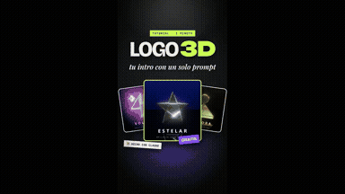
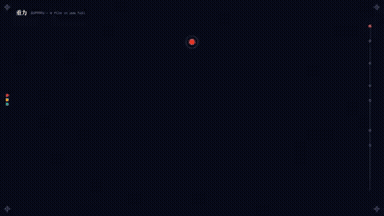

# Awesome Opus 5.5 Video Prompts

**[Explore the collection →](#browse-the-full-library)** · [Start with a prompt](#start-here) · [Latest additions](#recently-added)

## Recently added

<table>
<tr>
<td width="33%" valign="top">
 
<strong>Three.js 3D Logo Intro Studio Generator</strong> 

<a href="https://x.com/juancarlos17626/status/2108663864581558301">Original post ↗</a> · <a href="prompts/2108663864581558301.md">Prompt ↗</a>
</td>
<td width="33%" valign="top">
 
<strong>Claude Opus 5.5 Gravity Motion Graphics Explainer</strong> 

<a href="https://x.com/redbickey/status/2108685334343221621">Original post ↗</a> · <a href="prompts/2108685334343221621.md">Prompt ↗</a>
</td>
<td width="33%" valign="top">
 
<strong>Educational Explainer on the Riemann Hypothesis</strong> 

<a href="https://x.com/insideology/status/2108716885646639338">Original post ↗</a> · <a href="prompts/2108716885646639338.md">Prompt ↗</a>
</td>
</tr>
</table>

## Browse the full library

- [Product & Brand Videos](data/categories/product-brand.md) (1)
- [Motion Graphics & Typography](data/categories/motion-graphics.md) (7)
- [UI & Web Animation](data/categories/ui-web.md) (0)
- [Explainers & Education](data/categories/explainers.md) (5)
- [Music & Storytelling](data/categories/music-storytelling.md) (0)
- [3D Worlds & Simulations](data/categories/3d-scenes.md) (5)
- [Games & Interactive Experiences](data/categories/games-interactive.md) (0)

0 homepage picks · Original creator links on every card.

## Product & Brand Videos — homepage picks

New video + public prompt pairs are on the way.

[Browse all 1 product & brand videos →](data/categories/product-brand.md)

## Motion Graphics & Typography — homepage picks

New video + public prompt pairs are on the way.

[Browse all 7 motion graphics & typography →](data/categories/motion-graphics.md)

## UI & Web Animation — homepage picks

New video + public prompt pairs are on the way.

[Browse all 0 ui & web animation →](data/categories/ui-web.md)

## Explainers & Education — homepage picks

New video + public prompt pairs are on the way.

[Browse all 5 explainers & education →](data/categories/explainers.md)

## Music & Storytelling — homepage picks

New video + public prompt pairs are on the way.

[Browse all 0 music & storytelling →](data/categories/music-storytelling.md)

## 3D Worlds & Simulations — homepage picks

New video + public prompt pairs are on the way.

[Browse all 5 3d worlds & simulations →](data/categories/3d-scenes.md)

## Games & Interactive Experiences — homepage picks

New video + public prompt pairs are on the way.

[Browse all 0 games & interactive experiences →](data/categories/games-interactive.md)

Browse by tool

- [canvas-interactive](data/categories/canvas-interactive.md) — 0
- [manim](data/categories/manim.md) — 0
- [remotion](data/categories/remotion.md) — 0
- [blender](data/categories/blender.md) — 0
- [external-video-model](data/categories/external-video-model.md) — 1
- [other-animation](data/categories/other-animation.md) — 17

## How to use

1. Pick a result and copy its public prompt from the card or detail page.
2. Supply any inputs listed by the creator, then use the prompt with your Opus agent.
3. Follow the creator’s renderer/tool setup. A shared fragment may need additional instructions.

About this collection &amp; source checks

Opus directs or writes the code for these videos, animations and interactive recordings. The detail page distinguishes prompt-required tools, author-confirmed tools and unconfirmed inferences. Author claims and media consistency checks do not establish repository reproduction. Reference cases may have unverified model version or production details; they are not counted as fully verified cases. We do not reconstruct missing author prompts.

[Review queue](data/docs/REVIEW-QUEUE.md) · [Contribute](data/docs/CONTRIBUTING.md) · [Attribution & corrections](data/docs/RIGHTS.md)

## Credits

Maintained by [LeaddeOpenLab](https://github.com/LeaddeOpenLab) · [Leadde.ai](https://Leadde.ai). All works and prompts belong to their linked creators. Independent collection.
