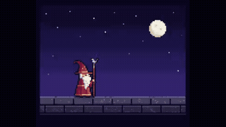
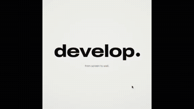
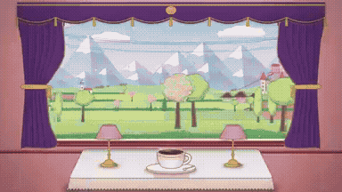
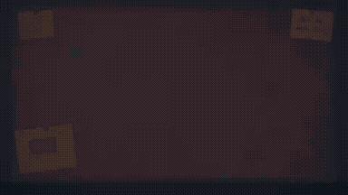

# Awesome Opus 5.5 Video Prompts

**Claude Opus 5.5 video prompts, organized by what you want to make.** Browse motion graphics, explainers, 3D showcases and interactive demos.
Save this library to find a useful result, copy the creator’s public prompt, and see the inputs and tools needed to start.
**30 homepage picks** · **398 browsable video + prompt pairs** · Original creator links on every card.
**Latest addition: 2026-09-30** · **398 total records** · **+19 in the latest addition**

## Browse the full library

- [Motion graphics](data/categories/motion-graphics.md) (265)
- [Explainers](data/categories/explainers.md) (53)
- [3D scenes](data/categories/3d-scenes.md) (29)
- [Games & interactive](data/categories/games-interactive.md) (51)
- [How to use a prompt](#how-to-use) · [Credits](#credits)

## Featured videos + prompts

<table>
<tr>
<td width="45%" valign="top">

https://github.com/user-attachments/assets/f53f15b9-a6f2-4067-8d27-605bd029d101

</td>
<td width="55%" valign="top">
<strong>Eye-catching · Vincent’s Cats</strong> 
Step into a Starry Night-inspired 3D town and find hidden cats. 
<strong>Use:</strong> 3D exploration game / hidden cats <strong>Inputs:</strong> User inputs not specified by the author <strong>Tools:</strong> Claude Code  
Creator’s public prompt 
can you make a 3d game where you walk around and spot cats inside of a van gogh painting? we can start with stary night and its town  
<a href="https://x.com/MandelDuck/status/2103802923465768972">Original post ↗</a> · <a href="prompts/2103802923465768972.md">Full prompt ↗</a> · <a href="https://claude.ai/new">Try in Claude ↗</a>
</td>
</tr>
<tr>
<td width="45%" valign="top">

https://github.com/user-attachments/assets/b4df86c0-07f7-4cdf-86c4-7073a3befb9d

</td>
<td width="55%" valign="top">
<strong>Easy to try · Motion design showreel</strong> 
A short prompt for a fast-paced motion graphics reel; no supplied assets are specified. 
<strong>Use:</strong> 15-second motion design showreel <strong>Inputs:</strong> No supplied assets specified; agent chooses production details <strong>Tools:</strong> Remotion  
Creator’s public prompt 
make a dynamic 15-second motion graphics video that shows what an incredible motion designer you are, like it's your showreel for a résumé. go all out.  
<a href="https://x.com/ajith_io/status/2103449416325890146">Original post ↗</a> · <a href="prompts/2103449416325890146.md">Full prompt ↗</a> · <a href="https://claude.ai/new">Try in Claude ↗</a>
</td>
</tr>
<tr>
<td width="45%" valign="top">

</td>
<td width="55%" valign="top">
<strong>Practical · Looping UI motion</strong> 
A continuous, beat-synced demonstration of UI states and interactions. 
<strong>Use:</strong> UI motion / interaction demonstration <strong>Inputs:</strong> 8–12 UI states; palette; ~120 BPM music <strong>Tools:</strong> FFmpeg / NumPy / Playwright  
Creator’s public prompt 
&lt;inputs&gt; Ask me for: 8 to 12 UI states I want the shape to become (e.g. button, loader, player, slider, toggle, tabs, chart, command palette, toast), pure black and white or one accent color, and a royalty-free song around 120 BPM (e.g. Mixkit, free for comme…  
<a href="https://x.com/twoclipping/status/2103273003555402193">Original post ↗</a> · <a href="prompts/2103273003555402193.md">Full prompt ↗</a> · <a href="https://claude.ai/new">Try in Claude ↗</a>
</td>
</tr>
</table>

## Recently added

- [fal API Showreel Motion Graphics Video](prompts/2104827314400026936.md) — fal Motion Design Showreel
- [Bloom Mobile Game Promo Video](prompts/2105102105702756414.md) — App Promotion Video
- [Code-Based Motion Graphics and Audio Synthesis with Claude Opus 5.5](prompts/2104832372164444162.md) — Creative Coding Motion Graphics & Synth
- [Agentic Neocloud Business Explainer Video via Claude Code and Opus 5.5](prompts/2104957026199900220.md) — Neocloud business explainer
- [Claude Opus 5.5 Self-Visualization Motion Design](prompts/2104981908241486064.md) — AI Self-Representation Motion Design

## Motion graphics — homepage picks

<table>
<tr>
<td width="33%" valign="top">
 
<strong>Product Promo Video Generation</strong> 
Use: Product promotional video Inputs: Product URL and product details Tools: FFmpeg / JavaScript / Playwright 
<a href="https://x.com/felipemoller/status/2103846311149936736">Original post ↗</a> · <a href="prompts/2103846311149936736.md">Prompt ↗</a>
</td>
<td width="33%" valign="top">
 
<strong>Infinite Zoom Vintage Collage Animation</strong> 
Use: Infinite zoom collage animation Inputs: Requires external generation services Tools: GPT 2.5 / Kling 2.5 / Lyria 3 / Magnific MCP / Seedream 5 Pro 
<a href="https://x.com/koldo2k/status/2103129343253778767">Original post ↗</a> · <a href="prompts/2103129343253778767.md">Prompt ↗</a>
</td>
<td width="33%" valign="top">
 
<strong>Code-Driven Motion Design Video</strong> 
Use: Product motion promotional film Inputs: Product name + one-line promise; 3–5 UI scenes; accent color; 10–20 owned vertical clips; music Tools: FFmpeg / NumPy / Playwright 
<a href="https://x.com/twoclipping/status/2102554209166000267">Original post ↗</a> · <a href="prompts/2102554209166000267.md">Prompt ↗</a>
</td>
</tr>
<tr>
<td width="33%" valign="top">
 
<strong>Animated Pixel Art Wizard in Canvas 2D</strong> 
Use: Procedural pixel-art animation Inputs: No external assets required by the prompt Tools: Canvas 2D / Vanilla JavaScript 
<a href="https://x.com/majidmanzarpour/status/2102476258948927543">Original post ↗</a> · <a href="prompts/2102476258948927543.md">Prompt ↗</a>
</td>
<td width="33%" valign="top">
 
<strong>Spotify-Themed Motion Design</strong> 
Use: Music-product motion graphics Inputs: No supplied assets required; artwork generated during production Tools: Tool setup not specified by the source 
<a href="https://x.com/brainextends/status/2103801834930606193">Original post ↗</a> · <a href="prompts/2103801834930606193.md">Prompt ↗</a>
</td>
<td width="33%" valign="top">
 
<strong>Code-Based Apple-Style Keynote Motion Design</strong> 
Use: Brand launch film Inputs: Brand name; 9–12 high-res photos; ~120 BPM music; moving plant-shadow stock video Tools: FFmpeg / Playwright 
<a href="https://x.com/twoclipping/status/2103835273813496100">Original post ↗</a> · <a href="prompts/2103835273813496100.md">Prompt ↗</a>
</td>
</tr>
<tr>
<td width="33%" valign="top">
 
<strong>Four Seasons Train Window Animation</strong> 
Use: Atmospheric animation / seasonal loop Inputs: User inputs not specified by the author Tools: Tool setup not specified by the source 
<a href="https://x.com/itsolelehmann/status/2103124033365762215">Original post ↗</a> · <a href="prompts/2103124033365762215.md">Prompt ↗</a>
</td>
<td width="33%" valign="top">
 
<strong>Opus 5.5 Ad Inspired by Apple 1984</strong> 
Use: Concept advertisement / Apple 1984 homage Inputs: User inputs not specified by the author Tools: Tool setup not specified by the source 
<a href="https://x.com/1littlecoder/status/2103746736980378066">Original post ↗</a> · <a href="prompts/2103746736980378066.md">Prompt ↗</a>
</td>
<td width="33%" valign="top">
 
<strong>Remotion Product Intro</strong> 
Use: Product introduction video Inputs: Product URL, screenshots, logo and assets; Music for beat-synchronized motion Tools: Tool setup not specified by the source 
<a href="https://x.com/HO_BA/status/2103845264649761062">Original post ↗</a> · <a href="prompts/2103845264649761062.md">Prompt ↗</a>
</td>
</tr>
<tr>
<td width="33%" valign="top">
 
<strong>Animated Music Video Prompt for Claude Opus</strong> 
Use: Motion graphics / music videos Inputs: Reference MV; Song Tools: Tool setup not specified by the source 
<a href="https://x.com/doubleunplussed/status/2103697580421181894">Original post ↗</a> · <a href="prompts/2103697580421181894.md">Prompt ↗</a>
</td><td></td><td></td>
</tr>
</table>

[Browse all 265 motion graphics →](data/categories/motion-graphics.md)

## Explainers — homepage picks

<table>
<tr>
<td width="33%" valign="top">
 
<strong>Manim Derivative Concept Educational Video</strong> 
Use: Derivative concept lesson Inputs: User inputs not specified by the author Tools: edge-tts / Manim 
<a href="https://x.com/LinearUncle/status/2103128559174971663">Original post ↗</a> · <a href="prompts/2103128559174971663.md">Prompt ↗</a>
</td>
<td width="33%" valign="top">
 
<strong>Recursion Explanation Video</strong> 
Use: Recursion explainer Inputs: User inputs not specified by the author Tools: Tool setup not specified by the source 
<a href="https://x.com/emollick/status/2103688362960019567">Original post ↗</a> · <a href="prompts/2103688362960019567.md">Prompt ↗</a>
</td>
<td width="33%" valign="top">
 
<strong>Japan Summer Weather Visualization</strong> 
Use: Weather data visualization / Japan summer Inputs: User inputs not specified by the author Tools: JavaScript 
<a href="https://x.com/GroundControl/status/2103678647777230877">Original post ↗</a> · <a href="prompts/2103678647777230877.md">Prompt ↗</a>
</td>
</tr>
<tr>
<td width="33%" valign="top">
 
<strong>Photon Journey Explainer Animation</strong> 
Use: Science explainer / photon journey Inputs: User inputs not specified by the author Tools: JavaScript 
<a href="https://x.com/AstroTheWizard/status/2103629247751618782">Original post ↗</a> · <a href="prompts/2103629247751618782.md">Prompt ↗</a>
</td>
<td width="33%" valign="top">
 
<strong>Negroni Cocktail Explainer Motion Graphic in HTML</strong> 
Use: Cocktail recipe explainer Inputs: Reference cocktail recipe illustration image attached to the prompt Tools: JavaScript 
<a href="https://x.com/Ror_Fly/status/2102853258582880547">Original post ↗</a> · <a href="prompts/2102853258582880547.md">Prompt ↗</a>
</td>
<td width="33%" valign="top">
 
<strong>Educational Motion-Graphics on Recursive AI Agent Limitations</strong> 
Use: Educational motion graphics / AI agents Inputs: User inputs not specified by the author Tools: GPT Image 2.5 on Fal AI 
<a href="https://x.com/M_Adrian2/status/2104542961081983435">Original post ↗</a> · <a href="prompts/2104542961081983435.md">Prompt ↗</a>
</td>
</tr>
</table>

[Browse all 53 explainers →](data/categories/explainers.md)

## 3D scenes — homepage picks

<table>
<tr>
<td width="33%" valign="top">
 
<strong>Cinematic Browser-Based 3D World</strong> 
Use: Explorable cinematic 3D world Inputs: User inputs not specified by the author Tools: Tool setup not specified by the source 
<a href="https://x.com/LexnLin/status/2103194052850241739">Original post ↗</a> · <a href="prompts/2103194052850241739.md">Prompt ↗</a>
</td>
<td width="33%" valign="top">
 
<strong>1906 San Francisco Market Street Blender Reconstruction</strong> 
Use: Historical 3D reconstruction Inputs: User inputs not specified by the author Tools: Blender 
<a href="https://x.com/alexalbert__/status/2102466523164274839">Original post ↗</a> · <a href="prompts/2102466523164274839.md">Prompt ↗</a>
</td>
<td width="33%" valign="top">
 
<strong>Pelican Riding a Bicycle Animation</strong> 
Use: Detailed character animation Inputs: User inputs not specified by the author Tools: Tool setup not specified by the source 
<a href="https://x.com/AxtonLiu/status/2103119648271290566">Original post ↗</a> · <a href="prompts/2103119648271290566.md">Prompt ↗</a>
</td>
</tr>
<tr>
<td width="33%" valign="top">
 
<strong>Three.js 15s 3D Motion Graphics</strong> 
Use: 3D motion graphics / website hero Inputs: User inputs not specified by the author Tools: Three.js 
<a href="https://x.com/hiro19_k/status/2104471436039803295">Original post ↗</a> · <a href="prompts/2104471436039803295.md">Prompt ↗</a>
</td><td></td><td></td>
</tr>
</table>

[Browse all 29 3d scenes →](data/categories/3d-scenes.md)

## Games & interactive — homepage picks

<table>
<tr>
<td width="33%" valign="top">
 
<strong>3D Star Wars Multiplayer Game</strong> 
Use: 3D multiplayer space game Inputs: User inputs not specified by the author Tools: Tool setup not specified by the source 
<a href="https://x.com/0xChuckstock/status/2103804606794879327">Original post ↗</a> · <a href="prompts/2103804606794879327.md">Prompt ↗</a>
</td>
<td width="33%" valign="top">
 
<strong>Auren Header Scroll-Scrubbed Hero Section</strong> 
Use: Scroll-driven website hero Inputs: Background video; Two feature-card images Tools: Framer Motion / GSAP ScrollTrigger / React 
<a href="https://x.com/iamtanzil_/status/2103820321673675031">Original post ↗</a> · <a href="prompts/2103820321673675031.md">Prompt ↗</a>
</td>
<td width="33%" valign="top">
 
<strong>Police Chase Arcade Game PRD</strong> 
Use: Mobile arcade game prototype Inputs: Existing Unity CLI project Tools: Unity 
<a href="https://x.com/froessell/status/2103789415323562325">Original post ↗</a> · <a href="prompts/2103789415323562325.md">Prompt ↗</a>
</td>
</tr>
<tr>
<td width="33%" valign="top">
 
<strong>Pixel Art Hearthstone-Style Card Game</strong> 
Use: Pixel-art card game prototype Inputs: User inputs not specified by the author Tools: Tool setup not specified by the source 
<a href="https://x.com/aisongman/status/2103763192971461057">Original post ↗</a> · <a href="prompts/2103763192971461057.md">Prompt ↗</a>
</td>
<td width="33%" valign="top">
 
<strong>Interactive 2D/3D Floor Plan and Interior Design Web Tool</strong> 
Use: Interactive floor-plan design tool Inputs: Floor plan image with millimeter dimension annotations Tools: Three.js 
<a href="https://x.com/akokoi1/status/2104520072014508316">Original post ↗</a> · <a href="prompts/2104520072014508316.md">Prompt ↗</a>
</td>
<td width="33%" valign="top">
 
<strong>Interactive WebGPU Strawberry Cake Soft-Body Physics</strong> 
Use: Interactive soft-body physics demo Inputs: No external assets required by the prompt Tools: WebGPU / WGSL 
<a href="https://x.com/ImaStudio_ai/status/2104514806443303238">Original post ↗</a> · <a href="prompts/2104514806443303238.md">Prompt ↗</a>
</td>
</tr>
<tr>
<td width="33%" valign="top">
 
<strong>Interactive Rain Window Calming App</strong> 
Use: Calming rain interaction Inputs: User inputs not specified by the author Tools: Tool setup not specified by the source 
<a href="https://x.com/d_llm_kr/status/2104189915693269112">Original post ↗</a> · <a href="prompts/2104189915693269112.md">Prompt ↗</a>
</td><td></td><td></td>
</tr>
</table>

[Browse all 51 games & interactive →](data/categories/games-interactive.md)

Browse by tool

- [canvas-interactive](data/categories/canvas-interactive.md) — 51
- [manim](data/categories/manim.md) — 2
- [remotion](data/categories/remotion.md) — 8
- [blender](data/categories/blender.md) — 4
- [external-video-model](data/categories/external-video-model.md) — 2
- [other-animation](data/categories/other-animation.md) — 332

## How to use

1. Pick a result and copy its public prompt from the card or detail page.
2. Supply any inputs listed by the creator, then use the prompt with your Opus agent.
3. Follow the creator’s renderer/tool setup. A shared fragment may need additional instructions.

About this collection &amp; source checks

Opus directs or writes the code for these videos, animations and interactive recordings. The detail page distinguishes prompt-required tools, author-confirmed tools and unconfirmed inferences. Author claims and media consistency checks do not establish repository reproduction. Reference cases may have unverified model version or production details; they are not counted as fully verified cases. We do not reconstruct missing author prompts.

[Review queue](data/docs/REVIEW-QUEUE.md) · [Contribute](data/docs/CONTRIBUTING.md) · [Attribution & corrections](data/docs/RIGHTS.md)

## Credits

Maintained by [LeaddeOpenLab](https://github.com/LeaddeOpenLab) · [Leadde.ai](https://Leadde.ai). All works and prompts belong to their linked creators. Independent collection.
