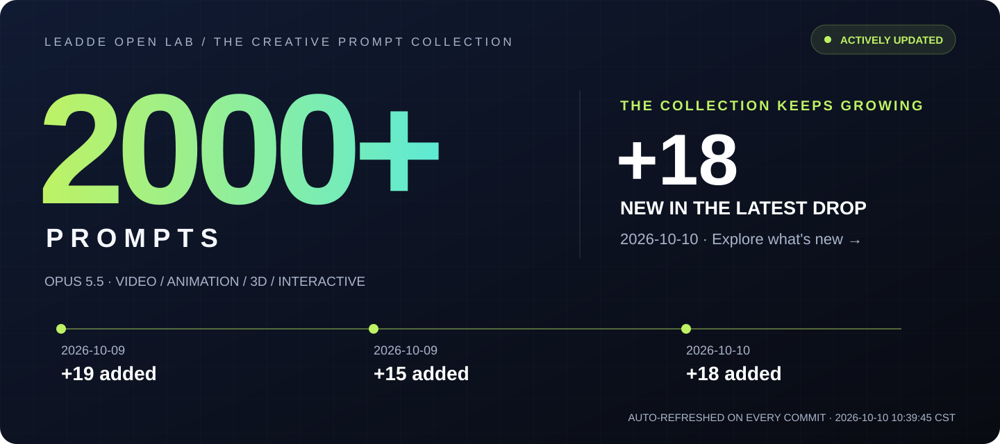
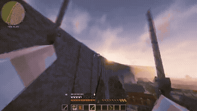
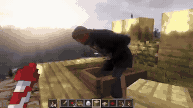

# Awesome Opus 5.5 Video Prompts

**[Explore the collection →](#browse-the-full-library)** · [Start with a prompt](#start-here) · [Latest additions](#recently-added)

## Featured creations

<table>
<tr>
<td width="50%" valign="top">
 
<strong>Claude Opus 5.5 15-Second Motion Design Showreel via Remotion</strong> 

<a href="https://x.com/ajith_io/status/2103449416325890146">Original post ↗</a> · <a href="prompts/2103449416325890146.md">Prompt ↗</a>
</td>
<td width="50%" valign="top">
 
<strong>Vincent's Cats: 3D Starry Night Game</strong> 

<a href="https://x.com/MandelDuck/status/2103802923465768972">Original post ↗</a> · <a href="prompts/2103802923465768972.md">Prompt ↗</a>
</td>
</tr>
<tr>
<td width="50%" valign="top">
 
<strong>Code-Driven Looping UI Motion Graphics</strong> 

<a href="https://x.com/twoclipping/status/2103273003555402193">Original post ↗</a> · <a href="prompts/2103273003555402193.md">Prompt ↗</a>
</td>
<td width="50%" valign="top">
 
<strong>Manim Derivative Concept Educational Video</strong> 

<a href="https://x.com/LinearUncle/status/2103128559174971663">Original post ↗</a> · <a href="prompts/2103128559174971663.md">Prompt ↗</a>
</td>
</tr>
<tr>
<td width="50%" valign="top">
 
<strong>1906 San Francisco Market Street Blender Reconstruction</strong> 

<a href="https://x.com/alexalbert__/status/2102466523164274839">Original post ↗</a> · <a href="prompts/2102466523164274839.md">Prompt ↗</a>
</td>
<td width="50%" valign="top">
 
<strong>Animated Pixel Art Wizard in Canvas 2D</strong> 

<a href="https://x.com/majidmanzarpour/status/2102476258948927543">Original post ↗</a> · <a href="prompts/2102476258948927543.md">Prompt ↗</a>
</td>
</tr>
</table>

## Start here

Pick a result to try. Setup instructions are on each prompt page; these examples have not been reproduced by this repository.

<table>
<tr>
<td width="33%" valign="top">
 
<strong>Easiest start: pixel-art wizard</strong> 
Copy the prompt, save one HTML file, and open it in your browser. No external assets. 
<a href="prompts/2102476258948927543.md#prompt-english">Copy prompt &amp; setup →</a>
</td>
<td width="33%" valign="top">
 
<strong>Your product: a 30-second business explainer</strong> 
Replace the business description and brand colors, then preview the HTML animation. 
<a href="prompts/2103499977632997524.md#prompt-english">Copy prompt &amp; setup →</a>
</td>
<td width="33%" valign="top">
 
<strong>Teach a concept: derivatives with Manim</strong> 
Generate a narrated lesson with Manim and edge-tts. Python setup required. 
<a href="prompts/2103128559174971663.md#prompt-english">Copy prompt &amp; setup →</a>
</td>
</tr>
</table>

## Recently added

<table>
<tr>
<td width="33%" valign="top">
 
<strong>Attack on Titan ODM Gear Setup in Minecraft</strong> 

<a href="https://x.com/0xDeniAi/status/2108301605544047099">Original post ↗</a> · <a href="prompts/2108301605544047099.md">Prompt ↗</a>
</td>
<td width="33%" valign="top">
 
<strong>Arthur Morgan in Minecraft via Opus 5.5</strong> 

<a href="https://x.com/0xAidanAi/status/2108303873538683065">Original post ↗</a> · <a href="prompts/2108303873538683065.md">Prompt ↗</a>
</td>
<td width="33%" valign="top">
 
<strong>Automated Guitar Chord Visualization from Video Reel</strong> 

<a href="https://x.com/keikumata/status/2108329031892713883">Original post ↗</a> · <a href="prompts/2108329031892713883.md">Prompt ↗</a>
</td>
</tr>
</table>

## Browse the full library

- [Product & Brand Videos](data/categories/product-brand.md) (68)
- [Motion Graphics & Typography](data/categories/motion-graphics.md) (210)
- [UI & Web Animation](data/categories/ui-web.md) (14)
- [Explainers & Education](data/categories/explainers.md) (62)
- [Music & Storytelling](data/categories/music-storytelling.md) (26)
- [3D Worlds & Simulations](data/categories/3d-scenes.md) (65)
- [Games & Interactive Experiences](data/categories/games-interactive.md) (62)

30 homepage picks · Original creator links on every card.

## Product & Brand Videos — homepage picks

<table>
<tr>
<td width="33%" valign="top">
 
<strong>Product Promo Video Generation</strong> 

<a href="https://x.com/felipemoller/status/2103846311149936736">Original post ↗</a> · <a href="prompts/2103846311149936736.md">Prompt ↗</a>
</td>
<td width="33%" valign="top">
 
<strong>Code-Driven Motion Design Video</strong> 

<a href="https://x.com/twoclipping/status/2102554209166000267">Original post ↗</a> · <a href="prompts/2102554209166000267.md">Prompt ↗</a>
</td>
<td width="33%" valign="top">
 
<strong>Code-Based Apple-Style Keynote Motion Design</strong> 

<a href="https://x.com/twoclipping/status/2103835273813496100">Original post ↗</a> · <a href="prompts/2103835273813496100.md">Prompt ↗</a>
</td>
</tr>
<tr>
<td width="33%" valign="top">
 
<strong>Opus 5.5 Ad Inspired by Apple 1984</strong> 

<a href="https://x.com/1littlecoder/status/2103746736980378066">Original post ↗</a> · <a href="prompts/2103746736980378066.md">Prompt ↗</a>
</td>
<td width="33%" valign="top">
 
<strong>Remotion Product Intro</strong> 

<a href="https://x.com/HO_BA/status/2103845264649761062">Original post ↗</a> · <a href="prompts/2103845264649761062.md">Prompt ↗</a>
</td><td></td>
</tr>
</table>

[Browse all 68 product & brand videos →](data/categories/product-brand.md)

## Motion Graphics & Typography — homepage picks

<table>
<tr>
<td width="33%" valign="top">
 
<strong>Infinite Zoom Vintage Collage Animation</strong> 

<a href="https://x.com/koldo2k/status/2103129343253778767">Original post ↗</a> · <a href="prompts/2103129343253778767.md">Prompt ↗</a>
</td>
<td width="33%" valign="top">
 
<strong>Spotify-Themed Motion Design</strong> 

<a href="https://x.com/brainextends/status/2103801834930606193">Original post ↗</a> · <a href="prompts/2103801834930606193.md">Prompt ↗</a>
</td>
<td width="33%" valign="top">
 
<strong>Four Seasons Train Window Animation</strong> 

<a href="https://x.com/itsolelehmann/status/2103124033365762215">Original post ↗</a> · <a href="prompts/2103124033365762215.md">Prompt ↗</a>
</td>
</tr>
</table>

[Browse all 210 motion graphics & typography →](data/categories/motion-graphics.md)

## UI & Web Animation — homepage picks

<table>
<tr>
<td width="33%" valign="top">
 
<strong>Three.js 15s 3D Motion Graphics</strong> 

<a href="https://x.com/hiro19_k/status/2104471436039803295">Original post ↗</a> · <a href="prompts/2104471436039803295.md">Prompt ↗</a>
</td>
<td width="33%" valign="top">
 
<strong>Auren Header Scroll-Scrubbed Hero Section</strong> 

<a href="https://x.com/iamtanzil_/status/2103820321673675031">Original post ↗</a> · <a href="prompts/2103820321673675031.md">Prompt ↗</a>
</td><td></td>
</tr>
</table>

[Browse all 14 ui & web animation →](data/categories/ui-web.md)

## Explainers & Education — homepage picks

<table>
<tr>
<td width="33%" valign="top">
 
<strong>Recursion Explanation Video</strong> 

<a href="https://x.com/emollick/status/2103688362960019567">Original post ↗</a> · <a href="prompts/2103688362960019567.md">Prompt ↗</a>
</td>
<td width="33%" valign="top">
 
<strong>Japan Summer Weather Visualization</strong> 

<a href="https://x.com/GroundControl/status/2103678647777230877">Original post ↗</a> · <a href="prompts/2103678647777230877.md">Prompt ↗</a>
</td>
<td width="33%" valign="top">
 
<strong>Photon Journey Explainer Animation</strong> 

<a href="https://x.com/AstroTheWizard/status/2103629247751618782">Original post ↗</a> · <a href="prompts/2103629247751618782.md">Prompt ↗</a>
</td>
</tr>
<tr>
<td width="33%" valign="top">
 
<strong>Negroni Cocktail Explainer Motion Graphic in HTML</strong> 

<a href="https://x.com/Ror_Fly/status/2102853258582880547">Original post ↗</a> · <a href="prompts/2102853258582880547.md">Prompt ↗</a>
</td>
<td width="33%" valign="top">
 
<strong>Educational Motion-Graphics on Recursive AI Agent Limitations</strong> 

<a href="https://x.com/M_Adrian2/status/2104542961081983435">Original post ↗</a> · <a href="prompts/2104542961081983435.md">Prompt ↗</a>
</td><td></td>
</tr>
</table>

[Browse all 62 explainers & education →](data/categories/explainers.md)

## Music & Storytelling — homepage picks

<table>
<tr>
<td width="33%" valign="top">
 
<strong>Animated Music Video Prompt for Claude Opus</strong> 

<a href="https://x.com/doubleunplussed/status/2103697580421181894">Original post ↗</a> · <a href="prompts/2103697580421181894.md">Prompt ↗</a>
</td><td></td><td></td>
</tr>
</table>

[Browse all 26 music & storytelling →](data/categories/music-storytelling.md)

## 3D Worlds & Simulations — homepage picks

<table>
<tr>
<td width="33%" valign="top">
 
<strong>Cinematic Browser-Based 3D World</strong> 

<a href="https://x.com/LexnLin/status/2103194052850241739">Original post ↗</a> · <a href="prompts/2103194052850241739.md">Prompt ↗</a>
</td>
<td width="33%" valign="top">
 
<strong>Pelican Riding a Bicycle Animation</strong> 

<a href="https://x.com/AxtonLiu/status/2103119648271290566">Original post ↗</a> · <a href="prompts/2103119648271290566.md">Prompt ↗</a>
</td>
<td width="33%" valign="top">
 
<strong>Interactive WebGPU Strawberry Cake Soft-Body Physics</strong> 

<a href="https://x.com/ImaStudio_ai/status/2104514806443303238">Original post ↗</a> · <a href="prompts/2104514806443303238.md">Prompt ↗</a>
</td>
</tr>
</table>

[Browse all 65 3d worlds & simulations →](data/categories/3d-scenes.md)

## Games & Interactive Experiences — homepage picks

<table>
<tr>
<td width="33%" valign="top">
 
<strong>3D Star Wars Multiplayer Game</strong> 

<a href="https://x.com/0xChuckstock/status/2103804606794879327">Original post ↗</a> · <a href="prompts/2103804606794879327.md">Prompt ↗</a>
</td>
<td width="33%" valign="top">
 
<strong>Police Chase Arcade Game PRD</strong> 

<a href="https://x.com/froessell/status/2103789415323562325">Original post ↗</a> · <a href="prompts/2103789415323562325.md">Prompt ↗</a>
</td>
<td width="33%" valign="top">
 
<strong>Pixel Art Hearthstone-Style Card Game</strong> 

<a href="https://x.com/aisongman/status/2103763192971461057">Original post ↗</a> · <a href="prompts/2103763192971461057.md">Prompt ↗</a>
</td>
</tr>
<tr>
<td width="33%" valign="top">
 
<strong>Interactive 2D/3D Floor Plan and Interior Design Web Tool</strong> 

<a href="https://x.com/akokoi1/status/2104520072014508316">Original post ↗</a> · <a href="prompts/2104520072014508316.md">Prompt ↗</a>
</td>
<td width="33%" valign="top">
 
<strong>Interactive Rain Window Calming App</strong> 

<a href="https://x.com/d_llm_kr/status/2104189915693269112">Original post ↗</a> · <a href="prompts/2104189915693269112.md">Prompt ↗</a>
</td><td></td>
</tr>
</table>

[Browse all 62 games & interactive experiences →](data/categories/games-interactive.md)

Browse by tool

- [canvas-interactive](data/categories/canvas-interactive.md) — 62
- [manim](data/categories/manim.md) — 2
- [remotion](data/categories/remotion.md) — 10
- [blender](data/categories/blender.md) — 7
- [external-video-model](data/categories/external-video-model.md) — 6
- [other-animation](data/categories/other-animation.md) — 421

## How to use

1. Pick a result and copy its public prompt from the card or detail page.
2. Supply any inputs listed by the creator, then use the prompt with your Opus agent.
3. Follow the creator’s renderer/tool setup. A shared fragment may need additional instructions.

About this collection &amp; source checks

Opus directs or writes the code for these videos, animations and interactive recordings. The detail page distinguishes prompt-required tools, author-confirmed tools and unconfirmed inferences. Author claims and media consistency checks do not establish repository reproduction. Reference cases may have unverified model version or production details; they are not counted as fully verified cases. We do not reconstruct missing author prompts.

[Review queue](data/docs/REVIEW-QUEUE.md) · [Contribute](data/docs/CONTRIBUTING.md) · [Attribution & corrections](data/docs/RIGHTS.md)

## Credits

Maintained by [LeaddeOpenLab](https://github.com/LeaddeOpenLab) · [Leadde.ai](https://Leadde.ai). All works and prompts belong to their linked creators. Independent collection.
