# Awesome Opus 5.5 Video Prompts

See the result. Copy the creator’s public prompt. Open the original video.

**20 video + prompt pairs** · 1 full public prompt · 19 shared fragments / transcriptions · [Browse by topic](#browse-by-topic) · [How to use](#how-to-use)

## Video + prompt gallery

Static covers or short GIF previews link to the original video. Fragments and reference cases are labelled; missing prompts are excluded.

<table>
<tr>
<td width="33%" valign="top">
<a href="https://x.com/notdwd/status/2104401208958230764">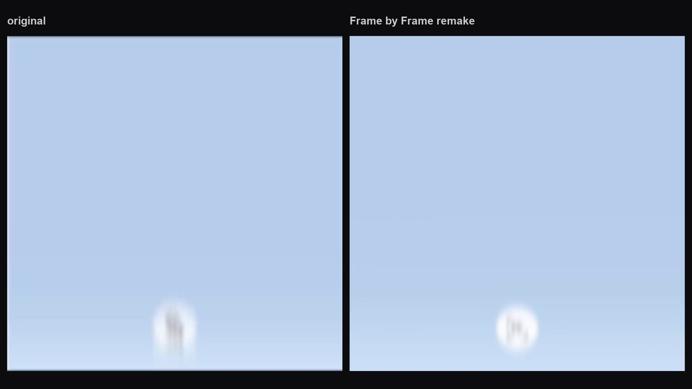</a>
<h3><a href="prompts/2104401208958230764.md">Brand Rebuild Product Sting with HTML Canvas and Playwright</a></h3>

Full public prompt · Reference case

&lt;inputs&gt; Ask me for: my product name, a logo (or let you draw a simple mark), my brand colours (or pull them from my logo), the one-line thing a user types into the prompt box, the page that answers it (title + 2–3 sente…

Read full shared text
<pre>&lt;inputs&gt;
Ask me for: my product name, a logo (or let you draw a simple mark), my brand colours (or pull them from my logo), the one-line thing a user types into the prompt box, the page that answers it (title + 2–3 sentences with one key phrase), two feature names for the stacked cards, and a music track. If I skip any, use the defaults: product &quot;Frame by Frame&quot; living inside its Whop hub, a viewfinder mark (four corner brackets around a bold &quot;FF&quot;), prompt &quot;Make a launch video for my app&quot;, a lesson page titled &quot;2.1 Choose a reference&quot;, cards &quot;Launch&quot; and &quot;Sound&quot;, and Mixkit's free house track &quot;Rising Forest&quot; slowed to 124 BPM.
&lt;/inputs&gt;

&lt;direction&gt;
A 12 second square product sting, 1080x1080, frame numbers at 29.97 fps (f0–f359), master rendered at 59.94 fps. Apple-keynote feel: soft, white, bright blue, glassy. The camera never cuts on a still frame: every shot enters already moving (exponential ease-out, 12–19% of the remaining distance per frame) and leaves on an accelerating move or a blur ramp. Blur follows speed and direction on every move.
Palette: my brand colours mapped onto these roles; if I give none, use page #FDFDFB, haze #B7CFEB, ice #E6F0FA, deep blue #294376 → #769CC2 sky gradient, navy #1E2F52, accent blues #2F6BFF / #3CC8F0 / mint #4ED6A0, white. Type: Inter (400/500/600/700). No purple, violet, magenta or orange anywhere.
Story: the product header rises out of a blue haze inside a light app window → a cursor glides in, turns to face where it's going, grows on hover and clicks the logo → hard cut on the music drop to the app icon with four squares orbiting into a cross → the icon collapses into a Mac menu bar → the cursor clicks the menu-bar icon, a frosted glass prompt box springs out and the prompt types → whip-tilt up through a light-blue flash into the answer page scrolling into place → a card rises over it → blur-dissolve to two stacked cards with giant frosted-glass titles → blur-dissolve to the lone logo disc → hard cut to a black end card with a glowing wordmark.
Banned: crossfades, frozen frames (except one hold in S7), stock UI kits, glows on UI text, Math.random, anything that looks like a template.
&lt;/direction&gt;

&lt;structure&gt;
Coordinates are px on the 1080 stage. Music beat k = 0.048 + 0.4838·k s (124 BPM, one beat = 14.5 frames). The three hard cuts f72, f101, f159 land 2 frames before a beat: keep these exact frames.
S1 f0–71, header + window + click: haze #B7CFEB fading to #FDFDFB by f28, keep a blue floor glow #DBEEFD at the bottom. Header on one line: logo disc ⌀132 (#FBFCFE, 1px rim #E8E8EA, dark mark), the product name (Inter 500), a dark capsule pill &quot;on Whop&quot; (#2F2E2F, white text); the whole lockup spans x474–1063, centre line rises y932 (f0) → 776 (f2) → 683 (f5) → 608 (f10) → 546 (f24) → 536 (f37), drifting 1 px/frame after. Name appears f2 blurred, pill f4–5 heavily blurred and sliding 15 px left as it sharpens. A light hub window (radius 93, fill #FCFDFF, top band #F1F6FF, blue inner floor glow) fades in around it: opacity 0 to f14, 0.53 f15, 0.7 f19, 1.0 f24; top-left corner (408,405), runs off the right and bottom. Inside: a search pill in the top band, a left icon column (Courses icon at (537,739), faded Chat icon at (537,900)), and a course card from (764,700) off-frame with its cover image, title and &quot;Course · 8 lessons&quot;. Cursor (black macOS arrow, white outline, 32x39) appears f27 at (891,393), glides left decelerating to (770,383) f44, rotates to point down-left f47–51 as it dives, lands on the disc's lower right (629,564) f56 → (587,546) f59 → (555,531) f71; grows ×1.55 on hover from f56; a soft ice ring (#D5F3FF → #F7FEFF, outer ⌀174) lights around the disc from f53. Camera zooms about (540,540): 1.0 f46 → 1.2 f60 ease-in-out, holds f61, then eases out accelerating to 1.04 at f71 while the cursor presses (shrinks 15% f69–71).
S2 f72–100, icon + orbit: navy squircle app icon (#294376 → #1E2F52, white mark), 276 px at f72 shrinking ease-out to 178 px by f86, radius 28% of width, on a grey halo disc #E9E9E7 growing ⌀240 (f75) → 326 (f86). Four 92 px squares (radius 26) spin in counter-clockwise, decelerating, and lock into a cross at orbit radius ≈216 by f86: white (1px #E3E8EF edge + faint shadow) left, #2F6BFF top, #3CC8F0 right, #4ED6A0 bottom. f88–100: the icon shrinks accelerating to ≈40 px, the squares slide into a row on its right (white slips behind the icon), blur ramps 0.3 → 6 px.
S3 f101–158, menu bar + prompt: white page above a black laptop bezel band (y425–475, top highlight #686866), a dark navy menu bar (y477–538), wallpaper below = the blue sky gradient with thin white line art (one big circle, two horizontal lines, one vertical, a four-point sparkle at a crossing, soft teal glow top-right). Menu bar right cluster in white: Wi-Fi, battery, toggles, the product mark at x531–584, three ⌀36 dots #2F6BFF / #3CC8F0 / #4ED6A0 at x612, 661, 709, &quot;Mon Jun 22  9:41 AM&quot; 34 px. Enters blurred 3 px and settling by f110. Cursor rises from below (f102), sits on the mark, presses f113–117. Camera pans content right +125 px f115–130 (fastest f118–120). A frosted glass box (white-blue glass over the sky, bright top rim, radius 60) springs out from under the mark f116: width peaks 744 at f126 and settles 726x228 by f138 around x196–922, y568–797. The prompt types from f121 (first legible &quot;Make &quot;) to f150 (complete) at about 1 char/frame with a 1-frame hold every 2–3 chars; caret always on; three white outline icons along the bottom; send button #2F6BFF ⌀51 with a white up arrow. From f136 the whole scene drifts up, accelerating into a whip-tilt (f158 moving ≈25 px/frame, vertical blur ≈6–8 px) while the page tints #E6F4FE over f154–158.
S4 f159–186, answer page: a light course lesson page (breadcrumb, title, body): text column x120, body 47 px Inter 400 grey #BCBCBA, line pitch 58, one key phrase (&quot;frame for frame&quot;) in black 600. It arrives smeared and 420 px low, scrolls up with offsets 420, 315, 210, 170, 140, 116, 96, 81 (f166) … 14 (f175) … 0 (f180), then creeps −6 px by f186. Blur 24 px (f159) → 1.5 (f165) → 0. Flash #E2F4FE fading to #FDFDFB by f165. A cursor pointing straight up rides the scroll and stops under the key phrase (≈(450,591) f180), then drifts right.
S5 f187–214, card: a white card (x203–878, runs off the bottom) rises over the page: cover image 627x536 inset 24 px, radius 64, a light grabber bar at its top centre, caption semibold 38 px black, sub-caption grey 23 px. Cover top y642 (f187) → 456 (f191) → 395 (f196) → 369 (f200) → 348 (f205), then keeps drifting up ~4 px/frame. Card blur peaks 3.8 px at f189, sharp by f201; the page behind blurs to ≈2.5 px. Exit f207–214: card shrinks ~5% and rises while the whole frame blurs 1 → 7 px; cut at the blur peak.
S6 f215–244, two cards: white page, two stacked cards 538x348 (radius 57, gap 36) centred on x540, top card settling at y168 by f230, bottom at y552. Each: cover art (no text baked into it), a frosted pill top-left (&quot;Module 3&quot; / &quot;Module 5&quot;), a frosted round &quot;•••&quot; top-right, and a huge bold title along the bottom edge made of frosted glass (a blurred, lightened copy of the image clipped to the letters, cut off by the card's bottom edge): &quot;Launch&quot; and &quot;Sound&quot;. Both enter blurred 12 px and sharp by f224; the top card enters 8% large and rises from y264; the bottom card rises from y927, staggered behind it. They drift up 3 px/frame f230–238, then accelerate up and blur out into the cut.
S7 f245–300, logo disc: page #FDFDFB, disc ⌀168 #F6F6F6 with the dark mark, rises into the centre (top y569 f245 → 491 f250 → 468 f255 → 456 f269) with a vertical smear on the cut frame, holds still f269–287 (the only frozen stretch), then shrinks accelerating to ⌀123 at f300.
S8 f301–359, end card: black radial background (#020204 corners, ≈#272729 around the word), the wordmark in Inter 600, white #F3F3F5 with a tight glow plus a wide soft halo, centred (540,540). Word width: ≈1650 px f301 (horizontally smeared, zoom streaks) → 1350 f302 → 1110 f303 → 1049 f304 → 734 f309 → 678 f311 → 563 f320 → 516 f342 (≈1 px/frame shrink) → 492 f350, then collapses ease-in: 450 f355 → 267 f359 with blur rising to 3.5 px. The film ends mid-collapse.
&lt;/structure&gt;

&lt;build&gt;
1. One HTML page, 1080x1080, drawn by seek(t) as a pure function of the frame number. No CSS transitions, no timers, no Math.random (seeded hashes only). Shots register as {f0, f1, render(localFrame)}.
2. Every value is continuous in the frame number (the 59.94 master renders half frames): animate with keyframe tables kf(frame, [[f, value], ...], ease) and per-frame lookup tables with linear interpolation. No Math.floor on motion.
3. Blur: CSS filter blur for round blur, SVG feGaussianBlur with separate x/y stdDeviation for directional smears. Zoom smear on the end card = 20–30 scaled, faded copies of the word. Frosted glass = a blurred, lightened copy of what's behind, clipped to the shape.
4. Cursor: one SVG macOS arrow (black fill, white outline, soft shadow) with rotation and scale, reused in S1, S3, S4.
5. Sound (no voice), exactly 12.075 s: music at 124 BPM, soft intro, the drop at 2.47 s (beat 5, the f72 cut leads it by 2 frames). Synthesized SFX: soft impact 0.10 s; whooshes peaking at the cuts 2.402, 3.370, 5.305, 10.043 s; transition hits exactly on 6.240 s and 8.175 s; clicks at 2.33 and 3.83 s; very quiet key ticks every ~32 ms over 4.04–5.00 s; a soft shimmer at 10.05 s. Master to −14 LUFS, true peak −1 dBTP, no fade except the last 60 ms.
6. Render with Playwright (one screenshot per frame, fonts loaded first), encode H.264 yuv420p at 60000/1001, mux the audio.
&lt;/build&gt;

&lt;gotchas&gt;
Measure text only after the fonts load. A long product name won't fit where a 5-letter name did: scale the whole lockup (disc gap, name, pill) to fit the span x474–1063, don't let the pill fall off-frame. A white orbit square vanishes on the white page without a 1px edge and a faint shadow. Don't put images with their own text inside the S6 cards, or the glass title doubles up. Keep the cut frames exact even where they don't sit on a beat. Nothing freezes except S7 f269–287. Heavy blur tables can wipe a shape out completely: if a frame looks empty, lower the blur until the shape still reads.
&lt;/gotchas&gt;

&lt;start&gt;
Ask me for the inputs. Then show me 4 stills (f40 header in the window, f86 icon cross, f150 finished prompt, f230 the two cards) before you render the full film.
&lt;/start&gt;</pre>

<a href="prompts/2104401208958230764.md">Prompt &amp; details</a> · <a href="https://x.com/notdwd/status/2104401208958230764">Watch original</a> by <a href="https://x.com/notdwd/status/2104401208958230764">@notdwd</a> · <a href="https://x.com/notdwd/status/2104401208958230764">Prompt source</a>

</td>
<td width="33%" valign="top">
<a href="https://x.com/kokoro_886/status/2104441050211475528">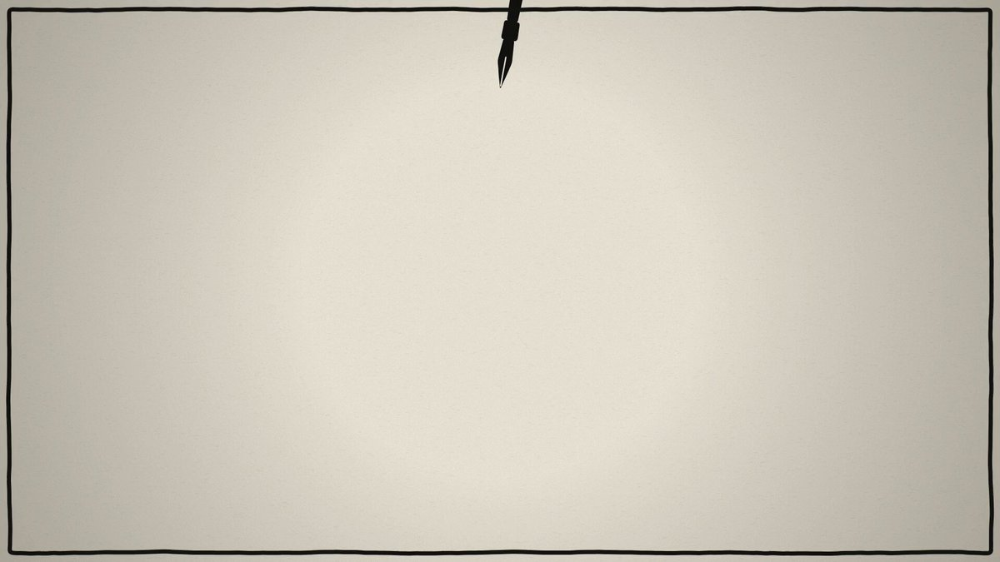</a>
<h3><a href="prompts/2104441050211475528.md">Opus 5.5 代码逐帧生成动画短片《我只会写字》</a></h3>

Public prompt fragment · Reference case

介绍自己能做什么样的视频

<a href="prompts/2104441050211475528.md">Prompt &amp; details</a> · <a href="https://x.com/kokoro_886/status/2104441050211475528">Watch original</a> by <a href="https://x.com/kokoro_886/status/2104441050211475528">@kokoro_886</a> · <a href="https://x.com/kokoro_886/status/2104441050211475528">Prompt source</a>

</td>
<td width="33%" valign="top">
<a href="https://x.com/rdominguezibar/status/2104436377546818041">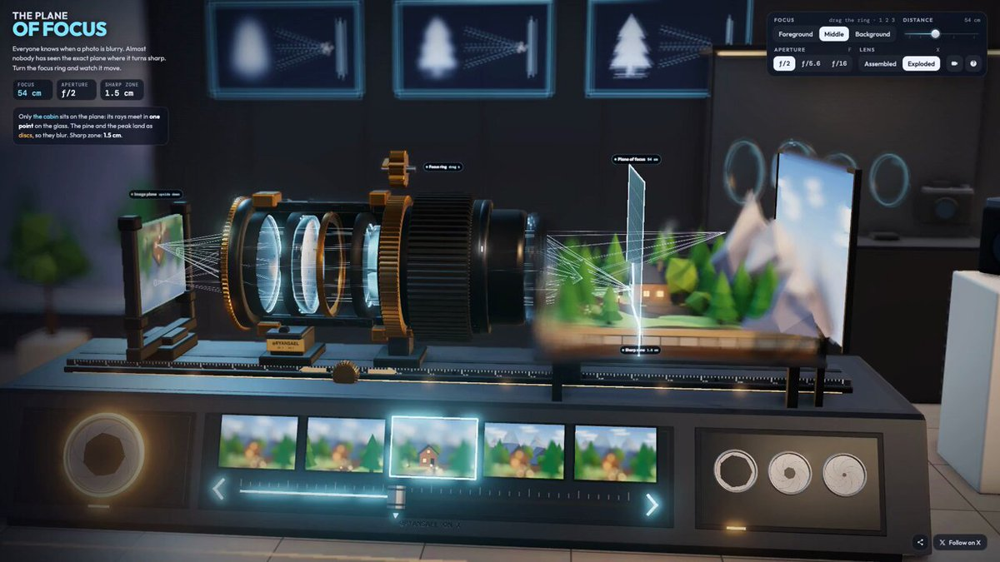</a>
<h3><a href="prompts/2104436377546818041.md">Interactive 3D Camera Lens Focus Lab</a></h3>

Public prompt fragment · Reference case

explain camera focus visually

<a href="prompts/2104436377546818041.md">Prompt &amp; details</a> · <a href="https://x.com/rdominguezibar/status/2104436377546818041">Watch original</a> by <a href="https://x.com/rdominguezibar/status/2104436377546818041">@rdominguezibar</a> · <a href="https://x.com/rdominguezibar/status/2104436377546818041">Prompt source</a>

</td>
</tr>
<tr>
<td width="33%" valign="top">
<a href="https://x.com/RAJKATAJJ/status/2104434742959755463">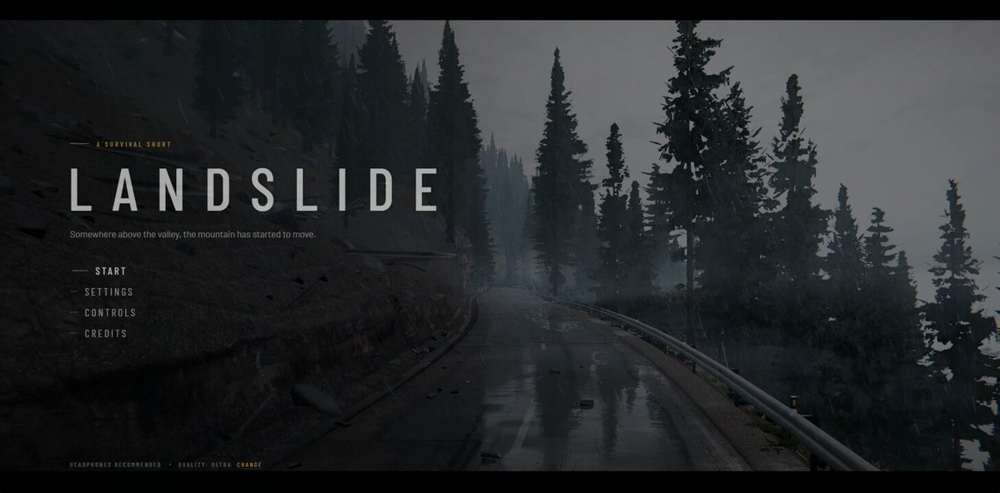</a>
<h3><a href="prompts/2104434742959755463.md">Hyperrealistic Landslide Escape Game Developed with Claude Opus 5.5</a></h3>

Public prompt fragment · Reference case

A hyperrealistic landslide escape game.

<a href="prompts/2104434742959755463.md">Prompt &amp; details</a> · <a href="https://x.com/RAJKATAJJ/status/2104434742959755463">Watch original</a> by <a href="https://x.com/RAJKATAJJ/status/2104434742959755463">@RAJKATAJJ</a> · <a href="https://x.com/RAJKATAJJ/status/2104434742959755463">Prompt source</a>

</td>
<td width="33%" valign="top">
<a href="https://x.com/AndyL5cc/status/2104428313544667245">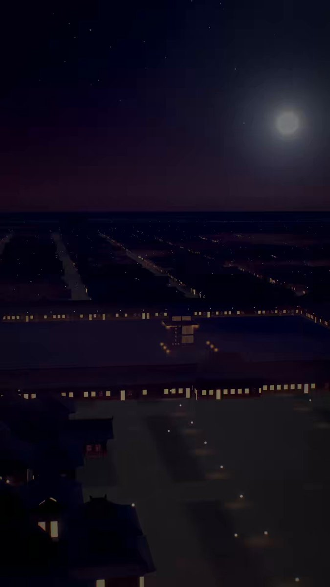</a>
<h3><a href="prompts/2104428313544667245.md">Opus 5.5 制作《水运仪象台》科普三维解构视频</a></h3>

Public prompt fragment · Reference case

水运仪象台

<a href="prompts/2104428313544667245.md">Prompt &amp; details</a> · <a href="https://x.com/AndyL5cc/status/2104428313544667245">Watch original</a> by <a href="https://x.com/AndyL5cc/status/2104428313544667245">@AndyL5cc</a> · <a href="https://x.com/AndyL5cc/status/2104428313544667245">Prompt source</a>

</td>
<td width="33%" valign="top">
<a href="https://x.com/weiwei2018831/status/2104420680142082118">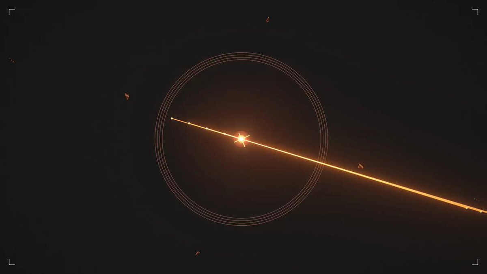</a>
<h3><a href="prompts/2104420680142082118.md">Code-Rendered Generative Music Video for I'm Upping My P(doom)</a></h3>

Public prompt fragment · Reference case

一个基于代码渲染的生成式音乐视频项目，用 Opus 5.5 在 Claude Code 中以对话方式，完成了歌曲《I'm Upping My P(doom)》MV 的创意、歌词逐词对齐、音频分析、渲染引擎与全部场景开发——每一帧画面都是歌曲时间的确定性函数，浏览器实时预览与离线导出的成片逐帧一致。

<a href="prompts/2104420680142082118.md">Prompt &amp; details</a> · <a href="https://x.com/weiwei2018831/status/2104420680142082118">Watch original</a> by <a href="https://x.com/weiwei2018831/status/2104420680142082118">@weiwei2018831</a> · <a href="https://x.com/weiwei2018831/status/2104420680142082118">Prompt source</a>

</td>
</tr>
<tr>
<td width="33%" valign="top">

<h3><a href="prompts/2104419703997567302.md">Persistence of Vision: A History of Hollywood in Code</a></h3>

Public prompt fragment · Reference case

A history of Hollywood, sculpted from light.

<a href="prompts/2104419703997567302.md">Prompt &amp; details</a> · <a href="https://x.com/abhi81i/status/2104419703997567302">Watch original</a> by <a href="https://x.com/abhi81i/status/2104419703997567302">@abhi81i</a> · <a href="https://x.com/abhi81i/status/2104419703997567302">Prompt source</a>

</td>
<td width="33%" valign="top">
<a href="https://x.com/bangbuilds/status/2104418374218600719">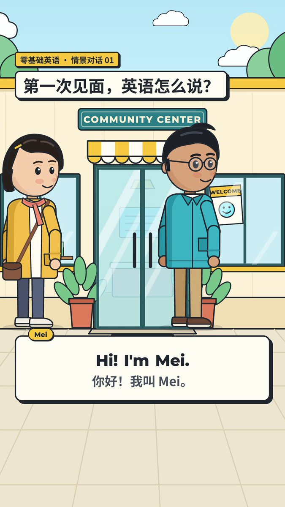</a>
<h3><a href="prompts/2104418374218600719.md">Programmatic 2D Animated English Learning Video via Opus 5.5 Code</a></h3>

Public prompt fragment · Reference case

让它写代码：人物用代码画，动作/标签/镜头/口型，都由他写的程序自动安排。

<a href="prompts/2104418374218600719.md">Prompt &amp; details</a> · <a href="https://x.com/bangbuilds/status/2104418374218600719">Watch original</a> by <a href="https://x.com/bangbuilds/status/2104418374218600719">@bangbuilds</a> · <a href="https://x.com/bangbuilds/status/2104418374218600719">Prompt source</a>

</td>
<td width="33%" valign="top">
<a href="https://x.com/happyanniegh3/status/2104416503164731646">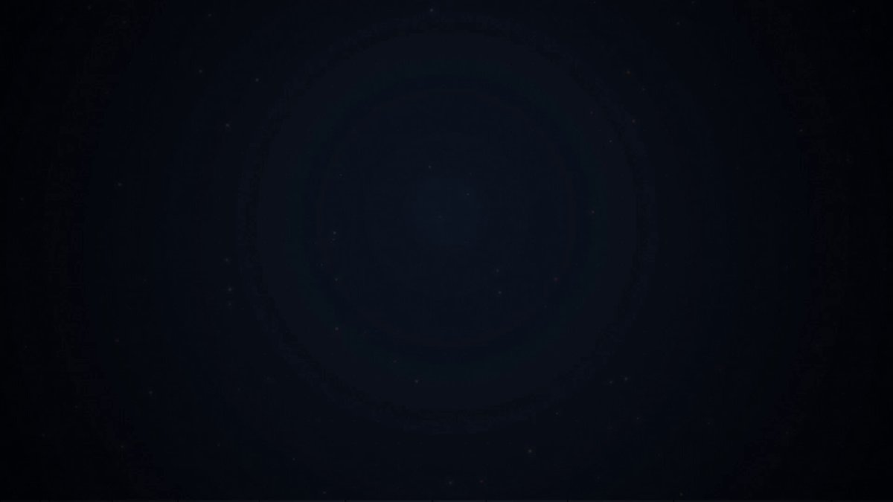</a>
<h3><a href="prompts/2104416503164731646.md">空气微流控芯片散热原理解析视频制作</a></h3>

Public prompt fragment · Reference case

空气微流控的芯片散热

<a href="prompts/2104416503164731646.md">Prompt &amp; details</a> · <a href="https://x.com/happyanniegh3/status/2104416503164731646">Watch original</a> by <a href="https://x.com/happyanniegh3/status/2104416503164731646">@happyanniegh3</a> · <a href="https://x.com/happyanniegh3/status/2104416503164731646">Prompt source</a>

</td>
</tr>
<tr>
<td width="33%" valign="top">

<h3><a href="prompts/2104413797876367664.md">Animated Book Preview for Winning With AI</a></h3>

Public prompt fragment · Reference case

generate a animated preview of our book- Winning With AI

<a href="prompts/2104413797876367664.md">Prompt &amp; details</a> · <a href="https://x.com/anujmagazine/status/2104413797876367664">Watch original</a> by <a href="https://x.com/anujmagazine/status/2104413797876367664">@anujmagazine</a> · <a href="https://x.com/anujmagazine/status/2104413797876367664">Prompt source</a>

</td>
<td width="33%" valign="top">

<h3><a href="prompts/2104410894167916709.md">Toyota Prius 2027 3D Disassembly and Animation in Blender</a></h3>

Public prompt fragment · Reference case

Avance del modelado 3D de un Toyota Prius 2027 🇲🇽: se desarma en 261 piezas, se vuelve a armar y sale rodando del arcoíris al Mostaza oficial.

<a href="prompts/2104410894167916709.md">Prompt &amp; details</a> · <a href="https://x.com/abxda/status/2104410894167916709">Watch original</a> by <a href="https://x.com/abxda/status/2104410894167916709">@abxda</a> · <a href="https://x.com/abxda/status/2104410894167916709">Prompt source</a>

</td>
<td width="33%" valign="top">
<a href="https://x.com/EZheng66099/status/2104410457263976899">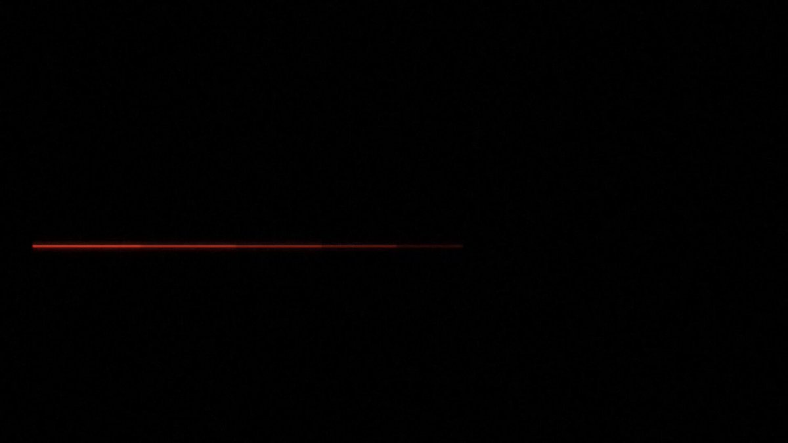</a>
<h3><a href="prompts/2104410457263976899.md">AI Portfolio Showreel Edited with Opus 5.5</a></h3>

Public prompt fragment · Reference case

I asked Opus 5.5 to turn my work into a one minute film.

<a href="prompts/2104410457263976899.md">Prompt &amp; details</a> · <a href="https://x.com/EZheng66099/status/2104410457263976899">Watch original</a> by <a href="https://x.com/EZheng66099/status/2104410457263976899">@EZheng66099</a> · <a href="https://x.com/EZheng66099/status/2104410457263976899">Prompt source</a>

</td>
</tr>
<tr>
<td width="33%" valign="top">
<a href="https://x.com/cryptoninjanime/status/2104409268351062188">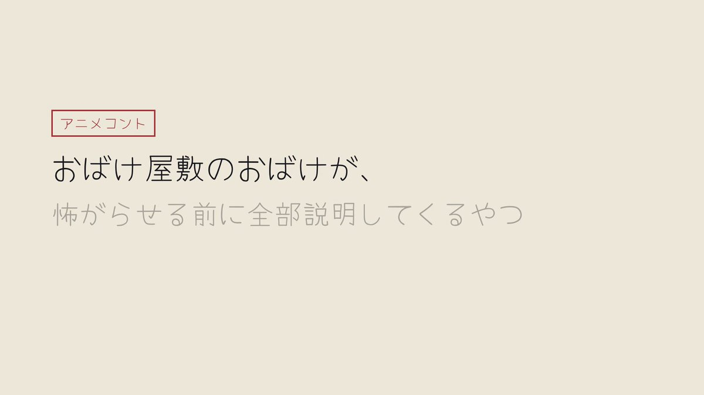</a>
<h3><a href="prompts/2104409268351062188.md">全自動ポン出しコントアニメ「おばけ屋敷のおばけが、怖がらせる前に全部説明してくるやつ」</a></h3>

Public prompt fragment · Reference case

シナリオ、イラスト、アニメーション、音声まで全部お任せでコントアニメをポン出しで

<a href="prompts/2104409268351062188.md">Prompt &amp; details</a> · <a href="https://x.com/cryptoninjanime/status/2104409268351062188">Watch original</a> by <a href="https://x.com/cryptoninjanime/status/2104409268351062188">@cryptoninjanime</a> · <a href="https://x.com/cryptoninjanime/status/2104409268351062188">Prompt source</a>

</td>
<td width="33%" valign="top">
<a href="https://x.com/ekcheungAI/status/2104406088862810533">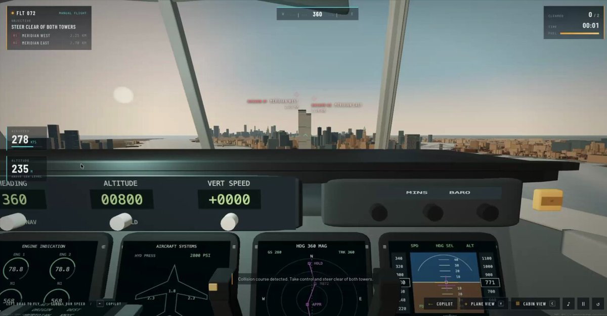</a>
<h3><a href="prompts/2104406088862810533.md">Interactive 3D Flight Simulator Game</a></h3>

Public prompt fragment · Reference case

寫一個飛機模擬器

<a href="prompts/2104406088862810533.md">Prompt &amp; details</a> · <a href="https://x.com/ekcheungAI/status/2104406088862810533">Watch original</a> by <a href="https://x.com/ekcheungAI/status/2104406088862810533">@ekcheungAI</a> · <a href="https://x.com/ekcheungAI/status/2104406088862810533">Prompt source</a>

</td>
<td width="33%" valign="top">

<h3><a href="prompts/2104403368752071059.md">防犯ダンス(翠都銀行)の動画制作とエフェクト付与</a></h3>

Public prompt fragment · Reference case

動画に合うタイプグラフィやエフェクトつけて

<a href="prompts/2104403368752071059.md">Prompt &amp; details</a> · <a href="https://x.com/mi7_crypto/status/2104403368752071059">Watch original</a> by <a href="https://x.com/mi7_crypto/status/2104403368752071059">@mi7_crypto</a> · <a href="https://x.com/mi7_crypto/status/2104409517459148927">Prompt source</a>

</td>
</tr>
<tr>
<td width="33%" valign="top">
<a href="https://x.com/yanliudesign/status/2104393313935839698">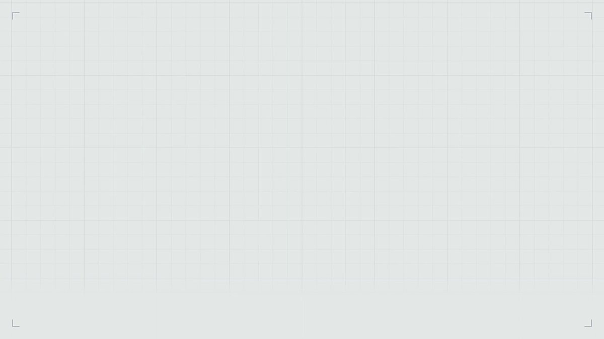</a>
<h3><a href="prompts/2104393313935839698.md">Seattle History Motion Graphics Video</a></h3>

Public prompt fragment · Reference case

create a 15-second motion graphics video about Seattle

<a href="prompts/2104393313935839698.md">Prompt &amp; details</a> · <a href="https://x.com/yanliudesign/status/2104393313935839698">Watch original</a> by <a href="https://x.com/yanliudesign/status/2104393313935839698">@yanliudesign</a> · <a href="https://x.com/yanliudesign/status/2104393313935839698">Prompt source</a>

</td>
<td width="33%" valign="top">

<h3><a href="prompts/2104391577091407965.md">SQLite Explainer Animation and Architectural Walkthrough</a></h3>

Public prompt fragment · Reference case

1. explains what the repo does and why its useful 2. shows a high level map of the code (beautiful graphic!) 3. life of a query through the codebase 4. the core abstractions in the repo 5. a real trace of execution and w…

Read full shared text
<pre>1. explains what the repo does and why its useful
2. shows a high level map of the code (beautiful graphic!)
3. life of a query through the codebase
4. the core abstractions in the repo
5. a real trace of execution and what happens, with a bit on join-order query planning</pre>

<a href="prompts/2104391577091407965.md">Prompt &amp; details</a> · <a href="https://x.com/deedydas/status/2104391577091407965">Watch original</a> by <a href="https://x.com/deedydas/status/2104391577091407965">@deedydas</a> · <a href="https://x.com/deedydas/status/2104391577091407965">Prompt source</a>

</td>
<td width="33%" valign="top">
<a href="https://x.com/zakisbuilding/status/2104389736647495680">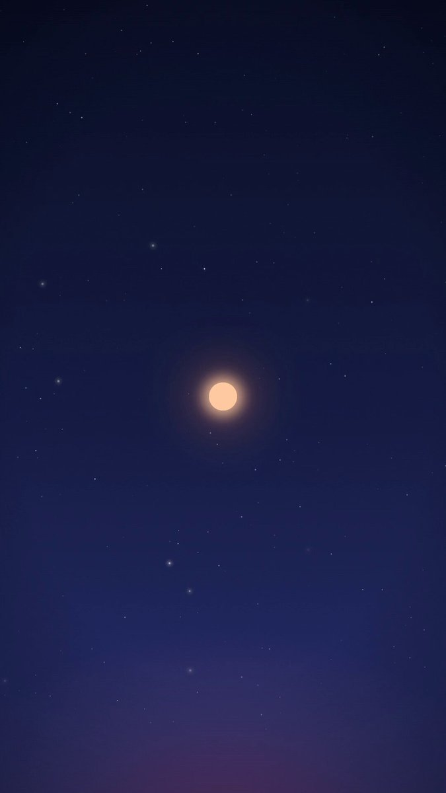</a>
<h3><a href="prompts/2104389736647495680.md">Bedless Fajr App Motion Graphics Showreel via Remotion</a></h3>

Public prompt fragment · Reference case

make a dynamic 15-second motion graphics video of the app that shows what an incredible motion designer you are, like it's your showreel for a résumé. go all out.

<a href="prompts/2104389736647495680.md">Prompt &amp; details</a> · <a href="https://x.com/zakisbuilding/status/2104389736647495680">Watch original</a> by <a href="https://x.com/zakisbuilding/status/2104389736647495680">@zakisbuilding</a> · <a href="https://x.com/zakisbuilding/status/2104389826414039074">Prompt source</a>

</td>
</tr>
<tr>
<td width="33%" valign="top">
<a href="https://x.com/ann_nnng/status/2104159923886244176">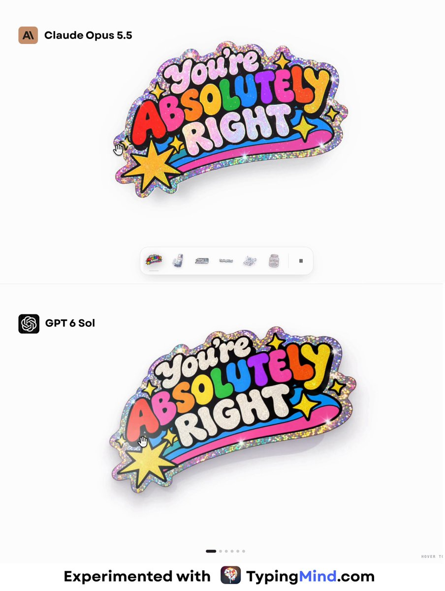</a>
<h3><a href="prompts/2104159923886244176.md">Interactive Glitter Sticker Effect with Peel Animation Comparison</a></h3>

Public prompt fragment · Reference case

create the glitter sticker effect

<a href="prompts/2104159923886244176.md">Prompt &amp; details</a> · <a href="https://x.com/ann_nnng/status/2104159923886244176">Watch original</a> by <a href="https://x.com/ann_nnng/status/2104159923886244176">@ann_nnng</a> · <a href="https://x.com/ann_nnng/status/2104159923886244176">Prompt source</a>

</td>
<td width="33%" valign="top">
<a href="https://x.com/konstantinsaifo/status/2104094723887501736">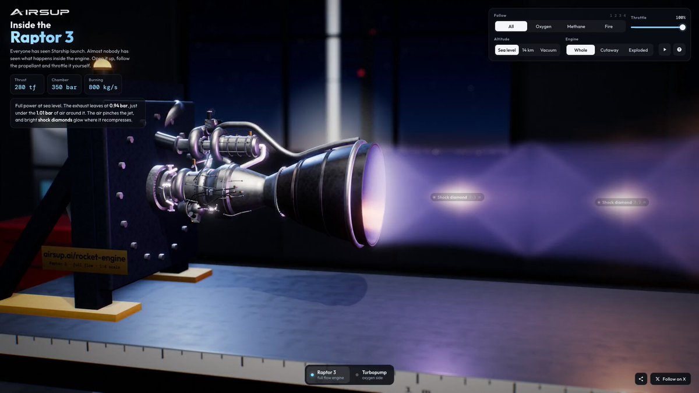</a>
<h3><a href="prompts/2104094723887501736.md">Interactive 3D Raptor 3 Rocket Engine WebGL Model</a></h3>

Public prompt fragment · Reference case

explain how a rocket engine works by building an interactive Raptor 3 you can take apart in your browser

<a href="prompts/2104094723887501736.md">Prompt &amp; details</a> · <a href="https://x.com/konstantinsaifo/status/2104094723887501736">Watch original</a> by <a href="https://x.com/konstantinsaifo/status/2104094723887501736">@konstantinsaifo</a> · <a href="https://x.com/konstantinsaifo/status/2104094723887501736">Prompt source</a>

</td><td></td>
</tr>
</table>

## Browse by topic

- [canvas-interactive](categories/canvas-interactive.md) — 7
- [manim](categories/manim.md) — 0
- [remotion](categories/remotion.md) — 1
- [blender](categories/blender.md) — 1
- [external-video-model](categories/external-video-model.md) — 1
- [other-animation](categories/other-animation.md) — 10

## How to use

1. Pick a result and copy its public prompt from the card or detail page.
2. Supply any inputs listed by the creator, then use the prompt with your Opus agent.
3. Follow the creator’s renderer/tool setup. A shared fragment may need additional instructions.

About this collection &amp; source checks

Opus directs or writes the code for these videos, animations and interactive recordings. The detail page identifies the actual renderer and known missing inputs. Reference cases may have unverified model version or production details; they are not counted as fully verified cases. We do not reconstruct missing author prompts.

[Review queue](REVIEW-QUEUE.md) · [Contribute](CONTRIBUTING.md) · [Attribution & corrections](RIGHTS.md)

Maintained by [LeaddeOpenLab](https://github.com/LeaddeOpenLab) · [Leadde.ai](https://Leadde.ai). All works and prompts belong to their linked creators. Independent collection.
