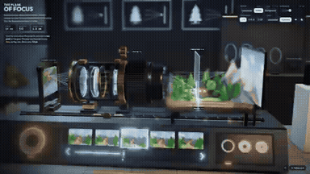
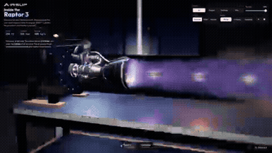

# Awesome Opus 5.5 Video Prompts

A growing collection of videos and animations made with **Claude Opus 5.5**, paired with the prompts their creators shared.

Explore motion graphics, explainers, 3D scenes and interactive experiments. Pick a result, copy its prompt, and try it with your own agent.

Updated continuously · Original creator links included · [Explore Leadde](https://Leadde.ai)

## Contents

- [Motion graphics](#motion-graphics) (7)
- [Explainers](#explainers) (5)
- [3D scenes](#3d-scenes) (1)
- [Games & interactive](#games-interactive) (7)
- [How to use a prompt](#how-to-use)
- [Credits](#credits)
- [More creator sources](DISCOVERY.md)

## Motion graphics

<table>
<tr>
<td width="33%" valign="top">
 
&lt;inputs&gt; Ask me for: my product name, a logo (or let you... 
<a href="https://x.com/notdwd/status/2104401208958230764">Original post ↗</a> · <a href="prompts/2104401208958230764.md">Prompt ↗</a>
</td>
<td width="33%" valign="top">
 
Make it write code: characters are drawn using code, and... 
<a href="https://x.com/bangbuilds/status/2104418374218600719">Original post ↗</a> · <a href="prompts/2104418374218600719.md">Prompt ↗</a>
</td>
<td width="33%" valign="top">
 
generate a animated preview of our book- Winning With AI 
<a href="https://x.com/anujmagazine/status/2104413797876367664">Original post ↗</a> · <a href="prompts/2104413797876367664.md">Prompt ↗</a>
</td>
</tr>
<tr>
<td width="33%" valign="top">
 
I asked Opus 5.5 to turn my work into a one minute film. 
<a href="https://x.com/EZheng66099/status/2104410457263976899">Original post ↗</a> · <a href="prompts/2104410457263976899.md">Prompt ↗</a>
</td>
<td width="33%" valign="top">
 
Produce a comedy sketch animation on the fly,... 
<a href="https://x.com/cryptoninjanime/status/2104409268351062188">Original post ↗</a> · <a href="prompts/2104409268351062188.md">Prompt ↗</a>
</td>
<td width="33%" valign="top">
 
Add typography and effects that match the video 
<a href="https://x.com/mi7_crypto/status/2104403368752071059">Original post ↗</a> · <a href="prompts/2104403368752071059.md">Prompt ↗</a>
</td>
</tr>
<tr>
<td width="33%" valign="top">
 
make a dynamic 15-second motion graphics video of the app... 
<a href="https://x.com/zakisbuilding/status/2104389736647495680">Original post ↗</a> · <a href="prompts/2104389736647495680.md">Prompt ↗</a>
</td><td></td><td></td>
</tr>
</table>

## Explainers

<table>
<tr>
<td width="33%" valign="top">
 
Water-driven Astronomical Clock Tower 
<a href="https://x.com/AndyL5cc/status/2104428313544667245">Original post ↗</a> · <a href="prompts/2104428313544667245.md">Prompt ↗</a>
</td>
<td width="33%" valign="top">
 
A history of Hollywood, sculpted from light. 
<a href="https://x.com/abhi81i/status/2104419703997567302">Original post ↗</a> · <a href="prompts/2104419703997567302.md">Prompt ↗</a>
</td>
<td width="33%" valign="top">
 
Air microfluidic chip cooling &nbsp; 
<a href="https://x.com/happyanniegh3/status/2104416503164731646">Original post ↗</a> · <a href="prompts/2104416503164731646.md">Prompt ↗</a>
</td>
</tr>
<tr>
<td width="33%" valign="top">
 
create a 15-second motion graphics video about Seattle 
<a href="https://x.com/yanliudesign/status/2104393313935839698">Original post ↗</a> · <a href="prompts/2104393313935839698.md">Prompt ↗</a>
</td>
<td width="33%" valign="top">
 
1. explains what the repo does and why its useful\n2. shows... 
<a href="https://x.com/deedydas/status/2104391577091407965">Original post ↗</a> · <a href="prompts/2104391577091407965.md">Prompt ↗</a>
</td><td></td>
</tr>
</table>

## 3D scenes

<table>
<tr>
<td width="33%" valign="top">
 
Preview of the 3D modeling of a 2027 Toyota Prius 🇲🇽: it d... 
<a href="https://x.com/abxda/status/2104410894167916709">Original post ↗</a> · <a href="prompts/2104410894167916709.md">Prompt ↗</a>
</td><td></td><td></td>
</tr>
</table>

## Games & interactive

<table>
<tr>
<td width="33%" valign="top">
 
Introduce what kind of videos you can make 
<a href="https://x.com/kokoro_886/status/2104441050211475528">Original post ↗</a> · <a href="prompts/2104441050211475528.md">Prompt ↗</a>
</td>
<td width="33%" valign="top">
 
explain camera focus visually &nbsp; 
<a href="https://x.com/rdominguezibar/status/2104436377546818041">Original post ↗</a> · <a href="prompts/2104436377546818041.md">Prompt ↗</a>
</td>
<td width="33%" valign="top">
 
A hyperrealistic landslide escape game. 
<a href="https://x.com/RAJKATAJJ/status/2104434742959755463">Original post ↗</a> · <a href="prompts/2104434742959755463.md">Prompt ↗</a>
</td>
</tr>
<tr>
<td width="33%" valign="top">
 
A code-rendered generative music video project,... 
<a href="https://x.com/weiwei2018831/status/2104420680142082118">Original post ↗</a> · <a href="prompts/2104420680142082118.md">Prompt ↗</a>
</td>
<td width="33%" valign="top">
 
Write a flight simulator &nbsp; 
<a href="https://x.com/ekcheungAI/status/2104406088862810533">Original post ↗</a> · <a href="prompts/2104406088862810533.md">Prompt ↗</a>
</td>
<td width="33%" valign="top">
 
create the glitter sticker effect 
<a href="https://x.com/ann_nnng/status/2104159923886244176">Original post ↗</a> · <a href="prompts/2104159923886244176.md">Prompt ↗</a>
</td>
</tr>
<tr>
<td width="33%" valign="top">
 
explain how a rocket engine works by building an... 
<a href="https://x.com/konstantinsaifo/status/2104094723887501736">Original post ↗</a> · <a href="prompts/2104094723887501736.md">Prompt ↗</a>
</td><td></td><td></td>
</tr>
</table>

## Browse by topic

- [canvas-interactive](categories/canvas-interactive.md) — 7
- [manim](categories/manim.md) — 0
- [remotion](categories/remotion.md) — 1
- [blender](categories/blender.md) — 1
- [external-video-model](categories/external-video-model.md) — 1
- [other-animation](categories/other-animation.md) — 10

## How to use

1. Pick a result and copy its public prompt from the card or detail page.
2. Supply any inputs listed by the creator, then use the prompt with your Opus agent.
3. Follow the creator’s renderer/tool setup. A shared fragment may need additional instructions.

About this collection &amp; source checks

Opus directs or writes the code for these videos, animations and interactive recordings. The detail page identifies the actual renderer and known missing inputs. Reference cases may have unverified model version or production details; they are not counted as fully verified cases. We do not reconstruct missing author prompts.

[Review queue](REVIEW-QUEUE.md) · [Contribute](CONTRIBUTING.md) · [Attribution & corrections](RIGHTS.md)

## Credits

Maintained by [LeaddeOpenLab](https://github.com/LeaddeOpenLab) · [Leadde.ai](https://Leadde.ai). All works and prompts belong to their linked creators. Independent collection.
