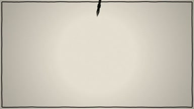
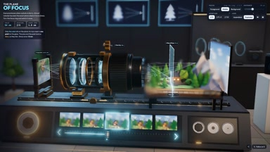
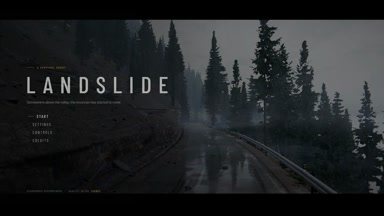
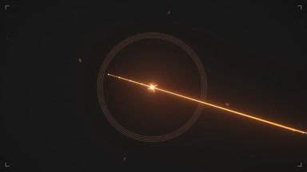
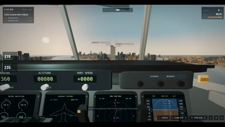
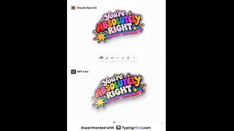
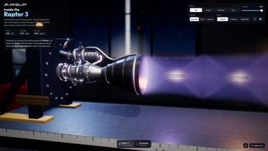

# Games & interactive

<table>
<tr>
<td width="33%" valign="top">
 
介绍自己能做什么样的视频 &nbsp; 
<a href="https://x.com/kokoro_886/status/2104441050211475528">Original post ↗</a>
</td>
<td width="33%" valign="top">
 
explain camera focus visually &nbsp; 
<a href="https://x.com/rdominguezibar/status/2104436377546818041">Original post ↗</a>
</td>
<td width="33%" valign="top">
 
A hyperrealistic landslide escape game. 
<a href="https://x.com/RAJKATAJJ/status/2104434742959755463">Original post ↗</a>
</td>
</tr>
<tr>
<td width="33%" valign="top">
 
一个基于代码渲染的生成式音乐视频 项目，用 Opus 5.5 在 Claude... 
<a href="https://x.com/weiwei2018831/status/2104420680142082118">Original post ↗</a>
</td>
<td width="33%" valign="top">
 
寫一個飛機模擬器 &nbsp; 
<a href="https://x.com/ekcheungAI/status/2104406088862810533">Original post ↗</a>
</td>
<td width="33%" valign="top">
 
create the glitter sticker effect 
<a href="https://x.com/ann_nnng/status/2104159923886244176">Original post ↗</a>
</td>
</tr>
<tr>
<td width="33%" valign="top">
 
explain how a rocket engine works by building an... 
<a href="https://x.com/konstantinsaifo/status/2104094723887501736">Original post ↗</a>
</td><td></td><td></td>
</tr>
</table>

[Back to gallery](../README.md)
