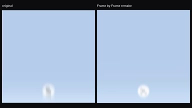
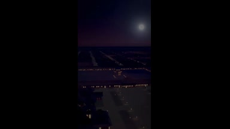
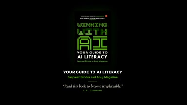

# other-animation

<table>
<tr>
<td width="33%" valign="top">
 
&lt;inputs&gt; Ask me for: my product name, a logo (or let you... 
<a href="https://x.com/notdwd/status/2104401208958230764">Original post ↗</a>
</td>
<td width="33%" valign="top">
 
Water-driven Astronomical Clock Tower 
<a href="https://x.com/AndyL5cc/status/2104428313544667245">Original post ↗</a>
</td>
<td width="33%" valign="top">
 
A history of Hollywood, sculpted from light. 
<a href="https://x.com/abhi81i/status/2104419703997567302">Original post ↗</a>
</td>
</tr>
<tr>
<td width="33%" valign="top">
 
Make it write code: characters are drawn using code, and... 
<a href="https://x.com/bangbuilds/status/2104418374218600719">Original post ↗</a>
</td>
<td width="33%" valign="top">
 
Air microfluidic chip cooling &nbsp; 
<a href="https://x.com/happyanniegh3/status/2104416503164731646">Original post ↗</a>
</td>
<td width="33%" valign="top">
 
generate a animated preview of our book- Winning With AI 
<a href="https://x.com/anujmagazine/status/2104413797876367664">Original post ↗</a>
</td>
</tr>
<tr>
<td width="33%" valign="top">
 
I asked Opus 5.5 to turn my work into a one minute film. 
<a href="https://x.com/EZheng66099/status/2104410457263976899">Original post ↗</a>
</td>
<td width="33%" valign="top">
 
Produce a comedy sketch animation on the fly,... 
<a href="https://x.com/cryptoninjanime/status/2104409268351062188">Original post ↗</a>
</td>
<td width="33%" valign="top">
 
create a 15-second motion graphics video about Seattle 
<a href="https://x.com/yanliudesign/status/2104393313935839698">Original post ↗</a>
</td>
</tr>
<tr>
<td width="33%" valign="top">
 
1. explains what the repo does and why its useful\n2. shows... 
<a href="https://x.com/deedydas/status/2104391577091407965">Original post ↗</a>
</td><td></td><td></td>
</tr>
</table>

[All tasks](../README.md)
