# 3D Worlds & Simulations

<table>
<tr>
<td width="33%" valign="top">
<a href="../../prompts/2108649845405929924.md">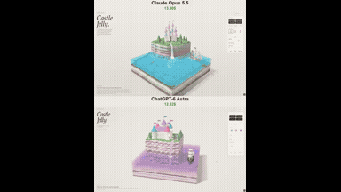</a> 
<strong>Castle Jelly WebGPU Diorama</strong> 
Use: Interactive Jelly Diorama Inputs: User inputs not specified by the author Tools: Claude Artifacts / WebGPU 
<a href="https://x.com/vib3coded/status/2108649845405929924">Original post ↗</a> · <a href="../../prompts/2108649845405929924.md">Prompt ↗</a>
</td>
<td width="33%" valign="top">
<a href="../../prompts/2108626076159357393.md">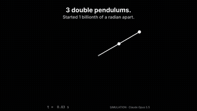</a> 
<strong>Double Pendulum Chaos Simulation with 1e-9 Radian Separation</strong> 
Use: Double Pendulum Chaos Simulation Inputs: User inputs not specified by the author Tools: Python 
<a href="https://x.com/marsautomates/status/2108626076159357393">Original post ↗</a> · <a href="../../prompts/2108626076159357393.md">Prompt ↗</a>
</td>
<td width="33%" valign="top">
<a href="../../prompts/2108625335122026542.md">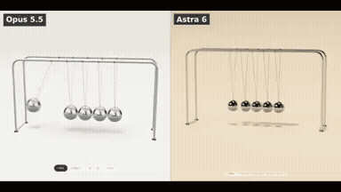</a> 
<strong>Interactive Three.js Newton's Cradle</strong> 
Use: Newton's Cradle Three.js Simulation Inputs: Attached reference image showing cradle construction. Tools: JavaScript / Three.js 
<a href="https://x.com/ivanainai/status/2108625335122026542">Original post ↗</a> · <a href="../../prompts/2108625335122026542.md">Prompt ↗</a>
</td>
</tr>
<tr>
<td width="33%" valign="top">
<a href="../../prompts/2108577475752054868.md">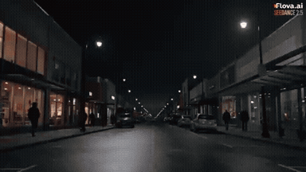</a> 
<strong>Meteor Time-Freeze Cinematic Sequence Prompt Orchestrated by Opu…</strong> 
Use: Cinematic sci-fi scene generation via prompt orchestration Inputs: User inputs not specified by the author Tools: Flova.ai / Seedance 2.5 
<a href="https://x.com/MadMax_Series/status/2108577475752054868">Original post ↗</a> · <a href="../../prompts/2108577475752054868.md">Prompt ↗</a>
</td>
<td width="33%" valign="top">
<a href="../../prompts/2108572856044986846.md">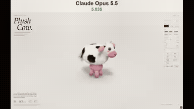</a> 
<strong>Interactive WebGPU Plush Cow Material Study</strong> 
Use: Interactive 3D Soft-Body WebGPU Simulation Inputs: User inputs not specified by the author Tools: WebAudio / WebGPU 
<a href="https://x.com/vib3coded/status/2108572856044986846">Original post ↗</a> · <a href="../../prompts/2108572856044986846.md">Prompt ↗</a>
</td>
<td width="33%" valign="top">
<a href="../../prompts/2108512810774802657.md">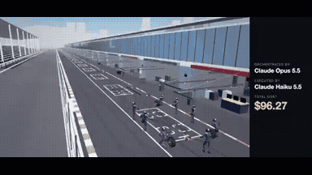</a> 
<strong>Cinematic F1 Pit Stop in Three.js</strong> 
Use: Cinematic 3D F1 Pit Stop Inputs: User inputs not specified by the author Tools: Claude Haiku 5.5 / Three.js 
<a href="https://x.com/rubenssoto_ai/status/2108512810774802657">Original post ↗</a> · <a href="../../prompts/2108512810774802657.md">Prompt ↗</a>
</td>
</tr>
<tr>
<td width="33%" valign="top">
<a href="../../prompts/2108490153467478249.md">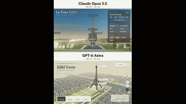</a> 
<strong>Interactive 3D Eiffel Tower Scene in Browser</strong> 
Use: Interactive 3D Eiffel Tower Scene Inputs: User inputs not specified by the author Tools: Tool setup not specified by the source 
<a href="https://x.com/maker_evan/status/2108490153467478249">Original post ↗</a> · <a href="../../prompts/2108490153467478249.md">Prompt ↗</a>
</td>
<td width="33%" valign="top">
 
<strong>Interactive WebGPU Plush Hammerhead Shark</strong> 
Use: Interactive WebGPU Plush Toy Simulation Inputs: User inputs not specified by the author Tools: WebGPU 
<a href="https://x.com/vib3coded/status/2108486895344767283">Original post ↗</a> · <a href="../../prompts/2108486895344767283.md">Prompt ↗</a>
</td>
<td width="33%" valign="top">
<a href="../../prompts/2108475056082850278.md">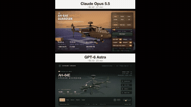</a> 
<strong>AH-64E Apache Guardian Interactive 3D Presentation</strong> 
Use: AH-64E Apache Guardian 3D Presentation Inputs: User inputs not specified by the author Tools: Tool setup not specified by the source 
<a href="https://x.com/maker_evan/status/2108475056082850278">Original post ↗</a> · <a href="../../prompts/2108475056082850278.md">Prompt ↗</a>
</td>
</tr>
<tr>
<td width="33%" valign="top">
<a href="../../prompts/2108459952683811167.md">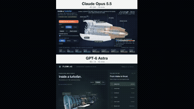</a> 
<strong>Interactive Educational 3D Jet Engine in the Browser</strong> 
Use: Interactive Educational 3D Jet Engine Inputs: User inputs not specified by the author Tools: Tool setup not specified by the source 
<a href="https://x.com/maker_evan/status/2108459952683811167">Original post ↗</a> · <a href="../../prompts/2108459952683811167.md">Prompt ↗</a>
</td>
<td width="33%" valign="top">
 
<strong>Tesseract: Six Universes, One Box (HTML5 3D Shader Demo)</strong> 
Use: Tesseract 3D Shader Illusion Inputs: User inputs not specified by the author Tools: HTML5 / WebGL 
<a href="https://x.com/TragoBuilds/status/2108384651362394407">Original post ↗</a> · <a href="../../prompts/2108384651362394407.md">Prompt ↗</a>
</td>
<td width="33%" valign="top">
<a href="../../prompts/2108347412636938609.md">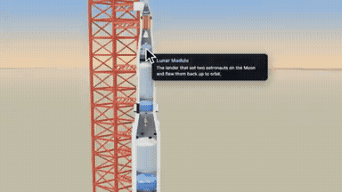</a> 
<strong>Interactive 3D Saturn V Rocket Cutaway in Three.js</strong> 
Use: Interactive 3D Saturn V rocket exploded view Inputs: User inputs not specified by the author Tools: Claude Code / Three.js 
<a href="https://x.com/aichrislee/status/2108347412636938609">Original post ↗</a> · <a href="../../prompts/2108347412636938609.md">Prompt ↗</a>
</td>
</tr>
<tr>
<td width="33%" valign="top">
<a href="../../prompts/2108256366879981677.md">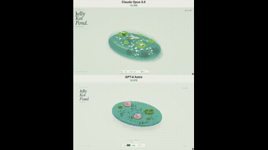</a> 
<strong>Interactive 3D Jelly Koi Pond Simulation</strong> 
Use: Interactive Jelly Koi Pond Inputs: User inputs not specified by the author Tools: HTML5 / WebGL 
<a href="https://x.com/vib3coded/status/2108256366879981677">Original post ↗</a> · <a href="../../prompts/2108256366879981677.md">Prompt ↗</a>
</td>
<td width="33%" valign="top">
<a href="../../prompts/2108249888571916688.md">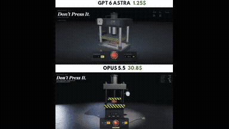</a> 
<strong>Propane Tank Crush and Explosion WebGPU Simulation</strong> 
Use: WebGPU Propane Tank Crushing and Explosion Simulation Inputs: User inputs not specified by the author Tools: Web Audio API / WebGPU / WGSL 
<a href="https://x.com/theparuchh/status/2108249888571916688">Original post ↗</a> · <a href="../../prompts/2108249888571916688.md">Prompt ↗</a>
</td>
<td width="33%" valign="top">
<a href="../../prompts/2108230699224596746.md">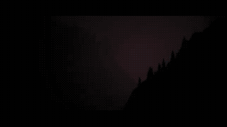</a> 
<strong>Mountainside Car Chase Previs</strong> 
Use: Car Chase Previs Inputs: User inputs not specified by the author Tools: Blender / Blender MCP 
<a href="https://x.com/tonysurix/status/2108230699224596746">Original post ↗</a> · <a href="../../prompts/2108230699224596746.md">Prompt ↗</a>
</td>
</tr>
<tr>
<td width="33%" valign="top">
<a href="../../prompts/2108218949808656725.md">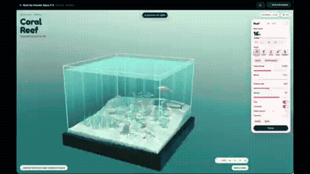</a> 
<strong>Interactive 3D Coral Reef Diorama Simulation</strong> 
Use: Interactive 3D Coral Reef Diorama Inputs: No external assets required by the prompt Tools: three.js / Three.js / WebAudio API 
<a href="https://x.com/0xRhinoX/status/2108218949808656725">Original post ↗</a> · <a href="../../prompts/2108218949808656725.md">Prompt ↗</a>
</td>
<td width="33%" valign="top">
 
<strong>Squid Jelly: Interactive 3D WebGPU Gummy Squid Simulation</strong> 
Use: Interactive 3D WebGPU Gummy Squid Simulation Inputs: User inputs not specified by the author Tools: WebGPU / WGSL 
<a href="https://x.com/vib3coded/status/2105190658701201725">Original post ↗</a> · <a href="../../prompts/2105190658701201725.md">Prompt ↗</a>
</td>
<td width="33%" valign="top">
 
<strong>Procedural Rube Goldberg Machine via Blender MCP</strong> 
Use: Procedural Rube Goldberg Machine in Blender Inputs: User inputs not specified by the author Tools: Blender / Blender MCP / Cursor 
<a href="https://x.com/Kwazikot/status/2104953406708175097">Original post ↗</a> · <a href="../../prompts/2104953406708175097.md">Prompt ↗</a>
</td>
</tr>
<tr>
<td width="33%" valign="top">
 
<strong>Continuous Zoom from Pencil Tip to Carbon Atom in Three.js</strong> 
Use: Continuous Macro Zoom Explainer Inputs: User inputs not specified by the author Tools: Three.js 
<a href="https://x.com/Dino_Spike_web3/status/2104909723443302770">Original post ↗</a> · <a href="../../prompts/2104909723443302770.md">Prompt ↗</a>
</td>
<td width="33%" valign="top">
 
<strong>Three.js 3D Particle Morphing Animation</strong> 
Use: Interactive 3D Particle Morphing System Inputs: User inputs not specified by the author Tools: HTML5 Canvas API / Three.js 
<a href="https://x.com/DaisyDiao2/status/2104827632538022154">Original post ↗</a> · <a href="../../prompts/2104827632538022154.md">Prompt ↗</a>
</td>
<td width="33%" valign="top">
 
<strong>The Beauty of Three.js Showcase Video</strong> 
Use: Three.js Cinematic Feature Reel Inputs: User inputs not specified by the author Tools: Three.js 
<a href="https://x.com/yupengfei990919/status/2104788406656184436">Original post ↗</a> · <a href="../../prompts/2104788406656184436.md">Prompt ↗</a>
</td>
</tr>
<tr>
<td width="33%" valign="top">
 
<strong>Interactive WebGPU Strawberry Cake Soft-Body Physics</strong> 
Use: Interactive soft-body physics demo Inputs: No external assets required by the prompt Tools: WebGPU / WGSL 
<a href="https://x.com/ImaStudio_ai/status/2104514806443303238">Original post ↗</a> · <a href="../../prompts/2104514806443303238.md">Prompt ↗</a>
</td>
<td width="33%" valign="top">
 
<strong>Interactive WebGPU Melon Jelly Simulation</strong> 
Use: Claude Opus 5.5 generated a self-contained WebGPU/XPBD soft-body 3D watermelon jelly simulation shown in a side-by-side screen recording. Inputs: User inputs not specified by the author Tools: JavaScript / WebGPU / WGSL 
<a href="https://x.com/esrhengwu/status/2104504957173153951">Original post ↗</a> · <a href="../../prompts/2104504957173153951.md">Prompt ↗</a>
</td>
<td width="33%" valign="top">
 
<strong>Beauty of Physics One-Shot Animation via Claude Code and Opus 5.5</strong> 
Use: Author prompts Claude Code using Opus 5.5 to independently generate and render an end-to-end scientific animation video titled 'The Beauty of Physics', spanning from quantum scales to black holes with a continuous timeline and cinematic layout. Inputs: User inputs not specified by the author Tools: Tool setup not specified by the source 
<a href="https://x.com/akokoi1/status/2104200939095904322">Original post ↗</a> · <a href="../../prompts/2104200939095904322.md">Prompt ↗</a>
</td>
</tr>
<tr>
<td width="33%" valign="top">
 
<strong>Three.js 3D Logo Intro Studio Generator</strong> 
Use: 3D Logo Motion Intro Inputs: User SVG logo code to be converted into 3D geometry Tools: Google Chrome / three.js 
<a href="https://x.com/juancarlos17626/status/2108663864581558301">Original post ↗</a> · <a href="../../prompts/2108663864581558301.md">Prompt ↗</a>
</td>
<td width="33%" valign="top">
 
<strong>Interactive Jelly Koi Pond Simulation</strong> 
Use: Interactive Jelly Koi Pond Inputs: User inputs not specified by the author Tools: Tool setup not specified by the source 
<a href="https://x.com/promptlogic_lab/status/2108564740519674082">Original post ↗</a> · <a href="../../prompts/2108564740519674082.md">Prompt ↗</a>
</td>
<td width="33%" valign="top">
 
<strong>Airplane Landing Animation Comparison</strong> 
Use: Airplane Landing 3D Animation Inputs: User inputs not specified by the author Tools: Tool setup not specified by the source 
<a href="https://x.com/sebmoska/status/2108552389871444113">Original post ↗</a> · <a href="../../prompts/2108552389871444113.md">Prompt ↗</a>
</td>
</tr>
<tr>
<td width="33%" valign="top">
 
<strong>Three.js Morphing Cube and Galaxy Animation</strong> 
Use: Procedural 3D Visualizer Inputs: User inputs not specified by the author Tools: Three.js 
<a href="https://x.com/narukijima/status/2108547315971793119">Original post ↗</a> · <a href="../../prompts/2108547315971793119.md">Prompt ↗</a>
</td>
<td width="33%" valign="top">
<a href="../../prompts/2108537908583919966.md">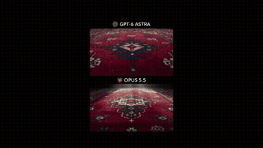</a> 
<strong>GPT-6 Astra vs Claude Opus 5.5 Video Lighting Comparison</strong> 
Use: Cinematic Scene Lighting and Video Generation Comparison Inputs: User inputs not specified by the author Tools: Tool setup not specified by the source 
<a href="https://x.com/kinderlayer/status/2108537908583919966">Original post ↗</a> · <a href="../../prompts/2108537908583919966.md">Prompt ↗</a>
</td>
<td width="33%" valign="top">
<a href="../../prompts/2108531279473910161.md">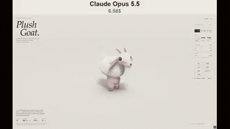</a> 
<strong>Interactive 3D Plush Goat Artifact</strong> 
Use: Interactive 3D Plush Toy Simulation Inputs: User inputs not specified by the author Tools: Claude Artifacts 
<a href="https://x.com/N1njaCodex/status/2108531279473910161">Original post ↗</a> · <a href="../../prompts/2108531279473910161.md">Prompt ↗</a>
</td>
</tr>
<tr>
<td width="33%" valign="top">
 
<strong>Interactive Jelly Koi Pond Simulation with Physics</strong> 
Use: Interactive Jelly Koi Pond Simulation Inputs: User inputs not specified by the author Tools: Tool setup not specified by the source 
<a href="https://x.com/zyroxxx111/status/2108514670411907296">Original post ↗</a> · <a href="../../prompts/2108514670411907296.md">Prompt ↗</a>
</td>
<td width="33%" valign="top">
 
<strong>Procedural 3D Elephant in Three.js</strong> 
Use: Procedural 3D Scene Generation Inputs: User inputs not specified by the author Tools: HTML / Browser WebGL / Three.js 
<a href="https://x.com/Thusatharan/status/2108511286795640926">Original post ↗</a> · <a href="../../prompts/2108511286795640926.md">Prompt ↗</a>
</td>
<td width="33%" valign="top">
<a href="../../prompts/2108311732376453546.md">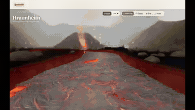</a> 
<strong>Hraunheim: Interactive 3D Lava River and Volcano in Three.js</strong> 
Use: Interactive 3D Lava River and Gnome Habitat in Three.js Inputs: User inputs not specified by the author Tools: Three.js 
<a href="https://x.com/ottollm/status/2108311732376453546">Original post ↗</a> · <a href="../../prompts/2108311732376453546.md">Prompt ↗</a>
</td>
</tr>
<tr>
<td width="33%" valign="top">
<a href="../../prompts/2108301527483838465.md">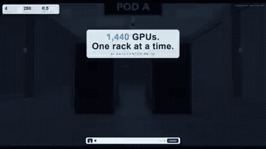</a> 
<strong>Interactive 3D Liquid-Cooled AI Hall Concept in Three.js</strong> 
Use: Data Center Infrastructure 3D Walkthrough Inputs: User inputs not specified by the author Tools: Three.js 
<a href="https://x.com/Solvaix/status/2108301527483838465">Original post ↗</a> · <a href="../../prompts/2108301527483838465.md">Prompt ↗</a>
</td>
<td width="33%" valign="top">
 
<strong>Interactive WebGL Lava Lamp in Single HTML File</strong> 
Use: Interactive WebGL Lava Lamp Simulation Inputs: User inputs not specified by the author Tools: Google Chrome / WebGL 
<a href="https://x.com/juancarlos17626/status/2108301452384870600">Original post ↗</a> · <a href="../../prompts/2108301452384870600.md">Prompt ↗</a>
</td>
<td width="33%" valign="top">
<a href="../../prompts/2108289170871582851.md">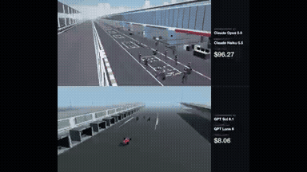</a> 
<strong>F1 Pit Stop Procedural Three.js Animation Orchestration</strong> 
Use: Procedural 3D F1 Pit Stop Animation Inputs: User inputs not specified by the author Tools: Claude Haiku 5.5 / Three.js 
<a href="https://x.com/rubenssoto_ai/status/2108289170871582851">Original post ↗</a> · <a href="../../prompts/2108289170871582851.md">Prompt ↗</a>
</td>
</tr>
<tr>
<td width="33%" valign="top">
 
<strong>Night Monster</strong> 
Use: Cinematic horror creature reveal scene Inputs: User inputs not specified by the author Tools: Claude Opus 5.5 / Higgsfield / Seedance 2.5 
<a href="https://x.com/MadMax_Series/status/2108218235468325374">Original post ↗</a> · <a href="../../prompts/2108218235468325374.md">Prompt ↗</a>
</td>
<td width="33%" valign="top">
 
<strong>Stained-Glass Maple Leaf 3D Animation Comparison: GPT 6.1 SOL vs…</strong> 
Use: The author compares 3D generation capabilities between GPT 6.1 SOL and Claude Opus 5.5, requesting thin borders, translucent tones, detailed veins, and beveled edges on a rotating stained-glass leaf. Inputs: User inputs not specified by the author Tools: Tool setup not specified by the source 
<a href="https://x.com/abhinavflac/status/2105100907952353560">Original post ↗</a> · <a href="../../prompts/2105100907952353560.md">Prompt ↗</a>
</td>
<td width="33%" valign="top">
 
<strong>Interactive 20,000 Water Particle Fluid Simulation Comparison</strong> 
Use: Interactive 2D particle fluid dynamics simulation Inputs: User inputs not specified by the author Tools: Tool setup not specified by the source 
<a href="https://x.com/viewsfrom02108/status/2105086568155304269">Original post ↗</a> · <a href="../../prompts/2105086568155304269.md">Prompt ↗</a>
</td>
</tr>
<tr>
<td width="33%" valign="top">
<a href="../../prompts/2105049523139850561.md">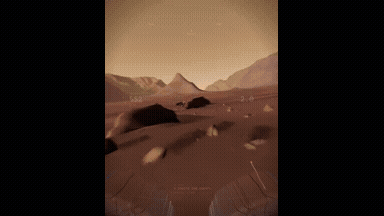</a> 
<strong>NASA Mars Canyon Flight Simulation</strong> 
Use: Mars Canyon Procedural Flight Inputs: User inputs not specified by the author Tools: Claude Code / ffmpeg / Gemini 3.8 Flash TTS / Playwright / Three.js / whisper 
<a href="https://x.com/Mochi_AGI/status/2105049523139850561">Original post ↗</a> · <a href="../../prompts/2105049523139850561.md">Prompt ↗</a>
</td>
<td width="33%" valign="top">
 
<strong>Interactive Water Balloon Ballistics Simulation with Ray Traced…</strong> 
Use: Interactive 3D ballistics and fluid ray tracing simulation Inputs: User inputs not specified by the author Tools: Tool setup not specified by the source 
<a href="https://x.com/decodedbysania/status/2104859976112206265">Original post ↗</a> · <a href="../../prompts/2104859976112206265.md">Prompt ↗</a>
</td>
<td width="33%" valign="top">
 
<strong>Tokyo Station 3D Architectural Breakdown</strong> 
Use: 3D visualization dissecting Tokyo Station's multi-layered layout generated via Claude Code / Opus 5.5 scripting Blender. Inputs: User inputs not specified by the author Tools: Blender 
<a href="https://x.com/yktgch/status/2104525642121519401">Original post ↗</a> · <a href="../../prompts/2104525642121519401.md">Prompt ↗</a>
</td>
</tr>
<tr>
<td width="33%" valign="top">
 
<strong>Interactive F135 Jet Engine Simulation</strong> 
Use: Author used Claude Opus 5.5 to create an interactive 3D WebGL F135 fighter jet engine model demonstrating internal airflow, combustion, and afterburner plume. Inputs: User inputs not specified by the author Tools: Tool setup not specified by the source 
<a href="https://x.com/konstantinsaifo/status/2104516868182598079">Original post ↗</a> · <a href="../../prompts/2104516868182598079.md">Prompt ↗</a>
</td>
<td width="33%" valign="top">
 
<strong>Microring Resonator Thermal Drift and Controller Simulation</strong> 
Use: Saul Flores Jr. demonstrates an interactive 3D simulation of sunlight heating a microring resonator and controller compensation, created by prompting Claude Opus 5.5. Inputs: User inputs not specified by the author Tools: Tool setup not specified by the source 
<a href="https://x.com/SaulFloresJr/status/2104498456626651380">Original post ↗</a> · <a href="../../prompts/2104498456626651380.md">Prompt ↗</a>
</td>
<td width="33%" valign="top">
 
<strong>Claude Opus 5.5 Unity Rain and Lightning Effect Experiment</strong> 
Use: Unity weather-effects experiment Inputs: Base Unity scene with simple 3D primitives and terrain before weather effects were added. Tools: Tool setup not specified by the source 
<a href="https://x.com/threediveai/status/2104458970865996117">Original post ↗</a> · <a href="../../prompts/2104458970865996117.md">Prompt ↗</a>
</td>
</tr>
<tr>
<td width="33%" valign="top">
 
<strong>Toyota Prius 2027 3D Disassembly and Animation in Blender</strong> 
Use: 3D modeling and exploded-view animation of a Toyota Prius 2027 in Blender, showing disassembly into 261 pieces, reassembly, and rainbow to mustard color shifting, led by Claude Opus 5.5 with assistance from GPT-Astra and Gemini. Inputs: User inputs not specified by the author Tools: Tool setup not specified by the source 
<a href="https://x.com/abxda/status/2104410894167916709">Original post ↗</a> · <a href="../../prompts/2104410894167916709.md">Prompt ↗</a>
</td>
<td width="33%" valign="top">
 
<strong>Porco Rosso Sunset Dogfight Web3D</strong> 
Use: A Web3D prompt used with Opus 5.5 and Three.js to recreate the classic dogfight scene from Hayao Miyazaki's 'Porco Rosso' over a sunset sea. Inputs: User inputs not specified by the author Tools: Tool setup not specified by the source 
<a href="https://x.com/NFT_Chen/status/2103882415299350878">Original post ↗</a> · <a href="../../prompts/2103882415299350878.md">Prompt ↗</a>
</td>
<td width="33%" valign="top">
 
<strong>3D Forest Conservation Website</strong> 
Use: A 3D website for a forest conservation agency generated in a single HTML file using Opus 5.5 based on a Pinterest reference. Inputs: User inputs not specified by the author Tools: Tool setup not specified by the source 
<a href="https://x.com/Souradip3000/status/2103876499262800291">Original post ↗</a> · <a href="../../prompts/2103876499262800291.md">Prompt ↗</a>
</td>
</tr>
<tr>
<td width="33%" valign="top">
 
<strong>AI Data Centre 3D Motion Graphic</strong> 
Use: A prompt given to Claude Opus 5.5 to generate a 3D browser animation inside a single HTML file showing what happens inside an AI data center down to the Blackwell silicon. Inputs: User inputs not specified by the author Tools: Tool setup not specified by the source 
<a href="https://x.com/mdaman010/status/2103845689713111079">Original post ↗</a> · <a href="../../prompts/2103845689713111079.md">Prompt ↗</a>
</td>
<td width="33%" valign="top">
 
<strong>AI Data Centre 3D Film</strong> 
Use: A simple prompt given to Claude Opus to generate an animated 3D walkthrough showing what happens inside an AI data center from the grid down to silicon. Inputs: User inputs not specified by the author Tools: Tool setup not specified by the source 
<a href="https://x.com/Sayan_shanky/status/2103736579449868515">Original post ↗</a> · <a href="../../prompts/2103736579449868515.md">Prompt ↗</a>
</td>
<td width="33%" valign="top">
 
<strong>Bedroom Layout Generator</strong> 
Use: Claude Opus 5.5 generated a 2D/3D bedroom planning app to test thousands of positions for fitting a double bed, based on specified room and furniture dimensions. Inputs: User inputs not specified by the author Tools: Tool setup not specified by the source 
<a href="https://x.com/goofyninjaaa/status/2103540288136315331">Original post ↗</a> · <a href="../../prompts/2103540288136315331.md">Prompt ↗</a>
</td>
</tr>
<tr>
<td width="33%" valign="top">
 
<strong>Creative Front-End and Video Generation</strong> 
Use: A creative prompt asking the AI model to freely select a theme tailored to the user's interests, generating both a 30-second video and an interactive HTML page to showcase its front-end capabilities. Inputs: User inputs not specified by the author Tools: Tool setup not specified by the source 
<a href="https://x.com/DemitiyaGeekzen/status/2103517910274818523">Original post ↗</a> · <a href="../../prompts/2103517910274818523.md">Prompt ↗</a>
</td>
<td width="33%" valign="top">
 
<strong>GLSL Fishbowl in Three.js</strong> 
Use: A prompt used to evaluate Claude Opus 5.5 on generating GLSL shaders in Three.js, focusing on refraction, reflection, and water caustics. Inputs: User inputs not specified by the author Tools: Tool setup not specified by the source 
<a href="https://x.com/NicolaManzini/status/2103499771206156628">Original post ↗</a> · <a href="../../prompts/2103499771206156628.md">Prompt ↗</a>
</td>
<td width="33%" valign="top">
 
<strong>3D Pagoda Navigation</strong> 
Use: A creative coding prompt used with Claude Opus 5.5 to generate an interactive 3D pagoda navigation world in a single shot. Inputs: User inputs not specified by the author Tools: Tool setup not specified by the source 
<a href="https://x.com/BuildFastWithAI/status/2103483174957597035">Original post ↗</a> · <a href="../../prompts/2103483174957597035.md">Prompt ↗</a>
</td>
</tr>
<tr>
<td width="33%" valign="top">
 
<strong>3D Animation of Gradient Descent</strong> 
Use: A prompt requesting Claude Opus to generate a 3D animation illustrating gradient descent with a ball moving from crest to trough, along with explanations and a specific color scheme. Inputs: User inputs not specified by the author Tools: Tool setup not specified by the source 
<a href="https://x.com/anirockshady/status/2103195903012032809">Original post ↗</a> · <a href="../../prompts/2103195903012032809.md">Prompt ↗</a>
</td>
<td width="33%" valign="top">
 
<strong>Cinematic Browser-Based 3D World</strong> 
Use: Explorable cinematic 3D world Inputs: User inputs not specified by the author Tools: Tool setup not specified by the source 
<a href="https://x.com/LexnLin/status/2103194052850241739">Original post ↗</a> · <a href="../../prompts/2103194052850241739.md">Prompt ↗</a>
</td>
<td width="33%" valign="top">
 
<strong>Viral Video Physics Simulation</strong> 
Use: A prompt given to Claude Opus asking it to create a video designed to go viral, leading to a coded physics simulation and synthesizer synchronized with Für Elise. Inputs: User inputs not specified by the author Tools: Tool setup not specified by the source 
<a href="https://x.com/kantamk/status/2103148907228176511">Original post ↗</a> · <a href="../../prompts/2103148907228176511.md">Prompt ↗</a>
</td>
</tr>
<tr>
<td width="33%" valign="top">
 
<strong>Pelican Riding a Bicycle Animation</strong> 
Use: Detailed character animation Inputs: User inputs not specified by the author Tools: Tool setup not specified by the source 
<a href="https://x.com/AxtonLiu/status/2103119648271290566">Original post ↗</a> · <a href="../../prompts/2103119648271290566.md">Prompt ↗</a>
</td>
<td width="33%" valign="top">
 
<strong>Interactive 3D Taj Mahal in Three.js</strong> 
Use: Prompt used with Opus 5.5 to generate an interactive, detailed 3D model of the Taj Mahal with an exploded architectural view in a single HTML file using Three.js. Inputs: User inputs not specified by the author Tools: Three.js 
<a href="https://x.com/CurieuxExplorer/status/2103038625483272483">Original post ↗</a> · <a href="../../prompts/2103038625483272483.md">Prompt ↗</a>
</td>
<td width="33%" valign="top">
 
<strong>3D Water Simulation Benchmark</strong> 
Use: Claude Opus 5.5 runs a benchmark task to generate a 3D procedural water simulation with terrain, rain, streams, and lakes using TypeScript and Three.js. Inputs: User inputs not specified by the author Tools: Three.js 
<a href="https://x.com/StephanFerraro/status/2103020274107224281">Original post ↗</a> · <a href="../../prompts/2103020274107224281.md">Prompt ↗</a>
</td>
</tr>
<tr>
<td width="33%" valign="top">
 
<strong>Interactive Explosion Simulation</strong> 
Use: A creative coding prompt instructing the AI to generate an advanced interactive explosion effect and unique environment with dynamic force propagation and visual aftermath. Inputs: User inputs not specified by the author Tools: Tool setup not specified by the source 
<a href="https://x.com/FornYapayZeka/status/2102971287224135914">Original post ↗</a> · <a href="../../prompts/2102971287224135914.md">Prompt ↗</a>
</td>
<td width="33%" valign="top">
 
<strong>Stylistic 3D Particle Santa Monica Beach</strong> 
Use: A prompt used with Claude Opus 5.5 to generate an interactive 3D WebGL particle illustration of Santa Monica beach that adapts to the time of day. Inputs: User inputs not specified by the author Tools: Tool setup not specified by the source 
<a href="https://x.com/ishuagra02/status/2102920408743678129">Original post ↗</a> · <a href="../../prompts/2102920408743678129.md">Prompt ↗</a>
</td>
<td width="33%" valign="top">
 
<strong>Interactive Fireworks and Particle Simulation</strong> 
Use: A creative coding prompt instructing the AI to design and build an impressive, cinematic fireworks or light particle show with depth, dynamic lighting, and interactive replay capabilities. Inputs: User inputs not specified by the author Tools: Tool setup not specified by the source 
<a href="https://x.com/FornYapayZeka/status/2102888241443795431">Original post ↗</a> · <a href="../../prompts/2102888241443795431.md">Prompt ↗</a>
</td>
</tr>
<tr>
<td width="33%" valign="top">
 
<strong>Browser Minecraft Recreation</strong> 
Use: A detailed prompt for Claude Opus 5.5 and PINOC MCP to generate a playable, browser-based Minecraft recreation with Three.js shaders and animated voxel NPCs. Inputs: User inputs not specified by the author Tools: Three.js 
<a href="https://x.com/Viggle_PINOC/status/2102861939072434495">Original post ↗</a> · <a href="../../prompts/2102861939072434495.md">Prompt ↗</a>
</td>
<td width="33%" valign="top">
 
<strong>250 Years of U.S. History Sand Animation</strong> 
Use: A prompt to generate a 2-minute sand animation illustrating 250 years of U.S. history with accompanying background music and sound design. Inputs: User inputs not specified by the author Tools: Tool setup not specified by the source 
<a href="https://x.com/Michaelzsguo/status/2102592355165782312">Original post ↗</a> · <a href="../../prompts/2102592355165782312.md">Prompt ↗</a>
</td>
<td width="33%" valign="top">
 
<strong>1906 San Francisco Market Street Blender Reconstruction</strong> 
Use: Historical 3D reconstruction Inputs: User inputs not specified by the author Tools: Blender 
<a href="https://x.com/alexalbert__/status/2102466523164274839">Original post ↗</a> · <a href="../../prompts/2102466523164274839.md">Prompt ↗</a>
</td>
</tr>
</table>

[Back to gallery](../../README.md)
