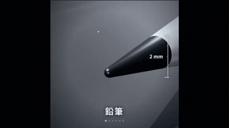
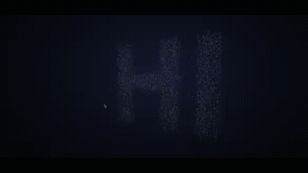
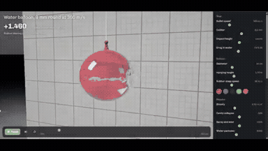

# 3D scenes

<table>
<tr>
<td width="33%" valign="top">
 
<strong>Continuous Zoom from Pencil Tip to Carbon Atom in Three.js</strong> 
Use: Continuous Macro Zoom Explainer Inputs: User inputs not specified by the author Tools: Three.js 
<a href="https://x.com/Dino_Spike_web3/status/2104909723443302770">Original post ↗</a> · <a href="../../prompts/2104909723443302770.md">Prompt ↗</a>
</td>
<td width="33%" valign="top">
 
<strong>Three.js 3D Particle Morphing Animation</strong> 
Use: Interactive 3D Particle Morphing System Inputs: User inputs not specified by the author Tools: HTML5 Canvas API / Three.js 
<a href="https://x.com/DaisyDiao2/status/2104827632538022154">Original post ↗</a> · <a href="../../prompts/2104827632538022154.md">Prompt ↗</a>
</td>
<td width="33%" valign="top">
 
<strong>The Beauty of Three.js Showcase Video</strong> 
Use: Three.js Cinematic Feature Reel Inputs: User inputs not specified by the author Tools: Three.js 
<a href="https://x.com/yupengfei990919/status/2104788406656184436">Original post ↗</a> · <a href="../../prompts/2104788406656184436.md">Prompt ↗</a>
</td>
</tr>
<tr>
<td width="33%" valign="top">
 
<strong>Three.js 15s 3D Motion Graphics</strong> 
Use: 3D motion graphics / website hero Inputs: User inputs not specified by the author Tools: Three.js 
<a href="https://x.com/hiro19_k/status/2104471436039803295">Original post ↗</a> · <a href="../../prompts/2104471436039803295.md">Prompt ↗</a>
</td>
<td width="33%" valign="top">
 
<strong>Stained-Glass Maple Leaf 3D Animation Comparison: GPT 6.1 SOL vs…</strong> 
Use: The author compares 3D generation capabilities between GPT 6.1 SOL and Claude Opus 5.5, requesting thin borders, translucent tones, detailed veins, and beveled edges on a rotating stained-glass leaf. Inputs: User inputs not specified by the author Tools: Tool setup not specified by the source 
<a href="https://x.com/abhinavflac/status/2105100907952353560">Original post ↗</a> · <a href="../../prompts/2105100907952353560.md">Prompt ↗</a>
</td>
<td width="33%" valign="top">
 
<strong>3D Animated Music Video Produced and Blender</strong> 
Use: 3D Animation / Music Video Inputs: Original musical composition created by the author; Storyboards and directorial instructions created by the author Tools: Blender / three.js 
<a href="https://x.com/LugiAXETomXV/status/2105091868149354753">Original post ↗</a> · <a href="../../prompts/2105091868149354753.md">Prompt ↗</a>
</td>
</tr>
<tr>
<td width="33%" valign="top">
 
<strong>Interactive Water Balloon Ballistics Simulation with Ray Traced…</strong> 
Use: Interactive 3D ballistics and fluid ray tracing simulation Inputs: User inputs not specified by the author Tools: Tool setup not specified by the source 
<a href="https://x.com/decodedbysania/status/2104859976112206265">Original post ↗</a> · <a href="../../prompts/2104859976112206265.md">Prompt ↗</a>
</td>
<td width="33%" valign="top">
 
<strong>Tokyo Station 3D Architectural Breakdown</strong> 
Use: 3D visualization dissecting Tokyo Station's multi-layered layout generated via Claude Code / Opus 5.5 scripting Blender. Inputs: User inputs not specified by the author Tools: Blender 
<a href="https://x.com/yktgch/status/2104525642121519401">Original post ↗</a> · <a href="../../prompts/2104525642121519401.md">Prompt ↗</a>
</td>
<td width="33%" valign="top">
 
<strong>Opus 5.5 Three.js Phone Commercial Production</strong> 
Use: Opus 5.5 orchestrating 6 subagents in Claude Code to direct, model, and animate a 45s phone ad rendered frame-by-frame via Three.js with Python-synthesized audio. Inputs: User inputs not specified by the author Tools: Tool setup not specified by the source 
<a href="https://x.com/thinkszyg/status/2104525558050886066">Original post ↗</a> · <a href="../../prompts/2104525558050886066.md">Prompt ↗</a>
</td>
</tr>
<tr>
<td width="33%" valign="top">
 
<strong>Claude Opus 5.5 Unity Rain and Lightning Effect Experiment</strong> 
Use: Unity weather-effects experiment Inputs: Base Unity scene with simple 3D primitives and terrain before weather effects were added. Tools: Tool setup not specified by the source 
<a href="https://x.com/threediveai/status/2104458970865996117">Original post ↗</a> · <a href="../../prompts/2104458970865996117.md">Prompt ↗</a>
</td>
<td width="33%" valign="top">
 
<strong>Toyota Prius 2027 3D Disassembly and Animation in Blender</strong> 
Use: 3D modeling and exploded-view animation of a Toyota Prius 2027 in Blender, showing disassembly into 261 pieces, reassembly, and rainbow to mustard color shifting, led by Claude Opus 5.5 with assistance from GPT-Astra and Gemini. Inputs: User inputs not specified by the author Tools: Tool setup not specified by the source 
<a href="https://x.com/abxda/status/2104410894167916709">Original post ↗</a> · <a href="../../prompts/2104410894167916709.md">Prompt ↗</a>
</td>
<td width="33%" valign="top">
 
<strong>Porco Rosso Sunset Dogfight Web3D</strong> 
Use: A Web3D prompt used with Opus 5.5 and Three.js to recreate the classic dogfight scene from Hayao Miyazaki's 'Porco Rosso' over a sunset sea. Inputs: User inputs not specified by the author Tools: Tool setup not specified by the source 
<a href="https://x.com/NFT_Chen/status/2103882415299350878">Original post ↗</a> · <a href="../../prompts/2103882415299350878.md">Prompt ↗</a>
</td>
</tr>
<tr>
<td width="33%" valign="top">
 
<strong>3D Forest Conservation Website</strong> 
Use: A 3D website for a forest conservation agency generated in a single HTML file using Opus 5.5 based on a Pinterest reference. Inputs: User inputs not specified by the author Tools: Tool setup not specified by the source 
<a href="https://x.com/Souradip3000/status/2103876499262800291">Original post ↗</a> · <a href="../../prompts/2103876499262800291.md">Prompt ↗</a>
</td>
<td width="33%" valign="top">
 
<strong>AI Data Centre 3D Motion Graphic</strong> 
Use: A prompt given to Claude Opus 5.5 to generate a 3D browser animation inside a single HTML file showing what happens inside an AI data center down to the Blackwell silicon. Inputs: User inputs not specified by the author Tools: Tool setup not specified by the source 
<a href="https://x.com/mdaman010/status/2103845689713111079">Original post ↗</a> · <a href="../../prompts/2103845689713111079.md">Prompt ↗</a>
</td>
<td width="33%" valign="top">
 
<strong>Code-Animated Short Film: Xi the Mechanical Hermit Crab</strong> 
Use: A detailed, multi-stage director prompt instructing Claude to procedurally code, rig, score, and render a 45–50 second animated short film about a mechanical hermit crab chasing a light through deep-sea realms using Remotion, WebGL, SVG, and Python audio synthesis. Inputs: User inputs not specified by the author Tools: FFmpeg / NumPy / React / Remotion 
<a href="https://x.com/gmgmgm1545/status/2103793820815245507">Original post ↗</a> · <a href="../../prompts/2103793820815245507.md">Prompt ↗</a>
</td>
</tr>
<tr>
<td width="33%" valign="top">
 
<strong>AI Data Centre 3D Film</strong> 
Use: A simple prompt given to Claude Opus to generate an animated 3D walkthrough showing what happens inside an AI data center from the grid down to silicon. Inputs: User inputs not specified by the author Tools: Tool setup not specified by the source 
<a href="https://x.com/Sayan_shanky/status/2103736579449868515">Original post ↗</a> · <a href="../../prompts/2103736579449868515.md">Prompt ↗</a>
</td>
<td width="33%" valign="top">
 
<strong>Bedroom Layout Generator</strong> 
Use: Claude Opus 5.5 generated a 2D/3D bedroom planning app to test thousands of positions for fitting a double bed, based on specified room and furniture dimensions. Inputs: User inputs not specified by the author Tools: Tool setup not specified by the source 
<a href="https://x.com/goofyninjaaa/status/2103540288136315331">Original post ↗</a> · <a href="../../prompts/2103540288136315331.md">Prompt ↗</a>
</td>
<td width="33%" valign="top">
 
<strong>Creative Front-End and Video Generation</strong> 
Use: A creative prompt asking the AI model to freely select a theme tailored to the user's interests, generating both a 30-second video and an interactive HTML page to showcase its front-end capabilities. Inputs: User inputs not specified by the author Tools: Tool setup not specified by the source 
<a href="https://x.com/DemitiyaGeekzen/status/2103517910274818523">Original post ↗</a> · <a href="../../prompts/2103517910274818523.md">Prompt ↗</a>
</td>
</tr>
<tr>
<td width="33%" valign="top">
 
<strong>GLSL Fishbowl in Three.js</strong> 
Use: A prompt used to evaluate Claude Opus 5.5 on generating GLSL shaders in Three.js, focusing on refraction, reflection, and water caustics. Inputs: User inputs not specified by the author Tools: Tool setup not specified by the source 
<a href="https://x.com/NicolaManzini/status/2103499771206156628">Original post ↗</a> · <a href="../../prompts/2103499771206156628.md">Prompt ↗</a>
</td>
<td width="33%" valign="top">
 
<strong>3D Pagoda Navigation</strong> 
Use: A creative coding prompt used with Claude Opus 5.5 to generate an interactive 3D pagoda navigation world in a single shot. Inputs: User inputs not specified by the author Tools: Tool setup not specified by the source 
<a href="https://x.com/BuildFastWithAI/status/2103483174957597035">Original post ↗</a> · <a href="../../prompts/2103483174957597035.md">Prompt ↗</a>
</td>
<td width="33%" valign="top">
 
<strong>3D Animation of Gradient Descent</strong> 
Use: A prompt requesting Claude Opus to generate a 3D animation illustrating gradient descent with a ball moving from crest to trough, along with explanations and a specific color scheme. Inputs: User inputs not specified by the author Tools: Tool setup not specified by the source 
<a href="https://x.com/anirockshady/status/2103195903012032809">Original post ↗</a> · <a href="../../prompts/2103195903012032809.md">Prompt ↗</a>
</td>
</tr>
<tr>
<td width="33%" valign="top">
 
<strong>Cinematic Browser-Based 3D World</strong> 
Use: Explorable cinematic 3D world Inputs: User inputs not specified by the author Tools: Tool setup not specified by the source 
<a href="https://x.com/LexnLin/status/2103194052850241739">Original post ↗</a> · <a href="../../prompts/2103194052850241739.md">Prompt ↗</a>
</td>
<td width="33%" valign="top">
 
<strong>Pelican Riding a Bicycle Animation</strong> 
Use: Detailed character animation Inputs: User inputs not specified by the author Tools: Tool setup not specified by the source 
<a href="https://x.com/AxtonLiu/status/2103119648271290566">Original post ↗</a> · <a href="../../prompts/2103119648271290566.md">Prompt ↗</a>
</td>
<td width="33%" valign="top">
 
<strong>Pixar-Level Promotional Animation in Three.js</strong> 
Use: A prompt asking an AI model to conceive a promotional story for an app and generate a full Pixar-level animation using Three.js and JavaScript. Inputs: User inputs not specified by the author Tools: JavaScript 
<a href="https://x.com/Anilraok/status/2103087766662009118">Original post ↗</a> · <a href="../../prompts/2103087766662009118.md">Prompt ↗</a>
</td>
</tr>
<tr>
<td width="33%" valign="top">
 
<strong>Interactive 3D Taj Mahal in Three.js</strong> 
Use: Prompt used with Opus 5.5 to generate an interactive, detailed 3D model of the Taj Mahal with an exploded architectural view in a single HTML file using Three.js. Inputs: User inputs not specified by the author Tools: Three.js 
<a href="https://x.com/CurieuxExplorer/status/2103038625483272483">Original post ↗</a> · <a href="../../prompts/2103038625483272483.md">Prompt ↗</a>
</td>
<td width="33%" valign="top">
 
<strong>Stylistic 3D Particle Santa Monica Beach</strong> 
Use: A prompt used with Claude Opus 5.5 to generate an interactive 3D WebGL particle illustration of Santa Monica beach that adapts to the time of day. Inputs: User inputs not specified by the author Tools: Tool setup not specified by the source 
<a href="https://x.com/ishuagra02/status/2102920408743678129">Original post ↗</a> · <a href="../../prompts/2102920408743678129.md">Prompt ↗</a>
</td>
<td width="33%" valign="top">
 
<strong>Browser Minecraft Recreation</strong> 
Use: A detailed prompt for Claude Opus 5.5 and PINOC MCP to generate a playable, browser-based Minecraft recreation with Three.js shaders and animated voxel NPCs. Inputs: User inputs not specified by the author Tools: Three.js 
<a href="https://x.com/Viggle_PINOC/status/2102861939072434495">Original post ↗</a> · <a href="../../prompts/2102861939072434495.md">Prompt ↗</a>
</td>
</tr>
<tr>
<td width="33%" valign="top">
 
<strong>250 Years of U.S. History Sand Animation</strong> 
Use: A prompt to generate a 2-minute sand animation illustrating 250 years of U.S. history with accompanying background music and sound design. Inputs: User inputs not specified by the author Tools: Tool setup not specified by the source 
<a href="https://x.com/Michaelzsguo/status/2102592355165782312">Original post ↗</a> · <a href="../../prompts/2102592355165782312.md">Prompt ↗</a>
</td>
<td width="33%" valign="top">
 
<strong>1906 San Francisco Market Street Blender Reconstruction</strong> 
Use: Historical 3D reconstruction Inputs: User inputs not specified by the author Tools: Blender 
<a href="https://x.com/alexalbert__/status/2102466523164274839">Original post ↗</a> · <a href="../../prompts/2102466523164274839.md">Prompt ↗</a>
</td><td></td>
</tr>
</table>

[Back to gallery](../../README.md)
