# 3D scenes

<table>
<tr>
<td width="33%" valign="top">
 
<strong>Claude Opus 5.5 Motion Designer Showreel</strong> 
Use: 3D showcase or immersive scene Inputs: No external assets listed; check the original for prior context. Tools: Tool setup not specified by the source 
<a href="https://x.com/just_adev/status/2104541344945627171">Original post ↗</a> · <a href="../../prompts/2104541344945627171.md">Prompt ↗</a>
</td>
<td width="33%" valign="top">
 
<strong>Three.js 15s 3D Motion Graphics</strong> 
Use: 3D showcase or immersive scene Inputs: No external assets listed; check the original for prior context. Tools: Three.js 
<a href="https://x.com/hiro19_k/status/2104471436039803295">Original post ↗</a> · <a href="../../prompts/2104471436039803295.md">Prompt ↗</a>
</td>
<td width="33%" valign="top">
 
<strong>Claude Motion Designer 15-Second Showreel</strong> 
Use: 3D showcase or immersive scene Inputs: No external assets listed; check the original for prior context. Tools: Claude Code, Remotion, Three.js 
<a href="https://x.com/leonabboud/status/2103576084499358051">Original post ↗</a> · <a href="../../prompts/2103576084499358051.md">Prompt ↗</a>
</td>
</tr>
<tr>
<td width="33%" valign="top">
 
<strong>Stained-Glass Maple Leaf 3D Animation Comparison: GPT 6.1 SOL vs…</strong> 
Use: 3D showcase or immersive scene Inputs: Inputs not fully specified; check the original post. Tools: Tool setup not specified by the source 
<a href="https://x.com/abhinavflac/status/2105100907952353560">Original post ↗</a> · <a href="../../prompts/2105100907952353560.md">Prompt ↗</a>
</td>
<td width="33%" valign="top">
 
<strong>Hillnote Dynamic 15-Second Motion Graphics Promo</strong> 
Use: Product launch or brand promo Inputs: Hillnote website and branding information (not supplied) Tools: Code renderer / video compiler 
<a href="https://x.com/karthikships/status/2104557402154549263">Original post ↗</a> · <a href="../../prompts/2104557402154549263.md">Prompt ↗</a>
</td>
<td width="33%" valign="top">
 
<strong>Tokyo Station 3D Architectural Breakdown</strong> 
Use: 3D showcase or immersive scene Inputs: No external assets listed; check the original for prior context. Tools: Blender, Claude Code, ChatGPT 
<a href="https://x.com/yktgch/status/2104525642121519401">Original post ↗</a> · <a href="../../prompts/2104525642121519401.md">Prompt ↗</a>
</td>
</tr>
<tr>
<td width="33%" valign="top">
 
<strong>Opus 5.5 Three.js Phone Commercial Production</strong> 
Use: Product launch or brand promo Inputs: Official phone product images used as textures for screen and back panel. (not supplied); Copy… Tools: Claude Code, three.js, Python 
<a href="https://x.com/thinkszyg/status/2104525558050886066">Original post ↗</a> · <a href="../../prompts/2104525558050886066.md">Prompt ↗</a>
</td>
<td width="33%" valign="top">
<a href="../../prompts/2104458970865996117.md">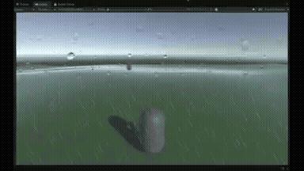</a> 
<strong>Claude Opus 5.5 Unity Rain and Lightning Effect Experiment</strong> 
Use: 3D showcase or immersive scene Inputs: Base Unity scene with simple 3D primitives and terrain before weather effects were added. (not… Tools: Unity CLI, Unity Official Skills, Unity Editor 
<a href="https://x.com/threediveai/status/2104458970865996117">Original post ↗</a> · <a href="../../prompts/2104458970865996117.md">Prompt ↗</a>
</td>
<td width="33%" valign="top">
 
<strong>Toyota Prius 2027 3D Disassembly and Animation in Blender</strong> 
Use: 3D showcase or immersive scene Inputs: 3D car model components and Blender scene setup (not supplied) Tools: Blender, Claude Opus 5.5, GPT-Astra, Gemini 
<a href="https://x.com/abxda/status/2104410894167916709">Original post ↗</a> · <a href="../../prompts/2104410894167916709.md">Prompt ↗</a>
</td>
</tr>
<tr>
<td width="33%" valign="top">
 
<strong>Claude Code 3D Enclosure Promo Video</strong> 
Use: Product launch or brand promo Inputs: Inputs not fully specified; check the original post. Tools: Tool setup not specified by the source 
<a href="https://x.com/VectorCrossProd/status/2104093497561436573">Original post ↗</a> · <a href="../../prompts/2104093497561436573.md">Prompt ↗</a>
</td>
<td width="33%" valign="top">
 
<strong>Porco Rosso Sunset Dogfight Web3D</strong> 
Use: 3D showcase or immersive scene Inputs: Inputs not fully specified; check the original post. Tools: Tool setup not specified by the source 
<a href="https://x.com/NFT_Chen/status/2103882415299350878">Original post ↗</a> · <a href="../../prompts/2103882415299350878.md">Prompt ↗</a>
</td>
<td width="33%" valign="top">
<a href="../../prompts/2103876499262800291.md">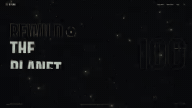</a> 
<strong>3D Forest Conservation Website</strong> 
Use: 3D showcase or immersive scene Inputs: Inputs not fully specified; check the original post. Tools: Tool setup not specified by the source 
<a href="https://x.com/Souradip3000/status/2103876499262800291">Original post ↗</a> · <a href="../../prompts/2103876499262800291.md">Prompt ↗</a>
</td>
</tr>
<tr>
<td width="33%" valign="top">
 
<strong>Motion Design Showcase Animation</strong> 
Use: 3D showcase or immersive scene Inputs: Inputs not fully specified; check the original post. Tools: Tool setup not specified by the source 
<a href="https://x.com/Dannnnnok/status/2103846630088716687">Original post ↗</a> · <a href="../../prompts/2103846630088716687.md">Prompt ↗</a>
</td>
<td width="33%" valign="top">
<a href="../../prompts/2103845689713111079.md">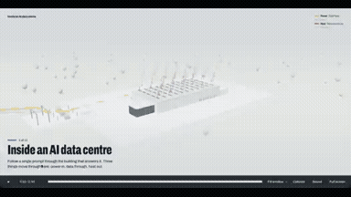</a> 
<strong>AI Data Centre 3D Motion Graphic</strong> 
Use: 3D showcase or immersive scene Inputs: Inputs not fully specified; check the original post. Tools: Tool setup not specified by the source 
<a href="https://x.com/mdaman010/status/2103845689713111079">Original post ↗</a> · <a href="../../prompts/2103845689713111079.md">Prompt ↗</a>
</td>
<td width="33%" valign="top">
 
<strong>3D Star Wars Multiplayer Game</strong> 
Use: 3D showcase or immersive scene Inputs: Inputs not fully specified; check the original post. Tools: Tool setup not specified by the source 
<a href="https://x.com/0xChuckstock/status/2103804606794879327">Original post ↗</a> · <a href="../../prompts/2103804606794879327.md">Prompt ↗</a>
</td>
</tr>
<tr>
<td width="33%" valign="top">
 
<strong>Code-Animated Short Film: Xi the Mechanical Hermit Crab</strong> 
Use: 3D showcase or immersive scene Inputs: Inputs not fully specified; check the original post. Tools: FFmpeg, Remotion 
<a href="https://x.com/gmgmgm1545/status/2103793820815245507">Original post ↗</a> · <a href="../../prompts/2103793820815245507.md">Prompt ↗</a>
</td>
<td width="33%" valign="top">
<a href="../../prompts/2103742861971726495.md">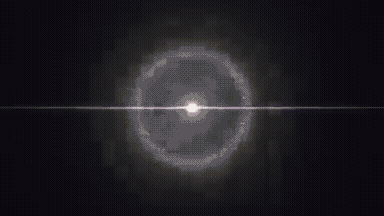</a> 
<strong>Motion Graphics Showreel</strong> 
Use: 3D showcase or immersive scene Inputs: Inputs not fully specified; check the original post. Tools: Tool setup not specified by the source 
<a href="https://x.com/lukasersil/status/2103742861971726495">Original post ↗</a> · <a href="../../prompts/2103742861971726495.md">Prompt ↗</a>
</td>
<td width="33%" valign="top">
<a href="../../prompts/2103736579449868515.md">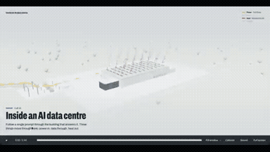</a> 
<strong>AI Data Centre 3D Film</strong> 
Use: 3D showcase or immersive scene Inputs: Inputs not fully specified; check the original post. Tools: Tool setup not specified by the source 
<a href="https://x.com/Sayan_shanky/status/2103736579449868515">Original post ↗</a> · <a href="../../prompts/2103736579449868515.md">Prompt ↗</a>
</td>
</tr>
<tr>
<td width="33%" valign="top">
<a href="../../prompts/2103540288136315331.md">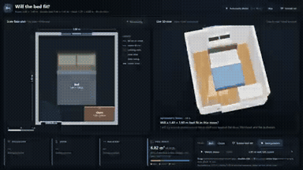</a> 
<strong>Bedroom Layout Generator</strong> 
Use: 3D showcase or immersive scene Inputs: Inputs not fully specified; check the original post. Tools: Tool setup not specified by the source 
<a href="https://x.com/goofyninjaaa/status/2103540288136315331">Original post ↗</a> · <a href="../../prompts/2103540288136315331.md">Prompt ↗</a>
</td>
<td width="33%" valign="top">
 
<strong>Creative Front-End and Video Generation</strong> 
Use: 3D showcase or immersive scene Inputs: Inputs not fully specified; check the original post. Tools: Tool setup not specified by the source 
<a href="https://x.com/DemitiyaGeekzen/status/2103517910274818523">Original post ↗</a> · <a href="../../prompts/2103517910274818523.md">Prompt ↗</a>
</td>
<td width="33%" valign="top">
<a href="../../prompts/2103499771206156628.md">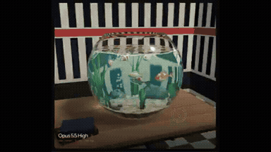</a> 
<strong>GLSL Fishbowl in Three.js</strong> 
Use: 3D showcase or immersive scene Inputs: Inputs not fully specified; check the original post. Tools: Tool setup not specified by the source 
<a href="https://x.com/NicolaManzini/status/2103499771206156628">Original post ↗</a> · <a href="../../prompts/2103499771206156628.md">Prompt ↗</a>
</td>
</tr>
<tr>
<td width="33%" valign="top">
<a href="../../prompts/2103483174957597035.md">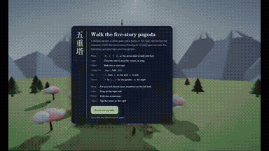</a> 
<strong>3D Pagoda Navigation</strong> 
Use: 3D showcase or immersive scene Inputs: Inputs not fully specified; check the original post. Tools: Tool setup not specified by the source 
<a href="https://x.com/BuildFastWithAI/status/2103483174957597035">Original post ↗</a> · <a href="../../prompts/2103483174957597035.md">Prompt ↗</a>
</td>
<td width="33%" valign="top">
 
<strong>Motion Graphics Showreel</strong> 
Use: 3D showcase or immersive scene Inputs: Inputs not fully specified; check the original post. Tools: Tool setup not specified by the source 
<a href="https://x.com/RaphaelAubryy/status/2103416909857190360">Original post ↗</a> · <a href="../../prompts/2103416909857190360.md">Prompt ↗</a>
</td>
<td width="33%" valign="top">
<a href="../../prompts/2103195903012032809.md">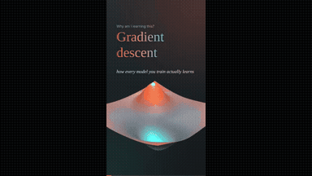</a> 
<strong>3D Animation of Gradient Descent</strong> 
Use: 3D showcase or immersive scene Inputs: Inputs not fully specified; check the original post. Tools: Tool setup not specified by the source 
<a href="https://x.com/anirockshady/status/2103195903012032809">Original post ↗</a> · <a href="../../prompts/2103195903012032809.md">Prompt ↗</a>
</td>
</tr>
<tr>
<td width="33%" valign="top">
 
<strong>Cinematic Browser-Based 3D World</strong> 
Use: 3D showcase or immersive scene Inputs: Inputs not fully specified; check the original post. Tools: Tool setup not specified by the source 
<a href="https://x.com/LexnLin/status/2103194052850241739">Original post ↗</a> · <a href="../../prompts/2103194052850241739.md">Prompt ↗</a>
</td>
<td width="33%" valign="top">
 
<strong>Pelican Riding a Bicycle Animation</strong> 
Use: 3D showcase or immersive scene Inputs: Inputs not fully specified; check the original post. Tools: Tool setup not specified by the source 
<a href="https://x.com/AxtonLiu/status/2103119648271290566">Original post ↗</a> · <a href="../../prompts/2103119648271290566.md">Prompt ↗</a>
</td>
<td width="33%" valign="top">
 
<strong>Pixar-Level Promotional Animation in Three.js</strong> 
Use: Product launch or brand promo Inputs: Inputs not fully specified; check the original post. Tools: JavaScript 
<a href="https://x.com/Anilraok/status/2103087766662009118">Original post ↗</a> · <a href="../../prompts/2103087766662009118.md">Prompt ↗</a>
</td>
</tr>
<tr>
<td width="33%" valign="top">
<a href="../../prompts/2103038625483272483.md">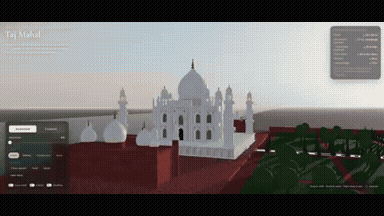</a> 
<strong>Interactive 3D Taj Mahal in Three.js</strong> 
Use: 3D showcase or immersive scene Inputs: Inputs not fully specified; check the original post. Tools: Three.js 
<a href="https://x.com/CurieuxExplorer/status/2103038625483272483">Original post ↗</a> · <a href="../../prompts/2103038625483272483.md">Prompt ↗</a>
</td>
<td width="33%" valign="top">
 
<strong>Stylistic 3D Particle Santa Monica Beach</strong> 
Use: 3D showcase or immersive scene Inputs: Inputs not fully specified; check the original post. Tools: Tool setup not specified by the source 
<a href="https://x.com/ishuagra02/status/2102920408743678129">Original post ↗</a> · <a href="../../prompts/2102920408743678129.md">Prompt ↗</a>
</td>
<td width="33%" valign="top">
<a href="../../prompts/2102861939072434495.md">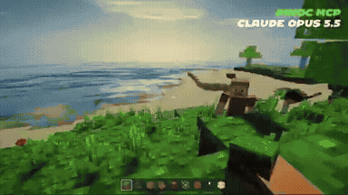</a> 
<strong>Browser Minecraft Recreation</strong> 
Use: 3D showcase or immersive scene Inputs: Inputs not fully specified; check the original post. Tools: Three.js 
<a href="https://x.com/Viggle_PINOC/status/2102861939072434495">Original post ↗</a> · <a href="../../prompts/2102861939072434495.md">Prompt ↗</a>
</td>
</tr>
<tr>
<td width="33%" valign="top">
 
<strong>250 Years of U.S. History Sand Animation</strong> 
Use: 3D showcase or immersive scene Inputs: Inputs not fully specified; check the original post. Tools: Tool setup not specified by the source 
<a href="https://x.com/Michaelzsguo/status/2102592355165782312">Original post ↗</a> · <a href="../../prompts/2102592355165782312.md">Prompt ↗</a>
</td>
<td width="33%" valign="top">
 
<strong>1906 San Francisco Market Street Blender Reconstruction</strong> 
Use: 3D showcase or immersive scene Inputs: Inputs not fully specified; check the original post. Tools: Blender 
<a href="https://x.com/alexalbert__/status/2102466523164274839">Original post ↗</a> · <a href="../../prompts/2102466523164274839.md">Prompt ↗</a>
</td><td></td>
</tr>
</table>

[Back to gallery](../../README.md)
