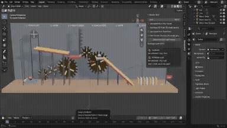
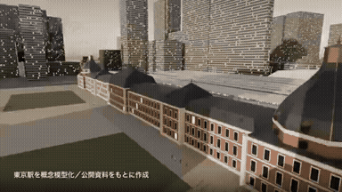

# blender

<table>
<tr>
<td width="33%" valign="top">
 
<strong>Agency Promo Motion Design Video</strong> 
Use: Motion graphics / showreel Inputs: User inputs not specified by the author Tools: Blender 
<a href="https://x.com/motion_conquest/status/2105077715510714439">Original post ↗</a> · <a href="../../prompts/2105077715510714439.md">Prompt ↗</a>
</td>
<td width="33%" valign="top">
 
<strong>FLIP CLASH Game UI Redesign with Blender Backgrounds</strong> 
Use: Game UI Redesign &amp; 3D Backgrounds Inputs: FLIP CLASH game source code and original settings interface Tools: Blender 
<a href="https://x.com/hii_studio_jp/status/2105051697525686340">Original post ↗</a> · <a href="../../prompts/2105051697525686340.md">Prompt ↗</a>
</td>
<td width="33%" valign="top">
 
<strong>Procedural Rube Goldberg Machine via Blender MCP</strong> 
Use: Procedural Rube Goldberg Machine in Blender Inputs: User inputs not specified by the author Tools: Blender / Blender MCP / Cursor 
<a href="https://x.com/Kwazikot/status/2104953406708175097">Original post ↗</a> · <a href="../../prompts/2104953406708175097.md">Prompt ↗</a>
</td>
</tr>
<tr>
<td width="33%" valign="top">
 
<strong>3D Animated Music Video Produced and Blender</strong> 
Use: 3D Animation / Music Video Inputs: Original musical composition created by the author; Storyboards and directorial instructions created by the author Tools: Blender / three.js 
<a href="https://x.com/LugiAXETomXV/status/2105091868149354753">Original post ↗</a> · <a href="../../prompts/2105091868149354753.md">Prompt ↗</a>
</td>
<td width="33%" valign="top">
 
<strong>Tokyo Station 3D Architectural Breakdown</strong> 
Use: 3D visualization dissecting Tokyo Station's multi-layered layout generated via Claude Code / Opus 5.5 scripting Blender. Inputs: User inputs not specified by the author Tools: Blender 
<a href="https://x.com/yktgch/status/2104525642121519401">Original post ↗</a> · <a href="../../prompts/2104525642121519401.md">Prompt ↗</a>
</td>
<td width="33%" valign="top">
 
<strong>1906 San Francisco Market Street Blender Reconstruction</strong> 
Use: Historical 3D reconstruction Inputs: User inputs not specified by the author Tools: Blender 
<a href="https://x.com/alexalbert__/status/2102466523164274839">Original post ↗</a> · <a href="../../prompts/2102466523164274839.md">Prompt ↗</a>
</td>
</tr>
</table>

[All tasks](../../README.md)
