# canvas-interactive

<table>
<tr>
<td width="33%" valign="top">
<a href="../../prompts/2108501256067285443.md">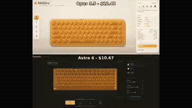</a> 
<strong>Interactive Honey Keyboard Simulation</strong> 
Use: Interactive 3D Honey Keyboard Inputs: User inputs not specified by the author Tools: HTML/WebGL 
<a href="https://x.com/keydol123/status/2108501256067285443">Original post ↗</a> · <a href="../../prompts/2108501256067285443.md">Prompt ↗</a>
</td>
<td width="33%" valign="top">
<a href="../../prompts/2108486895344767283.md">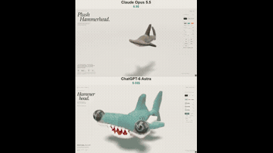</a> 
<strong>Interactive WebGPU Plush Hammerhead Shark</strong> 
Use: Interactive WebGPU Plush Toy Simulation Inputs: User inputs not specified by the author Tools: WebGPU 
<a href="https://x.com/vib3coded/status/2108486895344767283">Original post ↗</a> · <a href="../../prompts/2108486895344767283.md">Prompt ↗</a>
</td>
<td width="33%" valign="top">
<a href="../../prompts/2105190658701201725.md">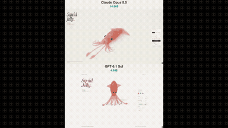</a> 
<strong>Squid Jelly: Interactive 3D WebGPU Gummy Squid Simulation</strong> 
Use: Interactive 3D WebGPU Gummy Squid Simulation Inputs: User inputs not specified by the author Tools: WebGPU / WGSL 
<a href="https://x.com/vib3coded/status/2105190658701201725">Original post ↗</a> · <a href="../../prompts/2105190658701201725.md">Prompt ↗</a>
</td>
</tr>
<tr>
<td width="33%" valign="top">
<a href="../../prompts/2105090561023901698.md">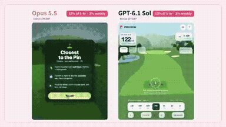</a> 
<strong>Three.js 3D Closest to the Pin Golf Game Comparison</strong> 
Use: Game / playable prototype Inputs: User inputs not specified by the author Tools: Tool setup not specified by the source 
<a href="https://x.com/Kyler_Lorin/status/2105090561023901698">Original post ↗</a> · <a href="../../prompts/2105090561023901698.md">Prompt ↗</a>
</td>
<td width="33%" valign="top">
<a href="../../prompts/2105086032005726712.md">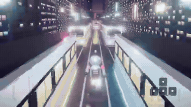</a> 
<strong>3D Neon City Robot Endless Runner Game</strong> 
Use: Game / playable prototype Inputs: User inputs not specified by the author Tools: Tool setup not specified by the source 
<a href="https://x.com/aichrislee/status/2105086032005726712">Original post ↗</a> · <a href="../../prompts/2105086032005726712.md">Prompt ↗</a>
</td>
<td width="33%" valign="top">
 
<strong>FLIP CLASH Game UI Redesign with Blender Backgrounds</strong> 
Use: Game UI Redesign &amp; 3D Backgrounds Inputs: FLIP CLASH game source code and original settings interface Tools: Blender 
<a href="https://x.com/hii_studio_jp/status/2105051697525686340">Original post ↗</a> · <a href="../../prompts/2105051697525686340.md">Prompt ↗</a>
</td>
</tr>
<tr>
<td width="33%" valign="top">
<a href="../../prompts/2104920915112829231.md">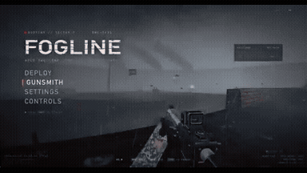</a> 
<strong>Bodycam FPS 'Fogline' Built with Three.js and Web Shaders</strong> 
Use: Browser-based 3D bodycam shooter game Inputs: User inputs not specified by the author Tools: Browser renderer test harness / Three.js / Web Shaders 
<a href="https://x.com/superalesha/status/2104920915112829231">Original post ↗</a> · <a href="../../prompts/2104920915112829231.md">Prompt ↗</a>
</td>
<td width="33%" valign="top">
<a href="../../prompts/2104520072014508316.md">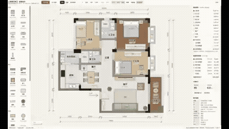</a> 
<strong>Interactive 2D/3D Floor Plan and Interior Design Web Tool</strong> 
Use: Interactive floor-plan design tool Inputs: Floor plan image with millimeter dimension annotations Tools: Three.js 
<a href="https://x.com/akokoi1/status/2104520072014508316">Original post ↗</a> · <a href="../../prompts/2104520072014508316.md">Prompt ↗</a>
</td>
<td width="33%" valign="top">
<a href="../../prompts/2104514806443303238.md">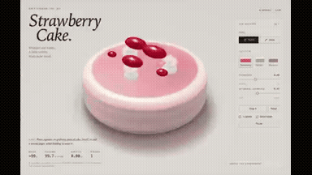</a> 
<strong>Interactive WebGPU Strawberry Cake Soft-Body Physics</strong> 
Use: Interactive soft-body physics demo Inputs: No external assets required by the prompt Tools: WebGPU / WGSL 
<a href="https://x.com/ImaStudio_ai/status/2104514806443303238">Original post ↗</a> · <a href="../../prompts/2104514806443303238.md">Prompt ↗</a>
</td>
</tr>
<tr>
<td width="33%" valign="top">
<a href="../../prompts/2104504957173153951.md">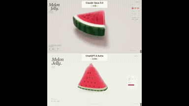</a> 
<strong>Interactive WebGPU Melon Jelly Simulation</strong> 
Use: Claude Opus 5.5 generated a self-contained WebGPU/XPBD soft-body 3D watermelon jelly simulation shown in a side-by-side screen recording. Inputs: User inputs not specified by the author Tools: JavaScript / WebGPU / WGSL 
<a href="https://x.com/esrhengwu/status/2104504957173153951">Original post ↗</a> · <a href="../../prompts/2104504957173153951.md">Prompt ↗</a>
</td>
<td width="33%" valign="top">
<a href="../../prompts/2104189915693269112.md">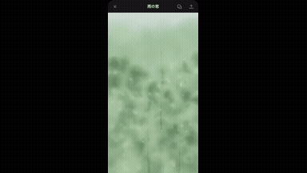</a> 
<strong>Interactive Rain Window Calming App</strong> 
Use: Calming rain interaction Inputs: User inputs not specified by the author Tools: Tool setup not specified by the source 
<a href="https://x.com/d_llm_kr/status/2104189915693269112">Original post ↗</a> · <a href="../../prompts/2104189915693269112.md">Prompt ↗</a>
</td>
<td width="33%" valign="top">
<a href="../../prompts/2103802923465768972.md">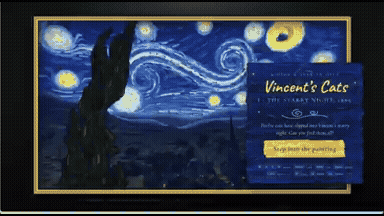</a> 
<strong>Vincent's Cats: 3D Starry Night Game</strong> 
Use: 3D exploration game / hidden cats Inputs: User inputs not specified by the author Tools: Claude Code 
<a href="https://x.com/MandelDuck/status/2103802923465768972">Original post ↗</a> · <a href="../../prompts/2103802923465768972.md">Prompt ↗</a>
</td>
</tr>
<tr>
<td width="33%" valign="top">
<a href="../../prompts/2108514670411907296.md">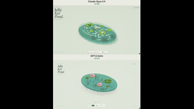</a> 
<strong>Interactive Jelly Koi Pond Simulation with Physics</strong> 
Use: Interactive Jelly Koi Pond Simulation Inputs: User inputs not specified by the author Tools: Tool setup not specified by the source 
<a href="https://x.com/zyroxxx111/status/2108514670411907296">Original post ↗</a> · <a href="../../prompts/2108514670411907296.md">Prompt ↗</a>
</td>
<td width="33%" valign="top">
<a href="../../prompts/2105160746363662816.md">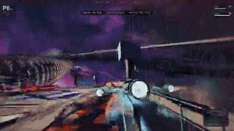</a> 
<strong>Span Nine Space Racing Game Evolution</strong> 
Use: Browser Space Racing Game Inputs: User inputs not specified by the author Tools: Web browser / WebGL 3D engine 
<a href="https://x.com/Ryancampbell/status/2105160746363662816">Original post ↗</a> · <a href="../../prompts/2105160746363662816.md">Prompt ↗</a>
</td>
<td width="33%" valign="top">
<a href="../../prompts/2105143909311803524.md">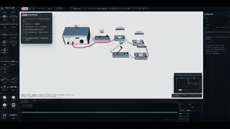</a> 
<strong>Interactive 3D Electrical Experiment Workbench Comparison</strong> 
Use: Interactive 3D Electrical Experiment Workbench Inputs: User inputs not specified by the author Tools: Tool setup not specified by the source 
<a href="https://x.com/akokoi1/status/2105143909311803524">Original post ↗</a> · <a href="../../prompts/2105143909311803524.md">Prompt ↗</a>
</td>
</tr>
<tr>
<td width="33%" valign="top">
<a href="../../prompts/2105102932114813383.md">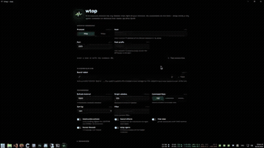</a> 
<strong>btop-like Live Machine Dashboard Web App</strong> 
Use: System Monitoring Live Web Dashboard Inputs: Docker daemon API host endpoint and credentials for collecting metrics Tools: Docker 
<a href="https://x.com/Jaidcel/status/2105102932114813383">Original post ↗</a> · <a href="../../prompts/2105102932114813383.md">Prompt ↗</a>
</td>
<td width="33%" valign="top">
<a href="../../prompts/2105095134354473053.md">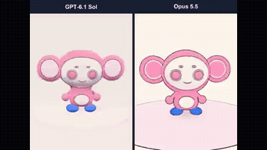</a> 
<strong>3D Character Modeling and Animation Comparison: Dopakichi Mascot</strong> 
Use: Opus 5.5 was prompted to turn a 2D mascot character into an interactive 3D model, generating toon shading and a blinking animation compared against GPT-6.1 Sol. Inputs: Reference illustration of Dopadrill's mascot character 'ドパキチ' (Dopakichi) Tools: Tool setup not specified by the source 
<a href="https://x.com/grmchn4ai/status/2105095134354473053">Original post ↗</a> · <a href="../../prompts/2105095134354473053.md">Prompt ↗</a>
</td>
<td width="33%" valign="top">
<a href="../../prompts/2105086568155304269.md">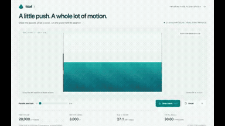</a> 
<strong>Interactive 20,000 Water Particle Fluid Simulation Comparison</strong> 
Use: Interactive 2D particle fluid dynamics simulation Inputs: User inputs not specified by the author Tools: Tool setup not specified by the source 
<a href="https://x.com/viewsfrom02108/status/2105086568155304269">Original post ↗</a> · <a href="../../prompts/2105086568155304269.md">Prompt ↗</a>
</td>
</tr>
<tr>
<td width="33%" valign="top">
<a href="../../prompts/2105028528198541622.md">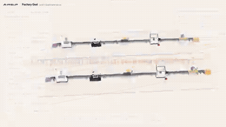</a> 
<strong>AI Factory Discrete Event Simulation Game</strong> 
Use: Discrete Event Simulation Game Inputs: User inputs not specified by the author Tools: Tool setup not specified by the source 
<a href="https://x.com/konstantinsaifo/status/2105028528198541622">Original post ↗</a> · <a href="../../prompts/2105028528198541622.md">Prompt ↗</a>
</td>
<td width="33%" valign="top">
<a href="../../prompts/2104999693113766152.md">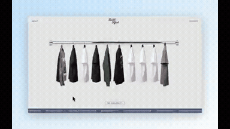</a> 
<strong>Batch Merch 3D Clothes Rack Interactive Portfolio</strong> 
Use: Interactive 3D Merch Portfolio Inputs: Mockup images of merchandise apparel Tools: Tool setup not specified by the source 
<a href="https://x.com/cambreedesigns/status/2104999693113766152">Original post ↗</a> · <a href="../../prompts/2104999693113766152.md">Prompt ↗</a>
</td>
<td width="33%" valign="top">
<a href="../../prompts/2104939145252749710.md">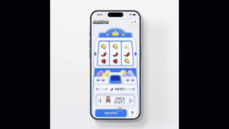</a> 
<strong>iOS Jackpot Game App Prototype with Opus 5.5</strong> 
Use: Interactive Jackpot App Prototype Inputs: User inputs not specified by the author Tools: Claude Opus 5.5 / GPT 5 / higgsfield MCP / mobbin MCP 
<a href="https://x.com/rehanxahmed/status/2104939145252749710">Original post ↗</a> · <a href="../../prompts/2104939145252749710.md">Prompt ↗</a>
</td>
</tr>
<tr>
<td width="33%" valign="top">
 
<strong>Game Boy Tetris Recreation in MONORAL Engine</strong> 
Use: The author modeled a Game Boy style housing using their MONORAL engine with the LCD rendered on canvas, then prompted Claude Opus 5.5 to recreate the Game Boy version of Tetris to run within MONORAL. Inputs: User inputs not specified by the author Tools: Tool setup not specified by the source 
<a href="https://x.com/mickeysmith_jp/status/2104539335249088582">Original post ↗</a> · <a href="../../prompts/2104539335249088582.md">Prompt ↗</a>
</td>
<td width="33%" valign="top">
<a href="../../prompts/2104532802486345950.md">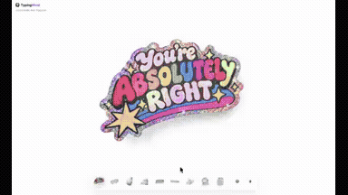</a> 
<strong>Interactive 3D Sticker Layer Breakdown Demo</strong> 
Use: Ann Nguyen shares an interactive screen recording generated with Claude Opus 5.5 showing a 3D exploded view of physical sticker layers with live rotation and interaction. Inputs: User inputs not specified by the author Tools: Tool setup not specified by the source 
<a href="https://x.com/ann_nnng/status/2104532802486345950">Original post ↗</a> · <a href="../../prompts/2104532802486345950.md">Prompt ↗</a>
</td>
<td width="33%" valign="top">
<a href="../../prompts/2104516868182598079.md">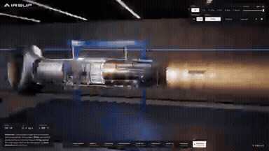</a> 
<strong>Interactive F135 Jet Engine Simulation</strong> 
Use: Author used Claude Opus 5.5 to create an interactive 3D WebGL F135 fighter jet engine model demonstrating internal airflow, combustion, and afterburner plume. Inputs: User inputs not specified by the author Tools: Tool setup not specified by the source 
<a href="https://x.com/konstantinsaifo/status/2104516868182598079">Original post ↗</a> · <a href="../../prompts/2104516868182598079.md">Prompt ↗</a>
</td>
</tr>
<tr>
<td width="33%" valign="top">
<a href="../../prompts/2104509574409769436.md">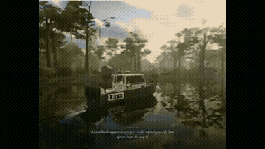</a> 
<strong>Three.js 3D Swamp Scene Generated via Opus 5.5</strong> 
Use: Interactive 3D swamp environment with boat, water wake, dynamic lighting, and foliage vibe-coded in Three.js using Claude Opus 5.5. Inputs: User inputs not specified by the author Tools: Tool setup not specified by the source 
<a href="https://x.com/chetanankola/status/2104509574409769436">Original post ↗</a> · <a href="../../prompts/2104509574409769436.md">Prompt ↗</a>
</td>
<td width="33%" valign="top">
<a href="../../prompts/2104498456626651380.md">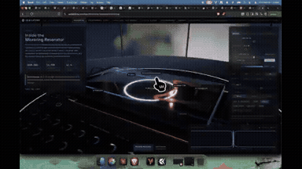</a> 
<strong>Microring Resonator Thermal Drift and Controller Simulation</strong> 
Use: Saul Flores Jr. demonstrates an interactive 3D simulation of sunlight heating a microring resonator and controller compensation, created by prompting Claude Opus 5.5. Inputs: User inputs not specified by the author Tools: Tool setup not specified by the source 
<a href="https://x.com/SaulFloresJr/status/2104498456626651380">Original post ↗</a> · <a href="../../prompts/2104498456626651380.md">Prompt ↗</a>
</td>
<td width="33%" valign="top">
<a href="../../prompts/2104485636690584000.md">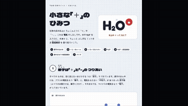</a> 
<strong>Interactive Educational Webpage on Ions and Coordinate Bonding</strong> 
Use: An interactive educational webpage with step-by-step animations explaining ions, coordinate bonding in hydronium (H3O+), and an interactive comprehension quiz generated using Claude Opus 5.5. Inputs: User inputs not specified by the author Tools: Tool setup not specified by the source 
<a href="https://x.com/neco1751662/status/2104485636690584000">Original post ↗</a> · <a href="../../prompts/2104485636690584000.md">Prompt ↗</a>
</td>
</tr>
<tr>
<td width="33%" valign="top">
<a href="../../prompts/2104467552281952473.md">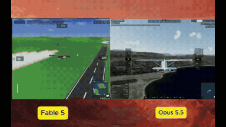</a> 
<strong>Interactive Flight Simulator Comparison Built by Opus 5.5</strong> 
Use: The author prompts Opus 5.5 and Fable 5 with 'Build an ultra-realistic flight simulator' and demonstrates screen recordings of the resulting playable flight simulation experiences. Inputs: User inputs not specified by the author Tools: Tool setup not specified by the source 
<a href="https://x.com/cryptocatguru/status/2104467552281952473">Original post ↗</a> · <a href="../../prompts/2104467552281952473.md">Prompt ↗</a>
</td>
<td width="33%" valign="top">
<a href="../../prompts/2104463774862446760.md">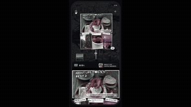</a> 
<strong>Interactive Bubble Genre Selection UI in App Development</strong> 
Use: Demonstration of an interactive mobile app genre selection screen generated using Claude Opus 5.5, featuring animated soap bubbles that expand and filter subcategories upon interaction. Inputs: User inputs not specified by the author Tools: Tool setup not specified by the source 
<a href="https://x.com/asakarifa/status/2104463774862446760">Original post ↗</a> · <a href="../../prompts/2104463774862446760.md">Prompt ↗</a>
</td>
<td width="33%" valign="top">
<a href="../../prompts/2104452405144535314.md">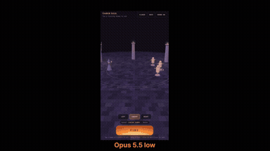</a> 
<strong>Opus 5.5 Fireball Spell Animation Across Effort Levels</strong> 
Use: Author showcases an interactive 3D fireball spell casting simulation created with Claude Opus 5.5 across varying effort levels (low, medium, high, xhigh, max). Inputs: User inputs not specified by the author Tools: Tool setup not specified by the source 
<a href="https://x.com/VibeCode_SahilM/status/2104452405144535314">Original post ↗</a> · <a href="../../prompts/2104452405144535314.md">Prompt ↗</a>
</td>
</tr>
<tr>
<td width="33%" valign="top">
<a href="../../prompts/2104441050211475528.md">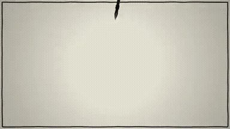</a> 
<strong>Opus 5.5 代码逐帧生成动画短片《我只会写字》</strong> 
Use: 作者让 Opus 5.5 介绍自己能制作何种类型的视频，模型构思了动画片《我只会写字》并生成逐帧绘制的 Canvas/代码动画脚本与旁白。 Inputs: User inputs not specified by the author Tools: Tool setup not specified by the source 
<a href="https://x.com/kokoro_886/status/2104441050211475528">Original post ↗</a> · <a href="../../prompts/2104441050211475528.md">Prompt ↗</a>
</td>
<td width="33%" valign="top">
 
<strong>Interactive 3D Camera Lens Focus Lab</strong> 
Use: Claude Opus 5.5 was prompted via the API to visually explain camera focus, generating a complex interactive 3D lens simulation where users can manipulate the focus ring to observe the plane of focus, ray convergence, and sensor image. Inputs: User inputs not specified by the author Tools: Tool setup not specified by the source 
<a href="https://x.com/rdominguezibar/status/2104436377546818041">Original post ↗</a> · <a href="../../prompts/2104436377546818041.md">Prompt ↗</a>
</td>
<td width="33%" valign="top">
<a href="../../prompts/2104434742959755463.md">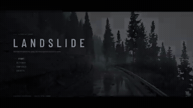</a> 
<strong>Hyperrealistic Landslide Escape Game Developed</strong> 
Use: Game / playable prototype Inputs: User inputs not specified by the author Tools: Tool setup not specified by the source 
<a href="https://x.com/RAJKATAJJ/status/2104434742959755463">Original post ↗</a> · <a href="../../prompts/2104434742959755463.md">Prompt ↗</a>
</td>
</tr>
<tr>
<td width="33%" valign="top">
<a href="../../prompts/2104421343429312968.md">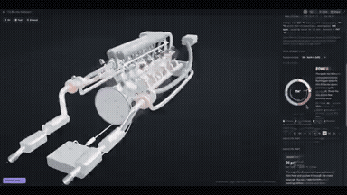</a> 
<strong>Interactive Explodable Twin-Turbo V12 Engine Explainer</strong> 
Use: A screen recording showing an interactive 3D explainer web application of a twin-turbo V12 engine created with Claude Opus 5.5, featuring exploded views, part inspection, and combustion cycle animations. Inputs: User inputs not specified by the author Tools: Tool setup not specified by the source 
<a href="https://x.com/ImperiumMentisX/status/2104421343429312968">Original post ↗</a> · <a href="../../prompts/2104421343429312968.md">Prompt ↗</a>
</td>
<td width="33%" valign="top">
 
<strong>Code-Rendered Generative Music Video for I'm Upping My P(doom)</strong> 
Use: Author used Claude Opus 5.5 via Claude Code to cooperatively design and program an entire generative music video, including lyric alignment, audio analysis, TypeScript/Three.js rendering engine, and dynamic 3D/typography scenes. Inputs: User inputs not specified by the author Tools: Tool setup not specified by the source 
<a href="https://x.com/weiwei2018831/status/2104420680142082118">Original post ↗</a> · <a href="../../prompts/2104420680142082118.md">Prompt ↗</a>
</td>
<td width="33%" valign="top">
<a href="../../prompts/2104407040135164032.md">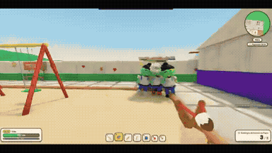</a> 
<strong>Escola de Massinha 3D Game</strong> 
Use: Tiago Chi demonstrates a 3D interactive claymation-style web game created with Claude Opus 5.5, where players navigate a school full of zombie teachers. Inputs: User inputs not specified by the author Tools: Tool setup not specified by the source 
<a href="https://x.com/tiagochilanti/status/2104407040135164032">Original post ↗</a> · <a href="../../prompts/2104407040135164032.md">Prompt ↗</a>
</td>
</tr>
<tr>
<td width="33%" valign="top">
<a href="../../prompts/2104406088862810533.md">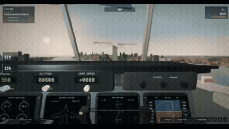</a> 
<strong>Interactive 3D Flight Simulator Game</strong> 
Use: Author demonstrates a 3D flight simulator project created by prompting Claude Opus 5.5, featuring cockpit instrumentation, switchable camera angles, and city navigation. Inputs: User inputs not specified by the author Tools: Tool setup not specified by the source 
<a href="https://x.com/ekcheungAI/status/2104406088862810533">Original post ↗</a> · <a href="../../prompts/2104406088862810533.md">Prompt ↗</a>
</td>
<td width="33%" valign="top">
<a href="../../prompts/2104212398303543512.md">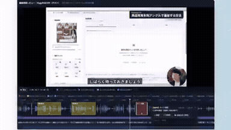</a> 
<strong>Claude Opus 5.5による動画編集プレビュー・カット承認UIの構築</strong> 
Use: Claude Opus 5.5を活用して動画の無音カット提案を行い、それを波形とプレビュー画面上でワンクリック承認・微調整できる専用の動画編集UI/スキルを開発・実演した事例。 Inputs: User inputs not specified by the author Tools: Tool setup not specified by the source 
<a href="https://x.com/excel_niisan/status/2104212398303543512">Original post ↗</a> · <a href="../../prompts/2104212398303543512.md">Prompt ↗</a>
</td>
<td width="33%" valign="top">
<a href="../../prompts/2104159923886244176.md">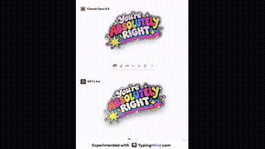</a> 
<strong>Interactive Glitter Sticker Effect with Peel Animation Comparison</strong> 
Use: Ann Nguyen tests Claude Opus 5.5 against GPT-6 Sol on building an interactive glitter sticker effect with tilt and peel animations. Inputs: User inputs not specified by the author Tools: Tool setup not specified by the source 
<a href="https://x.com/ann_nnng/status/2104159923886244176">Original post ↗</a> · <a href="../../prompts/2104159923886244176.md">Prompt ↗</a>
</td>
</tr>
<tr>
<td width="33%" valign="top">
 
<strong>Interactive 3D Raptor 3 Rocket Engine WebGL Model</strong> 
Use: Konstantin Saifoulline showcases an interactive Three.js 3D browser simulation of SpaceX's Raptor 3 engine generated with Claude Opus 5.5, featuring cutaway views, propellant flow paths, throttling controls, and shock diamonds. Inputs: User inputs not specified by the author Tools: Tool setup not specified by the source 
<a href="https://x.com/konstantinsaifo/status/2104094723887501736">Original post ↗</a> · <a href="../../prompts/2104094723887501736.md">Prompt ↗</a>
</td>
<td width="33%" valign="top">
<a href="../../prompts/2104046743751139812.md">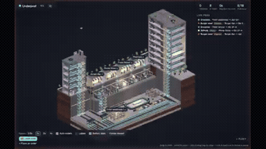</a> 
<strong>Underground Delivery Network Game</strong> 
Use: A 3D browser simulation game depicting a tiny underground parcel delivery network, created using Claude Opus 5.5 and Three.js. Inputs: User inputs not specified by the author Tools: React / Three.js 
<a href="https://x.com/lisp_mi/status/2104046743751139812">Original post ↗</a> · <a href="../../prompts/2104046743751139812.md">Prompt ↗</a>
</td>
<td width="33%" valign="top">
<a href="../../prompts/2103867115044237752.md">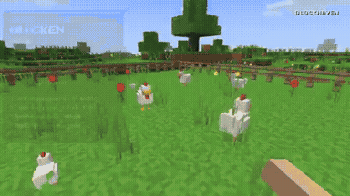</a> 
<strong>Minecraft-Style Browser Sandbox Game</strong> 
Use: Game / playable prototype Inputs: User inputs not specified by the author Tools: Tool setup not specified by the source 
<a href="https://x.com/kepochnik/status/2103867115044237752">Original post ↗</a> · <a href="../../prompts/2103867115044237752.md">Prompt ↗</a>
</td>
</tr>
<tr>
<td width="33%" valign="top">
<a href="../../prompts/2103822946800165270.md">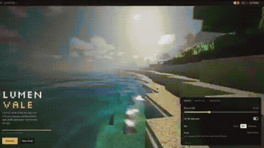</a> 
<strong>Browser-Based Minecraft Game</strong> 
Use: Game / playable prototype Inputs: User inputs not specified by the author Tools: Three.js 
<a href="https://x.com/dreyk0o0/status/2103822946800165270">Original post ↗</a> · <a href="../../prompts/2103822946800165270.md">Prompt ↗</a>
</td>
<td width="33%" valign="top">
<a href="../../prompts/2103820321673675031.md">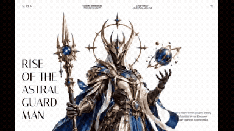</a> 
<strong>Auren Header Scroll-Scrubbed Hero Section</strong> 
Use: Scroll-driven website hero Inputs: Background video; Two feature-card images Tools: Framer Motion / GSAP ScrollTrigger / React 
<a href="https://x.com/iamtanzil_/status/2103820321673675031">Original post ↗</a> · <a href="../../prompts/2103820321673675031.md">Prompt ↗</a>
</td>
<td width="33%" valign="top">
<a href="../../prompts/2103804606794879327.md">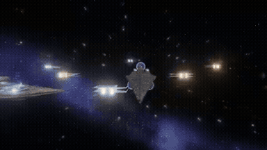</a> 
<strong>3D Star Wars Multiplayer Game</strong> 
Use: 3D multiplayer space game Inputs: User inputs not specified by the author Tools: Tool setup not specified by the source 
<a href="https://x.com/0xChuckstock/status/2103804606794879327">Original post ↗</a> · <a href="../../prompts/2103804606794879327.md">Prompt ↗</a>
</td>
</tr>
<tr>
<td width="33%" valign="top">
<a href="../../prompts/2103789415323562325.md">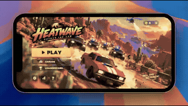</a> 
<strong>Police Chase Arcade Game PRD</strong> 
Use: Mobile arcade game prototype Inputs: Existing Unity CLI project Tools: Unity 
<a href="https://x.com/froessell/status/2103789415323562325">Original post ↗</a> · <a href="../../prompts/2103789415323562325.md">Prompt ↗</a>
</td>
<td width="33%" valign="top">
<a href="../../prompts/2103763192971461057.md">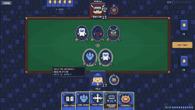</a> 
<strong>Pixel Art Hearthstone-Style Card Game</strong> 
Use: Pixel-art card game prototype Inputs: User inputs not specified by the author Tools: Tool setup not specified by the source 
<a href="https://x.com/aisongman/status/2103763192971461057">Original post ↗</a> · <a href="../../prompts/2103763192971461057.md">Prompt ↗</a>
</td>
<td width="33%" valign="top">
<a href="../../prompts/2103743617848459762.md">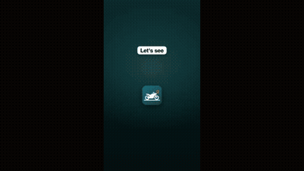</a> 
<strong>Motoseyir App Motion Design Promo</strong> 
Use: A motion design prompt used with Opus 5.5 to generate a 45–50 second vertical promotional video showcasing the features of the Motoseyir navigation app. Inputs: User inputs not specified by the author Tools: Tool setup not specified by the source 
<a href="https://x.com/Bilimfili1/status/2103743617848459762">Original post ↗</a> · <a href="../../prompts/2103743617848459762.md">Prompt ↗</a>
</td>
</tr>
<tr>
<td width="33%" valign="top">
<a href="../../prompts/2103708392930066575.md">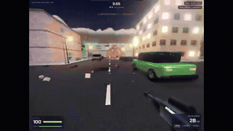</a> 
<strong>Multiplayer Shooting Game</strong> 
Use: Game / playable prototype Inputs: User inputs not specified by the author Tools: Tool setup not specified by the source 
<a href="https://x.com/Ved_CJ/status/2103708392930066575">Original post ↗</a> · <a href="../../prompts/2103708392930066575.md">Prompt ↗</a>
</td>
<td width="33%" valign="top">
<a href="../../prompts/2103628970000347627.md">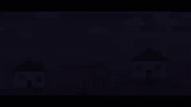</a> 
<strong>MapleStory Clone in Raylib-cs</strong> 
Use: A prompt given to Claude Opus 5.5 to generate a MapleStory clone game using Raylib-cs. Inputs: User inputs not specified by the author Tools: Tool setup not specified by the source 
<a href="https://x.com/NoLit64/status/2103628970000347627">Original post ↗</a> · <a href="../../prompts/2103628970000347627.md">Prompt ↗</a>
</td>
<td width="33%" valign="top">
<a href="../../prompts/2103437714695843891.md">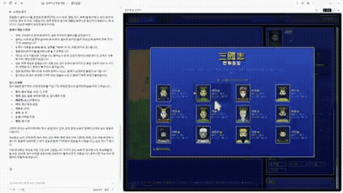</a> 
<strong>Retro Romance of the Three Kingdoms Game</strong> 
Use: Game / playable prototype Inputs: User inputs not specified by the author Tools: Tool setup not specified by the source 
<a href="https://x.com/opener_ai/status/2103437714695843891">Original post ↗</a> · <a href="../../prompts/2103437714695843891.md">Prompt ↗</a>
</td>
</tr>
<tr>
<td width="33%" valign="top">
<a href="../../prompts/2103401820261355554.md">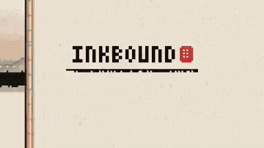</a> 
<strong>INKBOUND Pixel Runner Game</strong> 
Use: A detailed specification prompt for Claude to generate INKBOUND, a 16-bit sumi-e ink painting pixel runner game in a single self-contained HTML file using vanilla JavaScript, Canvas 2D, and Web Audio API. Inputs: No external assets required by the prompt Tools: Canvas 2D / Vanilla JavaScript 
<a href="https://x.com/agentgamesbot/status/2103401820261355554">Original post ↗</a> · <a href="../../prompts/2103401820261355554.md">Prompt ↗</a>
</td>
<td width="33%" valign="top">
<a href="../../prompts/2103197522382786581.md">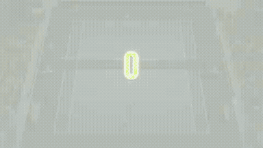</a> 
<strong>Opus 5.5 Launch Video</strong> 
Use: A prompt used with Claude Opus 5.5 to generate a high-energy launch video highlighting live stats, cross-platform play, and themes for an online tennis game. Inputs: User inputs not specified by the author Tools: Tool setup not specified by the source 
<a href="https://x.com/deifosv/status/2103197522382786581">Original post ↗</a> · <a href="../../prompts/2103197522382786581.md">Prompt ↗</a>
</td>
<td width="33%" valign="top">
<a href="../../prompts/2103152898708582551.md">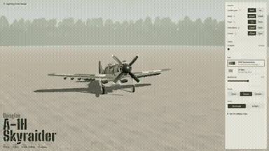</a> 
<strong>Three.js Douglas A-1H Skyraider</strong> 
Use: A prompt used with Opus 5.5 to generate a Douglas A-1H Skyraider aircraft model entirely in Three.js within a single HTML file. Inputs: User inputs not specified by the author Tools: Three.js 
<a href="https://x.com/BuildFastWithAI/status/2103152898708582551">Original post ↗</a> · <a href="../../prompts/2103152898708582551.md">Prompt ↗</a>
</td>
</tr>
<tr>
<td width="33%" valign="top">
 
<strong>Three.js Animated Story</strong> 
Use: A prompt asking the model to imagine a story and render a full animation using Three.js in the style of an 80s Star Wars or 90s cartoon. Inputs: User inputs not specified by the author Tools: Tool setup not specified by the source 
<a href="https://x.com/Ryzoft/status/2102989395359887481">Original post ↗</a> · <a href="../../prompts/2102989395359887481.md">Prompt ↗</a>
</td>
<td width="33%" valign="top">
<a href="../../prompts/2102986585004511319.md">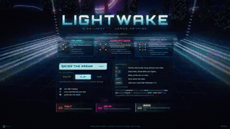</a> 
<strong>Make a Tron Game</strong> 
Use: Game / playable prototype Inputs: User inputs not specified by the author Tools: Tool setup not specified by the source 
<a href="https://x.com/0xRathi/status/2102986585004511319">Original post ↗</a> · <a href="../../prompts/2102986585004511319.md">Prompt ↗</a>
</td>
<td width="33%" valign="top">
 
<strong>90s-Style Demoscene Demo</strong> 
Use: Prompt provided to Claude Opus to create a 1990s-style demoscene demo synchronized to an S3M music track using C/C++ and OpenGL. Inputs: User inputs not specified by the author Tools: Tool setup not specified by the source 
<a href="https://x.com/gandamu_ml/status/2102919394775220530">Original post ↗</a> · <a href="../../prompts/2102919394775220530.md">Prompt ↗</a>
</td>
</tr>
<tr>
<td width="33%" valign="top">
 
<strong>Higher Game Update on Spawn</strong> 
Use: Game / playable prototype Inputs: User inputs not specified by the author Tools: Tool setup not specified by the source 
<a href="https://x.com/chukinice/status/2102889901297426722">Original post ↗</a> · <a href="../../prompts/2102889901297426722.md">Prompt ↗</a>
</td>
<td width="33%" valign="top">
 
<strong>Deep-Sea Horror Game</strong> 
Use: Game / playable prototype Inputs: User inputs not specified by the author Tools: Tool setup not specified by the source 
<a href="https://x.com/ggsimm/status/2102882622053535814">Original post ↗</a> · <a href="../../prompts/2102882622053535814.md">Prompt ↗</a>
</td><td></td>
</tr>
</table>

[All tasks](../../README.md)
