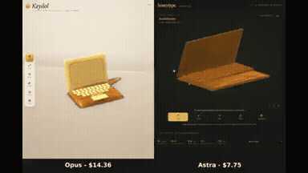
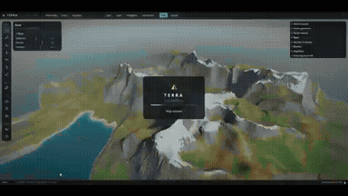
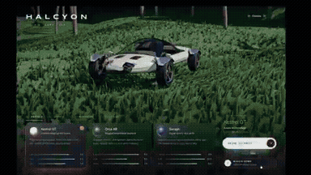
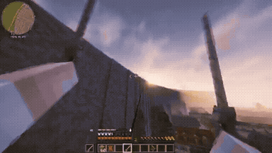
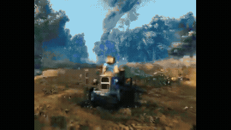

# canvas-interactive

<table>
<tr>
<td width="33%" valign="top">
 
<strong>Interactive Honey Jelly Laptop vs GPT-6 Astra</strong> 
Use: Interactive Honey Jelly Laptop Inputs: User inputs not specified by the author Tools: Tool setup not specified by the source 
<a href="https://x.com/keydol123/status/2108822897561399764">Original post ↗</a> · <a href="../../prompts/2108822897561399764.md">Prompt ↗</a>
</td>
<td width="33%" valign="top">
 
<strong>First-Person 3D Procedural Arms and Dynamic Grip Rigging in Thre…</strong> 
Use: Procedural First-Person Rigging &amp; Three.js Shader Implementation Inputs: Existing Three.js game codebase with item meshes, public arm API facade, and game world environment Tools: MPFB2 / Three.js 
<a href="https://x.com/maxt3chno/status/2108637690698633713">Original post ↗</a> · <a href="../../prompts/2108637690698633713.md">Prompt ↗</a>
</td>
<td width="33%" valign="top">
 
<strong>Interactive 3D Open World Terrain Editor</strong> 
Use: 3D Open World Terrain Editor Inputs: User inputs not specified by the author Tools: Tool setup not specified by the source 
<a href="https://x.com/SimonasLTU1/status/2108818549389115714">Original post ↗</a> · <a href="../../prompts/2108818549389115714.md">Prompt ↗</a>
</td>
</tr>
<tr>
<td width="33%" valign="top">
 
<strong>Autonomous WebGL Flying Car Demo by Claude Code Opus 5.5</strong> 
Use: Interactive 3D WebGL Vehicle Demo Inputs: User inputs not specified by the author Tools: Claude Code / Three.js 
<a href="https://x.com/AakarDesai/status/2108816611344019855">Original post ↗</a> · <a href="../../prompts/2108816611344019855.md">Prompt ↗</a>
</td>
<td width="33%" valign="top">
 
<strong>Attack on Titan ODM Gear in Minecraft</strong> 
Use: Attack on Titan ODM Gear Minecraft Mod Inputs: User inputs not specified by the author Tools: Minecraft 
<a href="https://x.com/Enzoxbt01/status/2108758920915452195">Original post ↗</a> · <a href="../../prompts/2108758920915452195.md">Prompt ↗</a>
</td>
<td width="33%" valign="top">
 
<strong>Interactive 3D Polish Farming Demo with Minecraft Steve</strong> 
Use: Interactive 3D Game Prototype Inputs: User inputs not specified by the author Tools: Tool setup not specified by the source 
<a href="https://x.com/0xZukko/status/2108672416667021489">Original post ↗</a> · <a href="../../prompts/2108672416667021489.md">Prompt ↗</a>
</td>
</tr>
<tr>
<td width="33%" valign="top">
 
<strong>Mario 64 in Elden Ring</strong> 
Use: Mario 64 and Elden Ring Crossover Inputs: User inputs not specified by the author Tools: Tool setup not specified by the source 
<a href="https://x.com/0xDeniAi/status/2108611423421043095">Original post ↗</a> · <a href="../../prompts/2108611423421043095.md">Prompt ↗</a>
</td>
<td width="33%" valign="top">
 
<strong>Retro 2D Zelda Game Built and Played</strong> 
Use: Interactive 2D Retro Game Coded and Autonomously Played by AI Inputs: User inputs not specified by the author Tools: HTML5 Canvas / JavaScript 
<a href="https://x.com/IAenCrudo/status/2108553430708990181">Original post ↗</a> · <a href="../../prompts/2108553430708990181.md">Prompt ↗</a>
</td><td></td>
</tr>
</table>

[All tasks](../../README.md)
