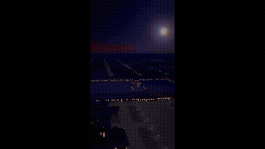
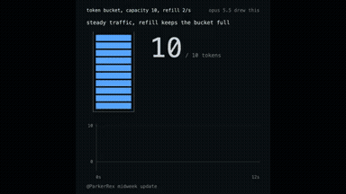

# Explainers

<table>
<tr>
<td width="33%" valign="top">
 
Water-driven Astronomical Clock Tower 
<a href="https://x.com/AndyL5cc/status/2104428313544667245">Original post ↗</a> · <a href="../../prompts/2104428313544667245.md">Prompt ↗</a>
</td>
<td width="33%" valign="top">
 
A history of Hollywood, sculpted from light. 
<a href="https://x.com/abhi81i/status/2104419703997567302">Original post ↗</a> · <a href="../../prompts/2104419703997567302.md">Prompt ↗</a>
</td>
<td width="33%" valign="top">
 
Air microfluidic chip cooling &nbsp; 
<a href="https://x.com/happyanniegh3/status/2104416503164731646">Original post ↗</a> · <a href="../../prompts/2104416503164731646.md">Prompt ↗</a>
</td>
</tr>
<tr>
<td width="33%" valign="top">
 
create a 15-second motion graphics video about Seattle 
<a href="https://x.com/yanliudesign/status/2104393313935839698">Original post ↗</a> · <a href="../../prompts/2104393313935839698.md">Prompt ↗</a>
</td>
<td width="33%" valign="top">
 
1. explains what the repo does and why its useful\n2. shows... 
<a href="https://x.com/deedydas/status/2104391577091407965">Original post ↗</a> · <a href="../../prompts/2104391577091407965.md">Prompt ↗</a>
</td>
<td width="33%" valign="top">
 
make educational video out of article. 
<a href="https://x.com/henkvaness/status/2103801351993975279">Original post ↗</a> · <a href="../../prompts/2103801351993975279.md">Prompt ↗</a>
</td>
</tr>
<tr>
<td width="33%" valign="top">
 
Make a dynamic 40-second motion graphics video on Distilbook... 
<a href="https://x.com/ajith_io/status/2103800569584562538">Original post ↗</a> · <a href="../../prompts/2103800569584562538.md">Prompt ↗</a>
</td>
<td width="33%" valign="top">
 
create best motion graphics explainer of the (your... 
<a href="https://x.com/sudo_kiran/status/2103761658745335993">Original post ↗</a> · <a href="../../prompts/2103761658745335993.md">Prompt ↗</a>
</td>
<td width="33%" valign="top">
 
Make a professional explainer video for anuprerna.com for... 
<a href="https://x.com/AmitSingha89/status/2103737604277780553">Original post ↗</a> · <a href="../../prompts/2103737604277780553.md">Prompt ↗</a>
</td>
</tr>
<tr>
<td width="33%" valign="top">
 
A video explaining recursion, where every explanation... 
<a href="https://x.com/emollick/status/2103688362960019567">Original post ↗</a> · <a href="../../prompts/2103688362960019567.md">Prompt ↗</a>
</td>
<td width="33%" valign="top">
 
Prompt 1: &quot;Do a quick hand-drawn whiteboard... 
<a href="https://x.com/tak3sh8/status/2103667481139441895">Original post ↗</a> · <a href="../../prompts/2103667481139441895.md">Prompt ↗</a>
</td>
<td width="33%" valign="top">
 
make a video highlighting key moments in the history of AI. 
<a href="https://x.com/kloss_xyz/status/2103652674336067876">Original post ↗</a> · <a href="../../prompts/2103652674336067876.md">Prompt ↗</a>
</td>
</tr>
<tr>
<td width="33%" valign="top">
 
I want you to make a 60-second, fully animated explainer... 
<a href="https://x.com/AstroTheWizard/status/2103629247751618782">Original post ↗</a> · <a href="../../prompts/2103629247751618782.md">Prompt ↗</a>
</td>
<td width="33%" valign="top">
 
Make this PayBox logo into a reel. Pretend you are a... 
<a href="https://x.com/0xValure/status/2103603025579331584">Original post ↗</a> · <a href="../../prompts/2103603025579331584.md">Prompt ↗</a>
</td>
<td width="33%" valign="top">
 
Adopt the role of an expert motion designer. Build a... 
<a href="https://x.com/alex_prompter/status/2103499977632997524">Original post ↗</a> · <a href="../../prompts/2103499977632997524.md">Prompt ↗</a>
</td>
</tr>
<tr>
<td width="33%" valign="top">
 
make a dynamic 30-seconds motion graphic video about... 
<a href="https://x.com/sudo_kiran/status/2103486573476254201">Original post ↗</a> · <a href="../../prompts/2103486573476254201.md">Prompt ↗</a>
</td>
<td width="33%" valign="top">
 
&lt;inputs&gt; Ask me for: • my product + URL • 8–12 UI... 
<a href="https://x.com/verbove/status/2103483957266268381">Original post ↗</a> · <a href="../../prompts/2103483957266268381.md">Prompt ↗</a>
</td>
<td width="33%" valign="top">
 
Render a recipe motion graphic animation using JavaScript... 
<a href="https://x.com/Sarut0biSasuke/status/2103418429248069973">Original post ↗</a> · <a href="../../prompts/2103418429248069973.md">Prompt ↗</a>
</td>
</tr>
<tr>
<td width="33%" valign="top">
 
Create a pure javascript animation. 30s-60s whimsical... 
<a href="https://x.com/TomAndrieu96707/status/2103411144899875264">Original post ↗</a> · <a href="../../prompts/2103411144899875264.md">Prompt ↗</a>
</td>
<td width="33%" valign="top">
 
make me an animation to explain why celld earns its place. 
<a href="https://x.com/0xnfrith/status/2103358957050068999">Original post ↗</a> · <a href="../../prompts/2103358957050068999.md">Prompt ↗</a>
</td>
<td width="33%" valign="top">
 
Make a 1-minute educational video about https://t.co/cgU4... 
<a href="https://x.com/1stnoel_/status/2103247530259603851">Original post ↗</a> · <a href="../../prompts/2103247530259603851.md">Prompt ↗</a>
</td>
</tr>
<tr>
<td width="33%" valign="top">
 
Render a fun motion graphic animation using the GSAP... 
<a href="https://x.com/RetropunkAI/status/2103237989065277590">Original post ↗</a> · <a href="../../prompts/2103237989065277590.md">Prompt ↗</a>
</td>
<td width="33%" valign="top">
 
explain a token bucket rate limiter, canvas only, no... 
<a href="https://x.com/ParkerRex/status/2103206747846701462">Original post ↗</a> · <a href="../../prompts/2103206747846701462.md">Prompt ↗</a>
</td>
<td width="33%" valign="top">
 
Build a looping &quot;infinite zoom&quot; animation, After Effects... 
<a href="https://x.com/koldo2k/status/2103129343253778767">Original post ↗</a> · <a href="../../prompts/2103129343253778767.md">Prompt ↗</a>
</td>
</tr>
<tr>
<td width="33%" valign="top">
 
Please make a video for learning the concept of... 
<a href="https://x.com/LinearUncle/status/2103128559174971663">Original post ↗</a> · <a href="../../prompts/2103128559174971663.md">Prompt ↗</a>
</td><td></td><td></td>
</tr>
</table>

[Back to gallery](../../README.md)
