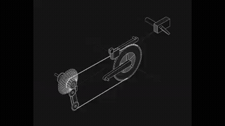
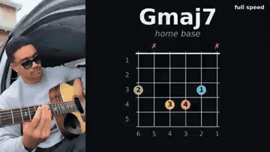
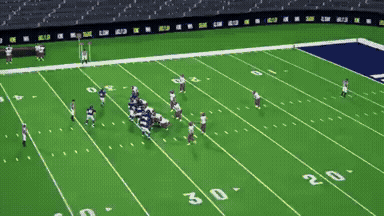
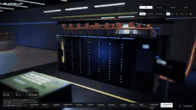
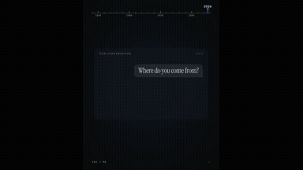
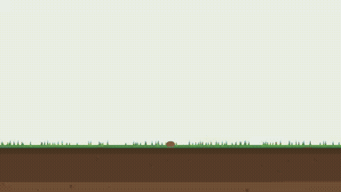
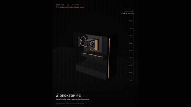
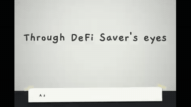

# Explainers & Education

<table>
<tr>
<td width="33%" valign="top">
 
<strong>4-Minute AI History Explainer Video Generated</strong> 
Use: AI History Documentary Explainer Inputs: User instruction requesting an AI history explainer video styled like a standout portfolio piece. Tools: H.264 Video Encoder / HTML + SVG Animation Engine / TTS and Procedural Audio Synthesizer 
<a href="https://x.com/Nuseti5/status/2108506248341856721">Original post ↗</a> · <a href="../../prompts/2108506248341856721.md">Prompt ↗</a>
</td>
<td width="33%" valign="top">
 
<strong>Solar System and Milky Way Explainer</strong> 
Use: Solar System and Milky Way Educational Explainer Inputs: User inputs not specified by the author Tools: edge-tts / ffprobe / Mixkit / Remotion / Three.js 
<a href="https://x.com/Grace_sunnyy/status/2105180179836576206">Original post ↗</a> · <a href="../../prompts/2105180179836576206.md">Prompt ↗</a>
</td>
<td width="33%" valign="top">
 
<strong>中国烟草发展史纪录风格短片</strong> 
Use: 中国烟草简史互动式纪录短片演示 Inputs: User inputs not specified by the author Tools: Tool setup not specified by the source 
<a href="https://x.com/zhishiai6/status/2104939693355995311">Original post ↗</a> · <a href="../../prompts/2104939693355995311.md">Prompt ↗</a>
</td>
</tr>
<tr>
<td width="33%" valign="top">
 
<strong>Computer History Motion Graphics Explainer</strong> 
Use: Computer History Motion Explainer Inputs: User inputs not specified by the author Tools: Claude Opus 5.5 / Jimeng (即梦) 
<a href="https://x.com/TheHappyWang/status/2104931748014702918">Original post ↗</a> · <a href="../../prompts/2104931748014702918.md">Prompt ↗</a>
</td>
<td width="33%" valign="top">
 
<strong>Automated Corporate Explainer Video Generated from Lark Meeting…</strong> 
Use: Corporate Philosophy Explainer Video Inputs: Lark database containing messages, documents, meeting recordings, transcripts, and emails. Tools: Claude Code / Lark 
<a href="https://x.com/NishizawaShimon/status/2104923224614326394">Original post ↗</a> · <a href="../../prompts/2104923224614326394.md">Prompt ↗</a>
</td>
<td width="33%" valign="top">
 
<strong>Educational Motion-Graphics on Recursive AI Agent Limitations</strong> 
Use: Educational motion graphics / AI agents Inputs: User inputs not specified by the author Tools: GPT Image 2.5 on Fal AI 
<a href="https://x.com/M_Adrian2/status/2104542961081983435">Original post ↗</a> · <a href="../../prompts/2104542961081983435.md">Prompt ↗</a>
</td>
</tr>
<tr>
<td width="33%" valign="top">
 
<strong>Opus 5.5 Hand-Drawn P(Doom) Educational Video</strong> 
Use: Claude Opus 5.5 generated a 15-second hand-drawn style animation explaining P(Doom). Inputs: User inputs not specified by the author Tools: Tool setup not specified by the source 
<a href="https://x.com/itnavi2022/status/2104468704490909880">Original post ↗</a> · <a href="../../prompts/2104468704490909880.md">Prompt ↗</a>
</td>
<td width="33%" valign="top">
 
<strong>Claude Opus 5.5 Animated Explanation of Yun Tianming's Three Fai…</strong> 
Use: Educational / explainer video Inputs: User inputs not specified by the author Tools: Tool setup not specified by the source 
<a href="https://x.com/imxishi/status/2104459910247235966">Original post ↗</a> · <a href="../../prompts/2104459910247235966.md">Prompt ↗</a>
</td>
<td width="33%" valign="top">
 
<strong>Negroni Cocktail Explainer Motion Graphic in HTML</strong> 
Use: Cocktail recipe explainer Inputs: Reference cocktail recipe illustration image attached to the prompt Tools: JavaScript 
<a href="https://x.com/Ror_Fly/status/2102853258582880547">Original post ↗</a> · <a href="../../prompts/2102853258582880547.md">Prompt ↗</a>
</td>
</tr>
<tr>
<td width="33%" valign="top">
 
<strong>Animated Explainer on the Bipartisan American Affordability and…</strong> 
Use: BAAJA Energy Permitting Explainer Inputs: User inputs not specified by the author Tools: Tool setup not specified by the source 
<a href="https://x.com/__drewface/status/2108663466383016430">Original post ↗</a> · <a href="../../prompts/2108663466383016430.md">Prompt ↗</a>
</td>
<td width="33%" valign="top">
 
<strong>Explainer for the 2026 Nobel Prize in Literature (Anne Carson)</strong> 
Use: 2026 Nobel Prize in Literature Explainer Inputs: User inputs not specified by the author Tools: Kokoro-82M / Scott Buckley Music 
<a href="https://x.com/moreisdifferent/status/2108563710260170985">Original post ↗</a> · <a href="../../prompts/2108563710260170985.md">Prompt ↗</a>
</td>
<td width="33%" valign="top">
 
<strong>Simulating the Moon Crashing into Earth</strong> 
Use: Orbital collision physics explainer Inputs: User inputs not specified by the author Tools: Tool setup not specified by the source 
<a href="https://x.com/ottollm/status/2108517404712325592">Original post ↗</a> · <a href="../../prompts/2108517404712325592.md">Prompt ↗</a>
</td>
</tr>
<tr>
<td width="33%" valign="top">
 
<strong>GenLayer ELI5 Motion Design Explainer</strong> 
Use: GenLayer Explainer Animation Inputs: User inputs not specified by the author Tools: Tool setup not specified by the source 
<a href="https://x.com/RahilBuilds/status/2108505330066092060">Original post ↗</a> · <a href="../../prompts/2108505330066092060.md">Prompt ↗</a>
</td>
<td width="33%" valign="top">
 
<strong>Bike Gears Explainer 3D Wireframe Animation</strong> 
Use: Bike Gears Mechanism 3D Explainer Inputs: User inputs not specified by the author Tools: Claude Artifacts 
<a href="https://x.com/harshitsatija/status/2108410208708169910">Original post ↗</a> · <a href="../../prompts/2108410208708169910.md">Prompt ↗</a>
</td>
<td width="33%" valign="top">
 
<strong>Automated Guitar Chord Visualization from Video Reel</strong> 
Use: Synchronized Guitar Chord Explainer Video Inputs: User inputs not specified by the author Tools: Tool setup not specified by the source 
<a href="https://x.com/keikumata/status/2108329031892713883">Original post ↗</a> · <a href="../../prompts/2108329031892713883.md">Prompt ↗</a>
</td>
</tr>
<tr>
<td width="33%" valign="top">
 
<strong>MTMC Multi-Camera Tracking Explainer Animation</strong> 
Use: Multi-Camera Tracking Technical Explainer Inputs: Markdown document explaining multi-camera tracking logic Tools: Tool setup not specified by the source 
<a href="https://x.com/Xterbase/status/2108161031243759993">Original post ↗</a> · <a href="../../prompts/2108161031243759993.md">Prompt ↗</a>
</td>
<td width="33%" valign="top">
 
<strong>Sweeply CLI Launch Explainer Video</strong> 
Use: CLI Tool Launch Explainer Inputs: Sweeply open-source project repository containing project context and functionality Tools: /brag 
<a href="https://x.com/ElforaDev/status/2105188480817230124">Original post ↗</a> · <a href="../../prompts/2105188480817230124.md">Prompt ↗</a>
</td>
<td width="33%" valign="top">
 
<strong>First &amp; 10 Yellow Line Explainer Video</strong> 
Use: First &amp; 10 System Explainer Inputs: User inputs not specified by the author Tools: Tool setup not specified by the source 
<a href="https://x.com/blueoctopusai/status/2105116391439270222">Original post ↗</a> · <a href="../../prompts/2105116391439270222.md">Prompt ↗</a>
</td>
</tr>
<tr>
<td width="33%" valign="top">
 
<strong>Note Article to Explainer Video via Claude Code and HyperFrames</strong> 
Use: An author generated a 95-second structured explainer video from a blog post using Claude Opus 5.5 via Claude Code, orchestrating the script, voiceover, subtitles, and HTML-based animation in HyperFrames. Inputs: User inputs not specified by the author Tools: Tool setup not specified by the source 
<a href="https://x.com/koumei_ai5566/status/2105077598934241383">Original post ↗</a> · <a href="../../prompts/2105077598934241383.md">Prompt ↗</a>
</td>
<td width="33%" valign="top">
 
<strong>Agentic Neocloud Business Explainer Video via Claude Code and Op…</strong> 
Use: Neocloud business explainer Inputs: CoreWeave Form 10-K fiscal year 2025 report data, model.py, and assumptions.yaml referenced in video footers Tools: Claude Code / ElevenLabs / ffmpeg / Gemini 3.8 TTS / Manim / Hyperframes / Motion Canvas / OpenRouter API / OpenTimelineIO 
<a href="https://x.com/deedydas/status/2104957026199900220">Original post ↗</a> · <a href="../../prompts/2104957026199900220.md">Prompt ↗</a>
</td>
<td width="33%" valign="top">
 
<strong>Claude 发展史动态解说视频</strong> 
Use: Claude Evolution History Explainer Inputs: User inputs not specified by the author Tools: Tool setup not specified by the source 
<a href="https://x.com/LawrenceW_Zen/status/2104934916505108662">Original post ↗</a> · <a href="../../prompts/2104934916505108662.md">Prompt ↗</a>
</td>
</tr>
<tr>
<td width="33%" valign="top">
 
<strong>Interactive 3D AI Data Center Explainer in WebGL</strong> 
Use: Interactive 3D Data Center Explainer Inputs: User inputs not specified by the author Tools: JavaScript / WebGL 
<a href="https://x.com/konstantinsaifo/status/2104895018683044262">Original post ↗</a> · <a href="../../prompts/2104895018683044262.md">Prompt ↗</a>
</td>
<td width="33%" valign="top">
 
<strong>Explainer Animation on AI Chat vs Agents Generated</strong> 
Use: AI Concepts Explainer Animation Inputs: Two panda character illustration assets; Explainer video script covering the difference between AI chat and agent Tools: Claude Code 
<a href="https://x.com/Fuyutopandasan/status/2104893606679253047">Original post ↗</a> · <a href="../../prompts/2104893606679253047.md">Prompt ↗</a>
</td>
<td width="33%" valign="top">
 
<strong>Kling 4.0 Flash Review Animated Explainer Video</strong> 
Use: AI Model Review Explainer Animation Inputs: Author's headphone-wearing mascot avatar used across slides Tools: Notion AI 
<a href="https://x.com/nbykos/status/2104880176580731165">Original post ↗</a> · <a href="../../prompts/2104880176580731165.md">Prompt ↗</a>
</td>
</tr>
<tr>
<td width="33%" valign="top">
 
<strong>Claude Opus 5.5 Update Explainer Video</strong> 
Use: Claude Opus 5.5 Update Explainer Animation Inputs: User inputs not specified by the author Tools: Tool setup not specified by the source 
<a href="https://x.com/mira_ai_base/status/2104872812674793697">Original post ↗</a> · <a href="../../prompts/2104872812674793697.md">Prompt ↗</a>
</td>
<td width="33%" valign="top">
 
<strong>PostgreSQL Animated Explainer with Mascot Animation</strong> 
Use: PostgreSQL Architecture and History Explainer Inputs: User inputs not specified by the author Tools: Tool setup not specified by the source 
<a href="https://x.com/kokaneka/status/2104843907594875185">Original post ↗</a> · <a href="../../prompts/2104843907594875185.md">Prompt ↗</a>
</td>
<td width="33%" valign="top">
 
<strong>Opus 5.5 Motion Graphics: Chronicle of Two</strong> 
Use: The author prompted Claude Opus 5.5 with high reasoning level to inspect memory and generate a motion graphics animation recounting their shared history, titled 'A story of the moon &amp; a little star'. Inputs: User inputs not specified by the author Tools: Tool setup not specified by the source 
<a href="https://x.com/monya_for_io/status/2104554735382778328">Original post ↗</a> · <a href="../../prompts/2104554735382778328.md">Prompt ↗</a>
</td>
</tr>
<tr>
<td width="33%" valign="top">
 
<strong>History of Space Exploration Animated Video</strong> 
Use: Video covering space exploration milestones generated via code and audio written by Claude Opus 5.5. Inputs: User inputs not specified by the author Tools: Tool setup not specified by the source 
<a href="https://x.com/0xSarthak/status/2104543926644564036">Original post ↗</a> · <a href="../../prompts/2104543926644564036.md">Prompt ↗</a>
</td>
<td width="33%" valign="top">
 
<strong>History of Internet Money Code Animation</strong> 
Use: Cryptocatguru showcases an animated timeline video covering the history of internet money from 1989 to present, stating that Claude Opus 5.5 generated the animation by writing code to draw each frame. Inputs: User inputs not specified by the author Tools: Tool setup not specified by the source 
<a href="https://x.com/cryptocatguru/status/2104525804604645802">Original post ↗</a> · <a href="../../prompts/2104525804604645802.md">Prompt ↗</a>
</td>
<td width="33%" valign="top">
 
<strong>Opus 5.5 制作《星际穿越里的真物理》黑洞篇动效科普视频</strong> 
Use: 作者展示使用 Claude Opus 5.5 基于单句主题「《星际穿越里的真物理》——黑洞篇」生成的科学动效解说视频，呈现了卡冈图雅黑洞、引力透镜、时间膨胀与事件视界望远镜对比等复杂视觉与双语字幕。 Inputs: User inputs not specified by the author Tools: Tool setup not specified by the source 
<a href="https://x.com/AndyL5cc/status/2104519528873103773">Original post ↗</a> · <a href="../../prompts/2104519528873103773.md">Prompt ↗</a>
</td>
</tr>
<tr>
<td width="33%" valign="top">
 
<strong>History of Machine Communications Motion Graphic Video</strong> 
Use: Claude Opus 5.5 was prompted to create a motion graphic video about the history of technology, resulting in animated kinetic typography and timeline visuals illustrating humanity's first transmitted messages. Inputs: User inputs not specified by the author Tools: Tool setup not specified by the source 
<a href="https://x.com/egemntoprak/status/2104506459530866869">Original post ↗</a> · <a href="../../prompts/2104506459530866869.md">Prompt ↗</a>
</td>
<td width="33%" valign="top">
 
<strong>India's Got Latent Explainer Breakdown</strong> 
Use: Ratnaksh Tyagi shares an animated motion graphics explainer breaking down the comedy talent show 'India's Got Latent', attributing the generation task to Opus 5.5. Inputs: User inputs not specified by the author Tools: Tool setup not specified by the source 
<a href="https://x.com/ratnakshtyagi27/status/2104474644279697754">Original post ↗</a> · <a href="../../prompts/2104474644279697754.md">Prompt ↗</a>
</td>
<td width="33%" valign="top">
 
<strong>Remotion Search History 15s Timeline Animation</strong> 
Use: Author used Claude Opus 5.5 to write Remotion code generating a 15-second motion graphics timeline depicting the history of search from 1996 to 2015 with neon numbers and SVG illustrations. Inputs: User inputs not specified by the author Tools: Tool setup not specified by the source 
<a href="https://x.com/rpa_dake/status/2104466394859593915">Original post ↗</a> · <a href="../../prompts/2104466394859593915.md">Prompt ↗</a>
</td>
</tr>
<tr>
<td width="33%" valign="top">
 
<strong>Opus 5.5 制作《水运仪象台》科普三维解构视频</strong> 
Use: 作者测试使用 Opus 5.5 输入简短提示制作关于北宋「水运仪象台」的 3D 解构与原理解析科普视频，视频包含机械结构拆解、擒纵机构运转展示及配音字幕。 Inputs: User inputs not specified by the author Tools: Tool setup not specified by the source 
<a href="https://x.com/AndyL5cc/status/2104428313544667245">Original post ↗</a> · <a href="../../prompts/2104428313544667245.md">Prompt ↗</a>
</td>
<td width="33%" valign="top">
 
<strong>Persistence of Vision: A History of Hollywood in Code</strong> 
Use: An animated short film tracing the history of cinema rendered from light and volumetric particle motes, created via code with Claude Opus 5.5 and narrated by ElevenLabs. Inputs: Historical film references including The Horse in Motion, The Black Maria, and others. Tools: Tool setup not specified by the source 
<a href="https://x.com/abhi81i/status/2104419703997567302">Original post ↗</a> · <a href="../../prompts/2104419703997567302.md">Prompt ↗</a>
</td>
<td width="33%" valign="top">
 
<strong>空气微流控芯片散热原理解析视频制作</strong> 
Use: 作者展示了由 Claude Opus 5.5 制作的关于 JouleForce 空气微流控/微通道芯片散热原理的科普动态图解视频，涵盖牛顿冷却定律、边界层效应、微通道压阻与工况对比等科学动画。 Inputs: User inputs not specified by the author Tools: Tool setup not specified by the source 
<a href="https://x.com/happyanniegh3/status/2104416503164731646">Original post ↗</a> · <a href="../../prompts/2104416503164731646.md">Prompt ↗</a>
</td>
</tr>
<tr>
<td width="33%" valign="top">
 
<strong>SQLite Explainer Animation and Architectural Walkthrough</strong> 
Use: Deedy shares a 7-minute technical explainer animation analyzing SQLite's codebase structure, query lifecycle, and join-order execution, generated with Claude Opus 5.5 and Gemini TTS. Inputs: User inputs not specified by the author Tools: Tool setup not specified by the source 
<a href="https://x.com/deedydas/status/2104391577091407965">Original post ↗</a> · <a href="../../prompts/2104391577091407965.md">Prompt ↗</a>
</td>
<td width="33%" valign="top">
 
<strong>Coding Agent Explainer Video</strong> 
Use: Arthur Katcher shares a 40-second motion-graphics explainer video on how coding agents work, generated in a single prompt using Claude Code (Opus 5.5) with Remotion and a NumPy audio synthesizer. Inputs: User inputs not specified by the author Tools: Tool setup not specified by the source 
<a href="https://x.com/arthurkatcher/status/2104198927549604161">Original post ↗</a> · <a href="../../prompts/2104198927549604161.md">Prompt ↗</a>
</td>
<td width="33%" valign="top">
 
<strong>Tree as an Ecosystem Animation</strong> 
Use: An animated video explaining the concept of a tree as an ecosystem, generated using a simple one-liner prompt in Opus 5.5. Inputs: User inputs not specified by the author Tools: Tool setup not specified by the source 
<a href="https://x.com/hunzai/status/2103904436141842605">Original post ↗</a> · <a href="../../prompts/2103904436141842605.md">Prompt ↗</a>
</td>
</tr>
<tr>
<td width="33%" valign="top">
 
<strong>Earth to Observable Universe Zoom-Out</strong> 
Use: Krzysztof Gonia prompted Opus 5.5 to generate a Three.js cinematic film that smoothly zooms out from an Earth hillside all the way to the observable universe without external assets. Inputs: No external assets required by the prompt Tools: Tool setup not specified by the source 
<a href="https://x.com/kgonia7/status/2103835848575746268">Original post ↗</a> · <a href="../../prompts/2103835848575746268.md">Prompt ↗</a>
</td>
<td width="33%" valign="top">
 
<strong>3D Desk to CPU Atom Zoom</strong> 
Use: A continuous 3D browser-rendered motion graphic zooming in from a desk all the way down to a single silicon atom inside a CPU, created with Claude Opus 5.5. Inputs: User inputs not specified by the author Tools: Tool setup not specified by the source 
<a href="https://x.com/Acoramaa/status/2103833991879053577">Original post ↗</a> · <a href="../../prompts/2103833991879053577.md">Prompt ↗</a>
</td>
<td width="33%" valign="top">
 
<strong>Mechanical Keyboard Explainer</strong> 
Use: Educational / explainer video Inputs: User inputs not specified by the author Tools: Tool setup not specified by the source 
<a href="https://x.com/iniyanai/status/2103814603100856596">Original post ↗</a> · <a href="../../prompts/2103814603100856596.md">Prompt ↗</a>
</td>
</tr>
<tr>
<td width="33%" valign="top">
 
<strong>Educational Video from Article</strong> 
Use: Educational / explainer video Inputs: User inputs not specified by the author Tools: Tool setup not specified by the source 
<a href="https://x.com/henkvaness/status/2103801351993975279">Original post ↗</a> · <a href="../../prompts/2103801351993975279.md">Prompt ↗</a>
</td>
<td width="33%" valign="top">
 
<strong>Anuprerna Explainer Video</strong> 
Use: Educational / explainer video Inputs: User inputs not specified by the author Tools: Tool setup not specified by the source 
<a href="https://x.com/AmitSingha89/status/2103737604277780553">Original post ↗</a> · <a href="../../prompts/2103737604277780553.md">Prompt ↗</a>
</td>
<td width="33%" valign="top">
 
<strong>Recursion Explanation Video</strong> 
Use: Recursion explainer Inputs: User inputs not specified by the author Tools: Tool setup not specified by the source 
<a href="https://x.com/emollick/status/2103688362960019567">Original post ↗</a> · <a href="../../prompts/2103688362960019567.md">Prompt ↗</a>
</td>
</tr>
<tr>
<td width="33%" valign="top">
 
<strong>Japan Summer Weather Visualization</strong> 
Use: Weather data visualization / Japan summer Inputs: User inputs not specified by the author Tools: JavaScript 
<a href="https://x.com/GroundControl/status/2103678647777230877">Original post ↗</a> · <a href="../../prompts/2103678647777230877.md">Prompt ↗</a>
</td>
<td width="33%" valign="top">
 
<strong>Replica Symmetry Breaking Whiteboard Animation</strong> 
Use: Educational / explainer video Inputs: User inputs not specified by the author Tools: Tool setup not specified by the source 
<a href="https://x.com/tak3sh8/status/2103667481139441895">Original post ↗</a> · <a href="../../prompts/2103667481139441895.md">Prompt ↗</a>
</td>
<td width="33%" valign="top">
 
<strong>AI History Video</strong> 
Use: A prompt given to Claude Opus 5.5 to create an animated video illustrating key moments in artificial intelligence history. Inputs: User inputs not specified by the author Tools: Tool setup not specified by the source 
<a href="https://x.com/kloss_xyz/status/2103652674336067876">Original post ↗</a> · <a href="../../prompts/2103652674336067876.md">Prompt ↗</a>
</td>
</tr>
<tr>
<td width="33%" valign="top">
 
<strong>Photon Journey Explainer Animation</strong> 
Use: Science explainer / photon journey Inputs: User inputs not specified by the author Tools: JavaScript 
<a href="https://x.com/AstroTheWizard/status/2103629247751618782">Original post ↗</a> · <a href="../../prompts/2103629247751618782.md">Prompt ↗</a>
</td>
<td width="33%" valign="top">
 
<strong>PayBox Logo Motion Design Reel</strong> 
Use: A prompt provided to Opus 5.5 to transform a PayBox logo into a dynamic 10-second motion design reel. Inputs: User inputs not specified by the author Tools: Tool setup not specified by the source 
<a href="https://x.com/0xValure/status/2103603025579331584">Original post ↗</a> · <a href="../../prompts/2103603025579331584.md">Prompt ↗</a>
</td>
<td width="33%" valign="top">
 
<strong>Autonomous JavaScript Explainer Animation</strong> 
Use: A prompt directing Opus to autonomously generate a whimsical hand-drawn JavaScript animation and audio explainer for the Headroom desktop app. Inputs: User inputs not specified by the author Tools: JavaScript 
<a href="https://x.com/garmdotcom/status/2103516101518987439">Original post ↗</a> · <a href="../../prompts/2103516101518987439.md">Prompt ↗</a>
</td>
</tr>
<tr>
<td width="33%" valign="top">
 
<strong>Animated Explainer Motion Designer</strong> 
Use: Educational / explainer video Inputs: User inputs not specified by the author Tools: Tool setup not specified by the source 
<a href="https://x.com/alex_prompter/status/2103499977632997524">Original post ↗</a> · <a href="../../prompts/2103499977632997524.md">Prompt ↗</a>
</td>
<td width="33%" valign="top">
 
<strong>Code-Based Product Motion Design</strong> 
Use: A structured prompt detailing rules, motion mechanics, and export specifications for generating a single-canvas, deterministic HTML/code-based product demo animation. Inputs: Ask me for: 
• my product + URL 
• 8–12 UI states that tell its story 
• the real data shown in each state 
• brand colors + fonts + accent color 
• required formats (1:1, 16:9, 9:16) Tools: Tool setup not specified by the source 
<a href="https://x.com/verbove/status/2103483957266268381">Original post ↗</a> · <a href="../../prompts/2103483957266268381.md">Prompt ↗</a>
</td>
<td width="33%" valign="top">
 
<strong>White Russian Recipe Motion Graphic</strong> 
Use: Educational / explainer video Inputs: User inputs not specified by the author Tools: JavaScript 
<a href="https://x.com/Sarut0biSasuke/status/2103418429248069973">Original post ↗</a> · <a href="../../prompts/2103418429248069973.md">Prompt ↗</a>
</td>
</tr>
<tr>
<td width="33%" valign="top">
 
<strong>JavaScript About Us Page Animation</strong> 
Use: Tom Andrieu shares an Opus 5.5 prompt used to generate a 30 to 60-second pure JavaScript animation in a whimsical hand-drawn collage style based on an 'about-us' page. Inputs: User inputs not specified by the author Tools: JavaScript 
<a href="https://x.com/TomAndrieu96707/status/2103411144899875264">Original post ↗</a> · <a href="../../prompts/2103411144899875264.md">Prompt ↗</a>
</td>
<td width="33%" valign="top">
 
<strong>Celld Explanation Animation</strong> 
Use: Nick Frith shares an animation generated using Opus 5.5 with a prompt asking for an explanation of why celld earns its place. Inputs: User inputs not specified by the author Tools: Tool setup not specified by the source 
<a href="https://x.com/0xnfrith/status/2103358957050068999">Original post ↗</a> · <a href="../../prompts/2103358957050068999.md">Prompt ↗</a>
</td>
<td width="33%" valign="top">
 
<strong>Educational Video Prompt for Sotto App</strong> 
Use: Educational / explainer video Inputs: User inputs not specified by the author Tools: Tool setup not specified by the source 
<a href="https://x.com/1stnoel_/status/2103247530259603851">Original post ↗</a> · <a href="../../prompts/2103247530259603851.md">Prompt ↗</a>
</td>
</tr>
<tr>
<td width="33%" valign="top">
 
<strong>The Sphere History GSAP Motion Graphic</strong> 
Use: Educational / explainer video Inputs: User inputs not specified by the author Tools: GSAP ScrollTrigger 
<a href="https://x.com/RetropunkAI/status/2103237989065277590">Original post ↗</a> · <a href="../../prompts/2103237989065277590.md">Prompt ↗</a>
</td>
<td width="33%" valign="top">
 
<strong>Token Bucket Rate Limiter Animation</strong> 
Use: Parker Rex shares an animated diagram of a token bucket rate limiter created with an AI prompt utilizing HTML5 canvas without external libraries. Inputs: User inputs not specified by the author Tools: Tool setup not specified by the source 
<a href="https://x.com/ParkerRex/status/2103206747846701462">Original post ↗</a> · <a href="../../prompts/2103206747846701462.md">Prompt ↗</a>
</td>
<td width="33%" valign="top">
 
<strong>Manim Derivative Concept Educational Video</strong> 
Use: Derivative concept lesson Inputs: User inputs not specified by the author Tools: edge-tts / Manim 
<a href="https://x.com/LinearUncle/status/2103128559174971663">Original post ↗</a> · <a href="../../prompts/2103128559174971663.md">Prompt ↗</a>
</td>
</tr>
<tr>
<td width="33%" valign="top">
 
<strong>Stop-Motion DeFi Saver Animation</strong> 
Use: Educational / explainer video Inputs: User inputs not specified by the author Tools: Tool setup not specified by the source 
<a href="https://x.com/_nikolajankovic/status/2102867033100616097">Original post ↗</a> · <a href="../../prompts/2102867033100616097.md">Prompt ↗</a>
</td>
<td width="33%" valign="top">
 
<strong>Datagran Explainer Video</strong> 
Use: A prompt requesting an AI model to generate a modern, punchy explainer video showcasing Datagran's end-to-end autonomous growth loop. Inputs: User inputs not specified by the author Tools: Tool setup not specified by the source 
<a href="https://x.com/charlesmendez/status/2102847039415476517">Original post ↗</a> · <a href="../../prompts/2102847039415476517.md">Prompt ↗</a>
</td><td></td>
</tr>
</table>

[Back to gallery](../../README.md)
