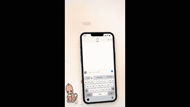

# Games & interactive

<table>
<tr>
<td width="33%" valign="top">
 
can you make a 3d game where you walk around and spot... 
<a href="https://x.com/MandelDuck/status/2103802923465768972">Original post ↗</a> · <a href="../../prompts/2103802923465768972.md">Prompt ↗</a>
</td>
<td width="33%" valign="top">
 
We're going to try a little test. Do you think you could... 
<a href="https://x.com/Ror_Fly/status/2102853258582880547">Original post ↗</a> · <a href="../../prompts/2102853258582880547.md">Prompt ↗</a>
</td>
<td width="33%" valign="top">
 
Creating fire ball spell animation 
<a href="https://x.com/VibeCode_SahilM/status/2104452405144535314">Original post ↗</a> · <a href="../../prompts/2104452405144535314.md">Prompt ↗</a>
</td>
</tr>
<tr>
<td width="33%" valign="top">
 
Introduce what kind of videos you can make 
<a href="https://x.com/kokoro_886/status/2104441050211475528">Original post ↗</a> · <a href="../../prompts/2104441050211475528.md">Prompt ↗</a>
</td>
<td width="33%" valign="top">
 
explain camera focus visually &nbsp; 
<a href="https://x.com/rdominguezibar/status/2104436377546818041">Original post ↗</a> · <a href="../../prompts/2104436377546818041.md">Prompt ↗</a>
</td>
<td width="33%" valign="top">
 
A hyperrealistic landslide escape game. 
<a href="https://x.com/RAJKATAJJ/status/2104434742959755463">Original post ↗</a> · <a href="../../prompts/2104434742959755463.md">Prompt ↗</a>
</td>
</tr>
<tr>
<td width="33%" valign="top">
 
an explodable interactive twin-turbo V12 engine 
<a href="https://x.com/ImperiumMentisX/status/2104421343429312968">Original post ↗</a> · <a href="../../prompts/2104421343429312968.md">Prompt ↗</a>
</td>
<td width="33%" valign="top">
 
A code-rendered generative music video project,... 
<a href="https://x.com/weiwei2018831/status/2104420680142082118">Original post ↗</a> · <a href="../../prompts/2104420680142082118.md">Prompt ↗</a>
</td>
<td width="33%" valign="top">
 
I created a game with Opus 5.5 made entirely out of... 
<a href="https://x.com/tiagochilanti/status/2104407040135164032">Original post ↗</a> · <a href="../../prompts/2104407040135164032.md">Prompt ↗</a>
</td>
</tr>
<tr>
<td width="33%" valign="top">
 
Write a flight simulator &nbsp; 
<a href="https://x.com/ekcheungAI/status/2104406088862810533">Original post ↗</a> · <a href="../../prompts/2104406088862810533.md">Prompt ↗</a>
</td>
<td width="33%" valign="top">
 
create the glitter sticker effect 
<a href="https://x.com/ann_nnng/status/2104159923886244176">Original post ↗</a> · <a href="../../prompts/2104159923886244176.md">Prompt ↗</a>
</td>
<td width="33%" valign="top">
 
explain how a rocket engine works by building an... 
<a href="https://x.com/konstantinsaifo/status/2104094723887501736">Original post ↗</a> · <a href="../../prompts/2104094723887501736.md">Prompt ↗</a>
</td>
</tr>
<tr>
<td width="33%" valign="top">
 
Create a studio level motion design ad for my app... 
<a href="https://x.com/redpersongpt/status/2103807094554284430">Original post ↗</a> · <a href="../../prompts/2103807094554284430.md">Prompt ↗</a>
</td>
<td width="33%" valign="top">
 
A 3D multiplayer game where the players are a squad of... 
<a href="https://x.com/0xChuckstock/status/2103804606794879327">Original post ↗</a> · <a href="../../prompts/2103804606794879327.md">Prompt ↗</a>
</td>
<td width="33%" valign="top">
 
PRD — Police Chase Arcade Game Working title: Heatwave... 
<a href="https://x.com/froessell/status/2103789415323562325">Original post ↗</a> · <a href="../../prompts/2103789415323562325.md">Prompt ↗</a>
</td>
</tr>
<tr>
<td width="33%" valign="top">
 
Create a 1-on-1 card game like Hearthstone. Just make it.... 
<a href="https://x.com/aisongman/status/2103763192971461057">Original post ↗</a> · <a href="../../prompts/2103763192971461057.md">Prompt ↗</a>
</td>
<td width="33%" valign="top">
 
Make a 45–50 second vertical video for my app: a glance... 
<a href="https://x.com/Bilimfili1/status/2103743617848459762">Original post ↗</a> · <a href="../../prompts/2103743617848459762.md">Prompt ↗</a>
</td>
<td width="33%" valign="top">
 
I want multiplayer game, with proximity chat, with... 
<a href="https://x.com/Ved_CJ/status/2103708392930066575">Original post ↗</a> · <a href="../../prompts/2103708392930066575.md">Prompt ↗</a>
</td>
</tr>
<tr>
<td width="33%" valign="top">
 
Build a MapleStory clone in Raylib-cs. 
<a href="https://x.com/NoLit64/status/2103628970000347627">Original post ↗</a> · <a href="../../prompts/2103628970000347627.md">Prompt ↗</a>
</td>
<td width="33%" valign="top">
 
Make a game like Romance of the Three Kingdoms III with a... 
<a href="https://x.com/opener_ai/status/2103437714695843891">Original post ↗</a> · <a href="../../prompts/2103437714695843891.md">Prompt ↗</a>
</td>
<td width="33%" valign="top">
 
Create a cinematic browser-based 3D world that... 
<a href="https://x.com/LexnLin/status/2103194052850241739">Original post ↗</a> · <a href="../../prompts/2103194052850241739.md">Prompt ↗</a>
</td>
</tr>
<tr>
<td width="33%" valign="top">
 
I would like you to create a kickass, impressive 1990s... 
<a href="https://x.com/gandamu_ml/status/2102919394775220530">Original post ↗</a> · <a href="../../prompts/2102919394775220530.md">Prompt ↗</a>
</td><td></td><td></td>
</tr>
</table>

[Back to gallery](../../README.md)
