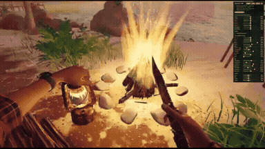
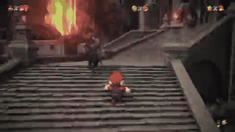
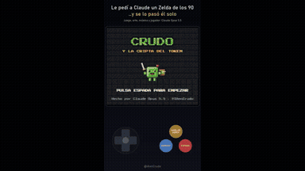

# Games & Interactive Experiences

<table>
<tr>
<td width="33%" valign="top">
 
<strong>First-Person 3D Procedural Arms and Dynamic Grip Rigging in Thre…</strong> 
Use: Procedural First-Person Rigging &amp; Three.js Shader Implementation Inputs: Existing Three.js game codebase with item meshes, public arm API facade, and game world environment Tools: MPFB2 / Three.js 
<a href="https://x.com/maxt3chno/status/2108637690698633713">Original post ↗</a> · <a href="../../prompts/2108637690698633713.md">Prompt ↗</a>
</td>
<td width="33%" valign="top">
 
<strong>Mario 64 in Elden Ring</strong> 
Use: Mario 64 and Elden Ring Crossover Inputs: User inputs not specified by the author Tools: Tool setup not specified by the source 
<a href="https://x.com/0xDeniAi/status/2108611423421043095">Original post ↗</a> · <a href="../../prompts/2108611423421043095.md">Prompt ↗</a>
</td>
<td width="33%" valign="top">
 
<strong>Retro 2D Zelda Game Built and Played</strong> 
Use: Interactive 2D Retro Game Coded and Autonomously Played by AI Inputs: User inputs not specified by the author Tools: HTML5 Canvas / JavaScript 
<a href="https://x.com/IAenCrudo/status/2108553430708990181">Original post ↗</a> · <a href="../../prompts/2108553430708990181.md">Prompt ↗</a>
</td>
</tr>
</table>

[Back to gallery](../../README.md)
