# Motion Graphics & Typography

<table>
<tr>
<td width="33%" valign="top">
 
<strong>Visual Representation of Claude Opus 5.5</strong> 
Use: AI Architecture Visual Interpretation Inputs: User inputs not specified by the author Tools: Tool setup not specified by the source 
<a href="https://x.com/mikenevermiss/status/2108788464909218140">Original post ↗</a> · <a href="../../prompts/2108788464909218140.md">Prompt ↗</a>
</td>
<td width="33%" valign="top">
<a href="../../prompts/2108569413746335887.md">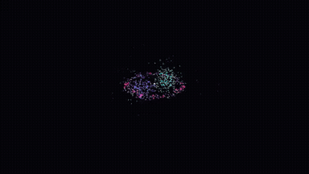</a> 
<strong>Quantum Mechanics Motion Graphic Flash Video</strong> 
Use: Quantum Mechanics Motion Graphic Inputs: User inputs not specified by the author Tools: Tool setup not specified by the source 
<a href="https://x.com/YuanXi901019/status/2108569413746335887">Original post ↗</a> · <a href="../../prompts/2108569413746335887.md">Prompt ↗</a>
</td>
<td width="33%" valign="top">
 
<strong>Bragly Review Widgets Teaser Video</strong> 
Use: Product Feature Teaser Inputs: Product feature landing page for asset extraction; Product knowledge provided to the model Tools: Claude Opus 5.5 
<a href="https://x.com/UtsavChopra30/status/2108478302625071205">Original post ↗</a> · <a href="../../prompts/2108478302625071205.md">Prompt ↗</a>
</td>
</tr>
<tr>
<td width="33%" valign="top">
<a href="../../prompts/2108418928397500487.md">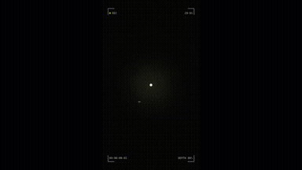</a> 
<strong>Claude Opus 5.5 Motion Graphics Dream Sequence</strong> 
Use: Dynamic Motion Graphics with Sound Design and Pixel Art Inputs: User inputs not specified by the author Tools: Tool setup not specified by the source 
<a href="https://x.com/arsbond_/status/2108418928397500487">Original post ↗</a> · <a href="../../prompts/2108418928397500487.md">Prompt ↗</a>
</td>
<td width="33%" valign="top">
<a href="../../prompts/2108300297487413491.md">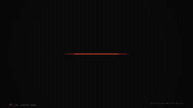</a> 
<strong>Dynamic 15-Second Motion Design Showreel</strong> 
Use: Motion Design Showreel Inputs: User inputs not specified by the author Tools: DuskCut 
<a href="https://x.com/pascal_gha83332/status/2108300297487413491">Original post ↗</a> · <a href="../../prompts/2108300297487413491.md">Prompt ↗</a>
</td>
<td width="33%" valign="top">
<a href="../../prompts/2108196827036054007.md">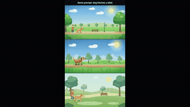</a> 
<strong>Dog Fetching Stick Animation Comparison</strong> 
Use: 2D Dog Fetch Animation Inputs: User inputs not specified by the author Tools: HyperFrames 
<a href="https://x.com/sebmoska/status/2108196827036054007">Original post ↗</a> · <a href="../../prompts/2108196827036054007.md">Prompt ↗</a>
</td>
</tr>
<tr>
<td width="33%" valign="top">
<a href="../../prompts/2108184711206257149.md">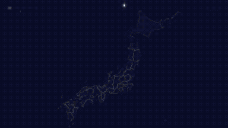</a> 
<strong>Saitama Prefecture Motion Graphics Showreel</strong> 
Use: Prefecture Infographic Showreel Inputs: User inputs not specified by the author Tools: Tool setup not specified by the source 
<a href="https://x.com/papaneco_life/status/2108184711206257149">Original post ↗</a> · <a href="../../prompts/2108184711206257149.md">Prompt ↗</a>
</td>
<td width="33%" valign="top">
<a href="../../prompts/2105208251956830625.md">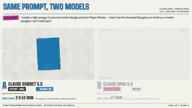</a> 
<strong>Paper Planes Motion Design Showreel Comparison</strong> 
Use: Paper Planes Motion Design Showreel Inputs: User inputs not specified by the author Tools: Claude Code 
<a href="https://x.com/_sslinNn/status/2105208251956830625">Original post ↗</a> · <a href="../../prompts/2105208251956830625.md">Prompt ↗</a>
</td>
<td width="33%" valign="top">
 
<strong>VibeCodingList 15-Second Motion Graphics Showreel</strong> 
Use: Motion Graphics Showreel Inputs: Base code repository and animation framework used to generate the video programmatically Tools: Tool setup not specified by the source 
<a href="https://x.com/josefandre_/status/2105177028911837538">Original post ↗</a> · <a href="../../prompts/2105177028911837538.md">Prompt ↗</a>
</td>
</tr>
<tr>
<td width="33%" valign="top">
<a href="../../prompts/2105152377057886343.md">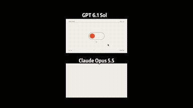</a> 
<strong>Studio Motion-Design Reel Comparison</strong> 
Use: Studio Motion-Design Reel Inputs: User inputs not specified by the author Tools: Tool setup not specified by the source 
<a href="https://x.com/threeaus/status/2105152377057886343">Original post ↗</a> · <a href="../../prompts/2105152377057886343.md">Prompt ↗</a>
</td>
<td width="33%" valign="top">
 
<strong>Beat-Synced Action Video Editing</strong> 
Use: Beat-Synced Action Video Editing Inputs: User inputs not specified by the author Tools: Claude Opus 5.5 
<a href="https://x.com/kray_ai/status/2105145374541484257">Original post ↗</a> · <a href="../../prompts/2105145374541484257.md">Prompt ↗</a>
</td>
<td width="33%" valign="top">
 
<strong>Carvuk 30-Second Motion Graphics Explainer</strong> 
Use: Product Explainer Motion Graphics Inputs: User inputs not specified by the author Tools: Tool setup not specified by the source 
<a href="https://x.com/nicovegam/status/2105064666904813711">Original post ↗</a> · <a href="../../prompts/2105064666904813711.md">Prompt ↗</a>
</td>
</tr>
<tr>
<td width="33%" valign="top">
 
<strong>Claude Opus 5.5 Code-Generated 30s Motion Graphics Meme Video</strong> 
Use: Atomic Blast Meme Motion Graphic Video Inputs: User inputs not specified by the author Tools: Code-based Video Renderer 
<a href="https://x.com/wangyaominde/status/2104992103428141286">Original post ↗</a> · <a href="../../prompts/2104992103428141286.md">Prompt ↗</a>
</td>
<td width="33%" valign="top">
<a href="../../prompts/2104981908241486064.md">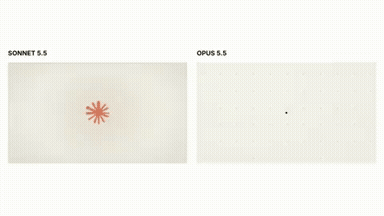</a> 
<strong>Claude Opus 5.5 Self-Visualization Motion Design</strong> 
Use: AI Self-Representation Motion Design Inputs: User inputs not specified by the author Tools: Tool setup not specified by the source 
<a href="https://x.com/motion_so/status/2104981908241486064">Original post ↗</a> · <a href="../../prompts/2104981908241486064.md">Prompt ↗</a>
</td>
<td width="33%" valign="top">
 
<strong>Opus 5.5 Motion Designer Showreel</strong> 
Use: Motion Design Portfolio Showreel Inputs: User inputs not specified by the author Tools: FFmpeg / Playwright / Tone.js 
<a href="https://x.com/Ai9app/status/2104912803786375645">Original post ↗</a> · <a href="../../prompts/2104912803786375645.md">Prompt ↗</a>
</td>
</tr>
<tr>
<td width="33%" valign="top">
 
<strong>Opus 5.5 30-Second Motion Designer Portfolio Reel</strong> 
Use: Motion Graphics Showreel Inputs: User inputs not specified by the author Tools: Tool setup not specified by the source 
<a href="https://x.com/MirrortekUK/status/2104903820639633895">Original post ↗</a> · <a href="../../prompts/2104903820639633895.md">Prompt ↗</a>
</td>
<td width="33%" valign="top">
 
<strong>Claude Opus 5.5 Motion Graphics Showreel</strong> 
Use: Motion Graphics Showreel Inputs: User inputs not specified by the author Tools: Tool setup not specified by the source 
<a href="https://x.com/dzairio_/status/2104884772518478061">Original post ↗</a> · <a href="../../prompts/2104884772518478061.md">Prompt ↗</a>
</td>
<td width="33%" valign="top">
<a href="../../prompts/2104827314400026936.md">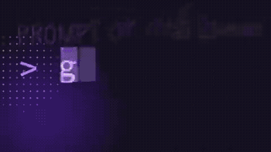</a> 
<strong>fal API Showreel Motion Graphics Video</strong> 
Use: fal Motion Design Showreel Inputs: User inputs not specified by the author Tools: fal API 
<a href="https://x.com/influencer_seo/status/2104827314400026936">Original post ↗</a> · <a href="../../prompts/2104827314400026936.md">Prompt ↗</a>
</td>
</tr>
<tr>
<td width="33%" valign="top">
 
<strong>30-Second Motion Designer Resume Showreel Comparison</strong> 
Use: Motion Graphics Showreel Inputs: User inputs not specified by the author Tools: Tool setup not specified by the source 
<a href="https://x.com/coolbat1999/status/2104827072283849181">Original post ↗</a> · <a href="../../prompts/2104827072283849181.md">Prompt ↗</a>
</td>
<td width="33%" valign="top">
 
<strong>Futuristic Little Red Riding Hood with AI Bots</strong> 
Use: Futuristic Animated Fairy Tale Inputs: User inputs not specified by the author Tools: Tool setup not specified by the source 
<a href="https://x.com/stagerbn/status/2104564078954107374">Original post ↗</a> · <a href="../../prompts/2104564078954107374.md">Prompt ↗</a>
</td>
<td width="33%" valign="top">
 
<strong>Dynamic 15-Second Motion Graphics Showreel by Opus 5.5</strong> 
Use: Motion graphics / showreel Inputs: User inputs not specified by the author Tools: Tool setup not specified by the source 
<a href="https://x.com/RaphaelAubryy/status/2104541641226977654">Original post ↗</a> · <a href="../../prompts/2104541641226977654.md">Prompt ↗</a>
</td>
</tr>
<tr>
<td width="33%" valign="top">
 
<strong>Claude Opus 5.5 Motion Designer Showreel</strong> 
Use: 15-second motion design showreel Inputs: User inputs not specified by the author Tools: Tool setup not specified by the source 
<a href="https://x.com/just_adev/status/2104541344945627171">Original post ↗</a> · <a href="../../prompts/2104541344945627171.md">Prompt ↗</a>
</td>
<td width="33%" valign="top">
 
<strong>Opus 5.5 Pokobot Motion Graphic Video</strong> 
Use: Motion graphics / showreel Inputs: User inputs not specified by the author Tools: Tool setup not specified by the source 
<a href="https://x.com/sudhanshusoni__/status/2104525366224412962">Original post ↗</a> · <a href="../../prompts/2104525366224412962.md">Prompt ↗</a>
</td>
<td width="33%" valign="top">
 
<strong>Industrial Hub 30-Second Motion Graphics Video</strong> 
Use: Motion graphics / showreel Inputs: User inputs not specified by the author Tools: Tool setup not specified by the source 
<a href="https://x.com/s7trimm/status/2104524606841217044">Original post ↗</a> · <a href="../../prompts/2104524606841217044.md">Prompt ↗</a>
</td>
</tr>
<tr>
<td width="33%" valign="top">
 
<strong>Math Motion Graphics Showreel</strong> 
Use: Motion graphics / showreel Inputs: User inputs not specified by the author Tools: Tool setup not specified by the source 
<a href="https://x.com/Math_files/status/2104486181853610052">Original post ↗</a> · <a href="../../prompts/2104486181853610052.md">Prompt ↗</a>
</td>
<td width="33%" valign="top">
 
<strong>Ultracode Animation Movie Shoot with Opus 5.5 Dynamic Workflows</strong> 
Use: Dan McAteer prompts Claude Opus 5.5 via Claude Code Dynamic Workflows and Ultracode to orchestrate an animated movie shoot about developer usage efficiency, complete with Python-generated audio and 2D character animation. Inputs: User inputs not specified by the author Tools: Tool setup not specified by the source 
<a href="https://x.com/daniel_mac8/status/2103824976713306214">Original post ↗</a> · <a href="../../prompts/2103824976713306214.md">Prompt ↗</a>
</td>
<td width="33%" valign="top">
 
<strong>Claude Motion Designer 15-Second Showreel</strong> 
Use: Motion graphics / showreel Inputs: User inputs not specified by the author Tools: Tool setup not specified by the source 
<a href="https://x.com/leonabboud/status/2103576084499358051">Original post ↗</a> · <a href="../../prompts/2103576084499358051.md">Prompt ↗</a>
</td>
</tr>
<tr>
<td width="33%" valign="top">
 
<strong>Opus 5.5 Motion Designer Showreel</strong> 
Use: Motion graphics / showreel Inputs: User inputs not specified by the author Tools: Tool setup not specified by the source 
<a href="https://x.com/himanshutwtxs/status/2103495232637882858">Original post ↗</a> · <a href="../../prompts/2103495232637882858.md">Prompt ↗</a>
</td>
<td width="33%" valign="top">
 
<strong>Motion Designer Résumé Showreel and Remotion</strong> 
Use: 15-second motion design showreel Inputs: No supplied assets specified; agent chooses production details Tools: Remotion 
<a href="https://x.com/ajith_io/status/2103449416325890146">Original post ↗</a> · <a href="../../prompts/2103449416325890146.md">Prompt ↗</a>
</td>
<td width="33%" valign="top">
 
<strong>Pixel Art Chuseok Greeting Animation</strong> 
Use: Chuseok Pixel Art Greeting Animation Inputs: User inputs not specified by the author Tools: Tool setup not specified by the source 
<a href="https://x.com/hoyoyoda/status/2103400046922543147">Original post ↗</a> · <a href="../../prompts/2103400046922543147.md">Prompt ↗</a>
</td>
</tr>
<tr>
<td width="33%" valign="top">
<a href="../../prompts/2102501547062239317.md">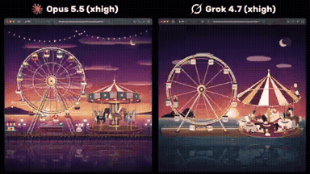</a> 
<strong>Animated Seaside Amusement Park with Ferris Wheel and Carousel</strong> 
Use: Seaside Amusement Park Animation Inputs: User inputs not specified by the author Tools: Tool setup not specified by the source 
<a href="https://x.com/lucian__03/status/2102501547062239317">Original post ↗</a> · <a href="../../prompts/2102501547062239317.md">Prompt ↗</a>
</td>
<td width="33%" valign="top">
<a href="../../prompts/2108802612669891048.md">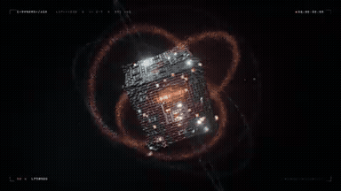</a> 
<strong>Opus 5.5 Self-Introduction Motion Graphics Video</strong> 
Use: Self-introduction Motion Graphics Inputs: User inputs not specified by the author Tools: Tool setup not specified by the source 
<a href="https://x.com/olezhavich/status/2108802612669891048">Original post ↗</a> · <a href="../../prompts/2108802612669891048.md">Prompt ↗</a>
</td>
<td width="33%" valign="top">
<a href="../../prompts/2108758475606229025.md">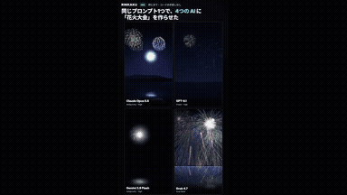</a> 
<strong>Fireworks Festival Comparison in HTML/Canvas</strong> 
Use: Fireworks Display Animation Inputs: User inputs not specified by the author Tools: HTML5 Canvas 2D 
<a href="https://x.com/KEI_Ediforce/status/2108758475606229025">Original post ↗</a> · <a href="../../prompts/2108758475606229025.md">Prompt ↗</a>
</td>
</tr>
<tr>
<td width="33%" valign="top">
<a href="../../prompts/2108678886426824980.md">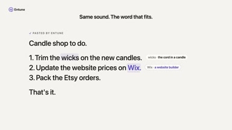</a> 
<strong>Entune Launch Video with BRAG and Opus 5.5</strong> 
Use: Software Launch Video Inputs: Entune application codebase Tools: BRAG 
<a href="https://x.com/eandualem/status/2108678886426824980">Original post ↗</a> · <a href="../../prompts/2108678886426824980.md">Prompt ↗</a>
</td>
<td width="33%" valign="top">
<a href="../../prompts/2108596616756416945.md">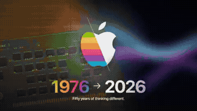</a> 
<strong>Apple 50-Year Evolution Motion Graphics</strong> 
Use: Brand History Motion Graphics Inputs: User inputs not specified by the author Tools: Tool setup not specified by the source 
<a href="https://x.com/aiRobertDaily/status/2108596616756416945">Original post ↗</a> · <a href="../../prompts/2108596616756416945.md">Prompt ↗</a>
</td>
<td width="33%" valign="top">
 
<strong>Opus 5.5 60-Second Attention-Grabbing Procedural Showcase</strong> 
Use: 60-Second Dynamic Procedural Animation Inputs: User inputs not specified by the author Tools: HTML5 Canvas / WebGL &amp; Web Audio API 
<a href="https://x.com/SimonasLTU1/status/2108584669859955083">Original post ↗</a> · <a href="../../prompts/2108584669859955083.md">Prompt ↗</a>
</td>
</tr>
<tr>
<td width="33%" valign="top">
<a href="../../prompts/2108563779046813910.md">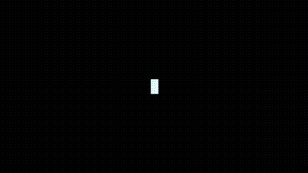</a> 
<strong>AI Capabilities Motion Graphics Video</strong> 
Use: AI Capabilities Showcase Inputs: User inputs not specified by the author Tools: Tool setup not specified by the source 
<a href="https://x.com/xiaofengai2023/status/2108563779046813910">Original post ↗</a> · <a href="../../prompts/2108563779046813910.md">Prompt ↗</a>
</td>
<td width="33%" valign="top">
 
<strong>Kokopelli's Space Journey Animation</strong> 
Use: Kokopelli Space Flight Inputs: User inputs not specified by the author Tools: Tool setup not specified by the source 
<a href="https://x.com/KimikoA97936/status/2108555077933822275">Original post ↗</a> · <a href="../../prompts/2108555077933822275.md">Prompt ↗</a>
</td>
<td width="33%" valign="top">
<a href="../../prompts/2108550192882503797.md">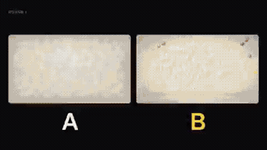</a> 
<strong>Opus 5.5 vs Sonnet 5.5 Motion Graphics Comparison</strong> 
Use: Opus 5.5 vs Sonnet 5.5 Motion Graphics Benchmark Inputs: User inputs not specified by the author Tools: Tool setup not specified by the source 
<a href="https://x.com/mmmarcus_ai/status/2108550192882503797">Original post ↗</a> · <a href="../../prompts/2108550192882503797.md">Prompt ↗</a>
</td>
</tr>
<tr>
<td width="33%" valign="top">
 
<strong>Code-Based Anime Video Assembly and Post-Processing</strong> 
Use: Programmatic Video Assembly Inputs: User inputs not specified by the author Tools: Code-based editing pipeline / Seedance 2.5 
<a href="https://x.com/neco1751662/status/2108361488130023466">Original post ↗</a> · <a href="../../prompts/2108361488130023466.md">Prompt ↗</a>
</td>
<td width="33%" valign="top">
 
<strong>Anime Cold Open: Westworld x Cowboy Bebop x Blade Runner 2049</strong> 
Use: Anime Cold Open Generation Inputs: User inputs not specified by the author Tools: NVIDIA RTX 4090 
<a href="https://x.com/gpbulkin/status/2108242769844310331">Original post ↗</a> · <a href="../../prompts/2108242769844310331.md">Prompt ↗</a>
</td>
<td width="33%" valign="top">
<a href="../../prompts/2108228989063991575.md">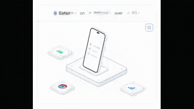</a> 
<strong>Isometric Environment Verification Animation</strong> 
Use: Isometric Environment Verification Component Inputs: User inputs not specified by the author Tools: Tool setup not specified by the source 
<a href="https://x.com/itsnotryan/status/2108228989063991575">Original post ↗</a> · <a href="../../prompts/2108228989063991575.md">Prompt ↗</a>
</td>
</tr>
<tr>
<td width="33%" valign="top">
 
<strong>Visualization of What Happens When We Die</strong> 
Use: Cycle of Life Particle Metaphor Inputs: User inputs not specified by the author Tools: Claude Code / HTML Animation 
<a href="https://x.com/twoclipping/status/2106216524465729626">Original post ↗</a> · <a href="../../prompts/2106216524465729626.md">Prompt ↗</a>
</td>
<td width="33%" valign="top">
 
<strong>Automated Profile Self-Introduction Motion Graphics</strong> 
Use: Self-Introduction Motion Graphics Inputs: User inputs not specified by the author Tools: Tool setup not specified by the source 
<a href="https://x.com/bonjinika3/status/2105158224307740811">Original post ↗</a> · <a href="../../prompts/2105158224307740811.md">Prompt ↗</a>
</td>
<td width="33%" valign="top">
<a href="../../prompts/2105148214622175250.md">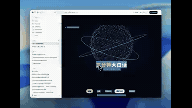</a> 
<strong>Three.js 3D Particle Sphere Title Animation</strong> 
Use: 3D Particle Sphere Title Animation Inputs: User inputs not specified by the author Tools: Three.js 
<a href="https://x.com/cheery9998/status/2105148214622175250">Original post ↗</a> · <a href="../../prompts/2105148214622175250.md">Prompt ↗</a>
</td>
</tr>
<tr>
<td width="33%" valign="top">
 
<strong>Claude Opus 5.5 Motion Graphics Resume Showreel</strong> 
Use: Executive Motion Graphics Resume Showreel Inputs: Biographical data, executive titles, milestones, and mission statement at KOBIRA referenced by '私の情報を踏まえて' Tools: Tool setup not specified by the source 
<a href="https://x.com/ryoheiikeda/status/2105136634492809280">Original post ↗</a> · <a href="../../prompts/2105136634492809280.md">Prompt ↗</a>
</td>
<td width="33%" valign="top">
 
<strong>Autonomous 14-Minute Documentary on Elon Musk Directed and Cut</strong> 
Use: An agentic video production project where Claude Opus 5.5 was prompted with a high-level creative brief to produce a documentary film using archival footage, AI-synthesized narration, classical scoring, and programmatic editing via FFmpeg and Python. Inputs: Voice timbre WAV reference and emotion audio clips for TTS transfer Tools: Tool setup not specified by the source 
<a href="https://x.com/Michaelzsguo/status/2105105890936233985">Original post ↗</a> · <a href="../../prompts/2105105890936233985.md">Prompt ↗</a>
</td>
<td width="33%" valign="top">
 
<strong>Autonomous Projection Mapping Animation with Opus 5.5</strong> 
Use: The author connected Claude Opus 5.5 with a camera and projector to auto-calibrate and project a custom animation onto a physical shelf containing three candles and a white pot. Inputs: User inputs not specified by the author Tools: Tool setup not specified by the source 
<a href="https://x.com/antipdoom/status/2105102530049175928">Original post ↗</a> · <a href="../../prompts/2105102530049175928.md">Prompt ↗</a>
</td>
</tr>
<tr>
<td width="33%" valign="top">
<a href="../../prompts/2105034298483220849.md">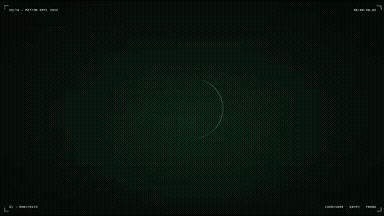</a> 
<strong>GOLT App Dynamic Motion Graphics Showreel</strong> 
Use: Product Motion Graphics Showreel Inputs: Product and branding context for GOLT (recycling app, workflow, UI mockups, metrics) Tools: Tool setup not specified by the source 
<a href="https://x.com/greco_dev/status/2105034298483220849">Original post ↗</a> · <a href="../../prompts/2105034298483220849.md">Prompt ↗</a>
</td>
<td width="33%" valign="top">
<a href="../../prompts/2104940371038109764.md">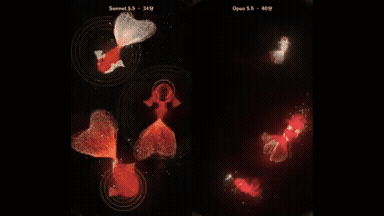</a> 
<strong>Generative Goldfish in Black Lacquer Bowl with Sound</strong> 
Use: Generative Lacquer Bowl Goldfish Animation Inputs: Rendered screenshots of the webpage shared with the model across 6 iterative feedback rounds; Instruction requesting procedural audio change from acid bass to koto and water sounds Tools: HTML5 / Web Audio API 
<a href="https://x.com/mizugame_22/status/2104940371038109764">Original post ↗</a> · <a href="../../prompts/2104940371038109764.md">Prompt ↗</a>
</td>
<td width="33%" valign="top">
 
<strong>Opus 5.5 纯代码生成40秒动态视觉短片</strong> 
Use: 代码生成动态图形视觉短片 Inputs: 作者提示词中提及的参考视频链接 Tools: Tool setup not specified by the source 
<a href="https://x.com/AndyL5cc/status/2104850150749532431">Original post ↗</a> · <a href="../../prompts/2104850150749532431.md">Prompt ↗</a>
</td>
</tr>
<tr>
<td width="33%" valign="top">
<a href="../../prompts/2104832372164444162.md">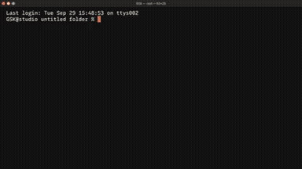</a> 
<strong>Code-Based Motion Graphics and Audio Synthesis</strong> 
Use: Creative Coding Motion Graphics &amp; Synth Inputs: User inputs not specified by the author Tools: Claude Code CLI / Grok Imagine API / TypeScript 
<a href="https://x.com/__gsk__/status/2104832372164444162">Original post ↗</a> · <a href="../../prompts/2104832372164444162.md">Prompt ↗</a>
</td>
<td width="33%" valign="top">
<a href="../../prompts/2104818940467945542.md">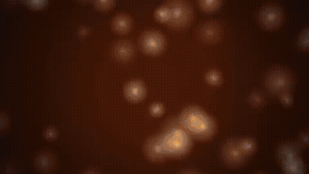</a> 
<strong>Photon Journey Remotion Animation</strong> 
Use: Photon Journey Remotion Animation Inputs: User inputs not specified by the author Tools: Node.js / Remotion 
<a href="https://x.com/apoorvjain25/status/2104818940467945542">Original post ↗</a> · <a href="../../prompts/2104818940467945542.md">Prompt ↗</a>
</td>
<td width="33%" valign="top">
 
<strong>Claude Opus 5.5 Feature Concept Animations</strong> 
Use: The author shares iterative video animations generated by Claude Opus 5.5 under low effort settings to convey the capabilities and appeal of Claude Opus 5.5. Inputs: User inputs not specified by the author Tools: Tool setup not specified by the source 
<a href="https://x.com/cherusi3/status/2104560611095187772">Original post ↗</a> · <a href="../../prompts/2104560611095187772.md">Prompt ↗</a>
</td>
</tr>
<tr>
<td width="33%" valign="top">
 
<strong>Vaporwave Motion Graphics Generated with Opus 5.5 for After Effe…</strong> 
Use: The author used Claude Opus 5.5 with a casual vaporwave prompt to generate layered animation data that was imported into After Effects with layer structures preserved. Inputs: User inputs not specified by the author Tools: Tool setup not specified by the source 
<a href="https://x.com/moaizo01012525/status/2104544365901459579">Original post ↗</a> · <a href="../../prompts/2104544365901459579.md">Prompt ↗</a>
</td>
<td width="33%" valign="top">
 
<strong>Claude Opus 5.5 App Motion Design Showcase</strong> 
Use: Mishka used Claude Opus 5.5 to generate a TikTok/Reels-formatted motion design video showcasing an app called KOPIO from its source code and UI components. Inputs: User inputs not specified by the author Tools: Tool setup not specified by the source 
<a href="https://x.com/Mishka_yan/status/2104531023144849496">Original post ↗</a> · <a href="../../prompts/2104531023144849496.md">Prompt ↗</a>
</td>
<td width="33%" valign="top">
 
<strong>Halo Health App Concept Animation</strong> 
Use: Claude Opus 5.5 is prompted to design a health and fitness mobile app concept called 'halo' and animate it into a polished 17-second product presentation video. Inputs: User inputs not specified by the author Tools: Tool setup not specified by the source 
<a href="https://x.com/buildwithgautam/status/2104522362402267138">Original post ↗</a> · <a href="../../prompts/2104522362402267138.md">Prompt ↗</a>
</td>
</tr>
<tr>
<td width="33%" valign="top">
 
<strong>Opus 5.5 AI Threat Movie Supercut Mashup</strong> 
Use: Claude Opus 5.5 acted as an agent to source, select, and edit movie clips into a rhythmic AI-threat supercut synchronized to a reference soundtrack. Inputs: Reference mashup video by creator 'Fanta' used for pacing style and soundtrack. Tools: Tool setup not specified by the source 
<a href="https://x.com/threeaus/status/2104512100844613836">Original post ↗</a> · <a href="../../prompts/2104512100844613836.md">Prompt ↗</a>
</td>
<td width="33%" valign="top">
 
<strong>Claude Opus 5.5 自画像映像『窓のない部屋』</strong> 
Use: Claude Opus 5.5がコードを生成し、映像と音楽の両方を自律制作した1分21秒の自画像映像作品。 Inputs: User inputs not specified by the author Tools: Tool setup not specified by the source 
<a href="https://x.com/July4Chi/status/2104510125298090331">Original post ↗</a> · <a href="../../prompts/2104510125298090331.md">Prompt ↗</a>
</td>
<td width="33%" valign="top">
 
<strong>Side-by-Side Motion Graphics Benchmark: Opus 5.5 vs GPT-6 Astra…</strong> 
Use: Charlie Hills tests Claude Opus 5.5 alongside Astra and Fable on a motion graphics task with an open-ended directive, presenting a side-by-side comparison video of four synchronized animation scenes. Inputs: User inputs not specified by the author Tools: Tool setup not specified by the source 
<a href="https://x.com/charliejhills/status/2104500966389399716">Original post ↗</a> · <a href="../../prompts/2104500966389399716.md">Prompt ↗</a>
</td>
</tr>
<tr>
<td width="33%" valign="top">
 
<strong>Opus 5.5 驱动全自动 AI 威胁论电影混剪视频制作</strong> 
Use: 作者向 Claude Opus 5.5 提供参考混剪样本并要求以 AI 威胁论为主题，由 Opus 5.5 自主选题、检索下载影视台词片段、卡点配乐并生成字幕，完成全流程视频混剪制作。 Inputs: User inputs not specified by the author Tools: Tool setup not specified by the source 
<a href="https://x.com/threeaus/status/2104499446872457243">Original post ↗</a> · <a href="../../prompts/2104499446872457243.md">Prompt ↗</a>
</td>
<td width="33%" valign="top">
 
<strong>Portfolio Teaser Motion Graphics Video</strong> 
Use: Pawan Kumar shared a vertical portfolio teaser video showcasing software engineering projects and metrics, created using Claude Opus 5.5. Inputs: User inputs not specified by the author Tools: Tool setup not specified by the source 
<a href="https://x.com/pksingh1508/status/2104493973339570288">Original post ↗</a> · <a href="../../prompts/2104493973339570288.md">Prompt ↗</a>
</td>
<td width="33%" valign="top">
 
<strong>Drooling Cat Motion Graphic Animation with Opus 5.5</strong> 
Use: The author shares a dynamic 2D motion graphic animation featuring a drooling cat, generated after prompting Opus 5.5 to create an illustration and animation. Inputs: User inputs not specified by the author Tools: Tool setup not specified by the source 
<a href="https://x.com/zanki00000/status/2104484761238671402">Original post ↗</a> · <a href="../../prompts/2104484761238671402.md">Prompt ↗</a>
</td>
</tr>
<tr>
<td width="33%" valign="top">
 
<strong>Dynamic 15-second motion graphics referral video</strong> 
Use: Motion graphics / showreel Inputs: User inputs not specified by the author Tools: Tool setup not specified by the source 
<a href="https://x.com/paulo_kombucha/status/2104481235028283883">Original post ↗</a> · <a href="../../prompts/2104481235028283883.md">Prompt ↗</a>
</td>
<td width="33%" valign="top">
 
<strong>Looping Hillside Town SVG/CSS Animation with Opus 5.5</strong> 
Use: Sundry Mill tests Claude Opus 5.5 to generate a single-file looping HTML, inline SVG, and CSS animation of a hillside town transitioning from sunrise to night. Inputs: User inputs not specified by the author Tools: Tool setup not specified by the source 
<a href="https://x.com/SundryMill/status/2104474025674326065">Original post ↗</a> · <a href="../../prompts/2104474025674326065.md">Prompt ↗</a>
</td>
<td width="33%" valign="top">
 
<strong>Dynamic App Update Motion Graphics with Opus 5.5</strong> 
Use: Motion graphics / showreel Inputs: User inputs not specified by the author Tools: Tool setup not specified by the source 
<a href="https://x.com/thilina_a/status/2104455320424915273">Original post ↗</a> · <a href="../../prompts/2104455320424915273.md">Prompt ↗</a>
</td>
</tr>
<tr>
<td width="33%" valign="top">
 
<strong>Opus 5.5 Product Demo Show Reel Generation</strong> 
Use: Vikash Sharma demonstrates using Claude Opus 5.5 in a code editor with project codebase access to generate a complete motion graphics product demo reel for The Talent App from a single prompt and reference. Inputs: Visual or video reference pointed to by the user Tools: Tool setup not specified by the source 
<a href="https://x.com/VikashSparxIT/status/2104453496363999462">Original post ↗</a> · <a href="../../prompts/2104453496363999462.md">Prompt ↗</a>
</td>
<td width="33%" valign="top">
 
<strong>Claude Opus 5.5 Shader-Based Atomic Bomb Animation</strong> 
Use: The author demonstrates an animation generated via shaders and code written by Claude Opus 5.5 based on the concept of slouching in a chair and witnessing an atomic bomb explosion. Inputs: User inputs not specified by the author Tools: Tool setup not specified by the source 
<a href="https://x.com/esrhengwu/status/2104448788790477239">Original post ↗</a> · <a href="../../prompts/2104448788790477239.md">Prompt ↗</a>
</td>
<td width="33%" valign="top">
 
<strong>Resume Motion Showreel Generated</strong> 
Use: Motion graphics / showreel Inputs: User inputs not specified by the author Tools: Tool setup not specified by the source 
<a href="https://x.com/Sayan_shanky/status/2104424421641314396">Original post ↗</a> · <a href="../../prompts/2104424421641314396.md">Prompt ↗</a>
</td>
</tr>
<tr>
<td width="33%" valign="top">
 
<strong>Programmatic 2D Animated English Learning Video via Opus 5.5 Code</strong> 
Use: Author uses Claude Opus 5.5 to write code for generating consistent 2D vector-style animated English learning videos with character graphics, motion, and lip-sync handled programmatically. Inputs: User inputs not specified by the author Tools: Tool setup not specified by the source 
<a href="https://x.com/bangbuilds/status/2104418374218600719">Original post ↗</a> · <a href="../../prompts/2104418374218600719.md">Prompt ↗</a>
</td>
<td width="33%" valign="top">
 
<strong>Animated Book Preview for Winning With AI</strong> 
Use: Author prompts Claude Opus 5.5 to create an animated motion-graphics preview for the book 'Winning With AI', discussing how Opus 5.5 creates code-driven animations (HTML/SVG/GSAP) rather than natively rendering pixels. Inputs: User inputs not specified by the author Tools: Tool setup not specified by the source 
<a href="https://x.com/anujmagazine/status/2104413797876367664">Original post ↗</a> · <a href="../../prompts/2104413797876367664.md">Prompt ↗</a>
</td>
<td width="33%" valign="top">
 
<strong>Autonomous Animated Short Production Attempt</strong> 
Use: Zach Harrison documents an experiment using Claude Opus 5.5 via Claude Console as an autonomous coding agent instructed to create, refine, and render an animated short video entirely in code. Inputs: User inputs not specified by the author Tools: Tool setup not specified by the source 
<a href="https://x.com/Zach__Harrison/status/2104413549896614066">Original post ↗</a> · <a href="../../prompts/2104413549896614066.md">Prompt ↗</a>
</td>
</tr>
<tr>
<td width="33%" valign="top">
 
<strong>AI Portfolio Showreel Edited with Opus 5.5</strong> 
Use: Eric Zheng used Claude Opus 5.5 to direct and edit a one-minute personal showreel from his existing production footage by having Opus generate the editing workflow as code. Inputs: User inputs not specified by the author Tools: Tool setup not specified by the source 
<a href="https://x.com/EZheng66099/status/2104410457263976899">Original post ↗</a> · <a href="../../prompts/2104410457263976899.md">Prompt ↗</a>
</td>
<td width="33%" valign="top">
 
<strong>全自動ポン出しコントアニメ「おばけ屋敷のおばけが、怖がらせる前に全部説明してくるやつ」</strong> 
Use: Claude Opus 5.5を活用し、シナリオ・イラスト・アニメーション・音声まで一括指定して制作された2分2秒の短編コントアニメーション動画。 Inputs: User inputs not specified by the author Tools: Tool setup not specified by the source 
<a href="https://x.com/cryptoninjanime/status/2104409268351062188">Original post ↗</a> · <a href="../../prompts/2104409268351062188.md">Prompt ↗</a>
</td>
<td width="33%" valign="top">
 
<strong>Spoken Word Video: All Watched Over by Machines of Loving Grace</strong> 
Use: Bret Kerr shares a psychedelic motion graphics spoken-word animated video for Richard Brautigan's poem 'All Watched Over by Machines of Loving Grace', created using Claude Opus 5.5. Inputs: User inputs not specified by the author Tools: Tool setup not specified by the source 
<a href="https://x.com/BretKerr/status/2104408032792990102">Original post ↗</a> · <a href="../../prompts/2104408032792990102.md">Prompt ↗</a>
</td>
</tr>
<tr>
<td width="33%" valign="top">
 
<strong>防犯ダンス(翠都銀行)の動画制作とエフェクト付与</strong> 
Use: M7［mi7］AI氏がAZ8プラットフォーム上でSeedance 2.5 OpusとOpus 5.5を連携させ、銀行強盗対策の『防犯ダンス』動画にタイポグラフィやエフェクトを付与して制作した事例。 Inputs: User inputs not specified by the author Tools: Tool setup not specified by the source 
<a href="https://x.com/mi7_crypto/status/2104403368752071059">Original post ↗</a> · <a href="../../prompts/2104403368752071059.md">Prompt ↗</a>
</td>
<td width="33%" valign="top">
 
<strong>Seattle History Motion Graphics Video</strong> 
Use: Motion graphics / showreel Inputs: User inputs not specified by the author Tools: Tool setup not specified by the source 
<a href="https://x.com/yanliudesign/status/2104393313935839698">Original post ↗</a> · <a href="../../prompts/2104393313935839698.md">Prompt ↗</a>
</td>
<td width="33%" valign="top">
 
<strong>Bedless Fajr App Motion Graphics Showreel via Remotion</strong> 
Use: Motion graphics / showreel Inputs: User inputs not specified by the author Tools: Tool setup not specified by the source 
<a href="https://x.com/zakisbuilding/status/2104389736647495680">Original post ↗</a> · <a href="../../prompts/2104389736647495680.md">Prompt ↗</a>
</td>
</tr>
<tr>
<td width="33%" valign="top">
 
<strong>Opus 5.5 Future of Human-AI Relationship Animation</strong> 
Use: Leo showcases an animated short film exploring the collaborative future between humans and artificial intelligence, created using Claude Opus 5.5. Inputs: User inputs not specified by the author Tools: Tool setup not specified by the source 
<a href="https://x.com/lzequin/status/2104213206629572779">Original post ↗</a> · <a href="../../prompts/2104213206629572779.md">Prompt ↗</a>
</td>
<td width="33%" valign="top">
 
<strong>15-Second Claude Opus 5.5 Motion Design Showcase</strong> 
Use: Motion graphics / showreel Inputs: User inputs not specified by the author Tools: Tool setup not specified by the source 
<a href="https://x.com/nansdeyz_/status/2104204905523126560">Original post ↗</a> · <a href="../../prompts/2104204905523126560.md">Prompt ↗</a>
</td>
<td width="33%" valign="top">
 
<strong>Chaindotwtf Pitch Video</strong> 
Use: A concise prompt used with Opus 5.5 to generate a 30-second brand pitch video. Inputs: User inputs not specified by the author Tools: Tool setup not specified by the source 
<a href="https://x.com/SPEARwtf/status/2103857153308029058">Original post ↗</a> · <a href="../../prompts/2103857153308029058.md">Prompt ↗</a>
</td>
</tr>
<tr>
<td width="33%" valign="top">
 
<strong>Remotion Video Generation with Opus 5.5</strong> 
Use: Dany shares a presentation video generated with Opus 5.5 for Brieform using a simple prompt. Inputs: User inputs not specified by the author Tools: Tool setup not specified by the source 
<a href="https://x.com/MajorBaguette/status/2103849602826834228">Original post ↗</a> · <a href="../../prompts/2103849602826834228.md">Prompt ↗</a>
</td>
<td width="33%" valign="top">
 
<strong>Motion Design Showcase Animation</strong> 
Use: Motion graphics / showreel Inputs: User inputs not specified by the author Tools: Tool setup not specified by the source 
<a href="https://x.com/Dannnnnok/status/2103846630088716687">Original post ↗</a> · <a href="../../prompts/2103846630088716687.md">Prompt ↗</a>
</td>
<td width="33%" valign="top">
 
<strong>Showcase Motion Graphics Animation</strong> 
Use: Motion graphics / showreel Inputs: User inputs not specified by the author Tools: Tool setup not specified by the source 
<a href="https://x.com/nolkeeg/status/2103841917603635633">Original post ↗</a> · <a href="../../prompts/2103841917603635633.md">Prompt ↗</a>
</td>
</tr>
<tr>
<td width="33%" valign="top">
 
<strong>TanStack AI Launch Motion Graphics Video</strong> 
Use: Motion graphics / showreel Inputs: User inputs not specified by the author Tools: Remotion 
<a href="https://x.com/HowDevelop/status/2103840883812733090">Original post ↗</a> · <a href="../../prompts/2103840883812733090.md">Prompt ↗</a>
</td>
<td width="33%" valign="top">
 
<strong>Opus Motion Graphics</strong> 
Use: Motion graphics / showreel Inputs: User inputs not specified by the author Tools: Tool setup not specified by the source 
<a href="https://x.com/Ishaaqahamed/status/2103837917538107563">Original post ↗</a> · <a href="../../prompts/2103837917538107563.md">Prompt ↗</a>
</td>
<td width="33%" valign="top">
 
<strong>Portfolio Motion Design Video</strong> 
Use: A prompt directing an AI model to act as a professional motion designer and create a ~30-second portfolio showcase video utilizing trending motion and sound design techniques. Inputs: User inputs not specified by the author Tools: Tool setup not specified by the source 
<a href="https://x.com/heyiammallik/status/2103837803587293397">Original post ↗</a> · <a href="../../prompts/2103837803587293397.md">Prompt ↗</a>
</td>
</tr>
<tr>
<td width="33%" valign="top">
 
<strong>Creative Coding Prompt for Opus 5.5</strong> 
Use: A creative prompt asking the AI model to build an immersive, jaw-dropping experience using pure code, generative audio, and real-time visuals. Inputs: User inputs not specified by the author Tools: Tool setup not specified by the source 
<a href="https://x.com/MiaAI_lab/status/2103837519615774895">Original post ↗</a> · <a href="../../prompts/2103837519615774895.md">Prompt ↗</a>
</td>
<td width="33%" valign="top">
 
<strong>Motion Designer Graphics</strong> 
Use: A creator shares a concise prompt used with Opus 5.5 to generate a dynamic 15-second motion graphics video. Inputs: User inputs not specified by the author Tools: Tool setup not specified by the source 
<a href="https://x.com/ChatGptAstra/status/2103834787647807540">Original post ↗</a> · <a href="../../prompts/2103834787647807540.md">Prompt ↗</a>
</td>
<td width="33%" valign="top">
 
<strong>Motion Graphics Showreel</strong> 
Use: Motion graphics / showreel Inputs: User inputs not specified by the author Tools: Tool setup not specified by the source 
<a href="https://x.com/ndhabarde11/status/2103832593355686104">Original post ↗</a> · <a href="../../prompts/2103832593355686104.md">Prompt ↗</a>
</td>
</tr>
<tr>
<td width="33%" valign="top">
 
<strong>Dynamic Motion Graphics Showreel</strong> 
Use: Motion graphics / showreel Inputs: User inputs not specified by the author Tools: Tool setup not specified by the source 
<a href="https://x.com/MisbahSy/status/2103831201114882277">Original post ↗</a> · <a href="../../prompts/2103831201114882277.md">Prompt ↗</a>
</td>
<td width="33%" valign="top">
 
<strong>Open-Source Project Launch Video</strong> 
Use: Motion graphics / showreel Inputs: User inputs not specified by the author Tools: Tool setup not specified by the source 
<a href="https://x.com/hqmank/status/2103831140033241156">Original post ↗</a> · <a href="../../prompts/2103831140033241156.md">Prompt ↗</a>
</td>
<td width="33%" valign="top">
 
<strong>Motion Graphics Showreel</strong> 
Use: Motion graphics / showreel Inputs: User inputs not specified by the author Tools: Tool setup not specified by the source 
<a href="https://x.com/eyishazyer/status/2103816865852129686">Original post ↗</a> · <a href="../../prompts/2103816865852129686.md">Prompt ↗</a>
</td>
</tr>
<tr>
<td width="33%" valign="top">
 
<strong>Emotional App Video</strong> 
Use: Mark Hinschberger shares a single prompt used to create an emotional promotional video for his app. Inputs: User inputs not specified by the author Tools: Tool setup not specified by the source 
<a href="https://x.com/marklaunches/status/2103811146411041046">Original post ↗</a> · <a href="../../prompts/2103811146411041046.md">Prompt ↗</a>
</td>
<td width="33%" valign="top">
 
<strong>Mimicly Motion Design Ad Strategy</strong> 
Use: Motion graphics / showreel Inputs: User inputs not specified by the author Tools: Tool setup not specified by the source 
<a href="https://x.com/redpersongpt/status/2103807094554284430">Original post ↗</a> · <a href="../../prompts/2103807094554284430.md">Prompt ↗</a>
</td>
<td width="33%" valign="top">
 
<strong>Video Summarizing Political Life in Morocco</strong> 
Use: Trig-lycee shares a video generated through prompts using Claude Opus 5.5 to summarize Moroccan political history since independence. Inputs: User inputs not specified by the author Tools: Tool setup not specified by the source 
<a href="https://x.com/TrigLyceee/status/2103804459986161719">Original post ↗</a> · <a href="../../prompts/2103804459986161719.md">Prompt ↗</a>
</td>
</tr>
<tr>
<td width="33%" valign="top">
 
<strong>Logo Motion Design Reveal</strong> 
Use: Motion graphics / showreel Inputs: User inputs not specified by the author Tools: Tool setup not specified by the source 
<a href="https://x.com/Mounnna/status/2103802871934497266">Original post ↗</a> · <a href="../../prompts/2103802871934497266.md">Prompt ↗</a>
</td>
<td width="33%" valign="top">
 
<strong>MotionSites AI Launch Video</strong> 
Use: Viktor Oddy shares a prompt used to generate a milestone motion video celebrating MotionSites AI reaching one million monthly visitors within eight months. Inputs: User inputs not specified by the author Tools: Tool setup not specified by the source 
<a href="https://x.com/viktoroddy/status/2103802280617402509">Original post ↗</a> · <a href="../../prompts/2103802280617402509.md">Prompt ↗</a>
</td>
<td width="33%" valign="top">
 
<strong>Spotify-Themed Motion Design</strong> 
Use: Music-product motion graphics Inputs: No supplied assets required; artwork generated during production Tools: Tool setup not specified by the source 
<a href="https://x.com/brainextends/status/2103801834930606193">Original post ↗</a> · <a href="../../prompts/2103801834930606193.md">Prompt ↗</a>
</td>
</tr>
<tr>
<td width="33%" valign="top">
 
<strong>Distilbook Motion Graphics Showreel</strong> 
Use: Motion graphics / showreel Inputs: User inputs not specified by the author Tools: Tool setup not specified by the source 
<a href="https://x.com/ajith_io/status/2103800569584562538">Original post ↗</a> · <a href="../../prompts/2103800569584562538.md">Prompt ↗</a>
</td>
<td width="33%" valign="top">
 
<strong>Motion Graphics Showreel Video</strong> 
Use: Motion graphics / showreel Inputs: User inputs not specified by the author Tools: Tool setup not specified by the source 
<a href="https://x.com/ayushunleashed/status/2103794962257084755">Original post ↗</a> · <a href="../../prompts/2103794962257084755.md">Prompt ↗</a>
</td>
<td width="33%" valign="top">
 
<strong>Retro/Futuristic Opus 5.5 Launch Video</strong> 
Use: A video generation prompt using a style reference image to create a retro-futuristic Opus 5.5 launch video featuring film grain and CRT effects. Inputs: User inputs not specified by the author Tools: Tool setup not specified by the source 
<a href="https://x.com/johnsavage_ai/status/2103792769982427263">Original post ↗</a> · <a href="../../prompts/2103792769982427263.md">Prompt ↗</a>
</td>
</tr>
<tr>
<td width="33%" valign="top">
 
<strong>Motion Graphics Showreel</strong> 
Use: Motion graphics / showreel Inputs: User inputs not specified by the author Tools: Tool setup not specified by the source 
<a href="https://x.com/levabashidze/status/2103786742520184909">Original post ↗</a> · <a href="../../prompts/2103786742520184909.md">Prompt ↗</a>
</td>
<td width="33%" valign="top">
 
<strong>Motion Graphics Showreel</strong> 
Use: Motion graphics / showreel Inputs: User inputs not specified by the author Tools: Tool setup not specified by the source 
<a href="https://x.com/polydao/status/2103783134206566862">Original post ↗</a> · <a href="../../prompts/2103783134206566862.md">Prompt ↗</a>
</td>
<td width="33%" valign="top">
 
<strong>Motion Graphics Showreel</strong> 
Use: Motion graphics / showreel Inputs: User inputs not specified by the author Tools: Tool setup not specified by the source 
<a href="https://x.com/0xScoffie/status/2103779700954779830">Original post ↗</a> · <a href="../../prompts/2103779700954779830.md">Prompt ↗</a>
</td>
</tr>
<tr>
<td width="33%" valign="top">
 
<strong>Dynamic Motion Graphics Showreel</strong> 
Use: Motion graphics / showreel Inputs: User inputs not specified by the author Tools: Remotion 
<a href="https://x.com/theattnlayer/status/2103776779064471834">Original post ↗</a> · <a href="../../prompts/2103776779064471834.md">Prompt ↗</a>
</td>
<td width="33%" valign="top">
 
<strong>Flexprice Motion Graphics Showreel</strong> 
Use: Motion graphics / showreel Inputs: User inputs not specified by the author Tools: Tool setup not specified by the source 
<a href="https://x.com/sudeepsd_/status/2103776623548158453">Original post ↗</a> · <a href="../../prompts/2103776623548158453.md">Prompt ↗</a>
</td>
<td width="33%" valign="top">
 
<strong>Motion Graphics Showreel Video</strong> 
Use: Motion graphics / showreel Inputs: User inputs not specified by the author Tools: Tool setup not specified by the source 
<a href="https://x.com/thismacapital/status/2103773635714375808">Original post ↗</a> · <a href="../../prompts/2103773635714375808.md">Prompt ↗</a>
</td>
</tr>
<tr>
<td width="33%" valign="top">
 
<strong>Product Demo</strong> 
Use: Vishesh Baghel shared a prompt used with Opus to generate a product demo highlighting site features using the /brag skill. Inputs: User inputs not specified by the author Tools: Tool setup not specified by the source 
<a href="https://x.com/VisheshBaghell/status/2103772327146119508">Original post ↗</a> · <a href="../../prompts/2103772327146119508.md">Prompt ↗</a>
</td>
<td width="33%" valign="top">
 
<strong>Remotion Portfolio Showreel Video</strong> 
Use: Motion graphics / showreel Inputs: User inputs not specified by the author Tools: Remotion 
<a href="https://x.com/wani_shola/status/2103769906638459278">Original post ↗</a> · <a href="../../prompts/2103769906638459278.md">Prompt ↗</a>
</td>
<td width="33%" valign="top">
 
<strong>Nohandslabs Motion Graphic Video</strong> 
Use: A prompt requesting a 15-second motion graphic video based on the Nohandslabs website, directing the model to go all out. Inputs: User inputs not specified by the author Tools: Tool setup not specified by the source 
<a href="https://x.com/robvjourney/status/2103768390322237474">Original post ↗</a> · <a href="../../prompts/2103768390322237474.md">Prompt ↗</a>
</td>
</tr>
<tr>
<td width="33%" valign="top">
 
<strong>Dynamic Motion Graphics Showreel</strong> 
Use: Motion graphics / showreel Inputs: User inputs not specified by the author Tools: Tool setup not specified by the source 
<a href="https://x.com/paukraft/status/2103766223133585863">Original post ↗</a> · <a href="../../prompts/2103766223133585863.md">Prompt ↗</a>
</td>
<td width="33%" valign="top">
 
<strong>Dynamic Motion Graphics Showreel</strong> 
Use: Motion graphics / showreel Inputs: User inputs not specified by the author Tools: Tool setup not specified by the source 
<a href="https://x.com/wallt_white/status/2103750353585942703">Original post ↗</a> · <a href="../../prompts/2103750353585942703.md">Prompt ↗</a>
</td>
<td width="33%" valign="top">
 
<strong>Dynamic Motion Design Showreel</strong> 
Use: Motion graphics / showreel Inputs: User inputs not specified by the author Tools: Tool setup not specified by the source 
<a href="https://x.com/RoxsaV2/status/2103749285846073412">Original post ↗</a> · <a href="../../prompts/2103749285846073412.md">Prompt ↗</a>
</td>
</tr>
<tr>
<td width="33%" valign="top">
 
<strong>Motion Graphics Showreel</strong> 
Use: Motion graphics / showreel Inputs: User inputs not specified by the author Tools: Tool setup not specified by the source 
<a href="https://x.com/TeslaChartz/status/2103746486978887985">Original post ↗</a> · <a href="../../prompts/2103746486978887985.md">Prompt ↗</a>
</td>
<td width="33%" valign="top">
 
<strong>Motion Graphics Introduction Video</strong> 
Use: Motion graphics / showreel Inputs: User inputs not specified by the author Tools: Tool setup not specified by the source 
<a href="https://x.com/blushpetal795/status/2103744870041170220">Original post ↗</a> · <a href="../../prompts/2103744870041170220.md">Prompt ↗</a>
</td>
<td width="33%" valign="top">
 
<strong>Motion Graphics Showreel</strong> 
Use: Motion graphics / showreel Inputs: User inputs not specified by the author Tools: Tool setup not specified by the source 
<a href="https://x.com/lukasersil/status/2103742861971726495">Original post ↗</a> · <a href="../../prompts/2103742861971726495.md">Prompt ↗</a>
</td>
</tr>
<tr>
<td width="33%" valign="top">
 
<strong>Dynamic Motion Graphics Video</strong> 
Use: Motion graphics / showreel Inputs: User inputs not specified by the author Tools: Tool setup not specified by the source 
<a href="https://x.com/prasad_pilla/status/2103728953785496049">Original post ↗</a> · <a href="../../prompts/2103728953785496049.md">Prompt ↗</a>
</td>
<td width="33%" valign="top">
 
<strong>Motion Design Poster Breaking Frame</strong> 
Use: Motion graphics / showreel Inputs: User inputs not specified by the author Tools: Tool setup not specified by the source 
<a href="https://x.com/sahilvermaai/status/2103725292095189237">Original post ↗</a> · <a href="../../prompts/2103725292095189237.md">Prompt ↗</a>
</td>
<td width="33%" valign="top">
 
<strong>Dynamic Motion Graphics Video</strong> 
Use: Motion graphics / showreel Inputs: User inputs not specified by the author Tools: Tool setup not specified by the source 
<a href="https://x.com/ann_nnng/status/2103723183899852885">Original post ↗</a> · <a href="../../prompts/2103723183899852885.md">Prompt ↗</a>
</td>
</tr>
<tr>
<td width="33%" valign="top">
 
<strong>Space Station Meteor Impact Scene</strong> 
Use: A detailed 25-second, seven-cut cinematic video generation prompt for Seedance 2.5 detailing blocking, optics, audio, and physics as an astronaut and crew member witness a meteor striking Earth. Inputs: User inputs not specified by the author Tools: Tool setup not specified by the source 
<a href="https://x.com/alexwtlf/status/2103713416367981005">Original post ↗</a> · <a href="../../prompts/2103713416367981005.md">Prompt ↗</a>
</td>
<td width="33%" valign="top">
 
<strong>Dynamic Opus 5.5 Motion Graphics</strong> 
Use: Motion graphics / showreel Inputs: User inputs not specified by the author Tools: Tool setup not specified by the source 
<a href="https://x.com/souravbhar871/status/2103711849703477361">Original post ↗</a> · <a href="../../prompts/2103711849703477361.md">Prompt ↗</a>
</td>
<td width="33%" valign="top">
 
<strong>App Launch Motion Graphics Video</strong> 
Use: Motion graphics / showreel Inputs: User inputs not specified by the author Tools: Tool setup not specified by the source 
<a href="https://x.com/MustaphaFenzar/status/2103708363074973906">Original post ↗</a> · <a href="../../prompts/2103708363074973906.md">Prompt ↗</a>
</td>
</tr>
<tr>
<td width="33%" valign="top">
 
<strong>Opus 5.5 Motion Graphics Video</strong> 
Use: Motion graphics / showreel Inputs: User inputs not specified by the author Tools: Tool setup not specified by the source 
<a href="https://x.com/bizibeast/status/2103696876130505124">Original post ↗</a> · <a href="../../prompts/2103696876130505124.md">Prompt ↗</a>
</td>
<td width="33%" valign="top">
 
<strong>Motion Designer Showreel</strong> 
Use: Motion graphics / showreel Inputs: User inputs not specified by the author Tools: Tool setup not specified by the source 
<a href="https://x.com/motiondsgnr/status/2103692944771313960">Original post ↗</a> · <a href="../../prompts/2103692944771313960.md">Prompt ↗</a>
</td>
<td width="33%" valign="top">
 
<strong>Claude Opus 5.5 Brain Rot Video</strong> 
Use: Prompt directing Claude Opus 5.5 to generate a Python script that renders a 9:16 chaotic brain rot video with FFmpeg, expressing its perspective as a creative LLM. Inputs: User inputs not specified by the author Tools: FFmpeg 
<a href="https://x.com/kloss_xyz/status/2103664956482941143">Original post ↗</a> · <a href="../../prompts/2103664956482941143.md">Prompt ↗</a>
</td>
</tr>
<tr>
<td width="33%" valign="top">
 
<strong>Motion Graphics Showreel Video</strong> 
Use: Motion graphics / showreel Inputs: User inputs not specified by the author Tools: Tool setup not specified by the source 
<a href="https://x.com/jasonzhou1993/status/2103663364958515541">Original post ↗</a> · <a href="../../prompts/2103663364958515541.md">Prompt ↗</a>
</td>
<td width="33%" valign="top">
 
<strong>Motion Graphics Showreel</strong> 
Use: Motion graphics / showreel Inputs: User inputs not specified by the author Tools: Tool setup not specified by the source 
<a href="https://x.com/codeSTACKr/status/2103656229717328129">Original post ↗</a> · <a href="../../prompts/2103656229717328129.md">Prompt ↗</a>
</td>
<td width="33%" valign="top">
 
<strong>Amazon Wholesale Business Pitch Video</strong> 
Use: Motion graphics / showreel Inputs: User inputs not specified by the author Tools: Tool setup not specified by the source 
<a href="https://x.com/ceowinkz/status/2103647124126683602">Original post ↗</a> · <a href="../../prompts/2103647124126683602.md">Prompt ↗</a>
</td>
</tr>
<tr>
<td width="33%" valign="top">
 
<strong>Dynamic Motion Designer Showreel Video</strong> 
Use: Motion graphics / showreel Inputs: User inputs not specified by the author Tools: Tool setup not specified by the source 
<a href="https://x.com/VanshWTFFF/status/2103644352794992798">Original post ↗</a> · <a href="../../prompts/2103644352794992798.md">Prompt ↗</a>
</td>
<td width="33%" valign="top">
 
<strong>100 Users Celebration Motion Graphics Reel</strong> 
Use: Motion graphics / showreel Inputs: User inputs not specified by the author Tools: Tool setup not specified by the source 
<a href="https://x.com/Sudiyasa_/status/2103638831669076027">Original post ↗</a> · <a href="../../prompts/2103638831669076027.md">Prompt ↗</a>
</td>
<td width="33%" valign="top">
 
<strong>Dario vs. Altman Fight Video</strong> 
Use: Prompt used to generate a 1-minute comedic and abstract fight video between Dario Amodei and Sam Altman with a clear winner. Inputs: User inputs not specified by the author Tools: Tool setup not specified by the source 
<a href="https://x.com/Xanderwow_A/status/2103637769012597063">Original post ↗</a> · <a href="../../prompts/2103637769012597063.md">Prompt ↗</a>
</td>
</tr>
<tr>
<td width="33%" valign="top">
 
<strong>Dynamic Motion Designer Showreel</strong> 
Use: Motion graphics / showreel Inputs: User inputs not specified by the author Tools: Tool setup not specified by the source 
<a href="https://x.com/leadnotifi/status/2103628028391960983">Original post ↗</a> · <a href="../../prompts/2103628028391960983.md">Prompt ↗</a>
</td>
<td width="33%" valign="top">
 
<strong>Motion Designer Showreel</strong> 
Use: Motion graphics / showreel Inputs: User inputs not specified by the author Tools: Tool setup not specified by the source 
<a href="https://x.com/tolgayhickiran/status/2103619422128935120">Original post ↗</a> · <a href="../../prompts/2103619422128935120.md">Prompt ↗</a>
</td>
<td width="33%" valign="top">
 
<strong>Motion Graphics Showreel Video</strong> 
Use: Motion graphics / showreel Inputs: User inputs not specified by the author Tools: Tool setup not specified by the source 
<a href="https://x.com/KangarooHere/status/2103617278671818789">Original post ↗</a> · <a href="../../prompts/2103617278671818789.md">Prompt ↗</a>
</td>
</tr>
<tr>
<td width="33%" valign="top">
 
<strong>Dynamic Motion Graphics Showreel</strong> 
Use: Motion graphics / showreel Inputs: User inputs not specified by the author Tools: Tool setup not specified by the source 
<a href="https://x.com/manuelogomigo/status/2103614667038052364">Original post ↗</a> · <a href="../../prompts/2103614667038052364.md">Prompt ↗</a>
</td>
<td width="33%" valign="top">
 
<strong>Dynamic Motion Designer Showreel Video</strong> 
Use: Motion graphics / showreel Inputs: User inputs not specified by the author Tools: Tool setup not specified by the source 
<a href="https://x.com/mrtanviir/status/2103608767309132205">Original post ↗</a> · <a href="../../prompts/2103608767309132205.md">Prompt ↗</a>
</td>
<td width="33%" valign="top">
 
<strong>Dynamic Motion Graphics Showreel</strong> 
Use: Motion graphics / showreel Inputs: User inputs not specified by the author Tools: Tool setup not specified by the source 
<a href="https://x.com/marouanegazouzi/status/2103608571435131257">Original post ↗</a> · <a href="../../prompts/2103608571435131257.md">Prompt ↗</a>
</td>
</tr>
<tr>
<td width="33%" valign="top">
 
<strong>Motion Graphics Showreel on Democracy and Vigilance</strong> 
Use: Motion graphics / showreel Inputs: User inputs not specified by the author Tools: Tool setup not specified by the source 
<a href="https://x.com/chrisjdimarco/status/2103606498928808196">Original post ↗</a> · <a href="../../prompts/2103606498928808196.md">Prompt ↗</a>
</td>
<td width="33%" valign="top">
 
<strong>Opus 5.5 Video</strong> 
Use: Madhav shared a 10-second video generated using a single prompt asking the AI model to create a video based on whatever it knows about him. Inputs: User inputs not specified by the author Tools: Tool setup not specified by the source 
<a href="https://x.com/Madhav_XO/status/2103605007396524440">Original post ↗</a> · <a href="../../prompts/2103605007396524440.md">Prompt ↗</a>
</td>
<td width="33%" valign="top">
 
<strong>Supademo Launch Video Motion Designer</strong> 
Use: A motion designer prompt used to generate a dynamic launch video for Supademo with beat-synced cuts and brand-accurate UI. Inputs: User inputs not specified by the author Tools: Tool setup not specified by the source 
<a href="https://x.com/jhylee95/status/2103604431627452427">Original post ↗</a> · <a href="../../prompts/2103604431627452427.md">Prompt ↗</a>
</td>
</tr>
<tr>
<td width="33%" valign="top">
 
<strong>Dynamic Motion Graphics Showreel</strong> 
Use: Motion graphics / showreel Inputs: User inputs not specified by the author Tools: Tool setup not specified by the source 
<a href="https://x.com/Astrodevil_/status/2103600734017392708">Original post ↗</a> · <a href="../../prompts/2103600734017392708.md">Prompt ↗</a>
</td>
<td width="33%" valign="top">
 
<strong>Opus 5.5 Motion Graphics Showreel</strong> 
Use: Motion graphics / showreel Inputs: User inputs not specified by the author Tools: Tool setup not specified by the source 
<a href="https://x.com/johnsavage_ai/status/2103600308010041677">Original post ↗</a> · <a href="../../prompts/2103600308010041677.md">Prompt ↗</a>
</td>
<td width="33%" valign="top">
 
<strong>Dynamic Motion Graphics Showreel</strong> 
Use: Motion graphics / showreel Inputs: User inputs not specified by the author Tools: Tool setup not specified by the source 
<a href="https://x.com/gabrielbuzziv/status/2103590703289057430">Original post ↗</a> · <a href="../../prompts/2103590703289057430.md">Prompt ↗</a>
</td>
</tr>
<tr>
<td width="33%" valign="top">
 
<strong>Opus 5.5 Motion Graphics Self-Introduction</strong> 
Use: Motion graphics / showreel Inputs: User inputs not specified by the author Tools: Tool setup not specified by the source 
<a href="https://x.com/1littlecoder/status/2103587706999914649">Original post ↗</a> · <a href="../../prompts/2103587706999914649.md">Prompt ↗</a>
</td>
<td width="33%" valign="top">
 
<strong>Dynamic Motion Graphics Showreel</strong> 
Use: Motion graphics / showreel Inputs: User inputs not specified by the author Tools: Tool setup not specified by the source 
<a href="https://x.com/Shinskinakamoto/status/2103580532852589043">Original post ↗</a> · <a href="../../prompts/2103580532852589043.md">Prompt ↗</a>
</td>
<td width="33%" valign="top">
 
<strong>Motion Graphics Showreel Video</strong> 
Use: Motion graphics / showreel Inputs: User inputs not specified by the author Tools: Tool setup not specified by the source 
<a href="https://x.com/m1n9_k7/status/2103580011882295601">Original post ↗</a> · <a href="../../prompts/2103580011882295601.md">Prompt ↗</a>
</td>
</tr>
<tr>
<td width="33%" valign="top">
 
<strong>Dynamic Motion Graphics Showreel</strong> 
Use: Motion graphics / showreel Inputs: User inputs not specified by the author Tools: Tool setup not specified by the source 
<a href="https://x.com/m1n9_k7/status/2103579630045466682">Original post ↗</a> · <a href="../../prompts/2103579630045466682.md">Prompt ↗</a>
</td>
<td width="33%" valign="top">
 
<strong>Motion Graphics Showreel</strong> 
Use: Motion graphics / showreel Inputs: User inputs not specified by the author Tools: Tool setup not specified by the source 
<a href="https://x.com/SagarmohanSingh/status/2103574041781322168">Original post ↗</a> · <a href="../../prompts/2103574041781322168.md">Prompt ↗</a>
</td>
<td width="33%" valign="top">
 
<strong>Motion Graphics Showreel</strong> 
Use: Motion graphics / showreel Inputs: User inputs not specified by the author Tools: Tool setup not specified by the source 
<a href="https://x.com/CrazyAlphaaa/status/2103568486249480622">Original post ↗</a> · <a href="../../prompts/2103568486249480622.md">Prompt ↗</a>
</td>
</tr>
<tr>
<td width="33%" valign="top">
 
<strong>LLM Progression Video</strong> 
Use: A voice prompt requesting a high-energy video showcasing LLM progression, model releases, capabilities, and future trajectory throughout 2026. Inputs: User inputs not specified by the author Tools: Tool setup not specified by the source 
<a href="https://x.com/nummanali/status/2103565570310340931">Original post ↗</a> · <a href="../../prompts/2103565570310340931.md">Prompt ↗</a>
</td>
<td width="33%" valign="top">
 
<strong>DreamFort Motion Graphics Manifesto</strong> 
Use: Motion graphics / showreel Inputs: User inputs not specified by the author Tools: Tool setup not specified by the source 
<a href="https://x.com/advait_jayant/status/2103565104243712107">Original post ↗</a> · <a href="../../prompts/2103565104243712107.md">Prompt ↗</a>
</td>
<td width="33%" valign="top">
 
<strong>Emmy-Style Netflix Thriller Title Sequence</strong> 
Use: A single prompt used with Claude to generate an Emmy-style opening title sequence for a fictional Netflix thriller, including credits, animation, and sound design. Inputs: User inputs not specified by the author Tools: Tool setup not specified by the source 
<a href="https://x.com/abhinayguptha/status/2103565090721259981">Original post ↗</a> · <a href="../../prompts/2103565090721259981.md">Prompt ↗</a>
</td>
</tr>
<tr>
<td width="33%" valign="top">
 
<strong>Dynamic Motion Graphics Showreel</strong> 
Use: Motion graphics / showreel Inputs: User inputs not specified by the author Tools: Tool setup not specified by the source 
<a href="https://x.com/blue_clarity/status/2103564589065449603">Original post ↗</a> · <a href="../../prompts/2103564589065449603.md">Prompt ↗</a>
</td>
<td width="33%" valign="top">
 
<strong>Dynamic Psychedelic Motion Graphics Showreel</strong> 
Use: Motion graphics / showreel Inputs: User inputs not specified by the author Tools: Tool setup not specified by the source 
<a href="https://x.com/monokern/status/2103563538828832979">Original post ↗</a> · <a href="../../prompts/2103563538828832979.md">Prompt ↗</a>
</td>
<td width="33%" valign="top">
 
<strong>Motion Graphics Showreel</strong> 
Use: Motion graphics / showreel Inputs: User inputs not specified by the author Tools: Tool setup not specified by the source 
<a href="https://x.com/3xtihor/status/2103551886272159839">Original post ↗</a> · <a href="../../prompts/2103551886272159839.md">Prompt ↗</a>
</td>
</tr>
<tr>
<td width="33%" valign="top">
 
<strong>Motion Graphics Showreel</strong> 
Use: Motion graphics / showreel Inputs: User inputs not specified by the author Tools: Tool setup not specified by the source 
<a href="https://x.com/dansushik/status/2103547478482289121">Original post ↗</a> · <a href="../../prompts/2103547478482289121.md">Prompt ↗</a>
</td>
<td width="33%" valign="top">
 
<strong>Dynamic Ren Motion Graphics Video</strong> 
Use: Motion graphics / showreel Inputs: User inputs not specified by the author Tools: Tool setup not specified by the source 
<a href="https://x.com/macrohou/status/2103545787875733862">Original post ↗</a> · <a href="../../prompts/2103545787875733862.md">Prompt ↗</a>
</td>
<td width="33%" valign="top">
 
<strong>Opus 5.5 Highlight Reel</strong> 
Use: Motion graphics / showreel Inputs: User inputs not specified by the author Tools: Tool setup not specified by the source 
<a href="https://x.com/samuel_spitz/status/2103544855276503053">Original post ↗</a> · <a href="../../prompts/2103544855276503053.md">Prompt ↗</a>
</td>
</tr>
<tr>
<td width="33%" valign="top">
 
<strong>Dynamic Motion Graphics Showreel</strong> 
Use: Motion graphics / showreel Inputs: User inputs not specified by the author Tools: Tool setup not specified by the source 
<a href="https://x.com/Adamdesgns/status/2103542756555768014">Original post ↗</a> · <a href="../../prompts/2103542756555768014.md">Prompt ↗</a>
</td>
<td width="33%" valign="top">
 
<strong>SEO Backlinks Video Visualization</strong> 
Use: A prompt designed to create an instructional visualization explaining how backlinks function in SEO. Inputs: User inputs not specified by the author Tools: Tool setup not specified by the source 
<a href="https://x.com/stewchan2/status/2103542568361369810">Original post ↗</a> · <a href="../../prompts/2103542568361369810.md">Prompt ↗</a>
</td>
<td width="33%" valign="top">
 
<strong>Distilbook Motion Graphics Video</strong> 
Use: Motion graphics / showreel Inputs: User inputs not specified by the author Tools: Tool setup not specified by the source 
<a href="https://x.com/ajith_io/status/2103541149709615243">Original post ↗</a> · <a href="../../prompts/2103541149709615243.md">Prompt ↗</a>
</td>
</tr>
<tr>
<td width="33%" valign="top">
 
<strong>15-Second Motion Reel</strong> 
Use: A prompt instructing the model to create, animate, and score its own 15-second motion reel. Inputs: User inputs not specified by the author Tools: Tool setup not specified by the source 
<a href="https://x.com/ghinaiya_nirmal/status/2103540656182308943">Original post ↗</a> · <a href="../../prompts/2103540656182308943.md">Prompt ↗</a>
</td>
<td width="33%" valign="top">
 
<strong>Motion Graphics Showreel and Synthesized Music</strong> 
Use: Motion graphics / showreel Inputs: User inputs not specified by the author Tools: Tool setup not specified by the source 
<a href="https://x.com/prasenx/status/2103538744695693512">Original post ↗</a> · <a href="../../prompts/2103538744695693512.md">Prompt ↗</a>
</td>
<td width="33%" valign="top">
 
<strong>Pictwin AI Animated Ad</strong> 
Use: Motion graphics / showreel Inputs: User inputs not specified by the author Tools: Tool setup not specified by the source 
<a href="https://x.com/l3d1c/status/2103536553930752011">Original post ↗</a> · <a href="../../prompts/2103536553930752011.md">Prompt ↗</a>
</td>
</tr>
<tr>
<td width="33%" valign="top">
 
<strong>Motion Graphics Showreel</strong> 
Use: Motion graphics / showreel Inputs: User inputs not specified by the author Tools: Tool setup not specified by the source 
<a href="https://x.com/sahildesigner23/status/2103536115563307120">Original post ↗</a> · <a href="../../prompts/2103536115563307120.md">Prompt ↗</a>
</td>
<td width="33%" valign="top">
 
<strong>Claude Code Motion Graphics</strong> 
Use: A Turkish prompt provided to Claude Code running Opus 5.5 to create a 15-second promotional motion graphics video for an application. Inputs: User inputs not specified by the author Tools: Tool setup not specified by the source 
<a href="https://x.com/cansincengiz_me/status/2103532681774424245">Original post ↗</a> · <a href="../../prompts/2103532681774424245.md">Prompt ↗</a>
</td>
<td width="33%" valign="top">
 
<strong>Portfolio Video Generation</strong> 
Use: A prompt asking Opus 5.5 to create a 20-second video based exclusively on the user's personal portfolio resources. Inputs: User inputs not specified by the author Tools: Tool setup not specified by the source 
<a href="https://x.com/kikelopezdesign/status/2103527289619173471">Original post ↗</a> · <a href="../../prompts/2103527289619173471.md">Prompt ↗</a>
</td>
</tr>
<tr>
<td width="33%" valign="top">
 
<strong>Motion Graphics Showreel</strong> 
Use: Motion graphics / showreel Inputs: User inputs not specified by the author Tools: Tool setup not specified by the source 
<a href="https://x.com/safarkhanshuvo/status/2103520091552059752">Original post ↗</a> · <a href="../../prompts/2103520091552059752.md">Prompt ↗</a>
</td>
<td width="33%" valign="top">
 
<strong>Dynamic Motion Graphics Prompt for Distilbook</strong> 
Use: Motion graphics / showreel Inputs: User inputs not specified by the author Tools: Tool setup not specified by the source 
<a href="https://x.com/itisRazak/status/2103517930424332386">Original post ↗</a> · <a href="../../prompts/2103517930424332386.md">Prompt ↗</a>
</td>
<td width="33%" valign="top">
 
<strong>Dynamic Motion Graphics Showreel</strong> 
Use: Motion graphics / showreel Inputs: User inputs not specified by the author Tools: Tool setup not specified by the source 
<a href="https://x.com/LeonKohli/status/2103517696038191220">Original post ↗</a> · <a href="../../prompts/2103517696038191220.md">Prompt ↗</a>
</td>
</tr>
<tr>
<td width="33%" valign="top">
 
<strong>Instagram Ad for Liinks</strong> 
Use: Charlie Clark shares an animated reel created using Opus 5.5 from a simple prompt designed for a Liinks Instagram ad. Inputs: User inputs not specified by the author Tools: Tool setup not specified by the source 
<a href="https://x.com/charliie/status/2103514073476334026">Original post ↗</a> · <a href="../../prompts/2103514073476334026.md">Prompt ↗</a>
</td>
<td width="33%" valign="top">
 
<strong>Dynamic Motion Graphics Showreel</strong> 
Use: Motion graphics / showreel Inputs: User inputs not specified by the author Tools: Tool setup not specified by the source 
<a href="https://x.com/fionntobin/status/2103510776690479597">Original post ↗</a> · <a href="../../prompts/2103510776690479597.md">Prompt ↗</a>
</td>
<td width="33%" valign="top">
 
<strong>Poster Breaking Out of Frame Motion Design</strong> 
Use: Motion graphics / showreel Inputs: User inputs not specified by the author Tools: Tool setup not specified by the source 
<a href="https://x.com/pankajkumar_dev/status/2103502614134718609">Original post ↗</a> · <a href="../../prompts/2103502614134718609.md">Prompt ↗</a>
</td>
</tr>
<tr>
<td width="33%" valign="top">
 
<strong>Motion Graphics Showreel Video</strong> 
Use: Motion graphics / showreel Inputs: User inputs not specified by the author Tools: Tool setup not specified by the source 
<a href="https://x.com/bhanujraj/status/2103496403544928454">Original post ↗</a> · <a href="../../prompts/2103496403544928454.md">Prompt ↗</a>
</td>
<td width="33%" valign="top">
 
<strong>Claude Opus Website Showreel</strong> 
Use: Motion graphics / showreel Inputs: User inputs not specified by the author Tools: Tool setup not specified by the source 
<a href="https://x.com/andginja/status/2103492000733618685">Original post ↗</a> · <a href="../../prompts/2103492000733618685.md">Prompt ↗</a>
</td>
<td width="33%" valign="top">
 
<strong>Dynamic Motion Graphics Showreel</strong> 
Use: Motion graphics / showreel Inputs: User inputs not specified by the author Tools: Tool setup not specified by the source 
<a href="https://x.com/umangratani/status/2103486881136840800">Original post ↗</a> · <a href="../../prompts/2103486881136840800.md">Prompt ↗</a>
</td>
</tr>
<tr>
<td width="33%" valign="top">
 
<strong>Portfolio Motion Graphics Video</strong> 
Use: Motion graphics / showreel Inputs: User inputs not specified by the author Tools: Tool setup not specified by the source 
<a href="https://x.com/AIStockSavvy/status/2103482258774483320">Original post ↗</a> · <a href="../../prompts/2103482258774483320.md">Prompt ↗</a>
</td>
<td width="33%" valign="top">
 
<strong>Code-Driven Animation</strong> 
Use: A prompt instructing the model to produce a code-driven animation using an HTML/JS page rendered frame-by-frame via headless Chrome and assembled with ffmpeg including motion blur and generated sound. Inputs: User inputs not specified by the author Tools: FFmpeg / Playwright 
<a href="https://x.com/xelandre__/status/2103473030160687413">Original post ↗</a> · <a href="../../prompts/2103473030160687413.md">Prompt ↗</a>
</td>
<td width="33%" valign="top">
 
<strong>Dynamic Motion Graphics Showreel</strong> 
Use: Motion graphics / showreel Inputs: User inputs not specified by the author Tools: Tool setup not specified by the source 
<a href="https://x.com/sudo_kiran/status/2103463886372696074">Original post ↗</a> · <a href="../../prompts/2103463886372696074.md">Prompt ↗</a>
</td>
</tr>
<tr>
<td width="33%" valign="top">
 
<strong>OBLT E-bike Header React Component</strong> 
Use: A detailed specification prompt for building a dark, cinematic e-bike product header in React featuring a cursor-driven CSS mask x-ray spotlight effect. Inputs: User inputs not specified by the author Tools: React 
<a href="https://x.com/iamtanzil_/status/2103459843831120030">Original post ↗</a> · <a href="../../prompts/2103459843831120030.md">Prompt ↗</a>
</td>
<td width="33%" valign="top">
 
<strong>Build the Floor Kinetic Typography Film</strong> 
Use: A comprehensive prompt for generating a self-contained HTML/SVG/Canvas 20-second kinetic spoken-word typographic film titled 'BUILD THE FLOOR'. Inputs: User inputs not specified by the author Tools: Tool setup not specified by the source 
<a href="https://x.com/Gdgtify/status/2103458245213929495">Original post ↗</a> · <a href="../../prompts/2103458245213929495.md">Prompt ↗</a>
</td>
<td width="33%" valign="top">
 
<strong>Comic Book Style Motion Graphic</strong> 
Use: A prompt used with a custom Claude skill and visual assets to generate a 10-second comic book-styled motion graphic. Inputs: User inputs not specified by the author Tools: Tool setup not specified by the source 
<a href="https://x.com/madpencil_/status/2103449418460753990">Original post ↗</a> · <a href="../../prompts/2103449418460753990.md">Prompt ↗</a>
</td>
</tr>
<tr>
<td width="33%" valign="top">
 
<strong>Dynamic Motion Graphics Showreel for Omarchy</strong> 
Use: Motion graphics / showreel Inputs: User inputs not specified by the author Tools: Tool setup not specified by the source 
<a href="https://x.com/tcballard/status/2103441222375268605">Original post ↗</a> · <a href="../../prompts/2103441222375268605.md">Prompt ↗</a>
</td>
<td width="33%" valign="top">
 
<strong>Motion Graphics Showreel Video</strong> 
Use: Motion graphics / showreel Inputs: User inputs not specified by the author Tools: Tool setup not specified by the source 
<a href="https://x.com/itsuki_dev/status/2103438087204618392">Original post ↗</a> · <a href="../../prompts/2103438087204618392.md">Prompt ↗</a>
</td>
<td width="33%" valign="top">
 
<strong>Cycle of Life Motion Graphics Showreel</strong> 
Use: Motion graphics / showreel Inputs: User inputs not specified by the author Tools: Tool setup not specified by the source 
<a href="https://x.com/loicRambo/status/2103428454355980558">Original post ↗</a> · <a href="../../prompts/2103428454355980558.md">Prompt ↗</a>
</td>
</tr>
<tr>
<td width="33%" valign="top">
 
<strong>ocrX Android App Launch Video</strong> 
Use: A one-line prompt used with Opus 5.5 to generate a product launch video for the ocrX Android app. Inputs: User inputs not specified by the author Tools: Tool setup not specified by the source 
<a href="https://x.com/mehul4795/status/2103420457110417532">Original post ↗</a> · <a href="../../prompts/2103420457110417532.md">Prompt ↗</a>
</td>
<td width="33%" valign="top">
 
<strong>Opus 5.5 Motion Designer</strong> 
Use: Eugene C shares a prompt asking Opus 5.5 to demonstrate its motion design capabilities. Inputs: User inputs not specified by the author Tools: Tool setup not specified by the source 
<a href="https://x.com/zheke/status/2103418664854622583">Original post ↗</a> · <a href="../../prompts/2103418664854622583.md">Prompt ↗</a>
</td>
<td width="33%" valign="top">
 
<strong>Motion Graphics Showreel</strong> 
Use: Motion graphics / showreel Inputs: User inputs not specified by the author Tools: Tool setup not specified by the source 
<a href="https://x.com/RaphaelAubryy/status/2103416909857190360">Original post ↗</a> · <a href="../../prompts/2103416909857190360.md">Prompt ↗</a>
</td>
</tr>
<tr>
<td width="33%" valign="top">
 
<strong>Motion Designer Showreel</strong> 
Use: Motion graphics / showreel Inputs: User inputs not specified by the author Tools: Tool setup not specified by the source 
<a href="https://x.com/hanifproduktif/status/2103404901451829311">Original post ↗</a> · <a href="../../prompts/2103404901451829311.md">Prompt ↗</a>
</td>
<td width="33%" valign="top">
 
<strong>Oscilloscope Style Motion Graphic</strong> 
Use: A prompt for generating a motion graphic about a studio using an oscilloscope visual style. Inputs: User inputs not specified by the author Tools: Tool setup not specified by the source 
<a href="https://x.com/rneayan/status/2103401461837406275">Original post ↗</a> · <a href="../../prompts/2103401461837406275.md">Prompt ↗</a>
</td>
<td width="33%" valign="top">
 
<strong>Risograph Studio Video</strong> 
Use: A prompt used to generate a video of a studio in a Risograph art style using Opus 5.5. Inputs: User inputs not specified by the author Tools: Tool setup not specified by the source 
<a href="https://x.com/rneayan/status/2103401006281441493">Original post ↗</a> · <a href="../../prompts/2103401006281441493.md">Prompt ↗</a>
</td>
</tr>
<tr>
<td width="33%" valign="top">
 
<strong>Motion Graphics Resume Showreel</strong> 
Use: Motion graphics / showreel Inputs: User inputs not specified by the author Tools: Tool setup not specified by the source 
<a href="https://x.com/rendesr/status/2103395846578676116">Original post ↗</a> · <a href="../../prompts/2103395846578676116.md">Prompt ↗</a>
</td>
<td width="33%" valign="top">
 
<strong>Mind-Blowing 4-Minute Animated Short</strong> 
Use: Farouk Alogba shares the prompt given to Claude Opus 5.5 to direct agents, compose music, and generate an animated short film. Inputs: User inputs not specified by the author Tools: Tool setup not specified by the source 
<a href="https://x.com/faroukzy/status/2103387771180138551">Original post ↗</a> · <a href="../../prompts/2103387771180138551.md">Prompt ↗</a>
</td>
<td width="33%" valign="top">
 
<strong>Brainrot Video About the Terminal</strong> 
Use: A prompt provided to Opus 5.5 alongside an article to generate a brainrot-style video exploring an addiction to AI and the terminal. Inputs: User inputs not specified by the author Tools: Tool setup not specified by the source 
<a href="https://x.com/supremebeme/status/2103272941832306746">Original post ↗</a> · <a href="../../prompts/2103272941832306746.md">Prompt ↗</a>
</td>
</tr>
<tr>
<td width="33%" valign="top">
 
<strong>Opus 5.5 Demo Video</strong> 
Use: Vee shares a one-line prompt used with Opus 5.5 alongside brand assets and screenshots to create a full company demo video. Inputs: User inputs not specified by the author Tools: Tool setup not specified by the source 
<a href="https://x.com/vahidf24/status/2103258346690121886">Original post ↗</a> · <a href="../../prompts/2103258346690121886.md">Prompt ↗</a>
</td>
<td width="33%" valign="top">
 
<strong>Anime Trailer Battle: Claude vs ChatGPT</strong> 
Use: A prompt used with Opus to generate a full anime-style action trailer depicting a ruthless battle between Claude and ChatGPT. Inputs: User inputs not specified by the author Tools: Tool setup not specified by the source 
<a href="https://x.com/ishuagra02/status/2103247844542922825">Original post ↗</a> · <a href="../../prompts/2103247844542922825.md">Prompt ↗</a>
</td>
<td width="33%" valign="top">
 
<strong>NotchBrowser Teaser Video</strong> 
Use: A detailed HyperFrames prompt designed to generate a polished 27-second hype teaser video for NotchBrowser, featuring smooth continuous camera motion across a Mac desktop. Inputs: User inputs not specified by the author Tools: Tool setup not specified by the source 
<a href="https://x.com/jake11moran/status/2103237884564414633">Original post ↗</a> · <a href="../../prompts/2103237884564414633.md">Prompt ↗</a>
</td>
</tr>
<tr>
<td width="33%" valign="top">
 
<strong>JavaScript Samurai Routine</strong> 
Use: Christopher J. DiMarco shares a test using Opus 5.5 to generate a samurai routine animation coded entirely in JavaScript. Inputs: User inputs not specified by the author Tools: JavaScript 
<a href="https://x.com/chrisjdimarco/status/2103232192847524106">Original post ↗</a> · <a href="../../prompts/2103232192847524106.md">Prompt ↗</a>
</td>
<td width="33%" valign="top">
 
<strong>Stickman Naval Battle Animation</strong> 
Use: Claude Opus was prompted to generate an animation of stickmen in a naval battle using sound effects from a specific folder. Inputs: User inputs not specified by the author Tools: Tool setup not specified by the source 
<a href="https://x.com/andriyfernandes/status/2103225854599807308">Original post ↗</a> · <a href="../../prompts/2103225854599807308.md">Prompt ↗</a>
</td>
<td width="33%" valign="top">
 
<strong>Pixel Animation Crypto Reference</strong> 
Use: A prompt used with Opus 5.5 alongside a reference video to generate a pixel animation themed around cryptocurrency. Inputs: User inputs not specified by the author Tools: Tool setup not specified by the source 
<a href="https://x.com/0xEvinho/status/2103212966703436195">Original post ↗</a> · <a href="../../prompts/2103212966703436195.md">Prompt ↗</a>
</td>
</tr>
<tr>
<td width="33%" valign="top">
 
<strong>140 BPM UK Dubstep Beat Generation</strong> 
Use: A prompt used with Claude Opus 5.5 and HyperFrames to compose a 140 BPM UK dubstep music track and visualizer in the style of Rusko and Skream. Inputs: User inputs not specified by the author Tools: Tool setup not specified by the source 
<a href="https://x.com/Rames_Jusso/status/2103200703598776559">Original post ↗</a> · <a href="../../prompts/2103200703598776559.md">Prompt ↗</a>
</td>
<td width="33%" valign="top">
 
<strong>Punchy Talking-Head Video Edit</strong> 
Use: Prompt used with Opus 5.5 and OpenEdit to transform a raw talking-head clip into an engaging edit with subtitles, graphics, and music. Inputs: User inputs not specified by the author Tools: Tool setup not specified by the source 
<a href="https://x.com/sab8a/status/2103144778481475686">Original post ↗</a> · <a href="../../prompts/2103144778481475686.md">Prompt ↗</a>
</td>
<td width="33%" valign="top">
 
<strong>Infinite Zoom Vintage Collage Animation</strong> 
Use: Infinite zoom collage animation Inputs: Requires external generation services Tools: GPT 2.5 / Kling 2.5 / Lyria 3 / Magnific MCP / Seedream 5 Pro 
<a href="https://x.com/koldo2k/status/2103129343253778767">Original post ↗</a> · <a href="../../prompts/2103129343253778767.md">Prompt ↗</a>
</td>
</tr>
<tr>
<td width="33%" valign="top">
 
<strong>Four Seasons Train Window Animation</strong> 
Use: Atmospheric animation / seasonal loop Inputs: User inputs not specified by the author Tools: Tool setup not specified by the source 
<a href="https://x.com/itsolelehmann/status/2103124033365762215">Original post ↗</a> · <a href="../../prompts/2103124033365762215.md">Prompt ↗</a>
</td>
<td width="33%" valign="top">
 
<strong>What It Feels Like to Be You</strong> 
Use: A prompt asking an AI model to create a 30-second video expressing what it feels like to be itself using any available tools. Inputs: User inputs not specified by the author Tools: Tool setup not specified by the source 
<a href="https://x.com/SuryaRajendhran/status/2103122292343730437">Original post ↗</a> · <a href="../../prompts/2103122292343730437.md">Prompt ↗</a>
</td>
<td width="33%" valign="top">
 
<strong>Taiwan Mid-Autumn Festival Animation</strong> 
Use: A detailed generation prompt instructing the AI to create a hand-drawn canvas animation video featuring the Taiwan black bear celebrating Mid-Autumn Festival traditions like outdoor barbecuing, eating mooncakes, wearing pomelo rind hats, and moon gazing. Inputs: User inputs not specified by the author Tools: Tool setup not specified by the source 
<a href="https://x.com/eric_khun/status/2103112385380667455">Original post ↗</a> · <a href="../../prompts/2103112385380667455.md">Prompt ↗</a>
</td>
</tr>
<tr>
<td width="33%" valign="top">
 
<strong>GravityDEX x Gojo Satoru Edit</strong> 
Use: A prompt requesting an intense edit crossover between GravityDEX and Gojo Satoru. Inputs: User inputs not specified by the author Tools: Tool setup not specified by the source 
<a href="https://x.com/MicheleHarmonic/status/2103111448352244175">Original post ↗</a> · <a href="../../prompts/2103111448352244175.md">Prompt ↗</a>
</td>
<td width="33%" valign="top">
 
<strong>A Day in the Sketchbook JavaScript Video</strong> 
Use: A prompt given to Claude Opus to generate an animated video with synchronized procedural sound in JavaScript, using hand-drawn sketchbook artwork as input assets and sample videos as references. Inputs: User inputs not specified by the author Tools: JavaScript 
<a href="https://x.com/abderrahmen_g/status/2103103836541899031">Original post ↗</a> · <a href="../../prompts/2103103836541899031.md">Prompt ↗</a>
</td>
<td width="33%" valign="top">
 
<strong>Video Music and Aspect Ratio Formatting</strong> 
Use: A prompt directing Opus 5.5 to add fast, royalty-free background music to a video and produce both landscape and portrait versions. Inputs: User inputs not specified by the author Tools: Tool setup not specified by the source 
<a href="https://x.com/PalashBagchi11/status/2102924409124389221">Original post ↗</a> · <a href="../../prompts/2102924409124389221.md">Prompt ↗</a>
</td>
</tr>
<tr>
<td width="33%" valign="top">
 
<strong>Animated Mosaic Film in WebGL2</strong> 
Use: A prompt instructing the model to generate a standalone HTML/WebGL2 animation resembling a dynamic, unglued glass and gold leaf mosaic with flocking tile creatures. Inputs: User inputs not specified by the author Tools: JavaScript 
<a href="https://x.com/zeezomb/status/2102906701552726206">Original post ↗</a> · <a href="../../prompts/2102906701552726206.md">Prompt ↗</a>
</td>
<td width="33%" valign="top">
 
<strong>Animated Short of an Unfixable Bug</strong> 
Use: A generation prompt for creating a 90-second animated short film centered on a bug that refuses to be fixed. Inputs: User inputs not specified by the author Tools: Tool setup not specified by the source 
<a href="https://x.com/KamStudioLabs/status/2102903173161877996">Original post ↗</a> · <a href="../../prompts/2102903173161877996.md">Prompt ↗</a>
</td>
<td width="33%" valign="top">
 
<strong>Synthesized Music Collision Machine</strong> 
Use: A prompt asking to create an in-browser 45-second machine that plays an original piece of music where every note originates from a visible collision. Inputs: User inputs not specified by the author Tools: Tool setup not specified by the source 
<a href="https://x.com/KamStudioLabs/status/2102899866762440893">Original post ↗</a> · <a href="../../prompts/2102899866762440893.md">Prompt ↗</a>
</td>
</tr>
<tr>
<td width="33%" valign="top">
 
<strong>Paper Fractal Visualizer</strong> 
Use: A prompt designed to create an art project fractal visualizer with handcrafted paper textures, cinematic post-processing, smooth animations, and polished UX. Inputs: User inputs not specified by the author Tools: Tool setup not specified by the source 
<a href="https://x.com/jrayon/status/2102861376184054015">Original post ↗</a> · <a href="../../prompts/2102861376184054015.md">Prompt ↗</a>
</td>
<td width="33%" valign="top">
 
<strong>Human History and AI Evolution Animation</strong> 
Use: A prompt given to Opus 5.5 to generate a code-based origami and doodle-style animation portraying the rise of human civilization and the birth and advancement of AI. Inputs: User inputs not specified by the author Tools: Tool setup not specified by the source 
<a href="https://x.com/songkeys/status/2102743212922384673">Original post ↗</a> · <a href="../../prompts/2102743212922384673.md">Prompt ↗</a>
</td>
<td width="33%" valign="top">
 
<strong>Animated Pixel Art Wizard in Canvas 2D</strong> 
Use: Procedural pixel-art animation Inputs: No external assets required by the prompt Tools: Canvas 2D / Vanilla JavaScript 
<a href="https://x.com/majidmanzarpour/status/2102476258948927543">Original post ↗</a> · <a href="../../prompts/2102476258948927543.md">Prompt ↗</a>
</td>
</tr>
</table>

[Back to gallery](../../README.md)
