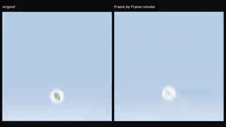
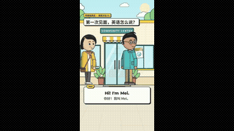
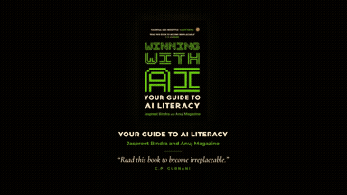
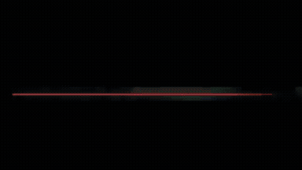
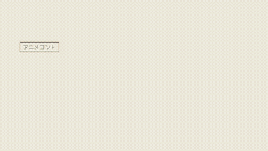
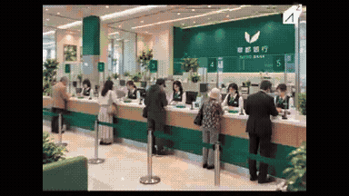

# Motion graphics

<table>
<tr>
<td width="33%" valign="top">
 
&lt;inputs&gt; Ask me for: my product name, a logo (or let you... 
<a href="https://x.com/notdwd/status/2104401208958230764">Original post ↗</a> · <a href="../../prompts/2104401208958230764.md">Prompt ↗</a>
</td>
<td width="33%" valign="top">
 
Make it write code: characters are drawn using code, and... 
<a href="https://x.com/bangbuilds/status/2104418374218600719">Original post ↗</a> · <a href="../../prompts/2104418374218600719.md">Prompt ↗</a>
</td>
<td width="33%" valign="top">
 
generate a animated preview of our book- Winning With AI 
<a href="https://x.com/anujmagazine/status/2104413797876367664">Original post ↗</a> · <a href="../../prompts/2104413797876367664.md">Prompt ↗</a>
</td>
</tr>
<tr>
<td width="33%" valign="top">
 
I asked Opus 5.5 to turn my work into a one minute film. 
<a href="https://x.com/EZheng66099/status/2104410457263976899">Original post ↗</a> · <a href="../../prompts/2104410457263976899.md">Prompt ↗</a>
</td>
<td width="33%" valign="top">
 
Produce a comedy sketch animation on the fly,... 
<a href="https://x.com/cryptoninjanime/status/2104409268351062188">Original post ↗</a> · <a href="../../prompts/2104409268351062188.md">Prompt ↗</a>
</td>
<td width="33%" valign="top">
 
Add typography and effects that match the video 
<a href="https://x.com/mi7_crypto/status/2104403368752071059">Original post ↗</a> · <a href="../../prompts/2104403368752071059.md">Prompt ↗</a>
</td>
</tr>
<tr>
<td width="33%" valign="top">
 
make a dynamic 15-second motion graphics video of the app... 
<a href="https://x.com/zakisbuilding/status/2104389736647495680">Original post ↗</a> · <a href="../../prompts/2104389736647495680.md">Prompt ↗</a>
</td><td></td><td></td>
</tr>
</table>

[Back to gallery](../../README.md)
