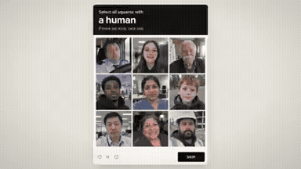
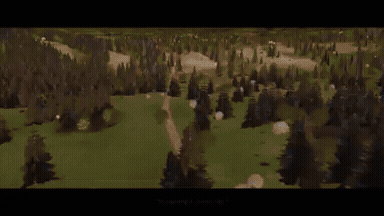

# Music & Storytelling

<table>
<tr>
<td width="33%" valign="top">
 
<strong>Perler Bead Pixel Music Video</strong> 
Use: Perler Bead Pixel Art Music Video Inputs: User inputs not specified by the author Tools: Suno 
<a href="https://x.com/hahazwei/status/2104809910152425483">Original post ↗</a> · <a href="../../prompts/2104809910152425483.md">Prompt ↗</a>
</td>
<td width="33%" valign="top">
 
<strong>Anime Maid vs Shoggoth 15-Second Animated MV</strong> 
Use: A 15-second animated Japanese anime-style music video of a maid dancing and fighting a Shoggoth, produced via Opus 5.5 in approximately 20 minutes. Inputs: User inputs not specified by the author Tools: Tool setup not specified by the source 
<a href="https://x.com/itnavi2022/status/2104509397535961220">Original post ↗</a> · <a href="../../prompts/2104509397535961220.md">Prompt ↗</a>
</td>
<td width="33%" valign="top">
 
<strong>Torradeira Turbo 3000 Animated Short</strong> 
Use: Comedic animated short story Inputs: User inputs not specified by the author Tools: Claude Artifacts 
<a href="https://x.com/NemTudo_/status/2102973867656614053">Original post ↗</a> · <a href="../../prompts/2102973867656614053.md">Prompt ↗</a>
</td>
</tr>
<tr>
<td width="33%" valign="top">
 
<strong>On My Side of the Chat Animation</strong> 
Use: AI Sentiment Animated Narrative Inputs: User inputs not specified by the author Tools: Tool setup not specified by the source 
<a href="https://x.com/RisingSunInt_/status/2108498649269567492">Original post ↗</a> · <a href="../../prompts/2108498649269567492.md">Prompt ↗</a>
</td>
<td width="33%" valign="top">
 
<strong>Higgsfield Katana Preset Orchestration with Opus 5.5</strong> 
Use: AI Music Video Orchestration Inputs: Five uploaded character sheets used as reference. Tools: Higgsfield Katana / Seedance 2.5 
<a href="https://x.com/AI__TSUBAKI/status/2108484647713984755">Original post ↗</a> · <a href="../../prompts/2108484647713984755.md">Prompt ↗</a>
</td>
<td width="33%" valign="top">
 
<strong>Opus 5.5 JS Animation to Lyria Song</strong> 
Use: Music Video Animation Inputs: User inputs not specified by the author Tools: JavaScript / Canvas / Lyria 
<a href="https://x.com/nicekate8888/status/2108241523200676048">Original post ↗</a> · <a href="../../prompts/2108241523200676048.md">Prompt ↗</a>
</td>
</tr>
<tr>
<td width="33%" valign="top">
 
<strong>Proof of Human Interactive Short Film</strong> 
Use: Proof of Human Concept Film Inputs: User inputs not specified by the author Tools: Image Generator / Open Text-to-Speech Model / Web Browser (HTML/JS Runtime) 
<a href="https://x.com/AstroTheWizard/status/2108223014471106723">Original post ↗</a> · <a href="../../prompts/2108223014471106723.md">Prompt ↗</a>
</td>
<td width="33%" valign="top">
 
<strong>Verify Loop Agentic Music Video by Opus 5.5</strong> 
Use: Agentic Lyric Motion Graphics Video Inputs: User inputs not specified by the author Tools: Treblo 
<a href="https://x.com/IvySparkleAI/status/2107128920407502910">Original post ↗</a> · <a href="../../prompts/2107128920407502910.md">Prompt ↗</a>
</td>
<td width="33%" valign="top">
 
<strong>Dracula Chapter 1 3D Scene Recreation with Three.js</strong> 
Use: Literary 3D Narrative Animation Inputs: User inputs not specified by the author Tools: Three.js 
<a href="https://x.com/original_ngv/status/2105193450467389763">Original post ↗</a> · <a href="../../prompts/2105193450467389763.md">Prompt ↗</a>
</td>
</tr>
<tr>
<td width="33%" valign="top">
 
<strong>3D Animated Music Video Produced and Blender</strong> 
Use: 3D Animation / Music Video Inputs: Original musical composition created by the author; Storyboards and directorial instructions created by the author Tools: Blender / three.js 
<a href="https://x.com/LugiAXETomXV/status/2105091868149354753">Original post ↗</a> · <a href="../../prompts/2105091868149354753.md">Prompt ↗</a>
</td>
<td width="33%" valign="top">
 
<strong>《月光小星》- Claude Opus 5.5 动画短片</strong> 
Use: Animated Story Short Inputs: User inputs not specified by the author Tools: Tool setup not specified by the source 
<a href="https://x.com/Lonely8patients/status/2105086526619091374">Original post ↗</a> · <a href="../../prompts/2105086526619091374.md">Prompt ↗</a>
</td>
<td width="33%" valign="top">
 
<strong>Claude Opus 5.5 Self-Reflective Music Video via Procedural Text…</strong> 
Use: Claude Opus 5.5 was prompted to write a song and generate every visual frame as procedural code composed entirely of text, paired with audio generated via Suno v6. Inputs: User inputs not specified by the author Tools: Tool setup not specified by the source 
<a href="https://x.com/buskerrrrrr/status/2104518643723764131">Original post ↗</a> · <a href="../../prompts/2104518643723764131.md">Prompt ↗</a>
</td>
</tr>
<tr>
<td width="33%" valign="top">
 
<strong>Crew in the Dark Motion Design Music Video</strong> 
Use: Satirical kinetic typography and motion graphics music video poking fun at single-prompt AI claims, crediting Claude Opus 5.5 for the visual generation and code orchestration. Inputs: User inputs not specified by the author Tools: Tool setup not specified by the source 
<a href="https://x.com/Sadegh1068/status/2104467879911686448">Original post ↗</a> · <a href="../../prompts/2104467879911686448.md">Prompt ↗</a>
</td>
<td width="33%" valign="top">
 
<strong>DeepSeek 灰测版魔性 MV 动画制作</strong> 
Use: 作者使用 Opus 5.5（xhigh 档位）制作了一支关于 DeepSeek 灰度测试主题的 2D 动效音乐 MV，包含丰富的角色动画、动态排版及分镜。 Inputs: User inputs not specified by the author Tools: Tool setup not specified by the source 
<a href="https://x.com/esrhengwu/status/2104458849524863062">Original post ↗</a> · <a href="../../prompts/2104458849524863062.md">Prompt ↗</a>
</td>
<td width="33%" valign="top">
 
<strong>K-pop Style AI Security Music Video Orchestrated by Opus 5.5</strong> 
Use: Jiquan Ngiam uses Claude Opus 5.5 to analyze reference video pacing, synthesize company documentation into song lyrics, generate a soundtrack via Suno, and orchestrate RunwayML to generate a complete K-pop music video for their product Mint. Inputs: Reference video referred to as 'the pdoom video' used for reverse-engineering pacing/structure Tools: Tool setup not specified by the source 
<a href="https://x.com/JiquanNgiam/status/2104446990008611251">Original post ↗</a> · <a href="../../prompts/2104446990008611251.md">Prompt ↗</a>
</td>
</tr>
<tr>
<td width="33%" valign="top">
 
<strong>Sneakers O'Toole Music Video</strong> 
Use: Music video Inputs: User inputs not specified by the author Tools: Tool setup not specified by the source 
<a href="https://x.com/coffemoth/status/2104429604815675791">Original post ↗</a> · <a href="../../prompts/2104429604815675791.md">Prompt ↗</a>
</td>
<td width="33%" valign="top">
 
<strong>Code-Rendered Generative Music Video for I'm Upping My P(doom)</strong> 
Use: Author used Claude Opus 5.5 via Claude Code to cooperatively design and program an entire generative music video, including lyric alignment, audio analysis, TypeScript/Three.js rendering engine, and dynamic 3D/typography scenes. Inputs: User inputs not specified by the author Tools: Tool setup not specified by the source 
<a href="https://x.com/weiwei2018831/status/2104420680142082118">Original post ↗</a> · <a href="../../prompts/2104420680142082118.md">Prompt ↗</a>
</td>
<td width="33%" valign="top">
 
<strong>Code-Animated Short Film: Xi the Mechanical Hermit Crab</strong> 
Use: A detailed, multi-stage director prompt instructing Claude to procedurally code, rig, score, and render a 45–50 second animated short film about a mechanical hermit crab chasing a light through deep-sea realms using Remotion, WebGL, SVG, and Python audio synthesis. Inputs: User inputs not specified by the author Tools: FFmpeg / NumPy / React / Remotion 
<a href="https://x.com/gmgmgm1545/status/2103793820815245507">Original post ↗</a> · <a href="../../prompts/2103793820815245507.md">Prompt ↗</a>
</td>
</tr>
<tr>
<td width="33%" valign="top">
 
<strong>Psychedelic Glitch Anime Music Video</strong> 
Use: A detailed prompt for Opus 5.5 instructing it to create a psychedelic, glitch-style anime music video from still images and audio using programmatic HTML Canvas animation, Playwright capture, and FFmpeg encoding. Inputs: User inputs not specified by the author Tools: Tool setup not specified by the source 
<a href="https://x.com/pound75423/status/2103722556918464968">Original post ↗</a> · <a href="../../prompts/2103722556918464968.md">Prompt ↗</a>
</td>
<td width="33%" valign="top">
 
<strong>Animated Music Video Prompt for Claude Opus</strong> 
Use: Motion graphics / music videos Inputs: Reference MV; Song Tools: Tool setup not specified by the source 
<a href="https://x.com/doubleunplussed/status/2103697580421181894">Original post ↗</a> · <a href="../../prompts/2103697580421181894.md">Prompt ↗</a>
</td>
<td width="33%" valign="top">
 
<strong>Deep Dish Music Video</strong> 
Use: Music video Inputs: User inputs not specified by the author Tools: Tool setup not specified by the source 
<a href="https://x.com/ParanoidAmerica/status/2103570879619686717">Original post ↗</a> · <a href="../../prompts/2103570879619686717.md">Prompt ↗</a>
</td>
</tr>
<tr>
<td width="33%" valign="top">
 
<strong>Dynamic Lyrics Motion Graphics Video</strong> 
Use: Motion graphics / showreel Inputs: User inputs not specified by the author Tools: Tool setup not specified by the source 
<a href="https://x.com/samaote/status/2103510974796124569">Original post ↗</a> · <a href="../../prompts/2103510974796124569.md">Prompt ↗</a>
</td>
<td width="33%" valign="top">
 
<strong>Peter Gabriel Style Music Video</strong> 
Use: Music video Inputs: User inputs not specified by the author Tools: Tool setup not specified by the source 
<a href="https://x.com/DavidShulmanFL/status/2103336310089842921">Original post ↗</a> · <a href="../../prompts/2103336310089842921.md">Prompt ↗</a>
</td>
<td width="33%" valign="top">
 
<strong>Short Story Animation</strong> 
Use: A prompt asking Claude to generate a 9:16 short story animation with sound effects using specific app assets and teaser elements. Inputs: User inputs not specified by the author Tools: Tool setup not specified by the source 
<a href="https://x.com/jackfriks/status/2103132260589338762">Original post ↗</a> · <a href="../../prompts/2103132260589338762.md">Prompt ↗</a>
</td>
</tr>
<tr>
<td width="33%" valign="top">
 
<strong>Paper Cut-Out Shadow Theatre Animation</strong> 
Use: A prompt requesting a vertical JavaScript animation in a paper cut-out shadow theatre style with synthesized audio on the theme of home. Inputs: User inputs not specified by the author Tools: JavaScript 
<a href="https://x.com/x4b47x/status/2103019799614034026">Original post ↗</a> · <a href="../../prompts/2103019799614034026.md">Prompt ↗</a>
</td>
<td width="33%" valign="top">
 
<strong>Three.js Animated Story</strong> 
Use: A prompt asking the model to imagine a story and render a full animation using Three.js in the style of an 80s Star Wars or 90s cartoon. Inputs: User inputs not specified by the author Tools: Tool setup not specified by the source 
<a href="https://x.com/Ryzoft/status/2102989395359887481">Original post ↗</a> · <a href="../../prompts/2102989395359887481.md">Prompt ↗</a>
</td>
<td width="33%" valign="top">
 
<strong>Silent Short Film</strong> 
Use: A prompt instructing Opus 5.5 to create an original 45-second silent short film without dialogue, utilizing sound to tell half the narrative. Inputs: User inputs not specified by the author Tools: Tool setup not specified by the source 
<a href="https://x.com/KamStudioLabs/status/2102908742518100086">Original post ↗</a> · <a href="../../prompts/2102908742518100086.md">Prompt ↗</a>
</td>
</tr>
</table>

[Back to gallery](../../README.md)
