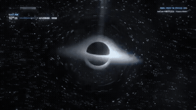
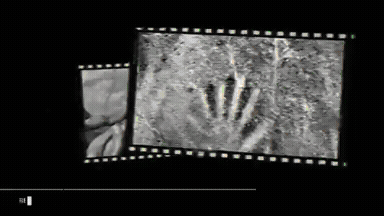
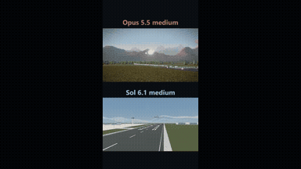
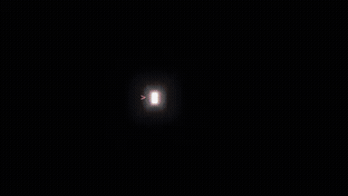
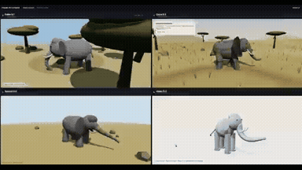

# other-animation

<table>
<tr>
<td width="33%" valign="top">
 
<strong>Visual Representation of Claude Opus 5.5</strong> 
Use: AI Architecture Visual Interpretation Inputs: User inputs not specified by the author Tools: Tool setup not specified by the source 
<a href="https://x.com/mikenevermiss/status/2108788464909218140">Original post ↗</a> · <a href="../../prompts/2108788464909218140.md">Prompt ↗</a>
</td>
<td width="33%" valign="top">
 
<strong>Claude Opus 5.5 Gravity Motion Graphics Explainer</strong> 
Use: Gravity Scientific Explainer Animation Inputs: User inputs not specified by the author Tools: Tool setup not specified by the source 
<a href="https://x.com/redbickey/status/2108685334343221621">Original post ↗</a> · <a href="../../prompts/2108685334343221621.md">Prompt ↗</a>
</td>
<td width="33%" valign="top">
 
<strong>Video as Code Kinetic Typography Promo</strong> 
Use: Video as Code Promo Inputs: User inputs not specified by the author Tools: Tool setup not specified by the source 
<a href="https://x.com/YuanXi901019/status/2108570435575222596">Original post ↗</a> · <a href="../../prompts/2108570435575222596.md">Prompt ↗</a>
</td>
</tr>
<tr>
<td width="33%" valign="top">
 
<strong>Quantum Mechanics Motion Graphic Flash Video</strong> 
Use: Quantum Mechanics Motion Graphic Inputs: User inputs not specified by the author Tools: Tool setup not specified by the source 
<a href="https://x.com/YuanXi901019/status/2108569413746335887">Original post ↗</a> · <a href="../../prompts/2108569413746335887.md">Prompt ↗</a>
</td>
<td width="33%" valign="top">
 
<strong>Nobel Prize Neutrino Astronomy Scientific Explainer Motion Graph…</strong> 
Use: Neutrino Astronomy 3D Scientific Explainer Inputs: SRT timing file and lyrics about Nobel prize neutrino physics Tools: Claude CLI / GLSL / 3D Graphics / Suno 
<a href="https://x.com/beebidao/status/2108567783789515051">Original post ↗</a> · <a href="../../prompts/2108567783789515051.md">Prompt ↗</a>
</td>
<td width="33%" valign="top">
 
<strong>Claude Opus 5.5 生成 AI 发展史动画视频</strong> 
Use: AI 发展史动效科普视频 Inputs: 要求制作 AI 发展史介绍视频的一句话提示词 Tools: HTML + SVG Animation Engine / Speech &amp; Music Synthesizer / Video Encoder (H.264) 
<a href="https://x.com/Nuseti5/status/2108506248341856721">Original post ↗</a> · <a href="../../prompts/2108506248341856721.md">Prompt ↗</a>
</td>
</tr>
<tr>
<td width="33%" valign="top">
 
<strong>Opus 5.5 Self-Introduction Motion Graphics Video</strong> 
Use: Self-introduction Motion Graphics Inputs: User inputs not specified by the author Tools: Tool setup not specified by the source 
<a href="https://x.com/olezhavich/status/2108802612669891048">Original post ↗</a> · <a href="../../prompts/2108802612669891048.md">Prompt ↗</a>
</td>
<td width="33%" valign="top">
 
<strong>Fireworks Festival Comparison in HTML/Canvas</strong> 
Use: Fireworks Display Animation Inputs: User inputs not specified by the author Tools: HTML5 Canvas 2D 
<a href="https://x.com/KEI_Ediforce/status/2108758475606229025">Original post ↗</a> · <a href="../../prompts/2108758475606229025.md">Prompt ↗</a>
</td>
<td width="33%" valign="top">
 
<strong>13.8 Billion Years of Human Revelations Told Through Hands</strong> 
Use: AI-Directed Historical Video Essay Inputs: User inputs not specified by the author Tools: ElevenLabs / Tesseract 
<a href="https://x.com/nett0eth/status/2108729269681520726">Original post ↗</a> · <a href="../../prompts/2108729269681520726.md">Prompt ↗</a>
</td>
</tr>
<tr>
<td width="33%" valign="top">
 
<strong>Educational Explainer on the Riemann Hypothesis</strong> 
Use: Mathematics Explainer Video Inputs: User inputs not specified by the author Tools: FFmpeg / Kokoro TTS / matplotlib / mpmath / pycairo 
<a href="https://x.com/insideology/status/2108716885646639338">Original post ↗</a> · <a href="../../prompts/2108716885646639338.md">Prompt ↗</a>
</td>
<td width="33%" valign="top">
 
<strong>Three.js 3D Logo Intro Studio Generator</strong> 
Use: 3D Logo Motion Intro Inputs: User SVG logo code to be converted into 3D geometry Tools: Google Chrome / three.js 
<a href="https://x.com/juancarlos17626/status/2108663864581558301">Original post ↗</a> · <a href="../../prompts/2108663864581558301.md">Prompt ↗</a>
</td>
<td width="33%" valign="top">
 
<strong>Interactive Jelly Koi Pond Simulation</strong> 
Use: Interactive Jelly Koi Pond Inputs: User inputs not specified by the author Tools: Tool setup not specified by the source 
<a href="https://x.com/promptlogic_lab/status/2108564740519674082">Original post ↗</a> · <a href="../../prompts/2108564740519674082.md">Prompt ↗</a>
</td>
</tr>
<tr>
<td width="33%" valign="top">
 
<strong>AI Capabilities Motion Graphics Video</strong> 
Use: AI Capabilities Showcase Inputs: User inputs not specified by the author Tools: Tool setup not specified by the source 
<a href="https://x.com/xiaofengai2023/status/2108563779046813910">Original post ↗</a> · <a href="../../prompts/2108563779046813910.md">Prompt ↗</a>
</td>
<td width="33%" valign="top">
 
<strong>Kokopelli's Space Journey Animation</strong> 
Use: Kokopelli Space Flight Inputs: User inputs not specified by the author Tools: Tool setup not specified by the source 
<a href="https://x.com/KimikoA97936/status/2108555077933822275">Original post ↗</a> · <a href="../../prompts/2108555077933822275.md">Prompt ↗</a>
</td>
<td width="33%" valign="top">
 
<strong>Airplane Landing Animation Comparison</strong> 
Use: Airplane Landing 3D Animation Inputs: User inputs not specified by the author Tools: Tool setup not specified by the source 
<a href="https://x.com/sebmoska/status/2108552389871444113">Original post ↗</a> · <a href="../../prompts/2108552389871444113.md">Prompt ↗</a>
</td>
</tr>
<tr>
<td width="33%" valign="top">
 
<strong>Three.js Morphing Cube and Galaxy Animation</strong> 
Use: Procedural 3D Visualizer Inputs: User inputs not specified by the author Tools: Three.js 
<a href="https://x.com/narukijima/status/2108547315971793119">Original post ↗</a> · <a href="../../prompts/2108547315971793119.md">Prompt ↗</a>
</td>
<td width="33%" valign="top">
 
<strong>Procedural 3D Elephant in Three.js</strong> 
Use: Procedural 3D Scene Generation Inputs: User inputs not specified by the author Tools: HTML / Browser WebGL / Three.js 
<a href="https://x.com/Thusatharan/status/2108511286795640926">Original post ↗</a> · <a href="../../prompts/2108511286795640926.md">Prompt ↗</a>
</td><td></td>
</tr>
</table>

[All tasks](../../README.md)
