# other-animation

<table>
<tr>
<td width="33%" valign="top">
 
<strong>Beat-Synced Action Video Editing</strong> 
Use: Beat-Synced Action Video Editing Inputs: User inputs not specified by the author Tools: Claude Opus 5.5 
<a href="https://x.com/kray_ai/status/2105145374541484257">Original post ↗</a> · <a href="../../prompts/2105145374541484257.md">Prompt ↗</a>
</td>
<td width="33%" valign="top">
<a href="../../prompts/2104912803786375645.md">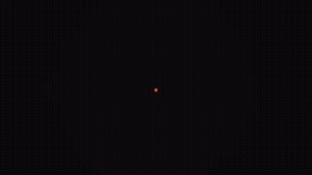</a> 
<strong>Opus 5.5 Motion Designer Showreel</strong> 
Use: Motion Design Portfolio Showreel Inputs: User inputs not specified by the author Tools: FFmpeg / Playwright / Tone.js 
<a href="https://x.com/Ai9app/status/2104912803786375645">Original post ↗</a> · <a href="../../prompts/2104912803786375645.md">Prompt ↗</a>
</td>
<td width="33%" valign="top">
 
<strong>Continuous Zoom from Pencil Tip to Carbon Atom in Three.js</strong> 
Use: Continuous Macro Zoom Explainer Inputs: User inputs not specified by the author Tools: Three.js 
<a href="https://x.com/Dino_Spike_web3/status/2104909723443302770">Original post ↗</a> · <a href="../../prompts/2104909723443302770.md">Prompt ↗</a>
</td>
</tr>
<tr>
<td width="33%" valign="top">
 
<strong>Opus 5.5 30-Second Motion Designer Portfolio Reel</strong> 
Use: Motion Graphics Showreel Inputs: User inputs not specified by the author Tools: Tool setup not specified by the source 
<a href="https://x.com/MirrortekUK/status/2104903820639633895">Original post ↗</a> · <a href="../../prompts/2104903820639633895.md">Prompt ↗</a>
</td>
<td width="33%" valign="top">
 
<strong>Claude Opus 5.5 Motion Graphics Showreel</strong> 
Use: Motion Graphics Showreel Inputs: User inputs not specified by the author Tools: Tool setup not specified by the source 
<a href="https://x.com/dzairio_/status/2104884772518478061">Original post ↗</a> · <a href="../../prompts/2104884772518478061.md">Prompt ↗</a>
</td>
<td width="33%" valign="top">
<a href="../../prompts/2104827072283849181.md">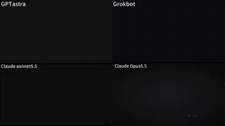</a> 
<strong>30-Second Motion Designer Resume Showreel Comparison</strong> 
Use: Motion Graphics Showreel Inputs: User inputs not specified by the author Tools: Tool setup not specified by the source 
<a href="https://x.com/coolbat1999/status/2104827072283849181">Original post ↗</a> · <a href="../../prompts/2104827072283849181.md">Prompt ↗</a>
</td>
</tr>
<tr>
<td width="33%" valign="top">
 
<strong>The Beauty of Three.js Showcase Video</strong> 
Use: Three.js Cinematic Feature Reel Inputs: User inputs not specified by the author Tools: Three.js 
<a href="https://x.com/yupengfei990919/status/2104788406656184436">Original post ↗</a> · <a href="../../prompts/2104788406656184436.md">Prompt ↗</a>
</td>
<td width="33%" valign="top">
<a href="../../prompts/2104560073217597459.md">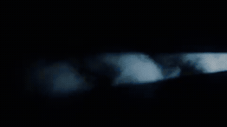</a> 
<strong>Fictional Fashion Commercial Direction and MiniMax H3</strong> 
Use: Multi-shot fashion commercial structured with Claude Opus 5.5 and rendered via MiniMax H3 using model and product reference images. Inputs: Picture 1: Reference image of the fashion model.; Picture 2: Reference image of the handbag product. Tools: Tool setup not specified by the source 
<a href="https://x.com/ito1217yo/status/2104560073217597459">Original post ↗</a> · <a href="../../prompts/2104560073217597459.md">Prompt ↗</a>
</td>
<td width="33%" valign="top">
 
<strong>Tidewave 15-second Dynamic Motion Graphics Promo</strong> 
Use: Motion graphics / showreel Inputs: User inputs not specified by the author Tools: Tool setup not specified by the source 
<a href="https://x.com/hugobarauna/status/2104558345118236704">Original post ↗</a> · <a href="../../prompts/2104558345118236704.md">Prompt ↗</a>
</td>
</tr>
<tr>
<td width="33%" valign="top">
 
<strong>Educational Motion-Graphics on Recursive AI Agent Limitations</strong> 
Use: Educational motion graphics / AI agents Inputs: User inputs not specified by the author Tools: GPT Image 2.5 on Fal AI 
<a href="https://x.com/M_Adrian2/status/2104542961081983435">Original post ↗</a> · <a href="../../prompts/2104542961081983435.md">Prompt ↗</a>
</td>
<td width="33%" valign="top">
 
<strong>Dynamic 15-Second Motion Graphics Showreel by Opus 5.5</strong> 
Use: Motion graphics / showreel Inputs: User inputs not specified by the author Tools: Tool setup not specified by the source 
<a href="https://x.com/RaphaelAubryy/status/2104541641226977654">Original post ↗</a> · <a href="../../prompts/2104541641226977654.md">Prompt ↗</a>
</td>
<td width="33%" valign="top">
 
<strong>Claude Opus 5.5 Motion Designer Showreel</strong> 
Use: 15-second motion design showreel Inputs: User inputs not specified by the author Tools: Tool setup not specified by the source 
<a href="https://x.com/just_adev/status/2104541344945627171">Original post ↗</a> · <a href="../../prompts/2104541344945627171.md">Prompt ↗</a>
</td>
</tr>
<tr>
<td width="33%" valign="top">
 
<strong>Opus 5.5 Pokobot Motion Graphic Video</strong> 
Use: Motion graphics / showreel Inputs: User inputs not specified by the author Tools: Tool setup not specified by the source 
<a href="https://x.com/sudhanshusoni__/status/2104525366224412962">Original post ↗</a> · <a href="../../prompts/2104525366224412962.md">Prompt ↗</a>
</td>
<td width="33%" valign="top">
 
<strong>Industrial Hub 30-Second Motion Graphics Video</strong> 
Use: Motion graphics / showreel Inputs: User inputs not specified by the author Tools: Tool setup not specified by the source 
<a href="https://x.com/s7trimm/status/2104524606841217044">Original post ↗</a> · <a href="../../prompts/2104524606841217044.md">Prompt ↗</a>
</td>
<td width="33%" valign="top">
 
<strong>Anime Maid vs Shoggoth 15-Second Animated MV</strong> 
Use: A 15-second animated Japanese anime-style music video of a maid dancing and fighting a Shoggoth, produced via Opus 5.5 in approximately 20 minutes. Inputs: User inputs not specified by the author Tools: Tool setup not specified by the source 
<a href="https://x.com/itnavi2022/status/2104509397535961220">Original post ↗</a> · <a href="../../prompts/2104509397535961220.md">Prompt ↗</a>
</td>
</tr>
<tr>
<td width="33%" valign="top">
 
<strong>Firetower Motion Graphics Promo Generated</strong> 
Use: Motion graphics / showreel Inputs: User inputs not specified by the author Tools: Tool setup not specified by the source 
<a href="https://x.com/kevinpiac/status/2104489806713553012">Original post ↗</a> · <a href="../../prompts/2104489806713553012.md">Prompt ↗</a>
</td>
<td width="33%" valign="top">
 
<strong>Math Motion Graphics Showreel</strong> 
Use: Motion graphics / showreel Inputs: User inputs not specified by the author Tools: Tool setup not specified by the source 
<a href="https://x.com/Math_files/status/2104486181853610052">Original post ↗</a> · <a href="../../prompts/2104486181853610052.md">Prompt ↗</a>
</td>
<td width="33%" valign="top">
 
<strong>Three.js 15s 3D Motion Graphics</strong> 
Use: 3D motion graphics / website hero Inputs: User inputs not specified by the author Tools: Three.js 
<a href="https://x.com/hiro19_k/status/2104471436039803295">Original post ↗</a> · <a href="../../prompts/2104471436039803295.md">Prompt ↗</a>
</td>
</tr>
<tr>
<td width="33%" valign="top">
 
<strong>Opus 5.5 Hand-Drawn P(Doom) Educational Video</strong> 
Use: Claude Opus 5.5 generated a 15-second hand-drawn style animation explaining P(Doom). Inputs: User inputs not specified by the author Tools: Tool setup not specified by the source 
<a href="https://x.com/itnavi2022/status/2104468704490909880">Original post ↗</a> · <a href="../../prompts/2104468704490909880.md">Prompt ↗</a>
</td>
<td width="33%" valign="top">
 
<strong>Claude Opus 5.5 Animated Explanation of Yun Tianming's Three Fai…</strong> 
Use: Educational / explainer video Inputs: User inputs not specified by the author Tools: Tool setup not specified by the source 
<a href="https://x.com/imxishi/status/2104459910247235966">Original post ↗</a> · <a href="../../prompts/2104459910247235966.md">Prompt ↗</a>
</td>
<td width="33%" valign="top">
 
<strong>Brand Rebuild Product Sting with HTML Canvas and Playwright</strong> 
Use: Educational / explainer video Inputs: Ask me for: my product name, a logo (or let you draw a simple mark), my brand colours (or pull them from my logo), the one-line thing a user types into the prompt box, the page that answers it (title + 2–3 sentences with one key phrase), two feature names for the stacked cards, and a music track. If I skip any, use the defaults: product &quot;Frame by Frame&quot; living inside its Whop hub, a viewfinder mark (four corner brackets around a bold &quot;FF&quot;), prompt &quot;Make a launch video for my app&quot;, a lesson page titled &quot;2.1 Choose a reference&quot;, cards &quot;Launch&quot; and &quot;Sound&quot;, and Mixkit's free house track &quot;Rising Forest&quot; slowed to 124 BPM. Tools: Playwright 
<a href="https://x.com/notdwd/status/2104401208958230764">Original post ↗</a> · <a href="../../prompts/2104401208958230764.md">Prompt ↗</a>
</td>
</tr>
<tr>
<td width="33%" valign="top">
 
<strong>Promotional Motion Graphics Video for EDteam via Single</strong> 
Use: Motion graphics / showreel Inputs: User inputs not specified by the author Tools: Tool setup not specified by the source 
<a href="https://x.com/AlvaroFelipeCh/status/2104219468079526187">Original post ↗</a> · <a href="../../prompts/2104219468079526187.md">Prompt ↗</a>
</td>
<td width="33%" valign="top">
 
<strong>Serif A Studio Startup Branding Showreel</strong> 
Use: Motion graphics / showreel Inputs: User inputs not specified by the author Tools: Tool setup not specified by the source 
<a href="https://x.com/tariqkhanfmd/status/2104219444130234430">Original post ↗</a> · <a href="../../prompts/2104219444130234430.md">Prompt ↗</a>
</td>
<td width="33%" valign="top">
 
<strong>Beauty of Physics One-Shot Animation via Claude Code and Opus 5.5</strong> 
Use: Author prompts Claude Code using Opus 5.5 to independently generate and render an end-to-end scientific animation video titled 'The Beauty of Physics', spanning from quantum scales to black holes with a continuous timeline and cinematic layout. Inputs: User inputs not specified by the author Tools: Tool setup not specified by the source 
<a href="https://x.com/akokoi1/status/2104200939095904322">Original post ↗</a> · <a href="../../prompts/2104200939095904322.md">Prompt ↗</a>
</td>
</tr>
<tr>
<td width="33%" valign="top">
<a href="../../prompts/2103824976713306214.md">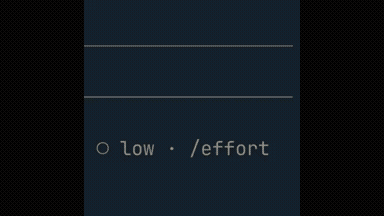</a> 
<strong>Ultracode Animation Movie Shoot with Opus 5.5 Dynamic Workflows</strong> 
Use: Dan McAteer prompts Claude Opus 5.5 via Claude Code Dynamic Workflows and Ultracode to orchestrate an animated movie shoot about developer usage efficiency, complete with Python-generated audio and 2D character animation. Inputs: User inputs not specified by the author Tools: Tool setup not specified by the source 
<a href="https://x.com/daniel_mac8/status/2103824976713306214">Original post ↗</a> · <a href="../../prompts/2103824976713306214.md">Prompt ↗</a>
</td>
<td width="33%" valign="top">
 
<strong>Claude Motion Designer 15-Second Showreel</strong> 
Use: Motion graphics / showreel Inputs: User inputs not specified by the author Tools: Tool setup not specified by the source 
<a href="https://x.com/leonabboud/status/2103576084499358051">Original post ↗</a> · <a href="../../prompts/2103576084499358051.md">Prompt ↗</a>
</td>
<td width="33%" valign="top">
 
<strong>Opus 5.5 Motion Designer Showreel</strong> 
Use: Motion graphics / showreel Inputs: User inputs not specified by the author Tools: Tool setup not specified by the source 
<a href="https://x.com/himanshutwtxs/status/2103495232637882858">Original post ↗</a> · <a href="../../prompts/2103495232637882858.md">Prompt ↗</a>
</td>
</tr>
<tr>
<td width="33%" valign="top">
<a href="../../prompts/2103273003555402193.md">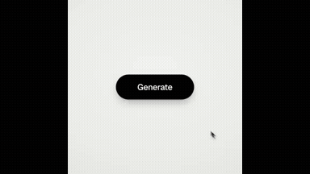</a> 
<strong>Code-Driven Looping UI Motion Graphics</strong> 
Use: UI motion / interaction demonstration Inputs: 8–12 UI states; palette; ~120 BPM music Tools: FFmpeg / NumPy / Playwright 
<a href="https://x.com/twoclipping/status/2103273003555402193">Original post ↗</a> · <a href="../../prompts/2103273003555402193.md">Prompt ↗</a>
</td>
<td width="33%" valign="top">
 
<strong>SaaS Product Launch Motion Graphics Video</strong> 
Use: Moritz Kremb prompts Claude Opus 5.5 to select a known SaaS product and produce a complete motion graphics launch video. Inputs: User inputs not specified by the author Tools: Tool setup not specified by the source 
<a href="https://x.com/moritzkremb/status/2103066071838466494">Original post ↗</a> · <a href="../../prompts/2103066071838466494.md">Prompt ↗</a>
</td>
<td width="33%" valign="top">
 
<strong>Negroni Cocktail Explainer Motion Graphic in HTML</strong> 
Use: Cocktail recipe explainer Inputs: Reference cocktail recipe illustration image attached to the prompt Tools: JavaScript 
<a href="https://x.com/Ror_Fly/status/2102853258582880547">Original post ↗</a> · <a href="../../prompts/2102853258582880547.md">Prompt ↗</a>
</td>
</tr>
<tr>
<td width="33%" valign="top">
 
<strong>Inference Startup Launch Video</strong> 
Use: Deedy demonstrates using Claude Opus 5.5 via Claude Code to generate a sleek startup launch video by coding a JavaScript animation and recording it with Playwright and ffmpeg. Inputs: User inputs not specified by the author Tools: Tool setup not specified by the source 
<a href="https://x.com/deedydas/status/2102787937482252537">Original post ↗</a> · <a href="../../prompts/2102787937482252537.md">Prompt ↗</a>
</td>
<td width="33%" valign="top">
 
<strong>Claude Opus 5.5 Motion Graphics Resume Showreel</strong> 
Use: Executive Motion Graphics Resume Showreel Inputs: Biographical data, executive titles, milestones, and mission statement at KOBIRA referenced by '私の情報を踏まえて' Tools: Tool setup not specified by the source 
<a href="https://x.com/ryoheiikeda/status/2105136634492809280">Original post ↗</a> · <a href="../../prompts/2105136634492809280.md">Prompt ↗</a>
</td>
<td width="33%" valign="top">
 
<strong>First &amp; 10 Yellow Line Explainer Video</strong> 
Use: First &amp; 10 System Explainer Inputs: User inputs not specified by the author Tools: Tool setup not specified by the source 
<a href="https://x.com/blueoctopusai/status/2105116391439270222">Original post ↗</a> · <a href="../../prompts/2105116391439270222.md">Prompt ↗</a>
</td>
</tr>
<tr>
<td width="33%" valign="top">
 
<strong>Autonomous 14-Minute Documentary on Elon Musk Directed and Cut</strong> 
Use: An agentic video production project where Claude Opus 5.5 was prompted with a high-level creative brief to produce a documentary film using archival footage, AI-synthesized narration, classical scoring, and programmatic editing via FFmpeg and Python. Inputs: Voice timbre WAV reference and emotion audio clips for TTS transfer Tools: Tool setup not specified by the source 
<a href="https://x.com/Michaelzsguo/status/2105105890936233985">Original post ↗</a> · <a href="../../prompts/2105105890936233985.md">Prompt ↗</a>
</td>
<td width="33%" valign="top">
<a href="../../prompts/2105102530049175928.md">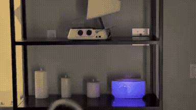</a> 
<strong>Autonomous Projection Mapping Animation with Opus 5.5</strong> 
Use: The author connected Claude Opus 5.5 with a camera and projector to auto-calibrate and project a custom animation onto a physical shelf containing three candles and a white pot. Inputs: User inputs not specified by the author Tools: Tool setup not specified by the source 
<a href="https://x.com/antipdoom/status/2105102530049175928">Original post ↗</a> · <a href="../../prompts/2105102530049175928.md">Prompt ↗</a>
</td>
<td width="33%" valign="top">
 
<strong>Stained-Glass Maple Leaf 3D Animation Comparison: GPT 6.1 SOL vs…</strong> 
Use: The author compares 3D generation capabilities between GPT 6.1 SOL and Claude Opus 5.5, requesting thin borders, translucent tones, detailed veins, and beveled edges on a rotating stained-glass leaf. Inputs: User inputs not specified by the author Tools: Tool setup not specified by the source 
<a href="https://x.com/abhinavflac/status/2105100907952353560">Original post ↗</a> · <a href="../../prompts/2105100907952353560.md">Prompt ↗</a>
</td>
</tr>
<tr>
<td width="33%" valign="top">
 
<strong>One-Shot 3D Motion Graphics Teaser for Location-Based WebXR</strong> 
Use: Open Source Repo Promo Video Inputs: Code and documentation for the Location-Based WebXR project Tools: Custom 3D Engine 
<a href="https://x.com/csutil_com/status/2105100452232577419">Original post ↗</a> · <a href="../../prompts/2105100452232577419.md">Prompt ↗</a>
</td>
<td width="33%" valign="top">
 
<strong>《月光小星》- Claude Opus 5.5 动画短片</strong> 
Use: Animated Story Short Inputs: User inputs not specified by the author Tools: Tool setup not specified by the source 
<a href="https://x.com/Lonely8patients/status/2105086526619091374">Original post ↗</a> · <a href="../../prompts/2105086526619091374.md">Prompt ↗</a>
</td>
<td width="33%" valign="top">
 
<strong>Note Article to Explainer Video via Claude Code and HyperFrames</strong> 
Use: An author generated a 95-second structured explainer video from a blog post using Claude Opus 5.5 via Claude Code, orchestrating the script, voiceover, subtitles, and HTML-based animation in HyperFrames. Inputs: User inputs not specified by the author Tools: Tool setup not specified by the source 
<a href="https://x.com/koumei_ai5566/status/2105077598934241383">Original post ↗</a> · <a href="../../prompts/2105077598934241383.md">Prompt ↗</a>
</td>
</tr>
<tr>
<td width="33%" valign="top">
<a href="../../prompts/2105075516156047624.md">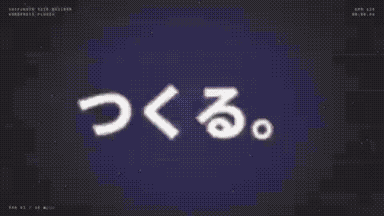</a> 
<strong>Promo Video for WordPress Site Builder Plugin</strong> 
Use: The author shares a fast-paced promotional motion graphics video for their WordPress plugin 'Shifukuin-san's Site Builder' generated using Claude Opus 5.5. Inputs: User inputs not specified by the author Tools: Tool setup not specified by the source 
<a href="https://x.com/Takamaro_SFKIN/status/2105075516156047624">Original post ↗</a> · <a href="../../prompts/2105075516156047624.md">Prompt ↗</a>
</td>
<td width="33%" valign="top">
 
<strong>Claude 发展史动态解说视频</strong> 
Use: Claude Evolution History Explainer Inputs: User inputs not specified by the author Tools: Tool setup not specified by the source 
<a href="https://x.com/LawrenceW_Zen/status/2104934916505108662">Original post ↗</a> · <a href="../../prompts/2104934916505108662.md">Prompt ↗</a>
</td>
<td width="33%" valign="top">
 
<strong>Opus 5.5 纯代码生成40秒动态视觉短片</strong> 
Use: 代码生成动态图形视觉短片 Inputs: 作者提示词中提及的参考视频链接 Tools: Tool setup not specified by the source 
<a href="https://x.com/AndyL5cc/status/2104850150749532431">Original post ↗</a> · <a href="../../prompts/2104850150749532431.md">Prompt ↗</a>
</td>
</tr>
<tr>
<td width="33%" valign="top">
 
<strong>Opus 5.5 Forgefy Product Motion Graphics Showcase</strong> 
Use: Motion graphics / showreel Inputs: User inputs not specified by the author Tools: Tool setup not specified by the source 
<a href="https://x.com/0xPaulvibe/status/2104562535340884325">Original post ↗</a> · <a href="../../prompts/2104562535340884325.md">Prompt ↗</a>
</td>
<td width="33%" valign="top">
 
<strong>Claude Opus 5.5 Feature Concept Animations</strong> 
Use: The author shares iterative video animations generated by Claude Opus 5.5 under low effort settings to convey the capabilities and appeal of Claude Opus 5.5. Inputs: User inputs not specified by the author Tools: Tool setup not specified by the source 
<a href="https://x.com/cherusi3/status/2104560611095187772">Original post ↗</a> · <a href="../../prompts/2104560611095187772.md">Prompt ↗</a>
</td>
<td width="33%" valign="top">
 
<strong>Hillnote Dynamic 15-Second Motion Graphics Promo</strong> 
Use: Motion graphics / showreel Inputs: User inputs not specified by the author Tools: Tool setup not specified by the source 
<a href="https://x.com/karthikships/status/2104557402154549263">Original post ↗</a> · <a href="../../prompts/2104557402154549263.md">Prompt ↗</a>
</td>
</tr>
<tr>
<td width="33%" valign="top">
 
<strong>Opus 5.5 Motion Graphics: Chronicle of Two</strong> 
Use: The author prompted Claude Opus 5.5 with high reasoning level to inspect memory and generate a motion graphics animation recounting their shared history, titled 'A story of the moon &amp; a little star'. Inputs: User inputs not specified by the author Tools: Tool setup not specified by the source 
<a href="https://x.com/monya_for_io/status/2104554735382778328">Original post ↗</a> · <a href="../../prompts/2104554735382778328.md">Prompt ↗</a>
</td>
<td width="33%" valign="top">
<a href="../../prompts/2104544365901459579.md">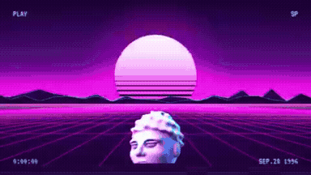</a> 
<strong>Vaporwave Motion Graphics Generated with Opus 5.5 for After Effe…</strong> 
Use: The author used Claude Opus 5.5 with a casual vaporwave prompt to generate layered animation data that was imported into After Effects with layer structures preserved. Inputs: User inputs not specified by the author Tools: Tool setup not specified by the source 
<a href="https://x.com/moaizo01012525/status/2104544365901459579">Original post ↗</a> · <a href="../../prompts/2104544365901459579.md">Prompt ↗</a>
</td>
<td width="33%" valign="top">
 
<strong>History of Space Exploration Animated Video</strong> 
Use: Video covering space exploration milestones generated via code and audio written by Claude Opus 5.5. Inputs: User inputs not specified by the author Tools: Tool setup not specified by the source 
<a href="https://x.com/0xSarthak/status/2104543926644564036">Original post ↗</a> · <a href="../../prompts/2104543926644564036.md">Prompt ↗</a>
</td>
</tr>
<tr>
<td width="33%" valign="top">
 
<strong>Product Demo Motion Graphics Video</strong> 
Use: Motion graphics / showreel Inputs: User inputs not specified by the author Tools: Tool setup not specified by the source 
<a href="https://x.com/carajnikant/status/2104539072106492193">Original post ↗</a> · <a href="../../prompts/2104539072106492193.md">Prompt ↗</a>
</td>
<td width="33%" valign="top">
 
<strong>HIKARI SODA Animated Commercial</strong> 
Use: The author used Claude Opus 5.5 to generate an animated commercial video for a fictional soda brand, delegating animation, BGM, and sound effects to the model. Inputs: User inputs not specified by the author Tools: Tool setup not specified by the source 
<a href="https://x.com/ito1217yo/status/2104537329667104818">Original post ↗</a> · <a href="../../prompts/2104537329667104818.md">Prompt ↗</a>
</td>
<td width="33%" valign="top">
 
<strong>Persona 5-Style Hefei Promotional Motion Graphics Video</strong> 
Use: Author created a 2-minute 42-second Persona 5-styled infographic motion graphics promotional video showcasing Hefei's historical background, economic milestones, and industrial development using Claude Opus 5.5. Inputs: User inputs not specified by the author Tools: Tool setup not specified by the source 
<a href="https://x.com/threeaus/status/2104535752373895249">Original post ↗</a> · <a href="../../prompts/2104535752373895249.md">Prompt ↗</a>
</td>
</tr>
<tr>
<td width="33%" valign="top">
 
<strong>Claude Opus 5.5 App Motion Design Showcase</strong> 
Use: Mishka used Claude Opus 5.5 to generate a TikTok/Reels-formatted motion design video showcasing an app called KOPIO from its source code and UI components. Inputs: User inputs not specified by the author Tools: Tool setup not specified by the source 
<a href="https://x.com/Mishka_yan/status/2104531023144849496">Original post ↗</a> · <a href="../../prompts/2104531023144849496.md">Prompt ↗</a>
</td>
<td width="33%" valign="top">
 
<strong>History of Internet Money Code Animation</strong> 
Use: Cryptocatguru showcases an animated timeline video covering the history of internet money from 1989 to present, stating that Claude Opus 5.5 generated the animation by writing code to draw each frame. Inputs: User inputs not specified by the author Tools: Tool setup not specified by the source 
<a href="https://x.com/cryptocatguru/status/2104525804604645802">Original post ↗</a> · <a href="../../prompts/2104525804604645802.md">Prompt ↗</a>
</td>
<td width="33%" valign="top">
 
<strong>Opus 5.5 Three.js Phone Commercial Production</strong> 
Use: Opus 5.5 orchestrating 6 subagents in Claude Code to direct, model, and animate a 45s phone ad rendered frame-by-frame via Three.js with Python-synthesized audio. Inputs: User inputs not specified by the author Tools: Tool setup not specified by the source 
<a href="https://x.com/thinkszyg/status/2104525558050886066">Original post ↗</a> · <a href="../../prompts/2104525558050886066.md">Prompt ↗</a>
</td>
</tr>
<tr>
<td width="33%" valign="top">
 
<strong>BugSmash SaaS Product Launch Motion Design Video</strong> 
Use: Nabil Kazi showcases a 65-second animated SaaS product launch video for BugSmash created using Claude Opus 5.5 acting as a motion designer from a single prompt. Inputs: User inputs not specified by the author Tools: Tool setup not specified by the source 
<a href="https://x.com/nQaze/status/2104525094571937922">Original post ↗</a> · <a href="../../prompts/2104525094571937922.md">Prompt ↗</a>
</td>
<td width="33%" valign="top">
<a href="../../prompts/2104522740695007363.md">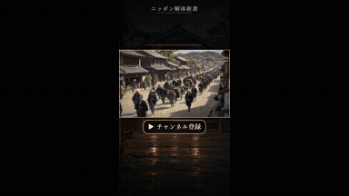</a> 
<strong>Edo Period YouTube Channel Promo Video Agent</strong> 
Use: Oren shares a promotional short video for their YouTube channel ('Nippon Kaitai Shinsho') depicting 200-year-old Edo life, orchestrated by Claude Opus 5.5 via Claude Code calling fal's H3 Max Turbo for visual generation and Gemini 3.8 Flash TTS for narration. Inputs: User inputs not specified by the author Tools: Tool setup not specified by the source 
<a href="https://x.com/Oren46902/status/2104522740695007363">Original post ↗</a> · <a href="../../prompts/2104522740695007363.md">Prompt ↗</a>
</td>
<td width="33%" valign="top">
 
<strong>Halo Health App Concept Animation</strong> 
Use: Claude Opus 5.5 is prompted to design a health and fitness mobile app concept called 'halo' and animate it into a polished 17-second product presentation video. Inputs: User inputs not specified by the author Tools: Tool setup not specified by the source 
<a href="https://x.com/buildwithgautam/status/2104522362402267138">Original post ↗</a> · <a href="../../prompts/2104522362402267138.md">Prompt ↗</a>
</td>
</tr>
<tr>
<td width="33%" valign="top">
 
<strong>Opus 5.5 制作《星际穿越里的真物理》黑洞篇动效科普视频</strong> 
Use: 作者展示使用 Claude Opus 5.5 基于单句主题「《星际穿越里的真物理》——黑洞篇」生成的科学动效解说视频，呈现了卡冈图雅黑洞、引力透镜、时间膨胀与事件视界望远镜对比等复杂视觉与双语字幕。 Inputs: User inputs not specified by the author Tools: Tool setup not specified by the source 
<a href="https://x.com/AndyL5cc/status/2104519528873103773">Original post ↗</a> · <a href="../../prompts/2104519528873103773.md">Prompt ↗</a>
</td>
<td width="33%" valign="top">
 
<strong>Claude Opus 5.5 Self-Reflective Music Video via Procedural Text…</strong> 
Use: Claude Opus 5.5 was prompted to write a song and generate every visual frame as procedural code composed entirely of text, paired with audio generated via Suno v6. Inputs: User inputs not specified by the author Tools: Tool setup not specified by the source 
<a href="https://x.com/buskerrrrrr/status/2104518643723764131">Original post ↗</a> · <a href="../../prompts/2104518643723764131.md">Prompt ↗</a>
</td>
<td width="33%" valign="top">
<a href="../../prompts/2104512100844613836.md">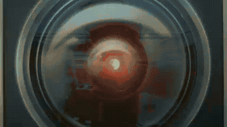</a> 
<strong>Opus 5.5 AI Threat Movie Supercut Mashup</strong> 
Use: Claude Opus 5.5 acted as an agent to source, select, and edit movie clips into a rhythmic AI-threat supercut synchronized to a reference soundtrack. Inputs: Reference mashup video by creator 'Fanta' used for pacing style and soundtrack. Tools: Tool setup not specified by the source 
<a href="https://x.com/threeaus/status/2104512100844613836">Original post ↗</a> · <a href="../../prompts/2104512100844613836.md">Prompt ↗</a>
</td>
</tr>
<tr>
<td width="33%" valign="top">
 
<strong>Claude Opus 5.5 自画像映像『窓のない部屋』</strong> 
Use: Claude Opus 5.5がコードを生成し、映像と音楽の両方を自律制作した1分21秒の自画像映像作品。 Inputs: User inputs not specified by the author Tools: Tool setup not specified by the source 
<a href="https://x.com/July4Chi/status/2104510125298090331">Original post ↗</a> · <a href="../../prompts/2104510125298090331.md">Prompt ↗</a>
</td>
<td width="33%" valign="top">
 
<strong>History of Machine Communications Motion Graphic Video</strong> 
Use: Claude Opus 5.5 was prompted to create a motion graphic video about the history of technology, resulting in animated kinetic typography and timeline visuals illustrating humanity's first transmitted messages. Inputs: User inputs not specified by the author Tools: Tool setup not specified by the source 
<a href="https://x.com/egemntoprak/status/2104506459530866869">Original post ↗</a> · <a href="../../prompts/2104506459530866869.md">Prompt ↗</a>
</td>
<td width="33%" valign="top">
<a href="../../prompts/2104500966389399716.md">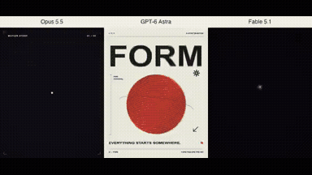</a> 
<strong>Side-by-Side Motion Graphics Benchmark: Opus 5.5 vs GPT-6 Astra…</strong> 
Use: Charlie Hills tests Claude Opus 5.5 alongside Astra and Fable on a motion graphics task with an open-ended directive, presenting a side-by-side comparison video of four synchronized animation scenes. Inputs: User inputs not specified by the author Tools: Tool setup not specified by the source 
<a href="https://x.com/charliejhills/status/2104500966389399716">Original post ↗</a> · <a href="../../prompts/2104500966389399716.md">Prompt ↗</a>
</td>
</tr>
<tr>
<td width="33%" valign="top">
<a href="../../prompts/2104499446872457243.md">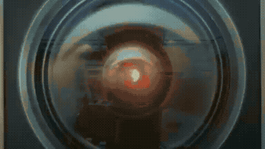</a> 
<strong>Opus 5.5 驱动全自动 AI 威胁论电影混剪视频制作</strong> 
Use: 作者向 Claude Opus 5.5 提供参考混剪样本并要求以 AI 威胁论为主题，由 Opus 5.5 自主选题、检索下载影视台词片段、卡点配乐并生成字幕，完成全流程视频混剪制作。 Inputs: User inputs not specified by the author Tools: Tool setup not specified by the source 
<a href="https://x.com/threeaus/status/2104499446872457243">Original post ↗</a> · <a href="../../prompts/2104499446872457243.md">Prompt ↗</a>
</td>
<td width="33%" valign="top">
 
<strong>Portfolio Teaser Motion Graphics Video</strong> 
Use: Pawan Kumar shared a vertical portfolio teaser video showcasing software engineering projects and metrics, created using Claude Opus 5.5. Inputs: User inputs not specified by the author Tools: Tool setup not specified by the source 
<a href="https://x.com/pksingh1508/status/2104493973339570288">Original post ↗</a> · <a href="../../prompts/2104493973339570288.md">Prompt ↗</a>
</td>
<td width="33%" valign="top">
 
<strong>Opus 5.5 Product Explainer Video Generation</strong> 
Use: Educational / explainer video Inputs: YouTube animated explainer reference videos Tools: Tool setup not specified by the source 
<a href="https://x.com/andrewmichaelsa/status/2104490962139385936">Original post ↗</a> · <a href="../../prompts/2104490962139385936.md">Prompt ↗</a>
</td>
</tr>
<tr>
<td width="33%" valign="top">
 
<strong>Exhibit A Product Demo Video Generation with Voiceover</strong> 
Use: The author demonstrates a 2-minute 25-second product demo video with voiceover for the chargeback defense app Exhibit A, claiming it was produced in Claude Opus 5.5 via a single prompt without external connectors. Inputs: User inputs not specified by the author Tools: Tool setup not specified by the source 
<a href="https://x.com/kenn_ronin/status/2104487655757029501">Original post ↗</a> · <a href="../../prompts/2104487655757029501.md">Prompt ↗</a>
</td>
<td width="33%" valign="top">
 
<strong>Drooling Cat Motion Graphic Animation with Opus 5.5</strong> 
Use: The author shares a dynamic 2D motion graphic animation featuring a drooling cat, generated after prompting Opus 5.5 to create an illustration and animation. Inputs: User inputs not specified by the author Tools: Tool setup not specified by the source 
<a href="https://x.com/zanki00000/status/2104484761238671402">Original post ↗</a> · <a href="../../prompts/2104484761238671402.md">Prompt ↗</a>
</td>
<td width="33%" valign="top">
 
<strong>Dynamic 15-second motion graphics referral video</strong> 
Use: Motion graphics / showreel Inputs: User inputs not specified by the author Tools: Tool setup not specified by the source 
<a href="https://x.com/paulo_kombucha/status/2104481235028283883">Original post ↗</a> · <a href="../../prompts/2104481235028283883.md">Prompt ↗</a>
</td>
</tr>
<tr>
<td width="33%" valign="top">
 
<strong>India's Got Latent Explainer Breakdown</strong> 
Use: Ratnaksh Tyagi shares an animated motion graphics explainer breaking down the comedy talent show 'India's Got Latent', attributing the generation task to Opus 5.5. Inputs: User inputs not specified by the author Tools: Tool setup not specified by the source 
<a href="https://x.com/ratnakshtyagi27/status/2104474644279697754">Original post ↗</a> · <a href="../../prompts/2104474644279697754.md">Prompt ↗</a>
</td>
<td width="33%" valign="top">
<a href="../../prompts/2104474025674326065.md">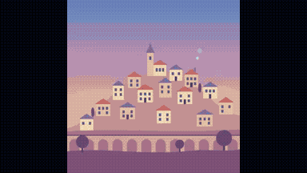</a> 
<strong>Looping Hillside Town SVG/CSS Animation with Opus 5.5</strong> 
Use: Sundry Mill tests Claude Opus 5.5 to generate a single-file looping HTML, inline SVG, and CSS animation of a hillside town transitioning from sunrise to night. Inputs: User inputs not specified by the author Tools: Tool setup not specified by the source 
<a href="https://x.com/SundryMill/status/2104474025674326065">Original post ↗</a> · <a href="../../prompts/2104474025674326065.md">Prompt ↗</a>
</td>
<td width="33%" valign="top">
 
<strong>Opus 5.5 Applore Product Promo Video</strong> 
Use: The author prompts Claude Opus 5.5 to create a creative and stunning promotional video for the product Applore, resulting in a dynamic motion graphics showcase of app icons and features. Inputs: User inputs not specified by the author Tools: Tool setup not specified by the source 
<a href="https://x.com/decohack/status/2104472001838465236">Original post ↗</a> · <a href="../../prompts/2104472001838465236.md">Prompt ↗</a>
</td>
</tr>
<tr>
<td width="33%" valign="top">
<a href="../../prompts/2104467879911686448.md">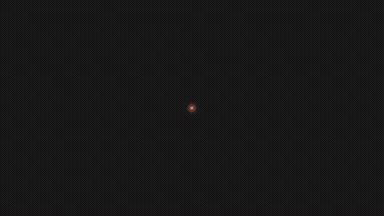</a> 
<strong>Crew in the Dark Motion Design Music Video</strong> 
Use: Satirical kinetic typography and motion graphics music video poking fun at single-prompt AI claims, crediting Claude Opus 5.5 for the visual generation and code orchestration. Inputs: User inputs not specified by the author Tools: Tool setup not specified by the source 
<a href="https://x.com/Sadegh1068/status/2104467879911686448">Original post ↗</a> · <a href="../../prompts/2104467879911686448.md">Prompt ↗</a>
</td>
<td width="33%" valign="top">
 
<strong>Remotion Search History 15s Timeline Animation</strong> 
Use: Author used Claude Opus 5.5 to write Remotion code generating a 15-second motion graphics timeline depicting the history of search from 1996 to 2015 with neon numbers and SVG illustrations. Inputs: User inputs not specified by the author Tools: Tool setup not specified by the source 
<a href="https://x.com/rpa_dake/status/2104466394859593915">Original post ↗</a> · <a href="../../prompts/2104466394859593915.md">Prompt ↗</a>
</td>
<td width="33%" valign="top">
 
<strong>Claude Opus 5.5 Unity Rain and Lightning Effect Experiment</strong> 
Use: Unity weather-effects experiment Inputs: Base Unity scene with simple 3D primitives and terrain before weather effects were added. Tools: Tool setup not specified by the source 
<a href="https://x.com/threediveai/status/2104458970865996117">Original post ↗</a> · <a href="../../prompts/2104458970865996117.md">Prompt ↗</a>
</td>
</tr>
<tr>
<td width="33%" valign="top">
<a href="../../prompts/2104458849524863062.md">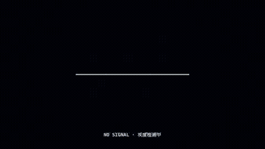</a> 
<strong>DeepSeek 灰测版魔性 MV 动画制作</strong> 
Use: 作者使用 Opus 5.5（xhigh 档位）制作了一支关于 DeepSeek 灰度测试主题的 2D 动效音乐 MV，包含丰富的角色动画、动态排版及分镜。 Inputs: User inputs not specified by the author Tools: Tool setup not specified by the source 
<a href="https://x.com/esrhengwu/status/2104458849524863062">Original post ↗</a> · <a href="../../prompts/2104458849524863062.md">Prompt ↗</a>
</td>
<td width="33%" valign="top">
<a href="../../prompts/2104455320424915273.md">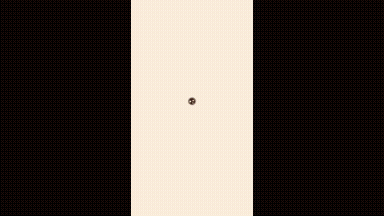</a> 
<strong>Dynamic App Update Motion Graphics with Opus 5.5</strong> 
Use: Motion graphics / showreel Inputs: User inputs not specified by the author Tools: Tool setup not specified by the source 
<a href="https://x.com/thilina_a/status/2104455320424915273">Original post ↗</a> · <a href="../../prompts/2104455320424915273.md">Prompt ↗</a>
</td>
<td width="33%" valign="top">
 
<strong>Opus 5.5 Product Demo Show Reel Generation</strong> 
Use: Vikash Sharma demonstrates using Claude Opus 5.5 in a code editor with project codebase access to generate a complete motion graphics product demo reel for The Talent App from a single prompt and reference. Inputs: Visual or video reference pointed to by the user Tools: Tool setup not specified by the source 
<a href="https://x.com/VikashSparxIT/status/2104453496363999462">Original post ↗</a> · <a href="../../prompts/2104453496363999462.md">Prompt ↗</a>
</td>
</tr>
<tr>
<td width="33%" valign="top">
 
<strong>Claude Opus 5.5 Shader-Based Atomic Bomb Animation</strong> 
Use: The author demonstrates an animation generated via shaders and code written by Claude Opus 5.5 based on the concept of slouching in a chair and witnessing an atomic bomb explosion. Inputs: User inputs not specified by the author Tools: Tool setup not specified by the source 
<a href="https://x.com/esrhengwu/status/2104448788790477239">Original post ↗</a> · <a href="../../prompts/2104448788790477239.md">Prompt ↗</a>
</td>
<td width="33%" valign="top">
<a href="../../prompts/2104446990008611251.md">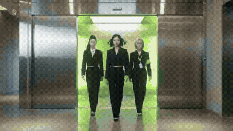</a> 
<strong>K-pop Style AI Security Music Video Orchestrated by Opus 5.5</strong> 
Use: Jiquan Ngiam uses Claude Opus 5.5 to analyze reference video pacing, synthesize company documentation into song lyrics, generate a soundtrack via Suno, and orchestrate RunwayML to generate a complete K-pop music video for their product Mint. Inputs: Reference video referred to as 'the pdoom video' used for reverse-engineering pacing/structure Tools: Tool setup not specified by the source 
<a href="https://x.com/JiquanNgiam/status/2104446990008611251">Original post ↗</a> · <a href="../../prompts/2104446990008611251.md">Prompt ↗</a>
</td>
<td width="33%" valign="top">
 
<strong>Sneakers O'Toole Music Video</strong> 
Use: Music video Inputs: User inputs not specified by the author Tools: Tool setup not specified by the source 
<a href="https://x.com/coffemoth/status/2104429604815675791">Original post ↗</a> · <a href="../../prompts/2104429604815675791.md">Prompt ↗</a>
</td>
</tr>
<tr>
<td width="33%" valign="top">
 
<strong>Opus 5.5 制作《水运仪象台》科普三维解构视频</strong> 
Use: 作者测试使用 Opus 5.5 输入简短提示制作关于北宋「水运仪象台」的 3D 解构与原理解析科普视频，视频包含机械结构拆解、擒纵机构运转展示及配音字幕。 Inputs: User inputs not specified by the author Tools: Tool setup not specified by the source 
<a href="https://x.com/AndyL5cc/status/2104428313544667245">Original post ↗</a> · <a href="../../prompts/2104428313544667245.md">Prompt ↗</a>
</td>
<td width="33%" valign="top">
 
<strong>Resume Motion Showreel Generated</strong> 
Use: Motion graphics / showreel Inputs: User inputs not specified by the author Tools: Tool setup not specified by the source 
<a href="https://x.com/Sayan_shanky/status/2104424421641314396">Original post ↗</a> · <a href="../../prompts/2104424421641314396.md">Prompt ↗</a>
</td>
<td width="33%" valign="top">
 
<strong>Persistence of Vision: A History of Hollywood in Code</strong> 
Use: An animated short film tracing the history of cinema rendered from light and volumetric particle motes, created via code with Claude Opus 5.5 and narrated by ElevenLabs. Inputs: Historical film references including The Horse in Motion, The Black Maria, and others. Tools: Tool setup not specified by the source 
<a href="https://x.com/abhi81i/status/2104419703997567302">Original post ↗</a> · <a href="../../prompts/2104419703997567302.md">Prompt ↗</a>
</td>
</tr>
<tr>
<td width="33%" valign="top">
 
<strong>Programmatic 2D Animated English Learning Video via Opus 5.5 Code</strong> 
Use: Author uses Claude Opus 5.5 to write code for generating consistent 2D vector-style animated English learning videos with character graphics, motion, and lip-sync handled programmatically. Inputs: User inputs not specified by the author Tools: Tool setup not specified by the source 
<a href="https://x.com/bangbuilds/status/2104418374218600719">Original post ↗</a> · <a href="../../prompts/2104418374218600719.md">Prompt ↗</a>
</td>
<td width="33%" valign="top">
 
<strong>空气微流控芯片散热原理解析视频制作</strong> 
Use: 作者展示了由 Claude Opus 5.5 制作的关于 JouleForce 空气微流控/微通道芯片散热原理的科普动态图解视频，涵盖牛顿冷却定律、边界层效应、微通道压阻与工况对比等科学动画。 Inputs: User inputs not specified by the author Tools: Tool setup not specified by the source 
<a href="https://x.com/happyanniegh3/status/2104416503164731646">Original post ↗</a> · <a href="../../prompts/2104416503164731646.md">Prompt ↗</a>
</td>
<td width="33%" valign="top">
 
<strong>Animated Book Preview for Winning With AI</strong> 
Use: Author prompts Claude Opus 5.5 to create an animated motion-graphics preview for the book 'Winning With AI', discussing how Opus 5.5 creates code-driven animations (HTML/SVG/GSAP) rather than natively rendering pixels. Inputs: User inputs not specified by the author Tools: Tool setup not specified by the source 
<a href="https://x.com/anujmagazine/status/2104413797876367664">Original post ↗</a> · <a href="../../prompts/2104413797876367664.md">Prompt ↗</a>
</td>
</tr>
<tr>
<td width="33%" valign="top">
<a href="../../prompts/2104413549896614066.md">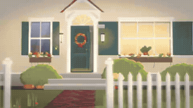</a> 
<strong>Autonomous Animated Short Production Attempt</strong> 
Use: Zach Harrison documents an experiment using Claude Opus 5.5 via Claude Console as an autonomous coding agent instructed to create, refine, and render an animated short video entirely in code. Inputs: User inputs not specified by the author Tools: Tool setup not specified by the source 
<a href="https://x.com/Zach__Harrison/status/2104413549896614066">Original post ↗</a> · <a href="../../prompts/2104413549896614066.md">Prompt ↗</a>
</td>
<td width="33%" valign="top">
 
<strong>Toyota Prius 2027 3D Disassembly and Animation in Blender</strong> 
Use: 3D modeling and exploded-view animation of a Toyota Prius 2027 in Blender, showing disassembly into 261 pieces, reassembly, and rainbow to mustard color shifting, led by Claude Opus 5.5 with assistance from GPT-Astra and Gemini. Inputs: User inputs not specified by the author Tools: Tool setup not specified by the source 
<a href="https://x.com/abxda/status/2104410894167916709">Original post ↗</a> · <a href="../../prompts/2104410894167916709.md">Prompt ↗</a>
</td>
<td width="33%" valign="top">
 
<strong>AI Portfolio Showreel Edited with Opus 5.5</strong> 
Use: Eric Zheng used Claude Opus 5.5 to direct and edit a one-minute personal showreel from his existing production footage by having Opus generate the editing workflow as code. Inputs: User inputs not specified by the author Tools: Tool setup not specified by the source 
<a href="https://x.com/EZheng66099/status/2104410457263976899">Original post ↗</a> · <a href="../../prompts/2104410457263976899.md">Prompt ↗</a>
</td>
</tr>
<tr>
<td width="33%" valign="top">
 
<strong>全自動ポン出しコントアニメ「おばけ屋敷のおばけが、怖がらせる前に全部説明してくるやつ」</strong> 
Use: Claude Opus 5.5を活用し、シナリオ・イラスト・アニメーション・音声まで一括指定して制作された2分2秒の短編コントアニメーション動画。 Inputs: User inputs not specified by the author Tools: Tool setup not specified by the source 
<a href="https://x.com/cryptoninjanime/status/2104409268351062188">Original post ↗</a> · <a href="../../prompts/2104409268351062188.md">Prompt ↗</a>
</td>
<td width="33%" valign="top">
<a href="../../prompts/2104408032792990102.md">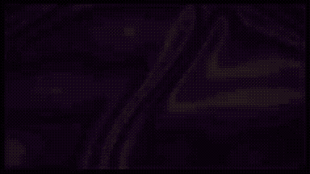</a> 
<strong>Spoken Word Video: All Watched Over by Machines of Loving Grace</strong> 
Use: Bret Kerr shares a psychedelic motion graphics spoken-word animated video for Richard Brautigan's poem 'All Watched Over by Machines of Loving Grace', created using Claude Opus 5.5. Inputs: User inputs not specified by the author Tools: Tool setup not specified by the source 
<a href="https://x.com/BretKerr/status/2104408032792990102">Original post ↗</a> · <a href="../../prompts/2104408032792990102.md">Prompt ↗</a>
</td>
<td width="33%" valign="top">
 
<strong>防犯ダンス(翠都銀行)の動画制作とエフェクト付与</strong> 
Use: M7［mi7］AI氏がAZ8プラットフォーム上でSeedance 2.5 OpusとOpus 5.5を連携させ、銀行強盗対策の『防犯ダンス』動画にタイポグラフィやエフェクトを付与して制作した事例。 Inputs: User inputs not specified by the author Tools: Tool setup not specified by the source 
<a href="https://x.com/mi7_crypto/status/2104403368752071059">Original post ↗</a> · <a href="../../prompts/2104403368752071059.md">Prompt ↗</a>
</td>
</tr>
<tr>
<td width="33%" valign="top">
 
<strong>Seattle History Motion Graphics Video</strong> 
Use: Motion graphics / showreel Inputs: User inputs not specified by the author Tools: Tool setup not specified by the source 
<a href="https://x.com/yanliudesign/status/2104393313935839698">Original post ↗</a> · <a href="../../prompts/2104393313935839698.md">Prompt ↗</a>
</td>
<td width="33%" valign="top">
 
<strong>SQLite Explainer Animation and Architectural Walkthrough</strong> 
Use: Deedy shares a 7-minute technical explainer animation analyzing SQLite's codebase structure, query lifecycle, and join-order execution, generated with Claude Opus 5.5 and Gemini TTS. Inputs: User inputs not specified by the author Tools: Tool setup not specified by the source 
<a href="https://x.com/deedydas/status/2104391577091407965">Original post ↗</a> · <a href="../../prompts/2104391577091407965.md">Prompt ↗</a>
</td>
<td width="33%" valign="top">
 
<strong>Bedless Fajr App Motion Graphics Showreel via Remotion</strong> 
Use: Motion graphics / showreel Inputs: User inputs not specified by the author Tools: Tool setup not specified by the source 
<a href="https://x.com/zakisbuilding/status/2104389736647495680">Original post ↗</a> · <a href="../../prompts/2104389736647495680.md">Prompt ↗</a>
</td>
</tr>
<tr>
<td width="33%" valign="top">
 
<strong>Opus 5.5 Future of Human-AI Relationship Animation</strong> 
Use: Leo showcases an animated short film exploring the collaborative future between humans and artificial intelligence, created using Claude Opus 5.5. Inputs: User inputs not specified by the author Tools: Tool setup not specified by the source 
<a href="https://x.com/lzequin/status/2104213206629572779">Original post ↗</a> · <a href="../../prompts/2104213206629572779.md">Prompt ↗</a>
</td>
<td width="33%" valign="top">
 
<strong>15-Second Claude Opus 5.5 Motion Design Showcase</strong> 
Use: Motion graphics / showreel Inputs: User inputs not specified by the author Tools: Tool setup not specified by the source 
<a href="https://x.com/nansdeyz_/status/2104204905523126560">Original post ↗</a> · <a href="../../prompts/2104204905523126560.md">Prompt ↗</a>
</td>
<td width="33%" valign="top">
 
<strong>Coding Agent Explainer Video</strong> 
Use: Arthur Katcher shares a 40-second motion-graphics explainer video on how coding agents work, generated in a single prompt using Claude Code (Opus 5.5) with Remotion and a NumPy audio synthesizer. Inputs: User inputs not specified by the author Tools: Tool setup not specified by the source 
<a href="https://x.com/arthurkatcher/status/2104198927549604161">Original post ↗</a> · <a href="../../prompts/2104198927549604161.md">Prompt ↗</a>
</td>
</tr>
<tr>
<td width="33%" valign="top">
 
<strong>Claude Code 3D Enclosure Promo Video</strong> 
Use: Product / brand film Inputs: User inputs not specified by the author Tools: Tool setup not specified by the source 
<a href="https://x.com/VectorCrossProd/status/2104093497561436573">Original post ↗</a> · <a href="../../prompts/2104093497561436573.md">Prompt ↗</a>
</td>
<td width="33%" valign="top">
 
<strong>Tree as an Ecosystem Animation</strong> 
Use: An animated video explaining the concept of a tree as an ecosystem, generated using a simple one-liner prompt in Opus 5.5. Inputs: User inputs not specified by the author Tools: Tool setup not specified by the source 
<a href="https://x.com/hunzai/status/2103904436141842605">Original post ↗</a> · <a href="../../prompts/2103904436141842605.md">Prompt ↗</a>
</td>
<td width="33%" valign="top">
 
<strong>Porco Rosso Sunset Dogfight Web3D</strong> 
Use: A Web3D prompt used with Opus 5.5 and Three.js to recreate the classic dogfight scene from Hayao Miyazaki's 'Porco Rosso' over a sunset sea. Inputs: User inputs not specified by the author Tools: Tool setup not specified by the source 
<a href="https://x.com/NFT_Chen/status/2103882415299350878">Original post ↗</a> · <a href="../../prompts/2103882415299350878.md">Prompt ↗</a>
</td>
</tr>
<tr>
<td width="33%" valign="top">
 
<strong>3D Forest Conservation Website</strong> 
Use: A 3D website for a forest conservation agency generated in a single HTML file using Opus 5.5 based on a Pinterest reference. Inputs: User inputs not specified by the author Tools: Tool setup not specified by the source 
<a href="https://x.com/Souradip3000/status/2103876499262800291">Original post ↗</a> · <a href="../../prompts/2103876499262800291.md">Prompt ↗</a>
</td>
<td width="33%" valign="top">
 
<strong>Chaindotwtf Pitch Video</strong> 
Use: A concise prompt used with Opus 5.5 to generate a 30-second brand pitch video. Inputs: User inputs not specified by the author Tools: Tool setup not specified by the source 
<a href="https://x.com/SPEARwtf/status/2103857153308029058">Original post ↗</a> · <a href="../../prompts/2103857153308029058.md">Prompt ↗</a>
</td>
<td width="33%" valign="top">
 
<strong>Remotion Video Generation with Opus 5.5</strong> 
Use: Dany shares a presentation video generated with Opus 5.5 for Brieform using a simple prompt. Inputs: User inputs not specified by the author Tools: Tool setup not specified by the source 
<a href="https://x.com/MajorBaguette/status/2103849602826834228">Original post ↗</a> · <a href="../../prompts/2103849602826834228.md">Prompt ↗</a>
</td>
</tr>
<tr>
<td width="33%" valign="top">
 
<strong>Motion Design Showcase Animation</strong> 
Use: Motion graphics / showreel Inputs: User inputs not specified by the author Tools: Tool setup not specified by the source 
<a href="https://x.com/Dannnnnok/status/2103846630088716687">Original post ↗</a> · <a href="../../prompts/2103846630088716687.md">Prompt ↗</a>
</td>
<td width="33%" valign="top">
 
<strong>Product Promo Video Generation</strong> 
Use: Product promotional video Inputs: Product URL and product details Tools: FFmpeg / JavaScript / Playwright 
<a href="https://x.com/felipemoller/status/2103846311149936736">Original post ↗</a> · <a href="../../prompts/2103846311149936736.md">Prompt ↗</a>
</td>
<td width="33%" valign="top">
 
<strong>AI Data Centre 3D Motion Graphic</strong> 
Use: A prompt given to Claude Opus 5.5 to generate a 3D browser animation inside a single HTML file showing what happens inside an AI data center down to the Blackwell silicon. Inputs: User inputs not specified by the author Tools: Tool setup not specified by the source 
<a href="https://x.com/mdaman010/status/2103845689713111079">Original post ↗</a> · <a href="../../prompts/2103845689713111079.md">Prompt ↗</a>
</td>
</tr>
<tr>
<td width="33%" valign="top">
 
<strong>Remotion Product Intro</strong> 
Use: Product introduction video Inputs: Product URL, screenshots, logo and assets; Music for beat-synchronized motion Tools: Tool setup not specified by the source 
<a href="https://x.com/HO_BA/status/2103845264649761062">Original post ↗</a> · <a href="../../prompts/2103845264649761062.md">Prompt ↗</a>
</td>
<td width="33%" valign="top">
 
<strong>Showcase Motion Graphics Animation</strong> 
Use: Motion graphics / showreel Inputs: User inputs not specified by the author Tools: Tool setup not specified by the source 
<a href="https://x.com/nolkeeg/status/2103841917603635633">Original post ↗</a> · <a href="../../prompts/2103841917603635633.md">Prompt ↗</a>
</td>
<td width="33%" valign="top">
 
<strong>Opus Motion Graphics</strong> 
Use: Motion graphics / showreel Inputs: User inputs not specified by the author Tools: Tool setup not specified by the source 
<a href="https://x.com/Ishaaqahamed/status/2103837917538107563">Original post ↗</a> · <a href="../../prompts/2103837917538107563.md">Prompt ↗</a>
</td>
</tr>
<tr>
<td width="33%" valign="top">
 
<strong>Portfolio Motion Design Video</strong> 
Use: A prompt directing an AI model to act as a professional motion designer and create a ~30-second portfolio showcase video utilizing trending motion and sound design techniques. Inputs: User inputs not specified by the author Tools: Tool setup not specified by the source 
<a href="https://x.com/heyiammallik/status/2103837803587293397">Original post ↗</a> · <a href="../../prompts/2103837803587293397.md">Prompt ↗</a>
</td>
<td width="33%" valign="top">
 
<strong>Creative Coding Prompt for Opus 5.5</strong> 
Use: A creative prompt asking the AI model to build an immersive, jaw-dropping experience using pure code, generative audio, and real-time visuals. Inputs: User inputs not specified by the author Tools: Tool setup not specified by the source 
<a href="https://x.com/MiaAI_lab/status/2103837519615774895">Original post ↗</a> · <a href="../../prompts/2103837519615774895.md">Prompt ↗</a>
</td>
<td width="33%" valign="top">
 
<strong>Earth to Observable Universe Zoom-Out</strong> 
Use: Krzysztof Gonia prompted Opus 5.5 to generate a Three.js cinematic film that smoothly zooms out from an Earth hillside all the way to the observable universe without external assets. Inputs: No external assets required by the prompt Tools: Tool setup not specified by the source 
<a href="https://x.com/kgonia7/status/2103835848575746268">Original post ↗</a> · <a href="../../prompts/2103835848575746268.md">Prompt ↗</a>
</td>
</tr>
<tr>
<td width="33%" valign="top">
 
<strong>Code-Based Apple-Style Keynote Motion Design</strong> 
Use: Brand launch film Inputs: Brand name; 9–12 high-res photos; ~120 BPM music; moving plant-shadow stock video Tools: FFmpeg / Playwright 
<a href="https://x.com/twoclipping/status/2103835273813496100">Original post ↗</a> · <a href="../../prompts/2103835273813496100.md">Prompt ↗</a>
</td>
<td width="33%" valign="top">
 
<strong>Motion Designer Graphics</strong> 
Use: A creator shares a concise prompt used with Opus 5.5 to generate a dynamic 15-second motion graphics video. Inputs: User inputs not specified by the author Tools: Tool setup not specified by the source 
<a href="https://x.com/ChatGptAstra/status/2103834787647807540">Original post ↗</a> · <a href="../../prompts/2103834787647807540.md">Prompt ↗</a>
</td>
<td width="33%" valign="top">
 
<strong>3D Desk to CPU Atom Zoom</strong> 
Use: A continuous 3D browser-rendered motion graphic zooming in from a desk all the way down to a single silicon atom inside a CPU, created with Claude Opus 5.5. Inputs: User inputs not specified by the author Tools: Tool setup not specified by the source 
<a href="https://x.com/Acoramaa/status/2103833991879053577">Original post ↗</a> · <a href="../../prompts/2103833991879053577.md">Prompt ↗</a>
</td>
</tr>
<tr>
<td width="33%" valign="top">
 
<strong>Motion Graphics Showreel</strong> 
Use: Motion graphics / showreel Inputs: User inputs not specified by the author Tools: Tool setup not specified by the source 
<a href="https://x.com/ndhabarde11/status/2103832593355686104">Original post ↗</a> · <a href="../../prompts/2103832593355686104.md">Prompt ↗</a>
</td>
<td width="33%" valign="top">
 
<strong>Dynamic Motion Graphics Showreel</strong> 
Use: Motion graphics / showreel Inputs: User inputs not specified by the author Tools: Tool setup not specified by the source 
<a href="https://x.com/MisbahSy/status/2103831201114882277">Original post ↗</a> · <a href="../../prompts/2103831201114882277.md">Prompt ↗</a>
</td>
<td width="33%" valign="top">
<a href="../../prompts/2103831140033241156.md">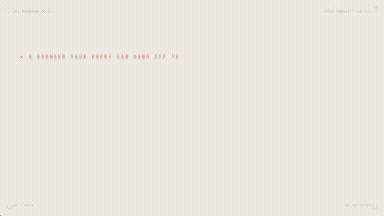</a> 
<strong>Open-Source Project Launch Video</strong> 
Use: Motion graphics / showreel Inputs: User inputs not specified by the author Tools: Tool setup not specified by the source 
<a href="https://x.com/hqmank/status/2103831140033241156">Original post ↗</a> · <a href="../../prompts/2103831140033241156.md">Prompt ↗</a>
</td>
</tr>
<tr>
<td width="33%" valign="top">
 
<strong>Motion Graphics Showreel</strong> 
Use: Motion graphics / showreel Inputs: User inputs not specified by the author Tools: Tool setup not specified by the source 
<a href="https://x.com/eyishazyer/status/2103816865852129686">Original post ↗</a> · <a href="../../prompts/2103816865852129686.md">Prompt ↗</a>
</td>
<td width="33%" valign="top">
 
<strong>SaaS Product Launch Motion Graphics Video</strong> 
Use: Motion graphics / showreel Inputs: User inputs not specified by the author Tools: Tool setup not specified by the source 
<a href="https://x.com/gouthamjay8/status/2103816261339910269">Original post ↗</a> · <a href="../../prompts/2103816261339910269.md">Prompt ↗</a>
</td>
<td width="33%" valign="top">
 
<strong>Mechanical Keyboard Explainer</strong> 
Use: Educational / explainer video Inputs: User inputs not specified by the author Tools: Tool setup not specified by the source 
<a href="https://x.com/iniyanai/status/2103814603100856596">Original post ↗</a> · <a href="../../prompts/2103814603100856596.md">Prompt ↗</a>
</td>
</tr>
<tr>
<td width="33%" valign="top">
 
<strong>Emotional App Video</strong> 
Use: Mark Hinschberger shares a single prompt used to create an emotional promotional video for his app. Inputs: User inputs not specified by the author Tools: Tool setup not specified by the source 
<a href="https://x.com/marklaunches/status/2103811146411041046">Original post ↗</a> · <a href="../../prompts/2103811146411041046.md">Prompt ↗</a>
</td>
<td width="33%" valign="top">
 
<strong>Email Verification Tool SaaS Motion Graphics</strong> 
Use: Motion graphics / showreel Inputs: User inputs not specified by the author Tools: Tool setup not specified by the source 
<a href="https://x.com/KmAsiff/status/2103810247131549880">Original post ↗</a> · <a href="../../prompts/2103810247131549880.md">Prompt ↗</a>
</td>
<td width="33%" valign="top">
 
<strong>Mimicly Motion Design Ad Strategy</strong> 
Use: Motion graphics / showreel Inputs: User inputs not specified by the author Tools: Tool setup not specified by the source 
<a href="https://x.com/redpersongpt/status/2103807094554284430">Original post ↗</a> · <a href="../../prompts/2103807094554284430.md">Prompt ↗</a>
</td>
</tr>
<tr>
<td width="33%" valign="top">
 
<strong>Video Summarizing Political Life in Morocco</strong> 
Use: Trig-lycee shares a video generated through prompts using Claude Opus 5.5 to summarize Moroccan political history since independence. Inputs: User inputs not specified by the author Tools: Tool setup not specified by the source 
<a href="https://x.com/TrigLyceee/status/2103804459986161719">Original post ↗</a> · <a href="../../prompts/2103804459986161719.md">Prompt ↗</a>
</td>
<td width="33%" valign="top">
 
<strong>Logo Motion Design Reveal</strong> 
Use: Motion graphics / showreel Inputs: User inputs not specified by the author Tools: Tool setup not specified by the source 
<a href="https://x.com/Mounnna/status/2103802871934497266">Original post ↗</a> · <a href="../../prompts/2103802871934497266.md">Prompt ↗</a>
</td>
<td width="33%" valign="top">
<a href="../../prompts/2103802280617402509.md">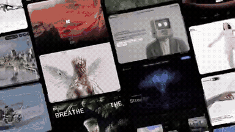</a> 
<strong>MotionSites AI Launch Video</strong> 
Use: Viktor Oddy shares a prompt used to generate a milestone motion video celebrating MotionSites AI reaching one million monthly visitors within eight months. Inputs: User inputs not specified by the author Tools: Tool setup not specified by the source 
<a href="https://x.com/viktoroddy/status/2103802280617402509">Original post ↗</a> · <a href="../../prompts/2103802280617402509.md">Prompt ↗</a>
</td>
</tr>
<tr>
<td width="33%" valign="top">
 
<strong>Spotify-Themed Motion Design</strong> 
Use: Music-product motion graphics Inputs: No supplied assets required; artwork generated during production Tools: Tool setup not specified by the source 
<a href="https://x.com/brainextends/status/2103801834930606193">Original post ↗</a> · <a href="../../prompts/2103801834930606193.md">Prompt ↗</a>
</td>
<td width="33%" valign="top">
 
<strong>Educational Video from Article</strong> 
Use: Educational / explainer video Inputs: User inputs not specified by the author Tools: Tool setup not specified by the source 
<a href="https://x.com/henkvaness/status/2103801351993975279">Original post ↗</a> · <a href="../../prompts/2103801351993975279.md">Prompt ↗</a>
</td>
<td width="33%" valign="top">
 
<strong>Distilbook Motion Graphics Showreel</strong> 
Use: Motion graphics / showreel Inputs: User inputs not specified by the author Tools: Tool setup not specified by the source 
<a href="https://x.com/ajith_io/status/2103800569584562538">Original post ↗</a> · <a href="../../prompts/2103800569584562538.md">Prompt ↗</a>
</td>
</tr>
<tr>
<td width="33%" valign="top">
 
<strong>Motion Graphics Showreel Video</strong> 
Use: Motion graphics / showreel Inputs: User inputs not specified by the author Tools: Tool setup not specified by the source 
<a href="https://x.com/ayushunleashed/status/2103794962257084755">Original post ↗</a> · <a href="../../prompts/2103794962257084755.md">Prompt ↗</a>
</td>
<td width="33%" valign="top">
 
<strong>Retro/Futuristic Opus 5.5 Launch Video</strong> 
Use: A video generation prompt using a style reference image to create a retro-futuristic Opus 5.5 launch video featuring film grain and CRT effects. Inputs: User inputs not specified by the author Tools: Tool setup not specified by the source 
<a href="https://x.com/johnsavage_ai/status/2103792769982427263">Original post ↗</a> · <a href="../../prompts/2103792769982427263.md">Prompt ↗</a>
</td>
<td width="33%" valign="top">
<a href="../../prompts/2103786742520184909.md">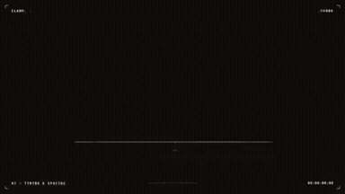</a> 
<strong>Motion Graphics Showreel</strong> 
Use: Motion graphics / showreel Inputs: User inputs not specified by the author Tools: Tool setup not specified by the source 
<a href="https://x.com/levabashidze/status/2103786742520184909">Original post ↗</a> · <a href="../../prompts/2103786742520184909.md">Prompt ↗</a>
</td>
</tr>
<tr>
<td width="33%" valign="top">
<a href="../../prompts/2103783134206566862.md">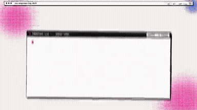</a> 
<strong>Motion Graphics Showreel</strong> 
Use: Motion graphics / showreel Inputs: User inputs not specified by the author Tools: Tool setup not specified by the source 
<a href="https://x.com/polydao/status/2103783134206566862">Original post ↗</a> · <a href="../../prompts/2103783134206566862.md">Prompt ↗</a>
</td>
<td width="33%" valign="top">
<a href="../../prompts/2103779700954779830.md">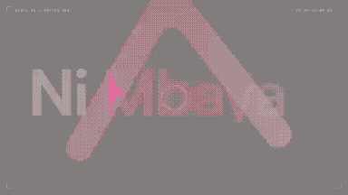</a> 
<strong>Motion Graphics Showreel</strong> 
Use: Motion graphics / showreel Inputs: User inputs not specified by the author Tools: Tool setup not specified by the source 
<a href="https://x.com/0xScoffie/status/2103779700954779830">Original post ↗</a> · <a href="../../prompts/2103779700954779830.md">Prompt ↗</a>
</td>
<td width="33%" valign="top">
 
<strong>Flexprice Motion Graphics Showreel</strong> 
Use: Motion graphics / showreel Inputs: User inputs not specified by the author Tools: Tool setup not specified by the source 
<a href="https://x.com/sudeepsd_/status/2103776623548158453">Original post ↗</a> · <a href="../../prompts/2103776623548158453.md">Prompt ↗</a>
</td>
</tr>
<tr>
<td width="33%" valign="top">
 
<strong>Product Launch Video</strong> 
Use: A prompt used with Opus 5.5 to create a fast-paced launch video under 20 seconds that highlights key product features and aligns with the brand. Inputs: User inputs not specified by the author Tools: Tool setup not specified by the source 
<a href="https://x.com/RatheeJaisal/status/2103774864742154698">Original post ↗</a> · <a href="../../prompts/2103774864742154698.md">Prompt ↗</a>
</td>
<td width="33%" valign="top">
 
<strong>Motion Graphics Showreel Video</strong> 
Use: Motion graphics / showreel Inputs: User inputs not specified by the author Tools: Tool setup not specified by the source 
<a href="https://x.com/thismacapital/status/2103773635714375808">Original post ↗</a> · <a href="../../prompts/2103773635714375808.md">Prompt ↗</a>
</td>
<td width="33%" valign="top">
 
<strong>Product Demo</strong> 
Use: Vishesh Baghel shared a prompt used with Opus to generate a product demo highlighting site features using the /brag skill. Inputs: User inputs not specified by the author Tools: Tool setup not specified by the source 
<a href="https://x.com/VisheshBaghell/status/2103772327146119508">Original post ↗</a> · <a href="../../prompts/2103772327146119508.md">Prompt ↗</a>
</td>
</tr>
<tr>
<td width="33%" valign="top">
 
<strong>Nohandslabs Motion Graphic Video</strong> 
Use: A prompt requesting a 15-second motion graphic video based on the Nohandslabs website, directing the model to go all out. Inputs: User inputs not specified by the author Tools: Tool setup not specified by the source 
<a href="https://x.com/robvjourney/status/2103768390322237474">Original post ↗</a> · <a href="../../prompts/2103768390322237474.md">Prompt ↗</a>
</td>
<td width="33%" valign="top">
 
<strong>Dynamic Motion Graphics Showreel</strong> 
Use: Motion graphics / showreel Inputs: User inputs not specified by the author Tools: Tool setup not specified by the source 
<a href="https://x.com/paukraft/status/2103766223133585863">Original post ↗</a> · <a href="../../prompts/2103766223133585863.md">Prompt ↗</a>
</td>
<td width="33%" valign="top">
 
<strong>DistilBook Motion Graphics Product Explainer Demo</strong> 
Use: Educational / explainer video Inputs: User inputs not specified by the author Tools: Tool setup not specified by the source 
<a href="https://x.com/sudo_kiran/status/2103761658745335993">Original post ↗</a> · <a href="../../prompts/2103761658745335993.md">Prompt ↗</a>
</td>
</tr>
<tr>
<td width="33%" valign="top">
 
<strong>Dynamic Motion Graphics Showreel</strong> 
Use: Motion graphics / showreel Inputs: User inputs not specified by the author Tools: Tool setup not specified by the source 
<a href="https://x.com/wallt_white/status/2103750353585942703">Original post ↗</a> · <a href="../../prompts/2103750353585942703.md">Prompt ↗</a>
</td>
<td width="33%" valign="top">
 
<strong>Dynamic Motion Design Showreel</strong> 
Use: Motion graphics / showreel Inputs: User inputs not specified by the author Tools: Tool setup not specified by the source 
<a href="https://x.com/RoxsaV2/status/2103749285846073412">Original post ↗</a> · <a href="../../prompts/2103749285846073412.md">Prompt ↗</a>
</td>
<td width="33%" valign="top">
 
<strong>Opus 5.5 Ad Inspired by Apple 1984</strong> 
Use: Concept advertisement / Apple 1984 homage Inputs: User inputs not specified by the author Tools: Tool setup not specified by the source 
<a href="https://x.com/1littlecoder/status/2103746736980378066">Original post ↗</a> · <a href="../../prompts/2103746736980378066.md">Prompt ↗</a>
</td>
</tr>
<tr>
<td width="33%" valign="top">
 
<strong>Motion Graphics Showreel</strong> 
Use: Motion graphics / showreel Inputs: User inputs not specified by the author Tools: Tool setup not specified by the source 
<a href="https://x.com/TeslaChartz/status/2103746486978887985">Original post ↗</a> · <a href="../../prompts/2103746486978887985.md">Prompt ↗</a>
</td>
<td width="33%" valign="top">
 
<strong>Motion Graphics Introduction Video</strong> 
Use: Motion graphics / showreel Inputs: User inputs not specified by the author Tools: Tool setup not specified by the source 
<a href="https://x.com/blushpetal795/status/2103744870041170220">Original post ↗</a> · <a href="../../prompts/2103744870041170220.md">Prompt ↗</a>
</td>
<td width="33%" valign="top">
 
<strong>Motion Graphics Showreel</strong> 
Use: Motion graphics / showreel Inputs: User inputs not specified by the author Tools: Tool setup not specified by the source 
<a href="https://x.com/lukasersil/status/2103742861971726495">Original post ↗</a> · <a href="../../prompts/2103742861971726495.md">Prompt ↗</a>
</td>
</tr>
<tr>
<td width="33%" valign="top">
 
<strong>Anuprerna Explainer Video</strong> 
Use: Educational / explainer video Inputs: User inputs not specified by the author Tools: Tool setup not specified by the source 
<a href="https://x.com/AmitSingha89/status/2103737604277780553">Original post ↗</a> · <a href="../../prompts/2103737604277780553.md">Prompt ↗</a>
</td>
<td width="33%" valign="top">
 
<strong>AI Data Centre 3D Film</strong> 
Use: A simple prompt given to Claude Opus to generate an animated 3D walkthrough showing what happens inside an AI data center from the grid down to silicon. Inputs: User inputs not specified by the author Tools: Tool setup not specified by the source 
<a href="https://x.com/Sayan_shanky/status/2103736579449868515">Original post ↗</a> · <a href="../../prompts/2103736579449868515.md">Prompt ↗</a>
</td>
<td width="33%" valign="top">
 
<strong>Dynamic Motion Graphics Video</strong> 
Use: Motion graphics / showreel Inputs: User inputs not specified by the author Tools: Tool setup not specified by the source 
<a href="https://x.com/prasad_pilla/status/2103728953785496049">Original post ↗</a> · <a href="../../prompts/2103728953785496049.md">Prompt ↗</a>
</td>
</tr>
<tr>
<td width="33%" valign="top">
<a href="../../prompts/2103725292095189237.md">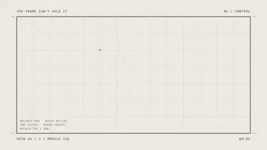</a> 
<strong>Motion Design Poster Breaking Frame</strong> 
Use: Motion graphics / showreel Inputs: User inputs not specified by the author Tools: Tool setup not specified by the source 
<a href="https://x.com/sahilvermaai/status/2103725292095189237">Original post ↗</a> · <a href="../../prompts/2103725292095189237.md">Prompt ↗</a>
</td>
<td width="33%" valign="top">
 
<strong>Dynamic Motion Graphics Video</strong> 
Use: Motion graphics / showreel Inputs: User inputs not specified by the author Tools: Tool setup not specified by the source 
<a href="https://x.com/ann_nnng/status/2103723183899852885">Original post ↗</a> · <a href="../../prompts/2103723183899852885.md">Prompt ↗</a>
</td>
<td width="33%" valign="top">
 
<strong>Psychedelic Glitch Anime Music Video</strong> 
Use: A detailed prompt for Opus 5.5 instructing it to create a psychedelic, glitch-style anime music video from still images and audio using programmatic HTML Canvas animation, Playwright capture, and FFmpeg encoding. Inputs: User inputs not specified by the author Tools: Tool setup not specified by the source 
<a href="https://x.com/pound75423/status/2103722556918464968">Original post ↗</a> · <a href="../../prompts/2103722556918464968.md">Prompt ↗</a>
</td>
</tr>
<tr>
<td width="33%" valign="top">
<a href="../../prompts/2103713416367981005.md">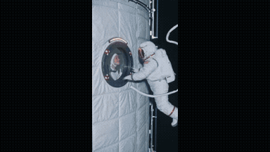</a> 
<strong>Space Station Meteor Impact Scene</strong> 
Use: A detailed 25-second, seven-cut cinematic video generation prompt for Seedance 2.5 detailing blocking, optics, audio, and physics as an astronaut and crew member witness a meteor striking Earth. Inputs: User inputs not specified by the author Tools: Tool setup not specified by the source 
<a href="https://x.com/alexwtlf/status/2103713416367981005">Original post ↗</a> · <a href="../../prompts/2103713416367981005.md">Prompt ↗</a>
</td>
<td width="33%" valign="top">
 
<strong>Dynamic Opus 5.5 Motion Graphics</strong> 
Use: Motion graphics / showreel Inputs: User inputs not specified by the author Tools: Tool setup not specified by the source 
<a href="https://x.com/souravbhar871/status/2103711849703477361">Original post ↗</a> · <a href="../../prompts/2103711849703477361.md">Prompt ↗</a>
</td>
<td width="33%" valign="top">
 
<strong>App Launch Motion Graphics Video</strong> 
Use: Motion graphics / showreel Inputs: User inputs not specified by the author Tools: Tool setup not specified by the source 
<a href="https://x.com/MustaphaFenzar/status/2103708363074973906">Original post ↗</a> · <a href="../../prompts/2103708363074973906.md">Prompt ↗</a>
</td>
</tr>
<tr>
<td width="33%" valign="top">
 
<strong>Apple-Style App Promo Video</strong> 
Use: A short prompt given to Claude Opus to generate a 30-second Apple-style promotional video for an app using Remotion and React. Inputs: User inputs not specified by the author Tools: Tool setup not specified by the source 
<a href="https://x.com/gautam_mer1/status/2103703336780530003">Original post ↗</a> · <a href="../../prompts/2103703336780530003.md">Prompt ↗</a>
</td>
<td width="33%" valign="top">
 
<strong>Animated Music Video Prompt for Claude Opus</strong> 
Use: Motion graphics / music videos Inputs: Reference MV; Song Tools: Tool setup not specified by the source 
<a href="https://x.com/doubleunplussed/status/2103697580421181894">Original post ↗</a> · <a href="../../prompts/2103697580421181894.md">Prompt ↗</a>
</td>
<td width="33%" valign="top">
 
<strong>Opus 5.5 Motion Graphics Video</strong> 
Use: Motion graphics / showreel Inputs: User inputs not specified by the author Tools: Tool setup not specified by the source 
<a href="https://x.com/bizibeast/status/2103696876130505124">Original post ↗</a> · <a href="../../prompts/2103696876130505124.md">Prompt ↗</a>
</td>
</tr>
<tr>
<td width="33%" valign="top">
<a href="../../prompts/2103692944771313960.md">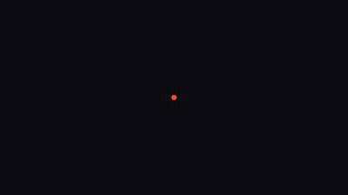</a> 
<strong>Motion Designer Showreel</strong> 
Use: Motion graphics / showreel Inputs: User inputs not specified by the author Tools: Tool setup not specified by the source 
<a href="https://x.com/motiondsgnr/status/2103692944771313960">Original post ↗</a> · <a href="../../prompts/2103692944771313960.md">Prompt ↗</a>
</td>
<td width="33%" valign="top">
 
<strong>Recursion Explanation Video</strong> 
Use: Recursion explainer Inputs: User inputs not specified by the author Tools: Tool setup not specified by the source 
<a href="https://x.com/emollick/status/2103688362960019567">Original post ↗</a> · <a href="../../prompts/2103688362960019567.md">Prompt ↗</a>
</td>
<td width="33%" valign="top">
 
<strong>Japan Summer Weather Visualization</strong> 
Use: Weather data visualization / Japan summer Inputs: User inputs not specified by the author Tools: JavaScript 
<a href="https://x.com/GroundControl/status/2103678647777230877">Original post ↗</a> · <a href="../../prompts/2103678647777230877.md">Prompt ↗</a>
</td>
</tr>
<tr>
<td width="33%" valign="top">
 
<strong>Replica Symmetry Breaking Whiteboard Animation</strong> 
Use: Educational / explainer video Inputs: User inputs not specified by the author Tools: Tool setup not specified by the source 
<a href="https://x.com/tak3sh8/status/2103667481139441895">Original post ↗</a> · <a href="../../prompts/2103667481139441895.md">Prompt ↗</a>
</td>
<td width="33%" valign="top">
<a href="../../prompts/2103664956482941143.md">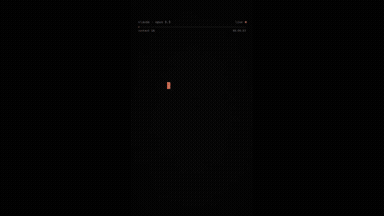</a> 
<strong>Claude Opus 5.5 Brain Rot Video</strong> 
Use: Prompt directing Claude Opus 5.5 to generate a Python script that renders a 9:16 chaotic brain rot video with FFmpeg, expressing its perspective as a creative LLM. Inputs: User inputs not specified by the author Tools: FFmpeg 
<a href="https://x.com/kloss_xyz/status/2103664956482941143">Original post ↗</a> · <a href="../../prompts/2103664956482941143.md">Prompt ↗</a>
</td>
<td width="33%" valign="top">
 
<strong>Motion Graphics Showreel Video</strong> 
Use: Motion graphics / showreel Inputs: User inputs not specified by the author Tools: Tool setup not specified by the source 
<a href="https://x.com/jasonzhou1993/status/2103663364958515541">Original post ↗</a> · <a href="../../prompts/2103663364958515541.md">Prompt ↗</a>
</td>
</tr>
<tr>
<td width="33%" valign="top">
<a href="../../prompts/2103656229717328129.md">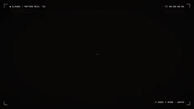</a> 
<strong>Motion Graphics Showreel</strong> 
Use: Motion graphics / showreel Inputs: User inputs not specified by the author Tools: Tool setup not specified by the source 
<a href="https://x.com/codeSTACKr/status/2103656229717328129">Original post ↗</a> · <a href="../../prompts/2103656229717328129.md">Prompt ↗</a>
</td>
<td width="33%" valign="top">
 
<strong>AI History Video</strong> 
Use: A prompt given to Claude Opus 5.5 to create an animated video illustrating key moments in artificial intelligence history. Inputs: User inputs not specified by the author Tools: Tool setup not specified by the source 
<a href="https://x.com/kloss_xyz/status/2103652674336067876">Original post ↗</a> · <a href="../../prompts/2103652674336067876.md">Prompt ↗</a>
</td>
<td width="33%" valign="top">
 
<strong>Amazon Wholesale Business Pitch Video</strong> 
Use: Motion graphics / showreel Inputs: User inputs not specified by the author Tools: Tool setup not specified by the source 
<a href="https://x.com/ceowinkz/status/2103647124126683602">Original post ↗</a> · <a href="../../prompts/2103647124126683602.md">Prompt ↗</a>
</td>
</tr>
<tr>
<td width="33%" valign="top">
<a href="../../prompts/2103644352794992798.md">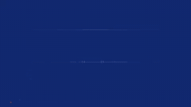</a> 
<strong>Dynamic Motion Designer Showreel Video</strong> 
Use: Motion graphics / showreel Inputs: User inputs not specified by the author Tools: Tool setup not specified by the source 
<a href="https://x.com/VanshWTFFF/status/2103644352794992798">Original post ↗</a> · <a href="../../prompts/2103644352794992798.md">Prompt ↗</a>
</td>
<td width="33%" valign="top">
<a href="../../prompts/2103638831669076027.md">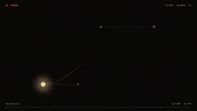</a> 
<strong>100 Users Celebration Motion Graphics Reel</strong> 
Use: Motion graphics / showreel Inputs: User inputs not specified by the author Tools: Tool setup not specified by the source 
<a href="https://x.com/Sudiyasa_/status/2103638831669076027">Original post ↗</a> · <a href="../../prompts/2103638831669076027.md">Prompt ↗</a>
</td>
<td width="33%" valign="top">
<a href="../../prompts/2103637769012597063.md">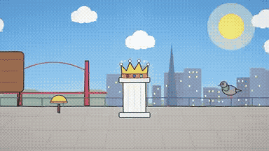</a> 
<strong>Dario vs. Altman Fight Video</strong> 
Use: Prompt used to generate a 1-minute comedic and abstract fight video between Dario Amodei and Sam Altman with a clear winner. Inputs: User inputs not specified by the author Tools: Tool setup not specified by the source 
<a href="https://x.com/Xanderwow_A/status/2103637769012597063">Original post ↗</a> · <a href="../../prompts/2103637769012597063.md">Prompt ↗</a>
</td>
</tr>
<tr>
<td width="33%" valign="top">
 
<strong>Photon Journey Explainer Animation</strong> 
Use: Science explainer / photon journey Inputs: User inputs not specified by the author Tools: JavaScript 
<a href="https://x.com/AstroTheWizard/status/2103629247751618782">Original post ↗</a> · <a href="../../prompts/2103629247751618782.md">Prompt ↗</a>
</td>
<td width="33%" valign="top">
 
<strong>Dynamic Motion Designer Showreel</strong> 
Use: Motion graphics / showreel Inputs: User inputs not specified by the author Tools: Tool setup not specified by the source 
<a href="https://x.com/leadnotifi/status/2103628028391960983">Original post ↗</a> · <a href="../../prompts/2103628028391960983.md">Prompt ↗</a>
</td>
<td width="33%" valign="top">
<a href="../../prompts/2103619422128935120.md">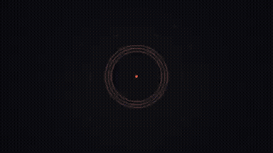</a> 
<strong>Motion Designer Showreel</strong> 
Use: Motion graphics / showreel Inputs: User inputs not specified by the author Tools: Tool setup not specified by the source 
<a href="https://x.com/tolgayhickiran/status/2103619422128935120">Original post ↗</a> · <a href="../../prompts/2103619422128935120.md">Prompt ↗</a>
</td>
</tr>
<tr>
<td width="33%" valign="top">
 
<strong>Launch Video Prompt for Startup Release</strong> 
Use: A multi-step prompt sequence used to generate a slick launch video for a startup release in an Anthropic-inspired style, including requests to make it viral and add trendy background music. Inputs: User inputs not specified by the author Tools: Tool setup not specified by the source 
<a href="https://x.com/iamMXFSCHR/status/2103619221296955831">Original post ↗</a> · <a href="../../prompts/2103619221296955831.md">Prompt ↗</a>
</td>
<td width="33%" valign="top">
 
<strong>Motion Graphics Showreel Video</strong> 
Use: Motion graphics / showreel Inputs: User inputs not specified by the author Tools: Tool setup not specified by the source 
<a href="https://x.com/KangarooHere/status/2103617278671818789">Original post ↗</a> · <a href="../../prompts/2103617278671818789.md">Prompt ↗</a>
</td>
<td width="33%" valign="top">
<a href="../../prompts/2103614667038052364.md">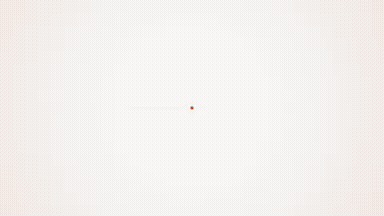</a> 
<strong>Dynamic Motion Graphics Showreel</strong> 
Use: Motion graphics / showreel Inputs: User inputs not specified by the author Tools: Tool setup not specified by the source 
<a href="https://x.com/manuelogomigo/status/2103614667038052364">Original post ↗</a> · <a href="../../prompts/2103614667038052364.md">Prompt ↗</a>
</td>
</tr>
<tr>
<td width="33%" valign="top">
 
<strong>Dynamic Motion Designer Showreel Video</strong> 
Use: Motion graphics / showreel Inputs: User inputs not specified by the author Tools: Tool setup not specified by the source 
<a href="https://x.com/mrtanviir/status/2103608767309132205">Original post ↗</a> · <a href="../../prompts/2103608767309132205.md">Prompt ↗</a>
</td>
<td width="33%" valign="top">
 
<strong>Dynamic Motion Graphics Showreel</strong> 
Use: Motion graphics / showreel Inputs: User inputs not specified by the author Tools: Tool setup not specified by the source 
<a href="https://x.com/marouanegazouzi/status/2103608571435131257">Original post ↗</a> · <a href="../../prompts/2103608571435131257.md">Prompt ↗</a>
</td>
<td width="33%" valign="top">
 
<strong>Motion Graphics Showreel on Democracy and Vigilance</strong> 
Use: Motion graphics / showreel Inputs: User inputs not specified by the author Tools: Tool setup not specified by the source 
<a href="https://x.com/chrisjdimarco/status/2103606498928808196">Original post ↗</a> · <a href="../../prompts/2103606498928808196.md">Prompt ↗</a>
</td>
</tr>
<tr>
<td width="33%" valign="top">
 
<strong>Opus 5.5 Video</strong> 
Use: Madhav shared a 10-second video generated using a single prompt asking the AI model to create a video based on whatever it knows about him. Inputs: User inputs not specified by the author Tools: Tool setup not specified by the source 
<a href="https://x.com/Madhav_XO/status/2103605007396524440">Original post ↗</a> · <a href="../../prompts/2103605007396524440.md">Prompt ↗</a>
</td>
<td width="33%" valign="top">
 
<strong>Supademo Launch Video Motion Designer</strong> 
Use: A motion designer prompt used to generate a dynamic launch video for Supademo with beat-synced cuts and brand-accurate UI. Inputs: User inputs not specified by the author Tools: Tool setup not specified by the source 
<a href="https://x.com/jhylee95/status/2103604431627452427">Original post ↗</a> · <a href="../../prompts/2103604431627452427.md">Prompt ↗</a>
</td>
<td width="33%" valign="top">
 
<strong>PayBox Logo Motion Design Reel</strong> 
Use: A prompt provided to Opus 5.5 to transform a PayBox logo into a dynamic 10-second motion design reel. Inputs: User inputs not specified by the author Tools: Tool setup not specified by the source 
<a href="https://x.com/0xValure/status/2103603025579331584">Original post ↗</a> · <a href="../../prompts/2103603025579331584.md">Prompt ↗</a>
</td>
</tr>
<tr>
<td width="33%" valign="top">
<a href="../../prompts/2103600734017392708.md">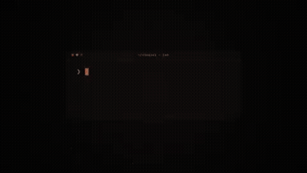</a> 
<strong>Dynamic Motion Graphics Showreel</strong> 
Use: Motion graphics / showreel Inputs: User inputs not specified by the author Tools: Tool setup not specified by the source 
<a href="https://x.com/Astrodevil_/status/2103600734017392708">Original post ↗</a> · <a href="../../prompts/2103600734017392708.md">Prompt ↗</a>
</td>
<td width="33%" valign="top">
 
<strong>Opus 5.5 Motion Graphics Showreel</strong> 
Use: Motion graphics / showreel Inputs: User inputs not specified by the author Tools: Tool setup not specified by the source 
<a href="https://x.com/johnsavage_ai/status/2103600308010041677">Original post ↗</a> · <a href="../../prompts/2103600308010041677.md">Prompt ↗</a>
</td>
<td width="33%" valign="top">
 
<strong>Dynamic Motion Graphics Showreel</strong> 
Use: Motion graphics / showreel Inputs: User inputs not specified by the author Tools: Tool setup not specified by the source 
<a href="https://x.com/gabrielbuzziv/status/2103590703289057430">Original post ↗</a> · <a href="../../prompts/2103590703289057430.md">Prompt ↗</a>
</td>
</tr>
<tr>
<td width="33%" valign="top">
 
<strong>Opus 5.5 Motion Graphics Self-Introduction</strong> 
Use: Motion graphics / showreel Inputs: User inputs not specified by the author Tools: Tool setup not specified by the source 
<a href="https://x.com/1littlecoder/status/2103587706999914649">Original post ↗</a> · <a href="../../prompts/2103587706999914649.md">Prompt ↗</a>
</td>
<td width="33%" valign="top">
<a href="../../prompts/2103580532852589043.md">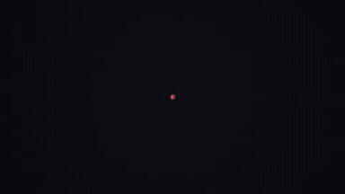</a> 
<strong>Dynamic Motion Graphics Showreel</strong> 
Use: Motion graphics / showreel Inputs: User inputs not specified by the author Tools: Tool setup not specified by the source 
<a href="https://x.com/Shinskinakamoto/status/2103580532852589043">Original post ↗</a> · <a href="../../prompts/2103580532852589043.md">Prompt ↗</a>
</td>
<td width="33%" valign="top">
 
<strong>Motion Graphics Showreel Video</strong> 
Use: Motion graphics / showreel Inputs: User inputs not specified by the author Tools: Tool setup not specified by the source 
<a href="https://x.com/m1n9_k7/status/2103580011882295601">Original post ↗</a> · <a href="../../prompts/2103580011882295601.md">Prompt ↗</a>
</td>
</tr>
<tr>
<td width="33%" valign="top">
<a href="../../prompts/2103579630045466682.md">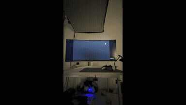</a> 
<strong>Dynamic Motion Graphics Showreel</strong> 
Use: Motion graphics / showreel Inputs: User inputs not specified by the author Tools: Tool setup not specified by the source 
<a href="https://x.com/m1n9_k7/status/2103579630045466682">Original post ↗</a> · <a href="../../prompts/2103579630045466682.md">Prompt ↗</a>
</td>
<td width="33%" valign="top">
 
<strong>Gene Spectra Motion Graphics Promo</strong> 
Use: Motion graphics / showreel Inputs: User inputs not specified by the author Tools: Tool setup not specified by the source 
<a href="https://x.com/madebyjmayala/status/2103578285892649220">Original post ↗</a> · <a href="../../prompts/2103578285892649220.md">Prompt ↗</a>
</td>
<td width="33%" valign="top">
<a href="../../prompts/2103574041781322168.md">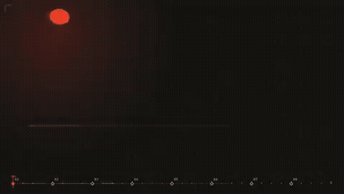</a> 
<strong>Motion Graphics Showreel</strong> 
Use: Motion graphics / showreel Inputs: User inputs not specified by the author Tools: Tool setup not specified by the source 
<a href="https://x.com/SagarmohanSingh/status/2103574041781322168">Original post ↗</a> · <a href="../../prompts/2103574041781322168.md">Prompt ↗</a>
</td>
</tr>
<tr>
<td width="33%" valign="top">
 
<strong>Sprites Product Promo UI Motion</strong> 
Use: A detailed system prompt to analyze sprites.ai and build an animated, looped product promo using pure code (HTML/Playwright/Python), featuring continuous morphing UI states and beat-matched UI sounds. Inputs: User inputs not specified by the author Tools: FFmpeg / NumPy / Playwright 
<a href="https://x.com/AnnaCher___/status/2103571096549433425">Original post ↗</a> · <a href="../../prompts/2103571096549433425.md">Prompt ↗</a>
</td>
<td width="33%" valign="top">
 
<strong>Deep Dish Music Video</strong> 
Use: Music video Inputs: User inputs not specified by the author Tools: Tool setup not specified by the source 
<a href="https://x.com/ParanoidAmerica/status/2103570879619686717">Original post ↗</a> · <a href="../../prompts/2103570879619686717.md">Prompt ↗</a>
</td>
<td width="33%" valign="top">
<a href="../../prompts/2103569170075975986.md">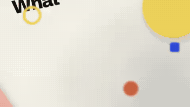</a> 
<strong>Motion Design Self-Promotion Promo</strong> 
Use: Slava S. shares a motion design animation created using Opus 5.5 Max from a single simple prompt. Inputs: User inputs not specified by the author Tools: Tool setup not specified by the source 
<a href="https://x.com/slvDev/status/2103569170075975986">Original post ↗</a> · <a href="../../prompts/2103569170075975986.md">Prompt ↗</a>
</td>
</tr>
<tr>
<td width="33%" valign="top">
 
<strong>Motion Graphics Showreel</strong> 
Use: Motion graphics / showreel Inputs: User inputs not specified by the author Tools: Tool setup not specified by the source 
<a href="https://x.com/CrazyAlphaaa/status/2103568486249480622">Original post ↗</a> · <a href="../../prompts/2103568486249480622.md">Prompt ↗</a>
</td>
<td width="33%" valign="top">
 
<strong>LLM Progression Video</strong> 
Use: A voice prompt requesting a high-energy video showcasing LLM progression, model releases, capabilities, and future trajectory throughout 2026. Inputs: User inputs not specified by the author Tools: Tool setup not specified by the source 
<a href="https://x.com/nummanali/status/2103565570310340931">Original post ↗</a> · <a href="../../prompts/2103565570310340931.md">Prompt ↗</a>
</td>
<td width="33%" valign="top">
<a href="../../prompts/2103565104243712107.md">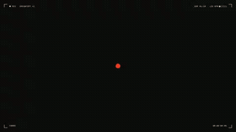</a> 
<strong>DreamFort Motion Graphics Manifesto</strong> 
Use: Motion graphics / showreel Inputs: User inputs not specified by the author Tools: Tool setup not specified by the source 
<a href="https://x.com/advait_jayant/status/2103565104243712107">Original post ↗</a> · <a href="../../prompts/2103565104243712107.md">Prompt ↗</a>
</td>
</tr>
<tr>
<td width="33%" valign="top">
 
<strong>Emmy-Style Netflix Thriller Title Sequence</strong> 
Use: A single prompt used with Claude to generate an Emmy-style opening title sequence for a fictional Netflix thriller, including credits, animation, and sound design. Inputs: User inputs not specified by the author Tools: Tool setup not specified by the source 
<a href="https://x.com/abhinayguptha/status/2103565090721259981">Original post ↗</a> · <a href="../../prompts/2103565090721259981.md">Prompt ↗</a>
</td>
<td width="33%" valign="top">
<a href="../../prompts/2103564589065449603.md">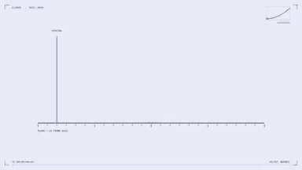</a> 
<strong>Dynamic Motion Graphics Showreel</strong> 
Use: Motion graphics / showreel Inputs: User inputs not specified by the author Tools: Tool setup not specified by the source 
<a href="https://x.com/blue_clarity/status/2103564589065449603">Original post ↗</a> · <a href="../../prompts/2103564589065449603.md">Prompt ↗</a>
</td>
<td width="33%" valign="top">
 
<strong>Dynamic Psychedelic Motion Graphics Showreel</strong> 
Use: Motion graphics / showreel Inputs: User inputs not specified by the author Tools: Tool setup not specified by the source 
<a href="https://x.com/monokern/status/2103563538828832979">Original post ↗</a> · <a href="../../prompts/2103563538828832979.md">Prompt ↗</a>
</td>
</tr>
<tr>
<td width="33%" valign="top">
 
<strong>Motion Graphics Showreel</strong> 
Use: Motion graphics / showreel Inputs: User inputs not specified by the author Tools: Tool setup not specified by the source 
<a href="https://x.com/3xtihor/status/2103551886272159839">Original post ↗</a> · <a href="../../prompts/2103551886272159839.md">Prompt ↗</a>
</td>
<td width="33%" valign="top">
 
<strong>Motion Graphics Showreel</strong> 
Use: Motion graphics / showreel Inputs: User inputs not specified by the author Tools: Tool setup not specified by the source 
<a href="https://x.com/dansushik/status/2103547478482289121">Original post ↗</a> · <a href="../../prompts/2103547478482289121.md">Prompt ↗</a>
</td>
<td width="33%" valign="top">
 
<strong>Dynamic Ren Motion Graphics Video</strong> 
Use: Motion graphics / showreel Inputs: User inputs not specified by the author Tools: Tool setup not specified by the source 
<a href="https://x.com/macrohou/status/2103545787875733862">Original post ↗</a> · <a href="../../prompts/2103545787875733862.md">Prompt ↗</a>
</td>
</tr>
<tr>
<td width="33%" valign="top">
<a href="../../prompts/2103544855276503053.md">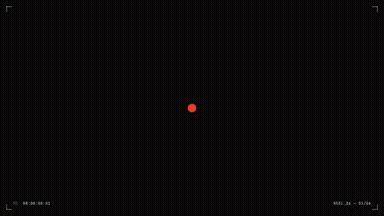</a> 
<strong>Opus 5.5 Highlight Reel</strong> 
Use: Motion graphics / showreel Inputs: User inputs not specified by the author Tools: Tool setup not specified by the source 
<a href="https://x.com/samuel_spitz/status/2103544855276503053">Original post ↗</a> · <a href="../../prompts/2103544855276503053.md">Prompt ↗</a>
</td>
<td width="33%" valign="top">
 
<strong>Dynamic Motion Graphics Showreel</strong> 
Use: Motion graphics / showreel Inputs: User inputs not specified by the author Tools: Tool setup not specified by the source 
<a href="https://x.com/Adamdesgns/status/2103542756555768014">Original post ↗</a> · <a href="../../prompts/2103542756555768014.md">Prompt ↗</a>
</td>
<td width="33%" valign="top">
 
<strong>SEO Backlinks Video Visualization</strong> 
Use: A prompt designed to create an instructional visualization explaining how backlinks function in SEO. Inputs: User inputs not specified by the author Tools: Tool setup not specified by the source 
<a href="https://x.com/stewchan2/status/2103542568361369810">Original post ↗</a> · <a href="../../prompts/2103542568361369810.md">Prompt ↗</a>
</td>
</tr>
<tr>
<td width="33%" valign="top">
 
<strong>Distilbook Motion Graphics Video</strong> 
Use: Motion graphics / showreel Inputs: User inputs not specified by the author Tools: Tool setup not specified by the source 
<a href="https://x.com/ajith_io/status/2103541149709615243">Original post ↗</a> · <a href="../../prompts/2103541149709615243.md">Prompt ↗</a>
</td>
<td width="33%" valign="top">
 
<strong>15-Second Motion Reel</strong> 
Use: A prompt instructing the model to create, animate, and score its own 15-second motion reel. Inputs: User inputs not specified by the author Tools: Tool setup not specified by the source 
<a href="https://x.com/ghinaiya_nirmal/status/2103540656182308943">Original post ↗</a> · <a href="../../prompts/2103540656182308943.md">Prompt ↗</a>
</td>
<td width="33%" valign="top">
 
<strong>Bedroom Layout Generator</strong> 
Use: Claude Opus 5.5 generated a 2D/3D bedroom planning app to test thousands of positions for fitting a double bed, based on specified room and furniture dimensions. Inputs: User inputs not specified by the author Tools: Tool setup not specified by the source 
<a href="https://x.com/goofyninjaaa/status/2103540288136315331">Original post ↗</a> · <a href="../../prompts/2103540288136315331.md">Prompt ↗</a>
</td>
</tr>
<tr>
<td width="33%" valign="top">
 
<strong>Motion Graphics Showreel and Synthesized Music</strong> 
Use: Motion graphics / showreel Inputs: User inputs not specified by the author Tools: Tool setup not specified by the source 
<a href="https://x.com/prasenx/status/2103538744695693512">Original post ↗</a> · <a href="../../prompts/2103538744695693512.md">Prompt ↗</a>
</td>
<td width="33%" valign="top">
<a href="../../prompts/2103536553930752011.md">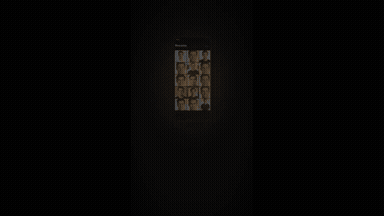</a> 
<strong>Pictwin AI Animated Ad</strong> 
Use: Motion graphics / showreel Inputs: User inputs not specified by the author Tools: Tool setup not specified by the source 
<a href="https://x.com/l3d1c/status/2103536553930752011">Original post ↗</a> · <a href="../../prompts/2103536553930752011.md">Prompt ↗</a>
</td>
<td width="33%" valign="top">
<a href="../../prompts/2103536115563307120.md">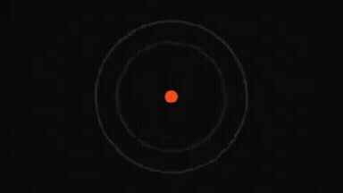</a> 
<strong>Motion Graphics Showreel</strong> 
Use: Motion graphics / showreel Inputs: User inputs not specified by the author Tools: Tool setup not specified by the source 
<a href="https://x.com/sahildesigner23/status/2103536115563307120">Original post ↗</a> · <a href="../../prompts/2103536115563307120.md">Prompt ↗</a>
</td>
</tr>
<tr>
<td width="33%" valign="top">
 
<strong>Claude Code Motion Graphics</strong> 
Use: A Turkish prompt provided to Claude Code running Opus 5.5 to create a 15-second promotional motion graphics video for an application. Inputs: User inputs not specified by the author Tools: Tool setup not specified by the source 
<a href="https://x.com/cansincengiz_me/status/2103532681774424245">Original post ↗</a> · <a href="../../prompts/2103532681774424245.md">Prompt ↗</a>
</td>
<td width="33%" valign="top">
 
<strong>Portfolio Video Generation</strong> 
Use: A prompt asking Opus 5.5 to create a 20-second video based exclusively on the user's personal portfolio resources. Inputs: User inputs not specified by the author Tools: Tool setup not specified by the source 
<a href="https://x.com/kikelopezdesign/status/2103527289619173471">Original post ↗</a> · <a href="../../prompts/2103527289619173471.md">Prompt ↗</a>
</td>
<td width="33%" valign="top">
<a href="../../prompts/2103526713208525162.md">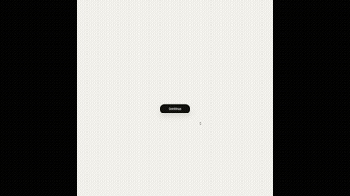</a> 
<strong>Code-Based UI Motion Design</strong> 
Use: A comprehensive prompt template to instruct an LLM (such as Claude Opus) to generate pure-code, seamless looping UI motion design synced to a musical beat grid. Inputs: Ask me for: 8 to 12 UI states I want the shape to become (e.g. button, loader, player, slider, toggle, tabs, chart, command palette, toast), pure black and white or one accent color, and a royalty-free song around 120 BPM (e.g. Mixkit, free for commercial use). Tools: FFmpeg / NumPy / Playwright 
<a href="https://x.com/demonugc/status/2103526713208525162">Original post ↗</a> · <a href="../../prompts/2103526713208525162.md">Prompt ↗</a>
</td>
</tr>
<tr>
<td width="33%" valign="top">
<a href="../../prompts/2103520091552059752.md">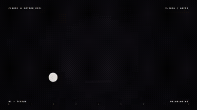</a> 
<strong>Motion Graphics Showreel</strong> 
Use: Motion graphics / showreel Inputs: User inputs not specified by the author Tools: Tool setup not specified by the source 
<a href="https://x.com/safarkhanshuvo/status/2103520091552059752">Original post ↗</a> · <a href="../../prompts/2103520091552059752.md">Prompt ↗</a>
</td>
<td width="33%" valign="top">
 
<strong>Dynamic Motion Graphics Prompt for Distilbook</strong> 
Use: Motion graphics / showreel Inputs: User inputs not specified by the author Tools: Tool setup not specified by the source 
<a href="https://x.com/itisRazak/status/2103517930424332386">Original post ↗</a> · <a href="../../prompts/2103517930424332386.md">Prompt ↗</a>
</td>
<td width="33%" valign="top">
 
<strong>Creative Front-End and Video Generation</strong> 
Use: A creative prompt asking the AI model to freely select a theme tailored to the user's interests, generating both a 30-second video and an interactive HTML page to showcase its front-end capabilities. Inputs: User inputs not specified by the author Tools: Tool setup not specified by the source 
<a href="https://x.com/DemitiyaGeekzen/status/2103517910274818523">Original post ↗</a> · <a href="../../prompts/2103517910274818523.md">Prompt ↗</a>
</td>
</tr>
<tr>
<td width="33%" valign="top">
<a href="../../prompts/2103517696038191220.md">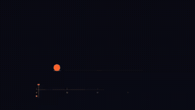</a> 
<strong>Dynamic Motion Graphics Showreel</strong> 
Use: Motion graphics / showreel Inputs: User inputs not specified by the author Tools: Tool setup not specified by the source 
<a href="https://x.com/LeonKohli/status/2103517696038191220">Original post ↗</a> · <a href="../../prompts/2103517696038191220.md">Prompt ↗</a>
</td>
<td width="33%" valign="top">
 
<strong>Autonomous JavaScript Explainer Animation</strong> 
Use: A prompt directing Opus to autonomously generate a whimsical hand-drawn JavaScript animation and audio explainer for the Headroom desktop app. Inputs: User inputs not specified by the author Tools: JavaScript 
<a href="https://x.com/garmdotcom/status/2103516101518987439">Original post ↗</a> · <a href="../../prompts/2103516101518987439.md">Prompt ↗</a>
</td>
<td width="33%" valign="top">
 
<strong>Instagram Ad for Liinks</strong> 
Use: Charlie Clark shares an animated reel created using Opus 5.5 from a simple prompt designed for a Liinks Instagram ad. Inputs: User inputs not specified by the author Tools: Tool setup not specified by the source 
<a href="https://x.com/charliie/status/2103514073476334026">Original post ↗</a> · <a href="../../prompts/2103514073476334026.md">Prompt ↗</a>
</td>
</tr>
<tr>
<td width="33%" valign="top">
 
<strong>Dynamic Lyrics Motion Graphics Video</strong> 
Use: Motion graphics / showreel Inputs: User inputs not specified by the author Tools: Tool setup not specified by the source 
<a href="https://x.com/samaote/status/2103510974796124569">Original post ↗</a> · <a href="../../prompts/2103510974796124569.md">Prompt ↗</a>
</td>
<td width="33%" valign="top">
<a href="../../prompts/2103510776690479597.md">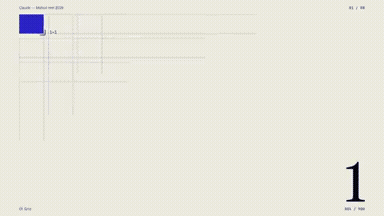</a> 
<strong>Dynamic Motion Graphics Showreel</strong> 
Use: Motion graphics / showreel Inputs: User inputs not specified by the author Tools: Tool setup not specified by the source 
<a href="https://x.com/fionntobin/status/2103510776690479597">Original post ↗</a> · <a href="../../prompts/2103510776690479597.md">Prompt ↗</a>
</td>
<td width="33%" valign="top">
<a href="../../prompts/2103502614134718609.md">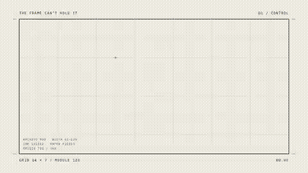</a> 
<strong>Poster Breaking Out of Frame Motion Design</strong> 
Use: Motion graphics / showreel Inputs: User inputs not specified by the author Tools: Tool setup not specified by the source 
<a href="https://x.com/pankajkumar_dev/status/2103502614134718609">Original post ↗</a> · <a href="../../prompts/2103502614134718609.md">Prompt ↗</a>
</td>
</tr>
<tr>
<td width="33%" valign="top">
 
<strong>Product Promo Video</strong> 
Use: A single prompt used with Claude Opus to automatically code and render a professional 16:9 MP4 product showcase video. Inputs: User inputs not specified by the author Tools: Tool setup not specified by the source 
<a href="https://x.com/ezshine/status/2103501705698750731">Original post ↗</a> · <a href="../../prompts/2103501705698750731.md">Prompt ↗</a>
</td>
<td width="33%" valign="top">
 
<strong>Animated Explainer Motion Designer</strong> 
Use: Educational / explainer video Inputs: User inputs not specified by the author Tools: Tool setup not specified by the source 
<a href="https://x.com/alex_prompter/status/2103499977632997524">Original post ↗</a> · <a href="../../prompts/2103499977632997524.md">Prompt ↗</a>
</td>
<td width="33%" valign="top">
 
<strong>GLSL Fishbowl in Three.js</strong> 
Use: A prompt used to evaluate Claude Opus 5.5 on generating GLSL shaders in Three.js, focusing on refraction, reflection, and water caustics. Inputs: User inputs not specified by the author Tools: Tool setup not specified by the source 
<a href="https://x.com/NicolaManzini/status/2103499771206156628">Original post ↗</a> · <a href="../../prompts/2103499771206156628.md">Prompt ↗</a>
</td>
</tr>
<tr>
<td width="33%" valign="top">
<a href="../../prompts/2103496403544928454.md">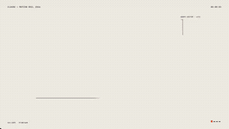</a> 
<strong>Motion Graphics Showreel Video</strong> 
Use: Motion graphics / showreel Inputs: User inputs not specified by the author Tools: Tool setup not specified by the source 
<a href="https://x.com/bhanujraj/status/2103496403544928454">Original post ↗</a> · <a href="../../prompts/2103496403544928454.md">Prompt ↗</a>
</td>
<td width="33%" valign="top">
 
<strong>Claude Opus Website Showreel</strong> 
Use: Motion graphics / showreel Inputs: User inputs not specified by the author Tools: Tool setup not specified by the source 
<a href="https://x.com/andginja/status/2103492000733618685">Original post ↗</a> · <a href="../../prompts/2103492000733618685.md">Prompt ↗</a>
</td>
<td width="33%" valign="top">
 
<strong>Opus 5.5 Promotional Video</strong> 
Use: Anas shares a simple prompt tested with Opus 5.5 to generate a video for the website heeya.fr. Inputs: User inputs not specified by the author Tools: Tool setup not specified by the source 
<a href="https://x.com/anas0ra/status/2103490331815952637">Original post ↗</a> · <a href="../../prompts/2103490331815952637.md">Prompt ↗</a>
</td>
</tr>
<tr>
<td width="33%" valign="top">
 
<strong>Dynamic Motion Graphics Showreel</strong> 
Use: Motion graphics / showreel Inputs: User inputs not specified by the author Tools: Tool setup not specified by the source 
<a href="https://x.com/umangratani/status/2103486881136840800">Original post ↗</a> · <a href="../../prompts/2103486881136840800.md">Prompt ↗</a>
</td>
<td width="33%" valign="top">
 
<strong>Distilbook Product Explainer Motion Graphic</strong> 
Use: Educational / explainer video Inputs: User inputs not specified by the author Tools: Tool setup not specified by the source 
<a href="https://x.com/sudo_kiran/status/2103486573476254201">Original post ↗</a> · <a href="../../prompts/2103486573476254201.md">Prompt ↗</a>
</td>
<td width="33%" valign="top">
 
<strong>Code-Based Product Motion Design</strong> 
Use: A structured prompt detailing rules, motion mechanics, and export specifications for generating a single-canvas, deterministic HTML/code-based product demo animation. Inputs: Ask me for: 
• my product + URL 
• 8–12 UI states that tell its story 
• the real data shown in each state 
• brand colors + fonts + accent color 
• required formats (1:1, 16:9, 9:16) Tools: Tool setup not specified by the source 
<a href="https://x.com/verbove/status/2103483957266268381">Original post ↗</a> · <a href="../../prompts/2103483957266268381.md">Prompt ↗</a>
</td>
</tr>
<tr>
<td width="33%" valign="top">
 
<strong>3D Pagoda Navigation</strong> 
Use: A creative coding prompt used with Claude Opus 5.5 to generate an interactive 3D pagoda navigation world in a single shot. Inputs: User inputs not specified by the author Tools: Tool setup not specified by the source 
<a href="https://x.com/BuildFastWithAI/status/2103483174957597035">Original post ↗</a> · <a href="../../prompts/2103483174957597035.md">Prompt ↗</a>
</td>
<td width="33%" valign="top">
 
<strong>Portfolio Motion Graphics Video</strong> 
Use: Motion graphics / showreel Inputs: User inputs not specified by the author Tools: Tool setup not specified by the source 
<a href="https://x.com/AIStockSavvy/status/2103482258774483320">Original post ↗</a> · <a href="../../prompts/2103482258774483320.md">Prompt ↗</a>
</td>
<td width="33%" valign="top">
 
<strong>Code-Driven Animation</strong> 
Use: A prompt instructing the model to produce a code-driven animation using an HTML/JS page rendered frame-by-frame via headless Chrome and assembled with ffmpeg including motion blur and generated sound. Inputs: User inputs not specified by the author Tools: FFmpeg / Playwright 
<a href="https://x.com/xelandre__/status/2103473030160687413">Original post ↗</a> · <a href="../../prompts/2103473030160687413.md">Prompt ↗</a>
</td>
</tr>
<tr>
<td width="33%" valign="top">
 
<strong>Professional SaaS Product Launch Video</strong> 
Use: A prompt designed to generate a motion-graphics-styled product launch video for a recognizable SaaS product using real assets and feature highlights. Inputs: User inputs not specified by the author Tools: Tool setup not specified by the source 
<a href="https://x.com/techyoutbe/status/2103465227807588678">Original post ↗</a> · <a href="../../prompts/2103465227807588678.md">Prompt ↗</a>
</td>
<td width="33%" valign="top">
 
<strong>Dynamic Motion Graphics Showreel</strong> 
Use: Motion graphics / showreel Inputs: User inputs not specified by the author Tools: Tool setup not specified by the source 
<a href="https://x.com/sudo_kiran/status/2103463886372696074">Original post ↗</a> · <a href="../../prompts/2103463886372696074.md">Prompt ↗</a>
</td>
<td width="33%" valign="top">
 
<strong>Motion Graphics Account Promo</strong> 
Use: A prompt asking an AI model to prove its graphic design skills by creating a 15-second promotional motion graphics video using a provided logo and cover photo. Inputs: User inputs not specified by the author Tools: Tool setup not specified by the source 
<a href="https://x.com/fire_ozgur/status/2103459971174130104">Original post ↗</a> · <a href="../../prompts/2103459971174130104.md">Prompt ↗</a>
</td>
</tr>
<tr>
<td width="33%" valign="top">
 
<strong>OBLT E-bike Header React Component</strong> 
Use: A detailed specification prompt for building a dark, cinematic e-bike product header in React featuring a cursor-driven CSS mask x-ray spotlight effect. Inputs: User inputs not specified by the author Tools: React 
<a href="https://x.com/iamtanzil_/status/2103459843831120030">Original post ↗</a> · <a href="../../prompts/2103459843831120030.md">Prompt ↗</a>
</td>
<td width="33%" valign="top">
 
<strong>Build the Floor Kinetic Typography Film</strong> 
Use: A comprehensive prompt for generating a self-contained HTML/SVG/Canvas 20-second kinetic spoken-word typographic film titled 'BUILD THE FLOOR'. Inputs: User inputs not specified by the author Tools: Tool setup not specified by the source 
<a href="https://x.com/Gdgtify/status/2103458245213929495">Original post ↗</a> · <a href="../../prompts/2103458245213929495.md">Prompt ↗</a>
</td>
<td width="33%" valign="top">
 
<strong>Continuous UI Motion Animation</strong> 
Use: A structured prompt for generating a continuous, looping Dribbble-style UI morph animation programmed in HTML and rendered via Playwright. Inputs: Ask me for: 8 to 12 UI states I want the shape to become (e.g. button, loader, player, slider, toggle, tabs, chart, command palette, toast), pure black and white or one accent color, and a royalty-free song around 120 BPM (e.g. Mixkit, free for commercial use). Tools: FFmpeg / NumPy / Playwright 
<a href="https://x.com/sanjeevn72/status/2103456358125457691">Original post ↗</a> · <a href="../../prompts/2103456358125457691.md">Prompt ↗</a>
</td>
</tr>
<tr>
<td width="33%" valign="top">
 
<strong>Comic Book Style Motion Graphic</strong> 
Use: A prompt used with a custom Claude skill and visual assets to generate a 10-second comic book-styled motion graphic. Inputs: User inputs not specified by the author Tools: Tool setup not specified by the source 
<a href="https://x.com/madpencil_/status/2103449418460753990">Original post ↗</a> · <a href="../../prompts/2103449418460753990.md">Prompt ↗</a>
</td>
<td width="33%" valign="top">
 
<strong>Dynamic Motion Graphics Showreel for Omarchy</strong> 
Use: Motion graphics / showreel Inputs: User inputs not specified by the author Tools: Tool setup not specified by the source 
<a href="https://x.com/tcballard/status/2103441222375268605">Original post ↗</a> · <a href="../../prompts/2103441222375268605.md">Prompt ↗</a>
</td>
<td width="33%" valign="top">
 
<strong>Motion Graphics Showreel Video</strong> 
Use: Motion graphics / showreel Inputs: User inputs not specified by the author Tools: Tool setup not specified by the source 
<a href="https://x.com/itsuki_dev/status/2103438087204618392">Original post ↗</a> · <a href="../../prompts/2103438087204618392.md">Prompt ↗</a>
</td>
</tr>
<tr>
<td width="33%" valign="top">
 
<strong>Cycle of Life Motion Graphics Showreel</strong> 
Use: Motion graphics / showreel Inputs: User inputs not specified by the author Tools: Tool setup not specified by the source 
<a href="https://x.com/loicRambo/status/2103428454355980558">Original post ↗</a> · <a href="../../prompts/2103428454355980558.md">Prompt ↗</a>
</td>
<td width="33%" valign="top">
 
<strong>ocrX Android App Launch Video</strong> 
Use: A one-line prompt used with Opus 5.5 to generate a product launch video for the ocrX Android app. Inputs: User inputs not specified by the author Tools: Tool setup not specified by the source 
<a href="https://x.com/mehul4795/status/2103420457110417532">Original post ↗</a> · <a href="../../prompts/2103420457110417532.md">Prompt ↗</a>
</td>
<td width="33%" valign="top">
 
<strong>Opus 5.5 Motion Designer</strong> 
Use: Eugene C shares a prompt asking Opus 5.5 to demonstrate its motion design capabilities. Inputs: User inputs not specified by the author Tools: Tool setup not specified by the source 
<a href="https://x.com/zheke/status/2103418664854622583">Original post ↗</a> · <a href="../../prompts/2103418664854622583.md">Prompt ↗</a>
</td>
</tr>
<tr>
<td width="33%" valign="top">
 
<strong>White Russian Recipe Motion Graphic</strong> 
Use: Educational / explainer video Inputs: User inputs not specified by the author Tools: JavaScript 
<a href="https://x.com/Sarut0biSasuke/status/2103418429248069973">Original post ↗</a> · <a href="../../prompts/2103418429248069973.md">Prompt ↗</a>
</td>
<td width="33%" valign="top">
 
<strong>Motion Graphics Showreel</strong> 
Use: Motion graphics / showreel Inputs: User inputs not specified by the author Tools: Tool setup not specified by the source 
<a href="https://x.com/RaphaelAubryy/status/2103416909857190360">Original post ↗</a> · <a href="../../prompts/2103416909857190360.md">Prompt ↗</a>
</td>
<td width="33%" valign="top">
 
<strong>JavaScript About Us Page Animation</strong> 
Use: Tom Andrieu shares an Opus 5.5 prompt used to generate a 30 to 60-second pure JavaScript animation in a whimsical hand-drawn collage style based on an 'about-us' page. Inputs: User inputs not specified by the author Tools: JavaScript 
<a href="https://x.com/TomAndrieu96707/status/2103411144899875264">Original post ↗</a> · <a href="../../prompts/2103411144899875264.md">Prompt ↗</a>
</td>
</tr>
<tr>
<td width="33%" valign="top">
 
<strong>Product Promo Video</strong> 
Use: AI大白 shared an AI-generated product promo video created using Opus 5.5 by passing a single prompt referencing the project's codebase. Inputs: User inputs not specified by the author Tools: Tool setup not specified by the source 
<a href="https://x.com/Ai_Baymax/status/2103411004902416787">Original post ↗</a> · <a href="../../prompts/2103411004902416787.md">Prompt ↗</a>
</td>
<td width="33%" valign="top">
 
<strong>Motion Designer Showreel</strong> 
Use: Motion graphics / showreel Inputs: User inputs not specified by the author Tools: Tool setup not specified by the source 
<a href="https://x.com/hanifproduktif/status/2103404901451829311">Original post ↗</a> · <a href="../../prompts/2103404901451829311.md">Prompt ↗</a>
</td>
<td width="33%" valign="top">
 
<strong>Oscilloscope Style Motion Graphic</strong> 
Use: A prompt for generating a motion graphic about a studio using an oscilloscope visual style. Inputs: User inputs not specified by the author Tools: Tool setup not specified by the source 
<a href="https://x.com/rneayan/status/2103401461837406275">Original post ↗</a> · <a href="../../prompts/2103401461837406275.md">Prompt ↗</a>
</td>
</tr>
<tr>
<td width="33%" valign="top">
 
<strong>Risograph Studio Video</strong> 
Use: A prompt used to generate a video of a studio in a Risograph art style using Opus 5.5. Inputs: User inputs not specified by the author Tools: Tool setup not specified by the source 
<a href="https://x.com/rneayan/status/2103401006281441493">Original post ↗</a> · <a href="../../prompts/2103401006281441493.md">Prompt ↗</a>
</td>
<td width="33%" valign="top">
 
<strong>Chuseok Pixel Animation</strong> 
Use: A prompt requesting the creation of a pixel art animation incorporating traditional elements associated with Korean Chuseok. Inputs: User inputs not specified by the author Tools: Tool setup not specified by the source 
<a href="https://x.com/hoyoyoda/status/2103400046922543147">Original post ↗</a> · <a href="../../prompts/2103400046922543147.md">Prompt ↗</a>
</td>
<td width="33%" valign="top">
 
<strong>Motion Graphics Resume Showreel</strong> 
Use: Motion graphics / showreel Inputs: User inputs not specified by the author Tools: Tool setup not specified by the source 
<a href="https://x.com/rendesr/status/2103395846578676116">Original post ↗</a> · <a href="../../prompts/2103395846578676116.md">Prompt ↗</a>
</td>
</tr>
<tr>
<td width="33%" valign="top">
 
<strong>Mind-Blowing 4-Minute Animated Short</strong> 
Use: Farouk Alogba shares the prompt given to Claude Opus 5.5 to direct agents, compose music, and generate an animated short film. Inputs: User inputs not specified by the author Tools: Tool setup not specified by the source 
<a href="https://x.com/faroukzy/status/2103387771180138551">Original post ↗</a> · <a href="../../prompts/2103387771180138551.md">Prompt ↗</a>
</td>
<td width="33%" valign="top">
 
<strong>Celld Explanation Animation</strong> 
Use: Nick Frith shares an animation generated using Opus 5.5 with a prompt asking for an explanation of why celld earns its place. Inputs: User inputs not specified by the author Tools: Tool setup not specified by the source 
<a href="https://x.com/0xnfrith/status/2103358957050068999">Original post ↗</a> · <a href="../../prompts/2103358957050068999.md">Prompt ↗</a>
</td>
<td width="33%" valign="top">
 
<strong>Peter Gabriel Style Music Video</strong> 
Use: Music video Inputs: User inputs not specified by the author Tools: Tool setup not specified by the source 
<a href="https://x.com/DavidShulmanFL/status/2103336310089842921">Original post ↗</a> · <a href="../../prompts/2103336310089842921.md">Prompt ↗</a>
</td>
</tr>
<tr>
<td width="33%" valign="top">
 
<strong>Flora App Promo Video</strong> 
Use: A prompt given to Opus 5.5 instructing it to generate a modern and impactful promotional video for the Flora app using JavaScript, Playwright, and FFmpeg from a designated folder of assets. Inputs: User inputs not specified by the author Tools: FFmpeg / JavaScript / Playwright 
<a href="https://x.com/andre_lucaxxs/status/2103292636945846347">Original post ↗</a> · <a href="../../prompts/2103292636945846347.md">Prompt ↗</a>
</td>
<td width="33%" valign="top">
 
<strong>Lightspark Promo Video</strong> 
Use: David Marcus shared a prompt used with Opus 5.5 to generate a promotional video for Lightspark. Inputs: User inputs not specified by the author Tools: Tool setup not specified by the source 
<a href="https://x.com/davidmarcus/status/2103275618045686217">Original post ↗</a> · <a href="../../prompts/2103275618045686217.md">Prompt ↗</a>
</td>
<td width="33%" valign="top">
 
<strong>Brainrot Video About the Terminal</strong> 
Use: A prompt provided to Opus 5.5 alongside an article to generate a brainrot-style video exploring an addiction to AI and the terminal. Inputs: User inputs not specified by the author Tools: Tool setup not specified by the source 
<a href="https://x.com/supremebeme/status/2103272941832306746">Original post ↗</a> · <a href="../../prompts/2103272941832306746.md">Prompt ↗</a>
</td>
</tr>
<tr>
<td width="33%" valign="top">
 
<strong>Opus 5.5 Demo Video</strong> 
Use: Vee shares a one-line prompt used with Opus 5.5 alongside brand assets and screenshots to create a full company demo video. Inputs: User inputs not specified by the author Tools: Tool setup not specified by the source 
<a href="https://x.com/vahidf24/status/2103258346690121886">Original post ↗</a> · <a href="../../prompts/2103258346690121886.md">Prompt ↗</a>
</td>
<td width="33%" valign="top">
 
<strong>Anime Trailer Battle: Claude vs ChatGPT</strong> 
Use: A prompt used with Opus to generate a full anime-style action trailer depicting a ruthless battle between Claude and ChatGPT. Inputs: User inputs not specified by the author Tools: Tool setup not specified by the source 
<a href="https://x.com/ishuagra02/status/2103247844542922825">Original post ↗</a> · <a href="../../prompts/2103247844542922825.md">Prompt ↗</a>
</td>
<td width="33%" valign="top">
 
<strong>Educational Video Prompt for Sotto App</strong> 
Use: Educational / explainer video Inputs: User inputs not specified by the author Tools: Tool setup not specified by the source 
<a href="https://x.com/1stnoel_/status/2103247530259603851">Original post ↗</a> · <a href="../../prompts/2103247530259603851.md">Prompt ↗</a>
</td>
</tr>
<tr>
<td width="33%" valign="top">
 
<strong>The Sphere History GSAP Motion Graphic</strong> 
Use: Educational / explainer video Inputs: User inputs not specified by the author Tools: GSAP ScrollTrigger 
<a href="https://x.com/RetropunkAI/status/2103237989065277590">Original post ↗</a> · <a href="../../prompts/2103237989065277590.md">Prompt ↗</a>
</td>
<td width="33%" valign="top">
 
<strong>NotchBrowser Teaser Video</strong> 
Use: A detailed HyperFrames prompt designed to generate a polished 27-second hype teaser video for NotchBrowser, featuring smooth continuous camera motion across a Mac desktop. Inputs: User inputs not specified by the author Tools: Tool setup not specified by the source 
<a href="https://x.com/jake11moran/status/2103237884564414633">Original post ↗</a> · <a href="../../prompts/2103237884564414633.md">Prompt ↗</a>
</td>
<td width="33%" valign="top">
 
<strong>JavaScript Samurai Routine</strong> 
Use: Christopher J. DiMarco shares a test using Opus 5.5 to generate a samurai routine animation coded entirely in JavaScript. Inputs: User inputs not specified by the author Tools: JavaScript 
<a href="https://x.com/chrisjdimarco/status/2103232192847524106">Original post ↗</a> · <a href="../../prompts/2103232192847524106.md">Prompt ↗</a>
</td>
</tr>
<tr>
<td width="33%" valign="top">
 
<strong>Stickman Naval Battle Animation</strong> 
Use: Claude Opus was prompted to generate an animation of stickmen in a naval battle using sound effects from a specific folder. Inputs: User inputs not specified by the author Tools: Tool setup not specified by the source 
<a href="https://x.com/andriyfernandes/status/2103225854599807308">Original post ↗</a> · <a href="../../prompts/2103225854599807308.md">Prompt ↗</a>
</td>
<td width="33%" valign="top">
 
<strong>SaaS Product Launch Video</strong> 
Use: A prompt designed to create a professional, motion-graphics-style SaaS product launch video showcasing features and benefits. Inputs: User inputs not specified by the author Tools: Tool setup not specified by the source 
<a href="https://x.com/techtactician/status/2103219463508144474">Original post ↗</a> · <a href="../../prompts/2103219463508144474.md">Prompt ↗</a>
</td>
<td width="33%" valign="top">
 
<strong>Pixel Animation Crypto Reference</strong> 
Use: A prompt used with Opus 5.5 alongside a reference video to generate a pixel animation themed around cryptocurrency. Inputs: User inputs not specified by the author Tools: Tool setup not specified by the source 
<a href="https://x.com/0xEvinho/status/2103212966703436195">Original post ↗</a> · <a href="../../prompts/2103212966703436195.md">Prompt ↗</a>
</td>
</tr>
<tr>
<td width="33%" valign="top">
 
<strong>Token Bucket Rate Limiter Animation</strong> 
Use: Parker Rex shares an animated diagram of a token bucket rate limiter created with an AI prompt utilizing HTML5 canvas without external libraries. Inputs: User inputs not specified by the author Tools: Tool setup not specified by the source 
<a href="https://x.com/ParkerRex/status/2103206747846701462">Original post ↗</a> · <a href="../../prompts/2103206747846701462.md">Prompt ↗</a>
</td>
<td width="33%" valign="top">
 
<strong>Tented Product Video Animation</strong> 
Use: Justin Cooperman shares an animated product clip for Tented created with Opus 5.5, illustrating its image generation features. Inputs: User inputs not specified by the author Tools: Tool setup not specified by the source 
<a href="https://x.com/justincooperman/status/2103201167367188876">Original post ↗</a> · <a href="../../prompts/2103201167367188876.md">Prompt ↗</a>
</td>
<td width="33%" valign="top">
 
<strong>140 BPM UK Dubstep Beat Generation</strong> 
Use: A prompt used with Claude Opus 5.5 and HyperFrames to compose a 140 BPM UK dubstep music track and visualizer in the style of Rusko and Skream. Inputs: User inputs not specified by the author Tools: Tool setup not specified by the source 
<a href="https://x.com/Rames_Jusso/status/2103200703598776559">Original post ↗</a> · <a href="../../prompts/2103200703598776559.md">Prompt ↗</a>
</td>
</tr>
<tr>
<td width="33%" valign="top">
 
<strong>3D Animation of Gradient Descent</strong> 
Use: A prompt requesting Claude Opus to generate a 3D animation illustrating gradient descent with a ball moving from crest to trough, along with explanations and a specific color scheme. Inputs: User inputs not specified by the author Tools: Tool setup not specified by the source 
<a href="https://x.com/anirockshady/status/2103195903012032809">Original post ↗</a> · <a href="../../prompts/2103195903012032809.md">Prompt ↗</a>
</td>
<td width="33%" valign="top">
 
<strong>Cinematic Browser-Based 3D World</strong> 
Use: Explorable cinematic 3D world Inputs: User inputs not specified by the author Tools: Tool setup not specified by the source 
<a href="https://x.com/LexnLin/status/2103194052850241739">Original post ↗</a> · <a href="../../prompts/2103194052850241739.md">Prompt ↗</a>
</td>
<td width="33%" valign="top">
 
<strong>Cartoony Battle Royale UI</strong> 
Use: Code Coach demonstrates generating a complete Roblox battle royale UI in seconds using a custom plugin and Claude Opus with a one-shot prompt. Inputs: User inputs not specified by the author Tools: Tool setup not specified by the source 
<a href="https://x.com/MyCodeCoach/status/2103181065976459574">Original post ↗</a> · <a href="../../prompts/2103181065976459574.md">Prompt ↗</a>
</td>
</tr>
<tr>
<td width="33%" valign="top">
 
<strong>Viral Video Physics Simulation</strong> 
Use: A prompt given to Claude Opus asking it to create a video designed to go viral, leading to a coded physics simulation and synthesizer synchronized with Für Elise. Inputs: User inputs not specified by the author Tools: Tool setup not specified by the source 
<a href="https://x.com/kantamk/status/2103148907228176511">Original post ↗</a> · <a href="../../prompts/2103148907228176511.md">Prompt ↗</a>
</td>
<td width="33%" valign="top">
 
<strong>AppSumo Animated Promo Clip</strong> 
Use: A prompt to generate a 30-second drawing-style animated video showing how to submit a product to AppSumo using an agent in three steps. Inputs: User inputs not specified by the author Tools: Tool setup not specified by the source 
<a href="https://x.com/mattbean/status/2103146389412917572">Original post ↗</a> · <a href="../../prompts/2103146389412917572.md">Prompt ↗</a>
</td>
<td width="33%" valign="top">
 
<strong>Punchy Talking-Head Video Edit</strong> 
Use: Prompt used with Opus 5.5 and OpenEdit to transform a raw talking-head clip into an engaging edit with subtitles, graphics, and music. Inputs: User inputs not specified by the author Tools: Tool setup not specified by the source 
<a href="https://x.com/sab8a/status/2103144778481475686">Original post ↗</a> · <a href="../../prompts/2103144778481475686.md">Prompt ↗</a>
</td>
</tr>
<tr>
<td width="33%" valign="top">
 
<strong>Short Story Animation</strong> 
Use: A prompt asking Claude to generate a 9:16 short story animation with sound effects using specific app assets and teaser elements. Inputs: User inputs not specified by the author Tools: Tool setup not specified by the source 
<a href="https://x.com/jackfriks/status/2103132260589338762">Original post ↗</a> · <a href="../../prompts/2103132260589338762.md">Prompt ↗</a>
</td>
<td width="33%" valign="top">
 
<strong>Four Seasons Train Window Animation</strong> 
Use: Atmospheric animation / seasonal loop Inputs: User inputs not specified by the author Tools: Tool setup not specified by the source 
<a href="https://x.com/itsolelehmann/status/2103124033365762215">Original post ↗</a> · <a href="../../prompts/2103124033365762215.md">Prompt ↗</a>
</td>
<td width="33%" valign="top">
 
<strong>What It Feels Like to Be You</strong> 
Use: A prompt asking an AI model to create a 30-second video expressing what it feels like to be itself using any available tools. Inputs: User inputs not specified by the author Tools: Tool setup not specified by the source 
<a href="https://x.com/SuryaRajendhran/status/2103122292343730437">Original post ↗</a> · <a href="../../prompts/2103122292343730437.md">Prompt ↗</a>
</td>
</tr>
<tr>
<td width="33%" valign="top">
 
<strong>Pelican Riding a Bicycle Animation</strong> 
Use: Detailed character animation Inputs: User inputs not specified by the author Tools: Tool setup not specified by the source 
<a href="https://x.com/AxtonLiu/status/2103119648271290566">Original post ↗</a> · <a href="../../prompts/2103119648271290566.md">Prompt ↗</a>
</td>
<td width="33%" valign="top">
 
<strong>Taiwan Mid-Autumn Festival Animation</strong> 
Use: A detailed generation prompt instructing the AI to create a hand-drawn canvas animation video featuring the Taiwan black bear celebrating Mid-Autumn Festival traditions like outdoor barbecuing, eating mooncakes, wearing pomelo rind hats, and moon gazing. Inputs: User inputs not specified by the author Tools: Tool setup not specified by the source 
<a href="https://x.com/eric_khun/status/2103112385380667455">Original post ↗</a> · <a href="../../prompts/2103112385380667455.md">Prompt ↗</a>
</td>
<td width="33%" valign="top">
 
<strong>GravityDEX x Gojo Satoru Edit</strong> 
Use: A prompt requesting an intense edit crossover between GravityDEX and Gojo Satoru. Inputs: User inputs not specified by the author Tools: Tool setup not specified by the source 
<a href="https://x.com/MicheleHarmonic/status/2103111448352244175">Original post ↗</a> · <a href="../../prompts/2103111448352244175.md">Prompt ↗</a>
</td>
</tr>
<tr>
<td width="33%" valign="top">
 
<strong>A Day in the Sketchbook JavaScript Video</strong> 
Use: A prompt given to Claude Opus to generate an animated video with synchronized procedural sound in JavaScript, using hand-drawn sketchbook artwork as input assets and sample videos as references. Inputs: User inputs not specified by the author Tools: JavaScript 
<a href="https://x.com/abderrahmen_g/status/2103103836541899031">Original post ↗</a> · <a href="../../prompts/2103103836541899031.md">Prompt ↗</a>
</td>
<td width="33%" valign="top">
 
<strong>Modern Startup Video</strong> 
Use: A prompt requesting a slick, punchy video for an inference startup created without dedicated video generation models or extra libraries. Inputs: User inputs not specified by the author Tools: Tool setup not specified by the source 
<a href="https://x.com/lepadev/status/2103101681806475414">Original post ↗</a> · <a href="../../prompts/2103101681806475414.md">Prompt ↗</a>
</td>
<td width="33%" valign="top">
 
<strong>Pixar-Level Promotional Animation in Three.js</strong> 
Use: A prompt asking an AI model to conceive a promotional story for an app and generate a full Pixar-level animation using Three.js and JavaScript. Inputs: User inputs not specified by the author Tools: JavaScript 
<a href="https://x.com/Anilraok/status/2103087766662009118">Original post ↗</a> · <a href="../../prompts/2103087766662009118.md">Prompt ↗</a>
</td>
</tr>
<tr>
<td width="33%" valign="top">
 
<strong>Mobile App Animated Splash Screen</strong> 
Use: A prompt fragment used with Opus 5.5 to generate an animated splash screen for a mobile app. Inputs: User inputs not specified by the author Tools: Tool setup not specified by the source 
<a href="https://x.com/modaalbuilder/status/2103053680945868989">Original post ↗</a> · <a href="../../prompts/2103053680945868989.md">Prompt ↗</a>
</td>
<td width="33%" valign="top">
 
<strong>Interactive 3D Taj Mahal in Three.js</strong> 
Use: Prompt used with Opus 5.5 to generate an interactive, detailed 3D model of the Taj Mahal with an exploded architectural view in a single HTML file using Three.js. Inputs: User inputs not specified by the author Tools: Three.js 
<a href="https://x.com/CurieuxExplorer/status/2103038625483272483">Original post ↗</a> · <a href="../../prompts/2103038625483272483.md">Prompt ↗</a>
</td>
<td width="33%" valign="top">
 
<strong>3D Water Simulation Benchmark</strong> 
Use: Claude Opus 5.5 runs a benchmark task to generate a 3D procedural water simulation with terrain, rain, streams, and lakes using TypeScript and Three.js. Inputs: User inputs not specified by the author Tools: Three.js 
<a href="https://x.com/StephanFerraro/status/2103020274107224281">Original post ↗</a> · <a href="../../prompts/2103020274107224281.md">Prompt ↗</a>
</td>
</tr>
<tr>
<td width="33%" valign="top">
 
<strong>Paper Cut-Out Shadow Theatre Animation</strong> 
Use: A prompt requesting a vertical JavaScript animation in a paper cut-out shadow theatre style with synthesized audio on the theme of home. Inputs: User inputs not specified by the author Tools: JavaScript 
<a href="https://x.com/x4b47x/status/2103019799614034026">Original post ↗</a> · <a href="../../prompts/2103019799614034026.md">Prompt ↗</a>
</td>
<td width="33%" valign="top">
 
<strong>Claude Humor Test Video</strong> 
Use: A prompt testing humor capabilities by requesting a funny video on any subject between 10 and 30 seconds in length. Inputs: User inputs not specified by the author Tools: Tool setup not specified by the source 
<a href="https://x.com/NemTudo_/status/2102973867656614053">Original post ↗</a> · <a href="../../prompts/2102973867656614053.md">Prompt ↗</a>
</td>
<td width="33%" valign="top">
 
<strong>Interactive Explosion Simulation</strong> 
Use: A creative coding prompt instructing the AI to generate an advanced interactive explosion effect and unique environment with dynamic force propagation and visual aftermath. Inputs: User inputs not specified by the author Tools: Tool setup not specified by the source 
<a href="https://x.com/FornYapayZeka/status/2102971287224135914">Original post ↗</a> · <a href="../../prompts/2102971287224135914.md">Prompt ↗</a>
</td>
</tr>
<tr>
<td width="33%" valign="top">
 
<strong>Video Music and Aspect Ratio Formatting</strong> 
Use: A prompt directing Opus 5.5 to add fast, royalty-free background music to a video and produce both landscape and portrait versions. Inputs: User inputs not specified by the author Tools: Tool setup not specified by the source 
<a href="https://x.com/PalashBagchi11/status/2102924409124389221">Original post ↗</a> · <a href="../../prompts/2102924409124389221.md">Prompt ↗</a>
</td>
<td width="33%" valign="top">
 
<strong>Stylistic 3D Particle Santa Monica Beach</strong> 
Use: A prompt used with Claude Opus 5.5 to generate an interactive 3D WebGL particle illustration of Santa Monica beach that adapts to the time of day. Inputs: User inputs not specified by the author Tools: Tool setup not specified by the source 
<a href="https://x.com/ishuagra02/status/2102920408743678129">Original post ↗</a> · <a href="../../prompts/2102920408743678129.md">Prompt ↗</a>
</td>
<td width="33%" valign="top">
 
<strong>Silent Short Film</strong> 
Use: A prompt instructing Opus 5.5 to create an original 45-second silent short film without dialogue, utilizing sound to tell half the narrative. Inputs: User inputs not specified by the author Tools: Tool setup not specified by the source 
<a href="https://x.com/KamStudioLabs/status/2102908742518100086">Original post ↗</a> · <a href="../../prompts/2102908742518100086.md">Prompt ↗</a>
</td>
</tr>
<tr>
<td width="33%" valign="top">
 
<strong>Animated Mosaic Film in WebGL2</strong> 
Use: A prompt instructing the model to generate a standalone HTML/WebGL2 animation resembling a dynamic, unglued glass and gold leaf mosaic with flocking tile creatures. Inputs: User inputs not specified by the author Tools: JavaScript 
<a href="https://x.com/zeezomb/status/2102906701552726206">Original post ↗</a> · <a href="../../prompts/2102906701552726206.md">Prompt ↗</a>
</td>
<td width="33%" valign="top">
 
<strong>Animated Short of an Unfixable Bug</strong> 
Use: A generation prompt for creating a 90-second animated short film centered on a bug that refuses to be fixed. Inputs: User inputs not specified by the author Tools: Tool setup not specified by the source 
<a href="https://x.com/KamStudioLabs/status/2102903173161877996">Original post ↗</a> · <a href="../../prompts/2102903173161877996.md">Prompt ↗</a>
</td>
<td width="33%" valign="top">
 
<strong>Synthesized Music Collision Machine</strong> 
Use: A prompt asking to create an in-browser 45-second machine that plays an original piece of music where every note originates from a visible collision. Inputs: User inputs not specified by the author Tools: Tool setup not specified by the source 
<a href="https://x.com/KamStudioLabs/status/2102899866762440893">Original post ↗</a> · <a href="../../prompts/2102899866762440893.md">Prompt ↗</a>
</td>
</tr>
<tr>
<td width="33%" valign="top">
 
<strong>Opus 5.5 Promotional Reel</strong> 
Use: A brief prompt used to generate a 10-second advertising-style video reel from an image using Opus 5.5. Inputs: User inputs not specified by the author Tools: Tool setup not specified by the source 
<a href="https://x.com/GonzaloMacagno/status/2102897651008344202">Original post ↗</a> · <a href="../../prompts/2102897651008344202.md">Prompt ↗</a>
</td>
<td width="33%" valign="top">
 
<strong>Interactive Fireworks and Particle Simulation</strong> 
Use: A creative coding prompt instructing the AI to design and build an impressive, cinematic fireworks or light particle show with depth, dynamic lighting, and interactive replay capabilities. Inputs: User inputs not specified by the author Tools: Tool setup not specified by the source 
<a href="https://x.com/FornYapayZeka/status/2102888241443795431">Original post ↗</a> · <a href="../../prompts/2102888241443795431.md">Prompt ↗</a>
</td>
<td width="33%" valign="top">
 
<strong>Stop-Motion DeFi Saver Animation</strong> 
Use: Educational / explainer video Inputs: User inputs not specified by the author Tools: Tool setup not specified by the source 
<a href="https://x.com/_nikolajankovic/status/2102867033100616097">Original post ↗</a> · <a href="../../prompts/2102867033100616097.md">Prompt ↗</a>
</td>
</tr>
<tr>
<td width="33%" valign="top">
 
<strong>Browser Minecraft Recreation</strong> 
Use: A detailed prompt for Claude Opus 5.5 and PINOC MCP to generate a playable, browser-based Minecraft recreation with Three.js shaders and animated voxel NPCs. Inputs: User inputs not specified by the author Tools: Three.js 
<a href="https://x.com/Viggle_PINOC/status/2102861939072434495">Original post ↗</a> · <a href="../../prompts/2102861939072434495.md">Prompt ↗</a>
</td>
<td width="33%" valign="top">
 
<strong>Paper Fractal Visualizer</strong> 
Use: A prompt designed to create an art project fractal visualizer with handcrafted paper textures, cinematic post-processing, smooth animations, and polished UX. Inputs: User inputs not specified by the author Tools: Tool setup not specified by the source 
<a href="https://x.com/jrayon/status/2102861376184054015">Original post ↗</a> · <a href="../../prompts/2102861376184054015.md">Prompt ↗</a>
</td>
<td width="33%" valign="top">
 
<strong>Datagran Explainer Video</strong> 
Use: A prompt requesting an AI model to generate a modern, punchy explainer video showcasing Datagran's end-to-end autonomous growth loop. Inputs: User inputs not specified by the author Tools: Tool setup not specified by the source 
<a href="https://x.com/charlesmendez/status/2102847039415476517">Original post ↗</a> · <a href="../../prompts/2102847039415476517.md">Prompt ↗</a>
</td>
</tr>
<tr>
<td width="33%" valign="top">
 
<strong>Human History and AI Evolution Animation</strong> 
Use: A prompt given to Opus 5.5 to generate a code-based origami and doodle-style animation portraying the rise of human civilization and the birth and advancement of AI. Inputs: User inputs not specified by the author Tools: Tool setup not specified by the source 
<a href="https://x.com/songkeys/status/2102743212922384673">Original post ↗</a> · <a href="../../prompts/2102743212922384673.md">Prompt ↗</a>
</td>
<td width="33%" valign="top">
 
<strong>250 Years of U.S. History Sand Animation</strong> 
Use: A prompt to generate a 2-minute sand animation illustrating 250 years of U.S. history with accompanying background music and sound design. Inputs: User inputs not specified by the author Tools: Tool setup not specified by the source 
<a href="https://x.com/Michaelzsguo/status/2102592355165782312">Original post ↗</a> · <a href="../../prompts/2102592355165782312.md">Prompt ↗</a>
</td>
<td width="33%" valign="top">
 
<strong>Code-Driven Motion Design Video</strong> 
Use: Product motion promotional film Inputs: Product name + one-line promise; 3–5 UI scenes; accent color; 10–20 owned vertical clips; music Tools: FFmpeg / NumPy / Playwright 
<a href="https://x.com/twoclipping/status/2102554209166000267">Original post ↗</a> · <a href="../../prompts/2102554209166000267.md">Prompt ↗</a>
</td>
</tr>
<tr>
<td width="33%" valign="top">
 
<strong>Animated Pixel Art Wizard in Canvas 2D</strong> 
Use: Procedural pixel-art animation Inputs: No external assets required by the prompt Tools: Canvas 2D / Vanilla JavaScript 
<a href="https://x.com/majidmanzarpour/status/2102476258948927543">Original post ↗</a> · <a href="../../prompts/2102476258948927543.md">Prompt ↗</a>
</td><td></td><td></td>
</tr>
</table>

[All tasks](../../README.md)
