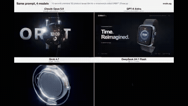
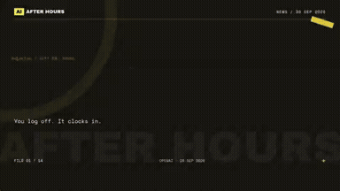
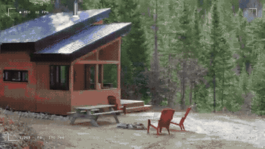
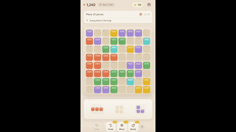

# Product & Brand Videos

<table>
<tr>
<td width="33%" valign="top">
 
<strong>Video as Code 15-Second Kinetic Typography with Remotion</strong> 
Use: Video as Code Kinetic Typography Promo Inputs: User inputs not specified by the author Tools: Tool setup not specified by the source 
<a href="https://x.com/YuanXi901019/status/2108570435575222596">Original post ↗</a> · <a href="../../prompts/2108570435575222596.md">Prompt ↗</a>
</td>
<td width="33%" valign="top">
 
<strong>Bragly Review Widgets Feature Teaser Video</strong> 
Use: Product Feature Teaser Video Inputs: Product webpage and feature details for Bragly review widgets Tools: Web Scraping / Page Reader 
<a href="https://x.com/UtsavChopra30/status/2108478302625071205">Original post ↗</a> · <a href="../../prompts/2108478302625071205.md">Prompt ↗</a>
</td>
<td width="33%" valign="top">
 
<strong>Smartwatch ORBIT Cinematic 3D Product Reveal Film in Three.js</strong> 
Use: Smartwatch Product Reveal Film Inputs: User inputs not specified by the author Tools: Three.js 
<a href="https://x.com/maker_evan/status/2108438685184401904">Original post ↗</a> · <a href="../../prompts/2108438685184401904.md">Prompt ↗</a>
</td>
</tr>
<tr>
<td width="33%" valign="top">
 
<strong>Roblox Game Trailer for Last Strike</strong> 
Use: Roblox Game Promotional Trailer Inputs: User inputs not specified by the author Tools: Tool setup not specified by the source 
<a href="https://x.com/Aryanpxcr7/status/2108326197516198346">Original post ↗</a> · <a href="../../prompts/2108326197516198346.md">Prompt ↗</a>
</td>
<td width="33%" valign="top">
 
<strong>Article-to-Motion Video via Claude in Chrome</strong> 
Use: Article Promo Motion Graphic Inputs: Author's open note article on AI meeting minutes Tools: Claude in Chrome 
<a href="https://x.com/kenchiku__girl/status/2108326054431707284">Original post ↗</a> · <a href="../../prompts/2108326054431707284.md">Prompt ↗</a>
</td>
<td width="33%" valign="top">
 
<strong>Opus 5.5 Agentic Meme-Style Video Production Comparison</strong> 
Use: AI Meme News Video Generator Inputs: User inputs not specified by the author Tools: Tool setup not specified by the source 
<a href="https://x.com/threeaus/status/2105152588991868936">Original post ↗</a> · <a href="../../prompts/2105152588991868936.md">Prompt ↗</a>
</td>
</tr>
<tr>
<td width="33%" valign="top">
 
<strong>Agency Promo Motion Design Video</strong> 
Use: Motion graphics / showreel Inputs: User inputs not specified by the author Tools: Blender 
<a href="https://x.com/motion_conquest/status/2105077715510714439">Original post ↗</a> · <a href="../../prompts/2105077715510714439.md">Prompt ↗</a>
</td>
<td width="33%" valign="top">
 
<strong>Autonomous Promotional Explainer Video Generated via Claude Code…</strong> 
Use: Service Promotional Motion Graphics Inputs: Local workspace and project context for the YEIKEN platform Tools: Claude Code / ffmpeg / Headless Browser 
<a href="https://x.com/yeiken_app/status/2104820349838000492">Original post ↗</a> · <a href="../../prompts/2104820349838000492.md">Prompt ↗</a>
</td>
<td width="33%" valign="top">
 
<strong>Fictional Fashion Commercial Direction and MiniMax H3</strong> 
Use: Multi-shot fashion commercial structured with Claude Opus 5.5 and rendered via MiniMax H3 using model and product reference images. Inputs: Picture 1: Reference image of the fashion model.; Picture 2: Reference image of the handbag product. Tools: Tool setup not specified by the source 
<a href="https://x.com/ito1217yo/status/2104560073217597459">Original post ↗</a> · <a href="../../prompts/2104560073217597459.md">Prompt ↗</a>
</td>
</tr>
<tr>
<td width="33%" valign="top">
 
<strong>Tidewave 15-second Dynamic Motion Graphics Promo</strong> 
Use: Motion graphics / showreel Inputs: User inputs not specified by the author Tools: Tool setup not specified by the source 
<a href="https://x.com/hugobarauna/status/2104558345118236704">Original post ↗</a> · <a href="../../prompts/2104558345118236704.md">Prompt ↗</a>
</td>
<td width="33%" valign="top">
 
<strong>Firetower Motion Graphics Promo Generated</strong> 
Use: Motion graphics / showreel Inputs: User inputs not specified by the author Tools: Tool setup not specified by the source 
<a href="https://x.com/kevinpiac/status/2104489806713553012">Original post ↗</a> · <a href="../../prompts/2104489806713553012.md">Prompt ↗</a>
</td>
<td width="33%" valign="top">
 
<strong>Brand Rebuild Product Sting with HTML Canvas and Playwright</strong> 
Use: Educational / explainer video Inputs: Ask me for: my product name, a logo (or let you draw a simple mark), my brand colours (or pull them from my logo), the one-line thing a user types into the prompt box, the page that answers it (title + 2–3 sentences with one key phrase), two feature names for the stacked cards, and a music track. If I skip any, use the defaults: product &quot;Frame by Frame&quot; living inside its Whop hub, a viewfinder mark (four corner brackets around a bold &quot;FF&quot;), prompt &quot;Make a launch video for my app&quot;, a lesson page titled &quot;2.1 Choose a reference&quot;, cards &quot;Launch&quot; and &quot;Sound&quot;, and Mixkit's free house track &quot;Rising Forest&quot; slowed to 124 BPM. Tools: Playwright 
<a href="https://x.com/notdwd/status/2104401208958230764">Original post ↗</a> · <a href="../../prompts/2104401208958230764.md">Prompt ↗</a>
</td>
</tr>
<tr>
<td width="33%" valign="top">
 
<strong>Promotional Motion Graphics Video for EDteam via Single</strong> 
Use: Motion graphics / showreel Inputs: User inputs not specified by the author Tools: Tool setup not specified by the source 
<a href="https://x.com/AlvaroFelipeCh/status/2104219468079526187">Original post ↗</a> · <a href="../../prompts/2104219468079526187.md">Prompt ↗</a>
</td>
<td width="33%" valign="top">
 
<strong>Serif A Studio Startup Branding Showreel</strong> 
Use: Motion graphics / showreel Inputs: User inputs not specified by the author Tools: Tool setup not specified by the source 
<a href="https://x.com/tariqkhanfmd/status/2104219444130234430">Original post ↗</a> · <a href="../../prompts/2104219444130234430.md">Prompt ↗</a>
</td>
<td width="33%" valign="top">
 
<strong>SaaS Product Launch Motion Graphics Video</strong> 
Use: Moritz Kremb prompts Claude Opus 5.5 to select a known SaaS product and produce a complete motion graphics launch video. Inputs: User inputs not specified by the author Tools: Tool setup not specified by the source 
<a href="https://x.com/moritzkremb/status/2103066071838466494">Original post ↗</a> · <a href="../../prompts/2103066071838466494.md">Prompt ↗</a>
</td>
</tr>
<tr>
<td width="33%" valign="top">
 
<strong>Inference Startup Launch Video</strong> 
Use: Deedy demonstrates using Claude Opus 5.5 via Claude Code to generate a sleek startup launch video by coding a JavaScript animation and recording it with Playwright and ffmpeg. Inputs: User inputs not specified by the author Tools: Tool setup not specified by the source 
<a href="https://x.com/deedydas/status/2102787937482252537">Original post ↗</a> · <a href="../../prompts/2102787937482252537.md">Prompt ↗</a>
</td>
<td width="33%" valign="top">
 
<strong>Apple-Style Opus 5.5 Product Launch Video</strong> 
Use: Apple Design System Launch Video Inputs: Apple product launch videos provided as reference material Tools: Tool setup not specified by the source 
<a href="https://x.com/skpnky/status/2108547893506478160">Original post ↗</a> · <a href="../../prompts/2108547893506478160.md">Prompt ↗</a>
</td>
<td width="33%" valign="top">
 
<strong>Rawnd App Promotional Motion Graphics Video</strong> 
Use: Product Explainer Motion Graphics Inputs: Logos, contact sheet preview imagery, and Rawnd web app interface UI assets featured throughout the video. Tools: Tool setup not specified by the source 
<a href="https://x.com/am56ay/status/2108511993955065948">Original post ↗</a> · <a href="../../prompts/2108511993955065948.md">Prompt ↗</a>
</td>
</tr>
<tr>
<td width="33%" valign="top">
 
<strong>Relay SaaS App Launch Video</strong> 
Use: SaaS Product Launch Motion Graphics Inputs: Application repository providing app code and context Tools: Devin / Remotion 
<a href="https://x.com/Screeendev/status/2108333562462408823">Original post ↗</a> · <a href="../../prompts/2108333562462408823.md">Prompt ↗</a>
</td>
<td width="33%" valign="top">
 
<strong>Opus 5.5 Dynamic Motion Graphics Launch Video for Hunt</strong> 
Use: Product Launch Motion Graphics Teaser Inputs: Project link / product materials for Hunt (@usehuntt) Tools: Tool setup not specified by the source 
<a href="https://x.com/daveeyyy_/status/2108231764023861630">Original post ↗</a> · <a href="../../prompts/2108231764023861630.md">Prompt ↗</a>
</td>
<td width="33%" valign="top">
 
<strong>CriptoBR Promotional Motion Graphics</strong> 
Use: Crypto Brand Motion Promo Inputs: User inputs not specified by the author Tools: Tool setup not specified by the source 
<a href="https://x.com/olivrweb3/status/2108226554740289897">Original post ↗</a> · <a href="../../prompts/2108226554740289897.md">Prompt ↗</a>
</td>
</tr>
<tr>
<td width="33%" valign="top">
 
<strong>Automated Hachijojima Promotional Video Generation</strong> 
Use: Automated Tourism Promotional Video Inputs: User instruction requesting a PR video for Hachijojima Tools: Tool setup not specified by the source 
<a href="https://x.com/8jojima_/status/2108157503209197887">Original post ↗</a> · <a href="../../prompts/2108157503209197887.md">Prompt ↗</a>
</td>
<td width="33%" valign="top">
 
<strong>Bloom Mobile Game Promo Video</strong> 
Use: App Promotion Video Inputs: User inputs not specified by the author Tools: Tool setup not specified by the source 
<a href="https://x.com/Alex_theFounder/status/2105102105702756414">Original post ↗</a> · <a href="../../prompts/2105102105702756414.md">Prompt ↗</a>
</td>
<td width="33%" valign="top">
 
<strong>One-Shot 3D Motion Graphics Teaser for Location-Based WebXR</strong> 
Use: Open Source Repo Promo Video Inputs: Code and documentation for the Location-Based WebXR project Tools: Custom 3D Engine 
<a href="https://x.com/csutil_com/status/2105100452232577419">Original post ↗</a> · <a href="../../prompts/2105100452232577419.md">Prompt ↗</a>
</td>
</tr>
<tr>
<td width="33%" valign="top">
 
<strong>Promo Video for WordPress Site Builder Plugin</strong> 
Use: The author shares a fast-paced promotional motion graphics video for their WordPress plugin 'Shifukuin-san's Site Builder' generated using Claude Opus 5.5. Inputs: User inputs not specified by the author Tools: Tool setup not specified by the source 
<a href="https://x.com/Takamaro_SFKIN/status/2105075516156047624">Original post ↗</a> · <a href="../../prompts/2105075516156047624.md">Prompt ↗</a>
</td>
<td width="33%" valign="top">
 
<strong>Opus 5.5 Forgefy Product Motion Graphics Showcase</strong> 
Use: Motion graphics / showreel Inputs: User inputs not specified by the author Tools: Tool setup not specified by the source 
<a href="https://x.com/0xPaulvibe/status/2104562535340884325">Original post ↗</a> · <a href="../../prompts/2104562535340884325.md">Prompt ↗</a>
</td>
<td width="33%" valign="top">
 
<strong>Hillnote Dynamic 15-Second Motion Graphics Promo</strong> 
Use: Motion graphics / showreel Inputs: User inputs not specified by the author Tools: Tool setup not specified by the source 
<a href="https://x.com/karthikships/status/2104557402154549263">Original post ↗</a> · <a href="../../prompts/2104557402154549263.md">Prompt ↗</a>
</td>
</tr>
<tr>
<td width="33%" valign="top">
 
<strong>Product Demo Motion Graphics Video</strong> 
Use: Motion graphics / showreel Inputs: User inputs not specified by the author Tools: Tool setup not specified by the source 
<a href="https://x.com/carajnikant/status/2104539072106492193">Original post ↗</a> · <a href="../../prompts/2104539072106492193.md">Prompt ↗</a>
</td>
<td width="33%" valign="top">
 
<strong>HIKARI SODA Animated Commercial</strong> 
Use: The author used Claude Opus 5.5 to generate an animated commercial video for a fictional soda brand, delegating animation, BGM, and sound effects to the model. Inputs: User inputs not specified by the author Tools: Tool setup not specified by the source 
<a href="https://x.com/ito1217yo/status/2104537329667104818">Original post ↗</a> · <a href="../../prompts/2104537329667104818.md">Prompt ↗</a>
</td>
<td width="33%" valign="top">
 
<strong>Persona 5-Style Hefei Promotional Motion Graphics Video</strong> 
Use: Author created a 2-minute 42-second Persona 5-styled infographic motion graphics promotional video showcasing Hefei's historical background, economic milestones, and industrial development using Claude Opus 5.5. Inputs: User inputs not specified by the author Tools: Tool setup not specified by the source 
<a href="https://x.com/threeaus/status/2104535752373895249">Original post ↗</a> · <a href="../../prompts/2104535752373895249.md">Prompt ↗</a>
</td>
</tr>
<tr>
<td width="33%" valign="top">
 
<strong>Opus 5.5 Three.js Phone Commercial Production</strong> 
Use: Opus 5.5 orchestrating 6 subagents in Claude Code to direct, model, and animate a 45s phone ad rendered frame-by-frame via Three.js with Python-synthesized audio. Inputs: User inputs not specified by the author Tools: Tool setup not specified by the source 
<a href="https://x.com/thinkszyg/status/2104525558050886066">Original post ↗</a> · <a href="../../prompts/2104525558050886066.md">Prompt ↗</a>
</td>
<td width="33%" valign="top">
 
<strong>BugSmash SaaS Product Launch Motion Design Video</strong> 
Use: Nabil Kazi showcases a 65-second animated SaaS product launch video for BugSmash created using Claude Opus 5.5 acting as a motion designer from a single prompt. Inputs: User inputs not specified by the author Tools: Tool setup not specified by the source 
<a href="https://x.com/nQaze/status/2104525094571937922">Original post ↗</a> · <a href="../../prompts/2104525094571937922.md">Prompt ↗</a>
</td>
<td width="33%" valign="top">
 
<strong>Edo Period YouTube Channel Promo Video Agent</strong> 
Use: Oren shares a promotional short video for their YouTube channel ('Nippon Kaitai Shinsho') depicting 200-year-old Edo life, orchestrated by Claude Opus 5.5 via Claude Code calling fal's H3 Max Turbo for visual generation and Gemini 3.8 Flash TTS for narration. Inputs: User inputs not specified by the author Tools: Tool setup not specified by the source 
<a href="https://x.com/Oren46902/status/2104522740695007363">Original post ↗</a> · <a href="../../prompts/2104522740695007363.md">Prompt ↗</a>
</td>
</tr>
<tr>
<td width="33%" valign="top">
 
<strong>Opus 5.5 Product Explainer Video Generation</strong> 
Use: Educational / explainer video Inputs: YouTube animated explainer reference videos Tools: Tool setup not specified by the source 
<a href="https://x.com/andrewmichaelsa/status/2104490962139385936">Original post ↗</a> · <a href="../../prompts/2104490962139385936.md">Prompt ↗</a>
</td>
<td width="33%" valign="top">
 
<strong>Exhibit A Product Demo Video Generation with Voiceover</strong> 
Use: The author demonstrates a 2-minute 25-second product demo video with voiceover for the chargeback defense app Exhibit A, claiming it was produced in Claude Opus 5.5 via a single prompt without external connectors. Inputs: User inputs not specified by the author Tools: Tool setup not specified by the source 
<a href="https://x.com/kenn_ronin/status/2104487655757029501">Original post ↗</a> · <a href="../../prompts/2104487655757029501.md">Prompt ↗</a>
</td>
<td width="33%" valign="top">
 
<strong>Opus 5.5 Applore Product Promo Video</strong> 
Use: The author prompts Claude Opus 5.5 to create a creative and stunning promotional video for the product Applore, resulting in a dynamic motion graphics showcase of app icons and features. Inputs: User inputs not specified by the author Tools: Tool setup not specified by the source 
<a href="https://x.com/decohack/status/2104472001838465236">Original post ↗</a> · <a href="../../prompts/2104472001838465236.md">Prompt ↗</a>
</td>
</tr>
<tr>
<td width="33%" valign="top">
 
<strong>Remotion Product Launch Film</strong> 
Use: Product / brand film Inputs: User inputs not specified by the author Tools: React / Remotion 
<a href="https://x.com/punit_io/status/2104467016719774112">Original post ↗</a> · <a href="../../prompts/2104467016719774112.md">Prompt ↗</a>
</td>
<td width="33%" valign="top">
 
<strong>Claude Code 3D Enclosure Promo Video</strong> 
Use: Product / brand film Inputs: User inputs not specified by the author Tools: Tool setup not specified by the source 
<a href="https://x.com/VectorCrossProd/status/2104093497561436573">Original post ↗</a> · <a href="../../prompts/2104093497561436573.md">Prompt ↗</a>
</td>
<td width="33%" valign="top">
 
<strong>Product Promo Video Generation</strong> 
Use: Product promotional video Inputs: Product URL and product details Tools: FFmpeg / JavaScript / Playwright 
<a href="https://x.com/felipemoller/status/2103846311149936736">Original post ↗</a> · <a href="../../prompts/2103846311149936736.md">Prompt ↗</a>
</td>
</tr>
<tr>
<td width="33%" valign="top">
 
<strong>Remotion Product Intro</strong> 
Use: Product introduction video Inputs: Product URL, screenshots, logo and assets; Music for beat-synchronized motion Tools: Tool setup not specified by the source 
<a href="https://x.com/HO_BA/status/2103845264649761062">Original post ↗</a> · <a href="../../prompts/2103845264649761062.md">Prompt ↗</a>
</td>
<td width="33%" valign="top">
 
<strong>Code-Based Apple-Style Keynote Motion Design</strong> 
Use: Brand launch film Inputs: Brand name; 9–12 high-res photos; ~120 BPM music; moving plant-shadow stock video Tools: FFmpeg / Playwright 
<a href="https://x.com/twoclipping/status/2103835273813496100">Original post ↗</a> · <a href="../../prompts/2103835273813496100.md">Prompt ↗</a>
</td>
<td width="33%" valign="top">
 
<strong>SaaS Product Launch Motion Graphics Video</strong> 
Use: Motion graphics / showreel Inputs: User inputs not specified by the author Tools: Tool setup not specified by the source 
<a href="https://x.com/gouthamjay8/status/2103816261339910269">Original post ↗</a> · <a href="../../prompts/2103816261339910269.md">Prompt ↗</a>
</td>
</tr>
<tr>
<td width="33%" valign="top">
 
<strong>Email Verification Tool SaaS Motion Graphics</strong> 
Use: Motion graphics / showreel Inputs: User inputs not specified by the author Tools: Tool setup not specified by the source 
<a href="https://x.com/KmAsiff/status/2103810247131549880">Original post ↗</a> · <a href="../../prompts/2103810247131549880.md">Prompt ↗</a>
</td>
<td width="33%" valign="top">
 
<strong>Product Launch Video</strong> 
Use: A prompt used with Opus 5.5 to create a fast-paced launch video under 20 seconds that highlights key product features and aligns with the brand. Inputs: User inputs not specified by the author Tools: Tool setup not specified by the source 
<a href="https://x.com/RatheeJaisal/status/2103774864742154698">Original post ↗</a> · <a href="../../prompts/2103774864742154698.md">Prompt ↗</a>
</td>
<td width="33%" valign="top">
 
<strong>DistilBook Motion Graphics Product Explainer Demo</strong> 
Use: Educational / explainer video Inputs: User inputs not specified by the author Tools: Tool setup not specified by the source 
<a href="https://x.com/sudo_kiran/status/2103761658745335993">Original post ↗</a> · <a href="../../prompts/2103761658745335993.md">Prompt ↗</a>
</td>
</tr>
<tr>
<td width="33%" valign="top">
 
<strong>Opus 5.5 Ad Inspired by Apple 1984</strong> 
Use: Concept advertisement / Apple 1984 homage Inputs: User inputs not specified by the author Tools: Tool setup not specified by the source 
<a href="https://x.com/1littlecoder/status/2103746736980378066">Original post ↗</a> · <a href="../../prompts/2103746736980378066.md">Prompt ↗</a>
</td>
<td width="33%" valign="top">
 
<strong>Motoseyir App Motion Design Promo</strong> 
Use: A motion design prompt used with Opus 5.5 to generate a 45–50 second vertical promotional video showcasing the features of the Motoseyir navigation app. Inputs: User inputs not specified by the author Tools: Tool setup not specified by the source 
<a href="https://x.com/Bilimfili1/status/2103743617848459762">Original post ↗</a> · <a href="../../prompts/2103743617848459762.md">Prompt ↗</a>
</td>
<td width="33%" valign="top">
 
<strong>Remotion Product Showcase Video</strong> 
Use: A prompt instructing the model to study a specified website and generate a product showcase video using Remotion. Inputs: User inputs not specified by the author Tools: Remotion 
<a href="https://x.com/lester_tyy/status/2103733819568480587">Original post ↗</a> · <a href="../../prompts/2103733819568480587.md">Prompt ↗</a>
</td>
</tr>
<tr>
<td width="33%" valign="top">
 
<strong>Apple-Style App Promo Video</strong> 
Use: A short prompt given to Claude Opus to generate a 30-second Apple-style promotional video for an app using Remotion and React. Inputs: User inputs not specified by the author Tools: Tool setup not specified by the source 
<a href="https://x.com/gautam_mer1/status/2103703336780530003">Original post ↗</a> · <a href="../../prompts/2103703336780530003.md">Prompt ↗</a>
</td>
<td width="33%" valign="top">
 
<strong>Launch Video Prompt for Startup Release</strong> 
Use: A multi-step prompt sequence used to generate a slick launch video for a startup release in an Anthropic-inspired style, including requests to make it viral and add trendy background music. Inputs: User inputs not specified by the author Tools: Tool setup not specified by the source 
<a href="https://x.com/iamMXFSCHR/status/2103619221296955831">Original post ↗</a> · <a href="../../prompts/2103619221296955831.md">Prompt ↗</a>
</td>
<td width="33%" valign="top">
 
<strong>Gene Spectra Motion Graphics Promo</strong> 
Use: Motion graphics / showreel Inputs: User inputs not specified by the author Tools: Tool setup not specified by the source 
<a href="https://x.com/madebyjmayala/status/2103578285892649220">Original post ↗</a> · <a href="../../prompts/2103578285892649220.md">Prompt ↗</a>
</td>
</tr>
<tr>
<td width="33%" valign="top">
 
<strong>Sprites Product Promo UI Motion</strong> 
Use: A detailed system prompt to analyze sprites.ai and build an animated, looped product promo using pure code (HTML/Playwright/Python), featuring continuous morphing UI states and beat-matched UI sounds. Inputs: User inputs not specified by the author Tools: FFmpeg / NumPy / Playwright 
<a href="https://x.com/AnnaCher___/status/2103571096549433425">Original post ↗</a> · <a href="../../prompts/2103571096549433425.md">Prompt ↗</a>
</td>
<td width="33%" valign="top">
 
<strong>Motion Design Self-Promotion Promo</strong> 
Use: Slava S. shares a motion design animation created using Opus 5.5 Max from a single simple prompt. Inputs: User inputs not specified by the author Tools: Tool setup not specified by the source 
<a href="https://x.com/slvDev/status/2103569170075975986">Original post ↗</a> · <a href="../../prompts/2103569170075975986.md">Prompt ↗</a>
</td>
<td width="33%" valign="top">
 
<strong>Product Promo Video</strong> 
Use: A single prompt used with Claude Opus to automatically code and render a professional 16:9 MP4 product showcase video. Inputs: User inputs not specified by the author Tools: Tool setup not specified by the source 
<a href="https://x.com/ezshine/status/2103501705698750731">Original post ↗</a> · <a href="../../prompts/2103501705698750731.md">Prompt ↗</a>
</td>
</tr>
<tr>
<td width="33%" valign="top">
 
<strong>Opus 5.5 Promotional Video</strong> 
Use: Anas shares a simple prompt tested with Opus 5.5 to generate a video for the website heeya.fr. Inputs: User inputs not specified by the author Tools: Tool setup not specified by the source 
<a href="https://x.com/anas0ra/status/2103490331815952637">Original post ↗</a> · <a href="../../prompts/2103490331815952637.md">Prompt ↗</a>
</td>
<td width="33%" valign="top">
 
<strong>Distilbook Product Explainer Motion Graphic</strong> 
Use: Educational / explainer video Inputs: User inputs not specified by the author Tools: Tool setup not specified by the source 
<a href="https://x.com/sudo_kiran/status/2103486573476254201">Original post ↗</a> · <a href="../../prompts/2103486573476254201.md">Prompt ↗</a>
</td>
<td width="33%" valign="top">
 
<strong>Professional SaaS Product Launch Video</strong> 
Use: A prompt designed to generate a motion-graphics-styled product launch video for a recognizable SaaS product using real assets and feature highlights. Inputs: User inputs not specified by the author Tools: Tool setup not specified by the source 
<a href="https://x.com/techyoutbe/status/2103465227807588678">Original post ↗</a> · <a href="../../prompts/2103465227807588678.md">Prompt ↗</a>
</td>
</tr>
<tr>
<td width="33%" valign="top">
 
<strong>Motion Graphics Account Promo</strong> 
Use: A prompt asking an AI model to prove its graphic design skills by creating a 15-second promotional motion graphics video using a provided logo and cover photo. Inputs: User inputs not specified by the author Tools: Tool setup not specified by the source 
<a href="https://x.com/fire_ozgur/status/2103459971174130104">Original post ↗</a> · <a href="../../prompts/2103459971174130104.md">Prompt ↗</a>
</td>
<td width="33%" valign="top">
 
<strong>Product Promo Video</strong> 
Use: AI大白 shared an AI-generated product promo video created using Opus 5.5 by passing a single prompt referencing the project's codebase. Inputs: User inputs not specified by the author Tools: Tool setup not specified by the source 
<a href="https://x.com/Ai_Baymax/status/2103411004902416787">Original post ↗</a> · <a href="../../prompts/2103411004902416787.md">Prompt ↗</a>
</td>
<td width="33%" valign="top">
 
<strong>Flora App Promo Video</strong> 
Use: A prompt given to Opus 5.5 instructing it to generate a modern and impactful promotional video for the Flora app using JavaScript, Playwright, and FFmpeg from a designated folder of assets. Inputs: User inputs not specified by the author Tools: FFmpeg / JavaScript / Playwright 
<a href="https://x.com/andre_lucaxxs/status/2103292636945846347">Original post ↗</a> · <a href="../../prompts/2103292636945846347.md">Prompt ↗</a>
</td>
</tr>
<tr>
<td width="33%" valign="top">
 
<strong>Lightspark Promo Video</strong> 
Use: David Marcus shared a prompt used with Opus 5.5 to generate a promotional video for Lightspark. Inputs: User inputs not specified by the author Tools: Tool setup not specified by the source 
<a href="https://x.com/davidmarcus/status/2103275618045686217">Original post ↗</a> · <a href="../../prompts/2103275618045686217.md">Prompt ↗</a>
</td>
<td width="33%" valign="top">
 
<strong>SaaS Product Launch Video</strong> 
Use: A prompt designed to create a professional, motion-graphics-style SaaS product launch video showcasing features and benefits. Inputs: User inputs not specified by the author Tools: Tool setup not specified by the source 
<a href="https://x.com/techtactician/status/2103219463508144474">Original post ↗</a> · <a href="../../prompts/2103219463508144474.md">Prompt ↗</a>
</td>
<td width="33%" valign="top">
 
<strong>Tented Product Video Animation</strong> 
Use: Justin Cooperman shares an animated product clip for Tented created with Opus 5.5, illustrating its image generation features. Inputs: User inputs not specified by the author Tools: Tool setup not specified by the source 
<a href="https://x.com/justincooperman/status/2103201167367188876">Original post ↗</a> · <a href="../../prompts/2103201167367188876.md">Prompt ↗</a>
</td>
</tr>
<tr>
<td width="33%" valign="top">
 
<strong>AppSumo Animated Promo Clip</strong> 
Use: A prompt to generate a 30-second drawing-style animated video showing how to submit a product to AppSumo using an agent in three steps. Inputs: User inputs not specified by the author Tools: Tool setup not specified by the source 
<a href="https://x.com/mattbean/status/2103146389412917572">Original post ↗</a> · <a href="../../prompts/2103146389412917572.md">Prompt ↗</a>
</td>
<td width="33%" valign="top">
 
<strong>Modern Startup Video</strong> 
Use: A prompt requesting a slick, punchy video for an inference startup created without dedicated video generation models or extra libraries. Inputs: User inputs not specified by the author Tools: Tool setup not specified by the source 
<a href="https://x.com/lepadev/status/2103101681806475414">Original post ↗</a> · <a href="../../prompts/2103101681806475414.md">Prompt ↗</a>
</td>
<td width="33%" valign="top">
 
<strong>Pixar-Level Promotional Animation in Three.js</strong> 
Use: A prompt asking an AI model to conceive a promotional story for an app and generate a full Pixar-level animation using Three.js and JavaScript. Inputs: User inputs not specified by the author Tools: JavaScript 
<a href="https://x.com/Anilraok/status/2103087766662009118">Original post ↗</a> · <a href="../../prompts/2103087766662009118.md">Prompt ↗</a>
</td>
</tr>
<tr>
<td width="33%" valign="top">
 
<strong>Opus 5.5 Promotional Reel</strong> 
Use: A brief prompt used to generate a 10-second advertising-style video reel from an image using Opus 5.5. Inputs: User inputs not specified by the author Tools: Tool setup not specified by the source 
<a href="https://x.com/GonzaloMacagno/status/2102897651008344202">Original post ↗</a> · <a href="../../prompts/2102897651008344202.md">Prompt ↗</a>
</td>
<td width="33%" valign="top">
 
<strong>Code-Driven Motion Design Video</strong> 
Use: Product motion promotional film Inputs: Product name + one-line promise; 3–5 UI scenes; accent color; 10–20 owned vertical clips; music Tools: FFmpeg / NumPy / Playwright 
<a href="https://x.com/twoclipping/status/2102554209166000267">Original post ↗</a> · <a href="../../prompts/2102554209166000267.md">Prompt ↗</a>
</td><td></td>
</tr>
</table>

[Back to gallery](../../README.md)
