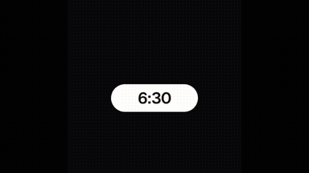
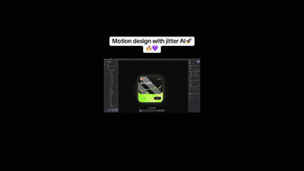
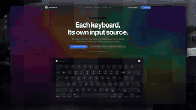

# UI & Web Animation

<table>
<tr>
<td width="33%" valign="top">
 
<strong>Interactive Honey Keyboard Simulation</strong> 
Use: Interactive 3D Honey Keyboard Inputs: User inputs not specified by the author Tools: HTML/WebGL 
<a href="https://x.com/keydol123/status/2108501256067285443">Original post ↗</a> · <a href="../../prompts/2108501256067285443.md">Prompt ↗</a>
</td>
<td width="33%" valign="top">
 
<strong>Seamless Morphing UI Motion Design</strong> 
Use: Seamless Morphing Motion Graphics Inputs: Ask me for: 4 photos (a mountain valley at sunrise, a top-down drone shot of a roundabout, a latte being poured from above, the sun over the sea at golden hour), one accent color (mine is violet #A898FF), and a royalty-free song around 118 BPM with a drop (e.g. Pixabay, free for commercial use). Tools: HTML Canvas / numpy / NumPy / Playwright 
<a href="https://x.com/finnardley/status/2108432616558879016">Original post ↗</a> · <a href="../../prompts/2108432616558879016.md">Prompt ↗</a>
</td>
<td width="33%" valign="top">
 
<strong>Jitter AI UI Widget Animation</strong> 
Use: UI Motion Design Inputs: Figma crypto card UI design Tools: Figma / Jitter 
<a href="https://x.com/Khlaseek_dsgner/status/2108167809997877659">Original post ↗</a> · <a href="../../prompts/2108167809997877659.md">Prompt ↗</a>
</td>
</tr>
<tr>
<td width="33%" valign="top">
 
<strong>FLIP CLASH Game UI Redesign with Blender Backgrounds</strong> 
Use: Game UI Redesign &amp; 3D Backgrounds Inputs: FLIP CLASH game source code and original settings interface Tools: Blender 
<a href="https://x.com/hii_studio_jp/status/2105051697525686340">Original post ↗</a> · <a href="../../prompts/2105051697525686340.md">Prompt ↗</a>
</td>
<td width="33%" valign="top">
 
<strong>Three.js 15s 3D Motion Graphics</strong> 
Use: 3D motion graphics / website hero Inputs: User inputs not specified by the author Tools: Three.js 
<a href="https://x.com/hiro19_k/status/2104471436039803295">Original post ↗</a> · <a href="../../prompts/2104471436039803295.md">Prompt ↗</a>
</td>
<td width="33%" valign="top">
 
<strong>Code-Driven Looping UI Motion Graphics</strong> 
Use: UI motion / interaction demonstration Inputs: 8–12 UI states; palette; ~120 BPM music Tools: FFmpeg / NumPy / Playwright 
<a href="https://x.com/twoclipping/status/2103273003555402193">Original post ↗</a> · <a href="../../prompts/2103273003555402193.md">Prompt ↗</a>
</td>
</tr>
<tr>
<td width="33%" valign="top">
 
<strong>Interactive MacBook Keyboard with Key Sounds and Split-Flap Anim…</strong> 
Use: Interactive Animated Keyboard Inputs: User inputs not specified by the author Tools: Tool setup not specified by the source 
<a href="https://x.com/fedemas/status/2108400811411996801">Original post ↗</a> · <a href="../../prompts/2108400811411996801.md">Prompt ↗</a>
</td>
<td width="33%" valign="top">
 
<strong>Interactive Bubble Genre Selection UI in App Development</strong> 
Use: Demonstration of an interactive mobile app genre selection screen generated using Claude Opus 5.5, featuring animated soap bubbles that expand and filter subcategories upon interaction. Inputs: User inputs not specified by the author Tools: Tool setup not specified by the source 
<a href="https://x.com/asakarifa/status/2104463774862446760">Original post ↗</a> · <a href="../../prompts/2104463774862446760.md">Prompt ↗</a>
</td>
<td width="33%" valign="top">
 
<strong>Claude Opus 5.5による動画編集プレビュー・カット承認UIの構築</strong> 
Use: Claude Opus 5.5を活用して動画の無音カット提案を行い、それを波形とプレビュー画面上でワンクリック承認・微調整できる専用の動画編集UI/スキルを開発・実演した事例。 Inputs: User inputs not specified by the author Tools: Tool setup not specified by the source 
<a href="https://x.com/excel_niisan/status/2104212398303543512">Original post ↗</a> · <a href="../../prompts/2104212398303543512.md">Prompt ↗</a>
</td>
</tr>
<tr>
<td width="33%" valign="top">
 
<strong>Auren Header Scroll-Scrubbed Hero Section</strong> 
Use: Scroll-driven website hero Inputs: Background video; Two feature-card images Tools: Framer Motion / GSAP ScrollTrigger / React 
<a href="https://x.com/iamtanzil_/status/2103820321673675031">Original post ↗</a> · <a href="../../prompts/2103820321673675031.md">Prompt ↗</a>
</td>
<td width="33%" valign="top">
 
<strong>Code-Based UI Motion Design</strong> 
Use: A comprehensive prompt template to instruct an LLM (such as Claude Opus) to generate pure-code, seamless looping UI motion design synced to a musical beat grid. Inputs: Ask me for: 8 to 12 UI states I want the shape to become (e.g. button, loader, player, slider, toggle, tabs, chart, command palette, toast), pure black and white or one accent color, and a royalty-free song around 120 BPM (e.g. Mixkit, free for commercial use). Tools: FFmpeg / NumPy / Playwright 
<a href="https://x.com/demonugc/status/2103526713208525162">Original post ↗</a> · <a href="../../prompts/2103526713208525162.md">Prompt ↗</a>
</td>
<td width="33%" valign="top">
 
<strong>Continuous UI Motion Animation</strong> 
Use: A structured prompt for generating a continuous, looping Dribbble-style UI morph animation programmed in HTML and rendered via Playwright. Inputs: Ask me for: 8 to 12 UI states I want the shape to become (e.g. button, loader, player, slider, toggle, tabs, chart, command palette, toast), pure black and white or one accent color, and a royalty-free song around 120 BPM (e.g. Mixkit, free for commercial use). Tools: FFmpeg / NumPy / Playwright 
<a href="https://x.com/sanjeevn72/status/2103456358125457691">Original post ↗</a> · <a href="../../prompts/2103456358125457691.md">Prompt ↗</a>
</td>
</tr>
<tr>
<td width="33%" valign="top">
 
<strong>Cartoony Battle Royale UI</strong> 
Use: Code Coach demonstrates generating a complete Roblox battle royale UI in seconds using a custom plugin and Claude Opus with a one-shot prompt. Inputs: User inputs not specified by the author Tools: Tool setup not specified by the source 
<a href="https://x.com/MyCodeCoach/status/2103181065976459574">Original post ↗</a> · <a href="../../prompts/2103181065976459574.md">Prompt ↗</a>
</td>
<td width="33%" valign="top">
 
<strong>Mobile App Animated Splash Screen</strong> 
Use: A prompt fragment used with Opus 5.5 to generate an animated splash screen for a mobile app. Inputs: User inputs not specified by the author Tools: Tool setup not specified by the source 
<a href="https://x.com/modaalbuilder/status/2103053680945868989">Original post ↗</a> · <a href="../../prompts/2103053680945868989.md">Prompt ↗</a>
</td><td></td>
</tr>
</table>

[Back to gallery](../../README.md)
